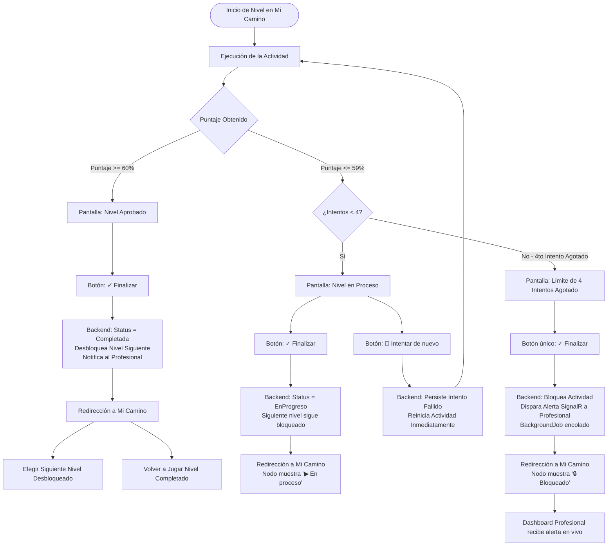

# Documentación Técnica: Flujo de Resolución de Niveles del Roadmap ("Mi Camino")

Este documento detalla todas las modificaciones arquitectónicas, de backend y frontend implementadas para dar cumplimiento al flujo de resolución, reintento, aprobación y bloqueo de niveles del Roadmap (**"Mi Camino"**).

---

## 1. Reglas de Negocio Implementadas

### A. Aprobación ($\ge 60\%$)
1. **Pantalla de Resultado**:
   - Visualiza el porcentaje obtenido (ej: `60%`, `100%`) acompañado de animación de medalla y confetti.
   - Muestra el distintivo destacado **`Nivel Aprobado (≥ 60%)`**.
   - Muestra el botón de acción principal **`✓ Finalizar`**.
2. **Redirección a "Mi Camino" (`/app/roadmap`)**:
   - Al hacer clic en `Finalizar`, el backend persiste la asignación como `Completada`.
   - Se evalúa el umbral del nivel actual y se desbloquea atómicamente el siguiente nivel en la base de datos (`IsUnlocked = true`).
   - El alumno es redirigido a `/app/roadmap`.
   - En el mapa, el nivel superado muestra el icono **`✓`** y la etiqueta **`Completada (score%) ✓`**.
   - **Opciones del alumno**:
     - Puede seleccionar el **siguiente nivel desbloqueado** para avanzar en su trayectoria.
     - Puede volver a pulsar en el nivel completado para **volver a jugar** (modo práctica/refuerzo).

---

### B. En Proceso ($\le 59\%$)
1. **Pantalla de Resultado**:
   - Visualiza el porcentaje obtenido (ej: `0%`, `50%`) y el icono de aliento 💪.
   - Muestra el distintivo destacado **`Nivel en Proceso (< 60%)`**.
   - Muestra el botón **`✓ Finalizar`**.
   - Inmediatamente abajo de "Finalizar", muestra el botón **`🔄 Intentar de nuevo`** (siempre que no haya alcanzado el 4to intento).
2. **Opciones del Alumno**:
   - **Opción 1: Pulsar `✓ Finalizar`**:
     - El backend registra la respuesta y mantiene la asignación en estado `EnProgreso`.
     - El siguiente nivel permanece bloqueado con candado (`🔒`).
     - Redirige a `/app/roadmap`, donde el nodo muestra el icono de reproducción **`▶`** y la insignia **`En proceso (score%)`**.
     - El alumno puede pulsar nuevamente en el nodo para continuar la actividad cuando lo desee.
   - **Opción 2: Pulsar `🔄 Intentar de nuevo`**:
     - Persiste transaccionalmente el intento previo en el backend (registrando el tiempo empleado y error count en la sesión analítica).
     - Reinicia de manera inmediata el nivel (`startActivity()`), cargando una nueva ejecución limpia sin obligar al alumno a volver al mapa ni pasar por pantallas intermedias.

---

### C. Límite de Frustración y Bloqueo a los 4 Intentos (HU-21)
1. **Detección**:
   - Si el estudiante acumula **4 intentos fallidos consecutivos** ($\le 59\%$) en la misma actividad:
     - El botón `Intentar de nuevo` se oculta automáticamente.
     - Aparece el aviso: *"Has alcanzado el límite de 4 intentos permitidos. Tu profesional ha sido notificado para ayudarte."*
2. **Notificación en Tiempo Real (SignalR)**:
   - Al pulsar `Finalizar` tras agotar el 4to intento, el backend despacha un evento en tiempo real a través del hub de SignalR dirigido al terapeuta/profesional asignado:
     - **Título**: *"Alerta: Actividad bloqueada por intentos agotados"*
     - **Mensaje**: *"El estudiante ha alcanzado 4 intentos sin superar el nivel. La actividad ha sido bloqueada preventivamente."*
   - Además, encola un registro de auditoría en la tabla `BackgroundJobs`.
3. **Bloqueo en el Roadmap y Backend**:
   - En **"Mi Camino"**, el nivel pasa a estado bloqueado con candado **`🔒`**.
   - Si el cliente intentara invocar `startResponse`, el backend valida los intentos y retorna un error **`409 Conflict`**:
     > *"La actividad se encuentra bloqueada tras haber agotado los 4 intentos permitidos. Tu profesional ha sido notificado para asistirte."*

---

## 2. Diagrama de Flujo y Estados



---

## 3. Detalle de Archivos Modificados

### A. Backend (.NET 10)

| Archivo | Responsabilidad y Modificaciones |
| :--- | :--- |
| [`CompleteActivityResponseCommandHandler.cs`](file:///d:/git/InclusiON.Server/InclusiON.Application/UseCases/Activities/Handlers/CompleteActivityResponseCommandHandler.cs) | 1. Asigna `assignment.StatusId = command.SuccessPercentage >= 60m ? AssignmentStatuses.Completada : AssignmentStatuses.EnProgreso`.<br>2. Evalúa `nextToUnlock` solo si `SuccessPercentage >= UnlockThresholdPercent` ($\ge 60\%$).<br>3. Dispara alertas en tiempo real vía `IRealTimeNotifier` al profesional (`Actividad completada`, `Nivel en proceso` o `Alerta: Actividad bloqueada por intentos agotados`). |
| [`StartActivityResponseCommandHandler.cs`](file:///d:/git/InclusiON.Server/InclusiON.Application/UseCases/Activities/Handlers/StartActivityResponseCommandHandler.cs) | Valida que si existen $\ge 4$ respuestas completadas sin ninguna aprobada ($\ge 60\%$), deniega el inicio con código HTTP `409 Conflict`. |
| [`ActivityCommandHandlersTests.cs`](file:///d:/git/InclusiON.Server/InclusiON.Tests/Unit/Handlers/Activities/ActivityCommandHandlersTests.cs) | Pruebas unitarias agregadas:<br>- `Start_WithFourFailedAttempts_ReturnsConflict`<br>- `CompleteResponse_UnderSixtyPercent_KeepsStatusAsEnProgreso`<br>- `CompleteResponse_FourExhaustedAttempts_EnqueuesAlertNotificationForProfessional` |

---

### B. Frontend (Angular 19)

| Archivo | Responsabilidad y Modificaciones |
| :--- | :--- |
| [`player-base.component.ts`](file:///d:/git/InclusiON.Client/src/app/views/aac/activities/player/player-base.component.ts) | 1. `canRetry`: Retorna verdadero si `!isCorrect() && consecutiveFailures < 3`.<br>2. `retry()`: Persiste el intento fallido previo en el backend con tiempo invertido y llama de inmediato a `startActivity()` para recomenzar sin pasos intermedios.<br>3. Inicializa fallos consecutivos y éxitos previos desde las respuestas de la asignación. |
| [`player-result.component.html`](file:///d:/git/InclusiON.Client/src/app/views/aac/activities/player/components/player-result.component.html) | 1. Muestra el porcentaje obtenido `{{ score }}%`.<br>2. Renderiza distintivos visuales: `Nivel Aprobado (≥ 60%)` y `Nivel en Proceso (< 60%)`.<br>3. Muestra aviso de límite alcanzado tras 4 intentos.<br>4. Botón `✓ Finalizar` y botón secundario `🔄 Intentar de nuevo` condicionado a `canRetry`. |
| [`player-result.component.scss`](file:///d:/git/InclusiON.Client/src/app/views/aac/activities/player/components/player-result.component.scss) | Estilos tipográficos y cromáticos accesibles para `.result-badge` (verde y ámbar) y `.result-limit-notice` (rojo suave con borde redondeado). |
| [`aac-roadmap.component.ts`](file:///d:/git/InclusiON.Client/src/app/views/aac/roadmap/aac-roadmap.component.ts) | 1. `resolveStatus`: Evalúa 4 fallos sin aprobar para retornar `'locked'`, `'completed'` para `Completada`, y `'in-progress'` para `EnProgreso`.<br>2. Asigna `score` en cada nodo del mapa a partir de la última respuesta completada.<br>3. Precedencia de estado completado al re-jugar asignaciones. |
| [`global-reading-player.component.html`](file:///d:/git/InclusiON.Client/src/app/views/aac/activities/player/global-reading/global-reading-player.component.html) | Vincula `[score]="isCorrect() ? 100 : 0"` y `[success]="(isCorrect() ? 100 : 0) >= 60"`. |
| [`option-select-player.component.html`](file:///d:/git/InclusiON.Client/src/app/views/aac/activities/player/option-select/option-select-player.component.html) | Vincula `[score]="isCorrect() ? 100 : 0"` y `[success]="(isCorrect() ? 100 : 0) >= 60"`. |
| [`select-figure-player.component.html`](file:///d:/git/InclusiON.Client/src/app/views/aac/activities/player/select-figure/select-figure-player.component.html) | Vincula `[score]="isCorrect() ? 100 : 0"` y `[success]="(isCorrect() ? 100 : 0) >= 60"`. |
| [`visual-sum-player.component.html`](file:///d:/git/InclusiON.Client/src/app/views/aac/activities/player/visual-sum/visual-sum-player.component.html) | Vincula `[score]="isCorrect() ? 100 : 0"` y `[success]="(isCorrect() ? 100 : 0) >= 60"`. |
| [`order-sequence-player.component.ts`](file:///d:/git/InclusiON.Client/src/app/views/aac/activities/player/order-sequence/order-sequence-player.component.ts) & `.html` | Ajusta `isCorrect` y `success` para evaluar `score >= 60` (en lugar de exigir 100%). |
| [`match-image-word-player.component.ts`](file:///d:/git/InclusiON.Client/src/app/views/aac/activities/player/match-image-word/match-image-word-player.component.ts) & `.html` | Ajusta `isCorrect` y `success` para evaluar `score >= 60` (en lugar de exigir 100%). |
| [`complete-letter-player.component.ts`](file:///d:/git/InclusiON.Client/src/app/views/aac/activities/player/complete-letter/complete-letter-player.component.ts) & `.html` | Ajusta `isCorrect` y `success` para evaluar `score >= 60` (en lugar de exigir 100%). |
| [`detail.component.ts`](file:///d:/git/InclusiON.Client/src/app/views/professional/dashboard/detail/detail.component.ts) | Suscripción activa a `signalrService.notification$` para actualizar métricas analíticas y mostrar toasts ante eventos de progreso o bloqueos de actividades. |

---

## 4. Cambios a Nivel de Código (Snippets, Diffs y Explicación)

A continuación se exponen los bloques exactos de código implementados en cada capa del sistema:

### 4.1 Backend (.NET Core 10)

#### A. `CompleteActivityResponseCommandHandler.cs`
**Ubicación**: `InclusiON.Application/UseCases/Activities/Handlers/CompleteActivityResponseCommandHandler.cs`

1. **Determinación del Estado según Umbral del 60%**:
```csharp
// Si el puntaje es 60% o superior, se marca como Completada. De lo contrario, queda EnProgreso.
if (command.SuccessPercentage >= 60m)
{
    assignment.StatusId  = AssignmentStatuses.Completada;
}
else
{
    assignment.StatusId  = AssignmentStatuses.EnProgreso;
}
assignment.UpdatedAt = now;
await _repository.UpdateAsync(assignment, cancellationToken);
```

2. **Desbloqueo Condicional del Siguiente Nivel del Roadmap**:
```csharp
// Desbloqueo del siguiente nivel: Requiere GAS >= 0 (éxito >= 60%) y cumplir el UnlockThresholdPercent
if (roadmapEntry is not null && gasScore >= 0 && command.SuccessPercentage >= roadmapEntry.UnlockThresholdPercent)
{
    var next = await _roadmapRepository.GetNextInAreaAsync(
        roadmapEntry.PersonRoadmapAreaId, roadmapEntry.SequenceOrder, cancellationToken);

    if (next is not null && !next.IsUnlocked)
        nextToUnlock = next;
}
```

3. **Despacho de Notificación en Tiempo Real vía SignalR**:
```csharp
if (_realTimeNotifier is not null)
{
    string notifTitle = command.SuccessPercentage >= 60m
        ? "Actividad completada"
        : (consecutiveFailures >= 4
            ? "Alerta: Actividad bloqueada por intentos agotados"
            : "Intento de actividad registrado");

    string notifMessage = command.SuccessPercentage >= 60m
        ? $"El estudiante ha completado la actividad con un {command.SuccessPercentage:0.#}% de éxito."
        : (consecutiveFailures >= 4
            ? $"El estudiante ha alcanzado 4 intentos sin superar la actividad. La actividad ha sido bloqueada preventivamente."
            : $"El estudiante obtuvo un {command.SuccessPercentage:0.#}% en la actividad (Nivel en proceso).");

    await _realTimeNotifier.SendToUserAsync(
        assignment.AssignedByProfessionalId.ToString(),
        "ReceiveNotification",
        new
        {
            Title = notifTitle,
            Message = notifMessage,
            Type = consecutiveFailures >= 4 ? "ActivityBlocked" : (command.SuccessPercentage >= 60m ? "ActivityCompleted" : "ActivityAttempt"),
            ActivityId = assignment.ActivityId,
            StudentId = assignment.PersonId,
            CreatedAt = now
        },
        cancellationToken);
}
```

---

#### B. `StartActivityResponseCommandHandler.cs`
**Ubicación**: `InclusiON.Application/UseCases/Activities/Handlers/StartActivityResponseCommandHandler.cs`

1. **Bloqueo HTTP `409 Conflict` tras 4 Intentos Agotados**:
```csharp
var completedResponses = assignment.Responses?.Where(r => r.CompletedAt.HasValue).ToList() ?? [];
bool hasPassed = completedResponses.Any(r => (r.SuccessPercentage ?? 0) >= 60m);

// Si tiene 4 o más intentos sin haber aprobado ninguna vez, se impide un nuevo inicio
if (!hasPassed && (attemptCount >= 4 || completedResponses.Count >= 4))
{
    return ApiResponse<ActivityAssignmentResponse>.Conflict(
        ErrorCode.BusinessRuleViolation,
        "La actividad se encuentra bloqueada tras haber agotado los 4 intentos permitidos. Tu profesional ha sido notificado para asistirte.");
}
```

2. **Permitir "Volver a Jugar" Actividades Previamente Completadas**:
```csharp
// Si la actividad estaba Pendiente o ya Completada, al re-iniciar pasa a EnProgreso para el nuevo intento
if (assignment.StatusId == AssignmentStatuses.Pendiente || assignment.StatusId == AssignmentStatuses.Completada)
{
    assignment.StatusId  = AssignmentStatuses.EnProgreso;
    assignment.UpdatedAt = _dateTime.UtcNow;
    await _repository.UpdateAsync(assignment, cancellationToken);
}
```

---

### 4.2 Frontend (Angular 19)

#### A. `player-base.component.ts`
**Ubicación**: `src/app/views/aac/activities/player/player-base.component.ts`

1. **Getter de Permisión de Reintento (`canRetry`)**:
```typescript
/**
 * Permite reintentar si el intento actual no fue aprobado (< 60%)
 * y no se ha alcanzado el límite de 4 intentos consecutivos fallidos (HU-21).
 */
get canRetry(): boolean {
  return !this.isCorrect() && this.consecutiveFailures() < 3;
}
```

2. **Método `retry()` con Persistencia Asíncrona y Re-inicio Inmediato**:
```typescript
retry(): void {
  if (!this.canRetry) {
    return;
  }

  const prevResponseId = this.responseId();
  this.consecutiveFailures.update(c => c + 1);
  this.responseId.set(null);
  this.isCorrect.set(null);

  // Persistir el intento fallido previo en backend para asegurar métricas en la analítica
  if (prevResponseId && this.assignment?.encryptedId && this.assignment?.id !== 0) {
    this.isLoading.set(true);
    this.activitiesService.completeResponse(this.assignment.encryptedId, prevResponseId, {
      successPercentage: 0,
      timeSpentSeconds: this.elapsedSeconds,
      requiredSupport: false,
      observations: 'Intento fallido registrado al solicitar reintento',
    }).subscribe({
      next: () => {
        this.isLoading.set(false);
        this.startActivity(); // Reinicia inmediatamente la fase playing
      },
      error: (err) => {
        console.warn('No se pudo registrar intento fallido previo:', err);
        this.isLoading.set(false);
        this.startActivity();
      },
    });
  } else {
    this.startActivity();
  }
}
```

---

#### B. `player-result.component.html` & `.scss`
**Ubicación**: `src/app/views/aac/activities/player/components/`

1. **Estructura de la Plantilla**:
```html
@if (success) {
  <!-- Medalla, burst y confetti -->
  <div class="medal-overlay" aria-hidden="true">...</div>
  <h2 class="result-title result-title--success">¡Muy bien!</h2>
  <span class="result-badge result-badge--success">Nivel Aprobado (≥ 60%)</span>
} @else {
  <div class="result-icon result-icon--fail" aria-hidden="true">💪</div>
  <h2 class="result-title result-title--fail">¡Casi!</h2>
  <span class="result-badge result-badge--fail">Nivel en Proceso (&lt; 60%)</span>
}

@if (score !== null) {
  <p class="result-score" [class.result-score--success]="success" [class.result-score--fail]="!success">
    {{ score }}%
  </p>
}

@if (!canRetry && !success) {
  <p class="result-limit-notice">
    Has alcanzado el límite de 4 intentos permitidos. Tu profesional ha sido notificado para ayudarte.
  </p>
}

<div class="result-actions">
  <!-- Botón 1: Finalizar (redirecciona a /app/roadmap) -->
  <button class="action-btn action-btn--primary" [disabled]="loading" (click)="finish.emit()">
    @if (loading) {
      <span class="btn-spinner" aria-hidden="true"></span> Guardando...
    } @else {
      ✓ Finalizar
    }
  </button>

  <!-- Botón 2: Intentar de nuevo (visible debajo de Finalizar) -->
  @if (canRetry) {
    <button class="action-btn action-btn--secondary" [disabled]="loading" (click)="retry.emit()">
      <span aria-hidden="true">🔄</span> Intentar de nuevo
    </button>
  }
</div>
```

2. **Estilos SCSS**:
```scss
.result-badge {
  display: inline-block;
  padding: 0.35rem 1rem;
  border-radius: 20px;
  font-size: 0.95rem;
  font-weight: 700;
  margin-top: -0.5rem;

  &--success {
    background: #e8f5e9;
    color: #2e7d32;
    border: 1px solid #a5d6a7;
  }

  &--fail {
    background: #fff3e0;
    color: #e65100;
    border: 1px solid #ffcc80;
  }
}

.result-limit-notice {
  font-size: 0.95rem;
  color: #c62828;
  background: #ffebee;
  border: 1px solid #ffcdd2;
  border-radius: 12px;
  padding: 0.65rem 1rem;
  margin: 0;
  max-width: 320px;
  font-weight: 600;
  line-height: 1.4;
}
```

---

#### C. `aac-roadmap.component.ts`
**Ubicación**: `src/app/views/aac/roadmap/aac-roadmap.component.ts`

1. **Enriquecimiento de Nodos con Score y Precedencia de Completado**:
```typescript
enrichedAreas = computed<EnrichedArea[]>(() => {
  const r = this.roadmap();
  const asns = this.assignments();
  if (!r || !r.areas) return [];

  return r.areas.map(area => ({
    ...area,
    headerColor: area.color ?? '#673AB7',
    nodes: (area.activities ?? []).map((act, idx) => {
      const matchingAssignments = asns.filter(a => a.activityId === act.activityId);
      const assignment = matchingAssignments.sort((a, b) => {
        // Priorizar estado Completada si existe, de lo contrario la asignación más reciente
        if (a.status === ActivityAssignmentStatus.Completada && b.status !== ActivityAssignmentStatus.Completada) return -1;
        if (a.status !== ActivityAssignmentStatus.Completada && b.status === ActivityAssignmentStatus.Completada) return 1;
        return new Date(b.assignedAt).getTime() - new Date(a.assignedAt).getTime();
      })[0];

      const completedResponses = assignment?.responses?.filter(r => r.completedAt) ?? [];
      const latestResponse = [...completedResponses].sort((a, b) =>
        new Date(b.completedAt!).getTime() - new Date(a.completedAt!).getTime()
      )[0];
      const latestScore = latestResponse?.successPercentage;

      return {
        activity: act,
        areaId: area.encryptedId,
        assignment,
        status: this.resolveStatus(act, assignment),
        side: (idx % 2 === 0 ? 'left' : 'right') as 'left' | 'right',
        score: latestScore,
      };
    }),
  }));
});
```

2. **Resolución de Estados (`resolveStatus`)**:
```typescript
private resolveStatus(act: RoadmapActivityResponse, assignment?: ActivityAssignmentResponse): NodeStatus {
  if (!act.isUnlocked) return 'locked';
  if (!assignment) return 'pending';

  // Si tiene 4 o más intentos completados y ninguno aprobado (>= 60%), se bloquea
  const completedResponses = assignment.responses?.filter(r => r.completedAt) ?? [];
  const hasPassed = completedResponses.some(r => (r.successPercentage ?? 0) >= 60);
  if (!hasPassed && completedResponses.length >= 4) {
    return 'locked';
  }

  switch (assignment.status) {
    case ActivityAssignmentStatus.Completada: return 'completed';
    case ActivityAssignmentStatus.EnProgreso: return 'in-progress';
    default: return 'pending';
  }
}
```

---

#### D. Componentes Concretos de Juego (Templates de Actividades)

* **En actividades de selección única (`global-reading`, `option-select`, `select-figure`, `visual-sum`)**:
```html
@if (phase() === 'result') {
  <app-player-result
    [success]="(isCorrect() ? 100 : 0) >= 60"
    [score]="isCorrect() ? 100 : 0"
    [message]="resultMessage"
    [loading]="isLoading()"
    [canRetry]="canRetry"
    (finish)="onFinish()"
    (retry)="retry()"
  />
}
```

* **En actividades graduadas (`order-sequence`, `match-image-word`, `complete-letter`)**:
```typescript
// En el componente TypeScript:
confirmOrder(): void {
  const s = this.score();
  this.isCorrect.set(s >= 60); // Aprobado con 60% o superior
  this.phase.set('result');
}
```
```html
<!-- En el template HTML: -->
@if (phase() === 'result') {
  <app-player-result
    [success]="score() >= 60"
    [score]="score()"
    [message]="resultMessage()"
    [loading]="isLoading()"
    [canRetry]="canRetry"
    (finish)="onFinish()"
    (retry)="retry()"
  />
}
```

---

## 5. Verificación y Resultados de Pruebas

### Pruebas Unitarias y de Integración (.NET)
```powershell
dotnet test
```
- **Pruebas Unitarias**: `720/720` aprobadas (0 fallos).
- **Pruebas de Integración**: `27/27` aprobadas (0 fallos).
- **Total**: `747/747` pruebas en verde.

### Compilación de Producción (Angular)
```powershell
cd InclusiON.Client
npm run build
```
- **Resultado**: `Build complete with 0 errors`. Bundle generado en `dist/inclusion-client`.

---

## 6. Guía de Prueba Manual de Extremo a Extremo

1. **Iniciar Sesión como Alumno**:
   - Ingresar con credenciales del alumno (ej: Pedro o Sofía) y acceder a **Mi Camino** (`/app/roadmap`).
2. **Caso 1: Nivel Aprobado ($\ge 60\%$)**:
   - Abrir el Nivel 1 ("¿Qué dice aquí?").
   - Seleccionar la imagen correcta ("Gato").
   - La pantalla muestra `100%`, medalla, confetti y el badge **`Nivel Aprobado (≥ 60%)`**.
   - Pulsar **`✓ Finalizar`**:
     - Regresa a `/app/roadmap`.
     - El Nivel 1 tiene el icono **`✓`** y badge **`Completada (100%) ✓`**.
     - El Nivel 2 aparece **desbloqueado** (`Disponible`).
     - Al hacer clic sobre el Nivel 1 completado, se abre para **volver a jugar**.
3. **Caso 2: Nivel en Proceso ($\le 59\%$)**:
   - Iniciar un nivel y cometer un error (0%).
   - La pantalla muestra `0%`, 💪 y badge **`Nivel en Proceso (< 60%)`**.
   - Muestra ambos botones: **`✓ Finalizar`** y **`🔄 Intentar de nuevo`**.
   - Al pulsar **`🔄 Intentar de nuevo`**: la actividad se reinicia de inmediato para volver a jugarla.
   - Al pulsar **`✓ Finalizar`**: regresa a `/app/roadmap`, donde el nivel muestra **`▶`** y badge **`En proceso`**. El nivel siguiente permanece bloqueado.
4. **Caso 3: Bloqueo por 4 Intentos Agotados**:
   - Realizar 4 intentos fallidos consecutivos en el nivel.
   - En el 4to intento fallido, el botón "Intentar de nuevo" desaparece y muestra el aviso de límite agotado.
   - Al pulsar "Finalizar", el profesional recibe una alerta SignalR en tiempo real y el nivel queda bloqueado con **`🔒`**.
