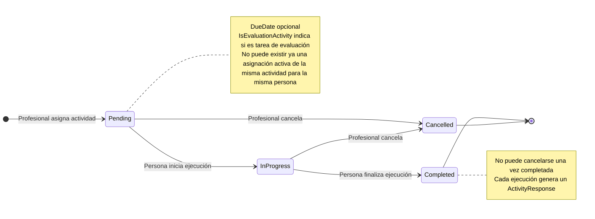
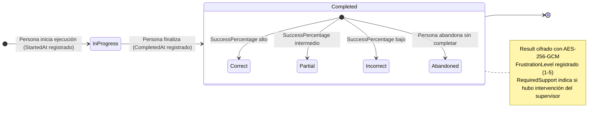

# Diagrama de Estado — ActivityAssignment

**Entidad:** `ActivityAssignment`  
**Campo de estado:** `Status` (varchar20)  
**Entidades relacionadas:** `ActivityResponse` (resultado de cada ejecución)

---

## Estados

| Estado | Descripción |
|--------|-------------|
| `Pending` | Asignación creada por el profesional. La persona aún no inició la actividad. |
| `InProgress` | La persona inició la ejecución de la actividad. |
| `Completed` | La persona completó la actividad (al menos un intento finalizado). |
| `Cancelled` | Cancelada por el profesional antes de ser completada. Soft-delete (`IsActive = false`). |

---

## Diagrama — ActivityAssignment

---

## Reglas de Transición

| Desde | Hacia | Actor | Condición |
|-------|-------|-------|-----------|
| — | `Pending` | Profesional | No puede existir asignación activa duplicada para misma actividad + persona |
| `Pending` | `InProgress` | Sistema (auto) | La persona inicia la ejecución en el frontend |
| `Pending` | `Cancelled` | Profesional | Soft-delete: `IsActive = false` |
| `InProgress` | `Completed` | Sistema (auto) | La persona finaliza el intento |
| `InProgress` | `Cancelled` | Profesional | Soft-delete: `IsActive = false` |
| `Completed` | `Cancelled` | — | **No permitido** |

El estado se actualiza automáticamente por el sistema; el profesional no lo modifica directamente (excepto para cancelar).

---

## ActivityResponse — Resultado de cada Ejecución

Cada vez que la persona ejecuta la actividad asignada, el sistema registra un `ActivityResponse`. Una asignación puede tener múltiples respuestas (múltiples intentos).

> `ActivityResponse` es inmutable una vez registrado. El profesional puede agregar `Observations` (notas post-sesión), pero no puede modificar el resultado.
