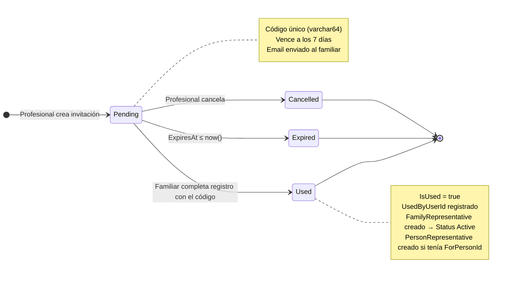

# Diagrama de Estado — Invitation

**Entidad:** `Invitation`  
**Campos de estado:** `IsUsed` (bool), `IsActive` (bool), `ExpiresAt` (timestamptz)  
**Estado derivado** (no hay campo `Status` explícito — se infiere de los tres campos)

---

## Estados

| Estado | Condición | Descripción |
|--------|-----------|-------------|
| `Pending` | `IsUsed = false` AND `IsActive = true` AND `ExpiresAt > now()` | Invitación activa, a la espera de ser usada. |
| `Used` | `IsUsed = true` | Familiar completó el registro con esta invitación. |
| `Expired` | `IsUsed = false` AND `ExpiresAt ≤ now()` | Venció sin ser usada (TTL: 7 días desde creación). |
| `Cancelled` | `IsActive = false` AND `IsUsed = false` | Cancelada manualmente antes de ser usada. |

---

## Diagrama

---

## Reglas de Negocio

- Una invitación es de **un solo uso**: una vez `Used`, no puede reutilizarse.
- No puede existir más de una invitación `Pending` para el mismo par `Email + ForPersonId`.
- Las invitaciones `Expired` y `Cancelled` no bloquean crear una nueva invitación para el mismo email.
- El TTL de 7 días se evalúa comparando `ExpiresAt` con la fecha actual; no hay job que cambie el estado en base de datos.

| Transition | Actor | Endpoint |
|------------|-------|----------|
| → `Pending` | Profesional | `POST /api/invitations` |
| `Pending` → `Used` | Sistema (auto al registrar el familiar) | `POST /api/auth/register-family` |
| `Pending` → `Cancelled` | Profesional | `DELETE /api/invitations/{id}` |
| `Pending` → `Expired` | Sistema (evaluación pasiva en lectura) | — |
