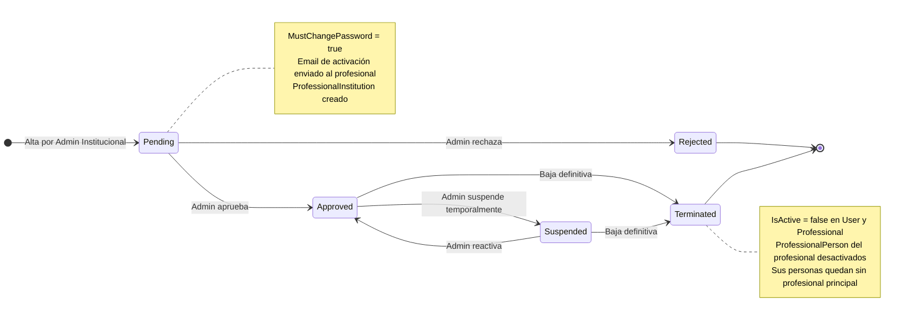

# Diagrama de Estado — Professional

**Entidad:** `Professional`  
**Campo de estado:** `Status` (varchar20)  
**Historial:** `ProfessionalStatusHistory`

---

## Estados

| Estado | Descripción |
|--------|-------------|
| `Pending` | Registro creado por el admin. El profesional aún no fue validado. |
| `Approved` | Profesional habilitado para operar en el sistema. |
| `Rejected` | Registro rechazado. Estado terminal; no puede operar. |
| `Suspended` | Habilitación suspendida temporalmente. Reversible. |
| `Terminated` | Baja definitiva. `IsActive = false` en `User` y `Professional`. Irreversible. |

---

## Diagrama

---

## Reglas de Transición

| Desde | Hacia | Actor | Condición |
|-------|-------|-------|-----------|
| — | `Pending` | Admin Institucional | Alta del profesional; email de activación enviado |
| `Pending` | `Approved` | Admin Institucional | Observación opcional |
| `Pending` | `Rejected` | Admin Institucional | Observación obligatoria |
| `Approved` | `Suspended` | Admin Institucional | Observación obligatoria |
| `Suspended` | `Approved` | Admin Institucional | Observación obligatoria |
| `Approved` | `Terminated` | Admin Institucional | Observación obligatoria. **Irreversible** |
| `Suspended` | `Terminated` | Admin Institucional | Observación obligatoria. **Irreversible** |

Cada transición registra una entrada en `ProfessionalStatusHistory` con: `OldStatus`, `NewStatus`, `Observation` y `ChangedByUserId`.

> El email del profesional solo puede modificarse mientras el estado sea `Pending` (cuenta no activada aún).
