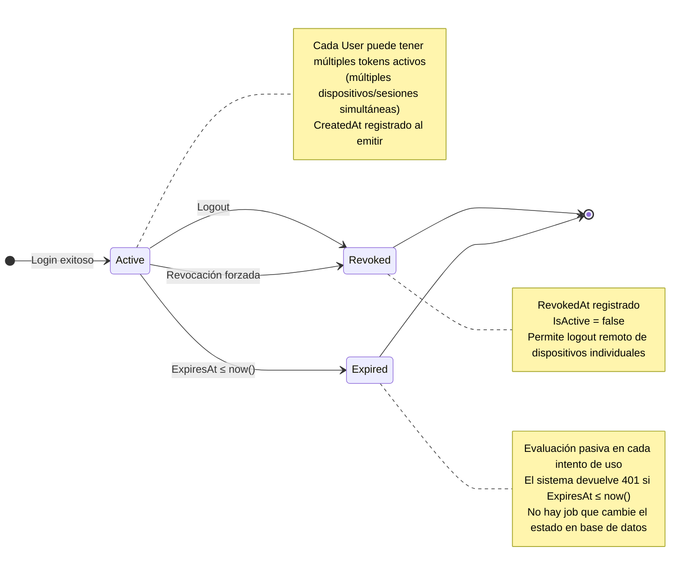

# Diagrama de Estado — RefreshToken

**Entidad:** `RefreshToken`  
**Campos de estado:** `IsActive` (bool), `RevokedAt` (timestamptz nullable), `ExpiresAt` (timestamptz)

---

## Estados

| Estado | Condición | Descripción |
|--------|-----------|-------------|
| `Active` | `IsActive = true` AND `RevokedAt IS NULL` AND `ExpiresAt > now()` | Token válido para renovar la sesión. |
| `Revoked` | `RevokedAt IS NOT NULL` AND `IsActive = false` | Revocado explícitamente (logout, cambio de contraseña, suspensión de cuenta). |
| `Expired` | `ExpiresAt ≤ now()` AND `RevokedAt IS NULL` | Venció sin ser revocado ni usado para renovar. |

---

## Diagrama

---

## Reglas de Negocio

- Un `User` puede tener múltiples `RefreshToken` activos simultáneamente (sesiones en distintos dispositivos).
- Al renovar (`POST /auth/refresh`): el token actual se **revoca** y se emite uno nuevo.
- El logout individual revoca solo el token del dispositivo actual.
- La suspensión o baja del usuario (`Suspended`, `Terminated`) fuerza la revocación de **todos** sus tokens activos.
- `TrustedDevice` es independiente del `RefreshToken`: el dispositivo puede estar autorizado aunque el token haya vencido.

---

## TrustedDevice — Dispositivo Autorizado

Entidad relacionada. No tiene máquina de estados propia (no hay campo `Status`), pero su ciclo de vida relevante es:

| Evento | Descripción |
|--------|-------------|
| Alta | `AuthorizedByUserId` (supervisor) autoriza el dispositivo para login asistido. `RegisteredAt` registrado. |
| Uso | `LastUsedAt` actualizado en cada login exitoso desde ese dispositivo. |
| Baja | Eliminación física o soft-delete si el `User` es dado de baja. |
