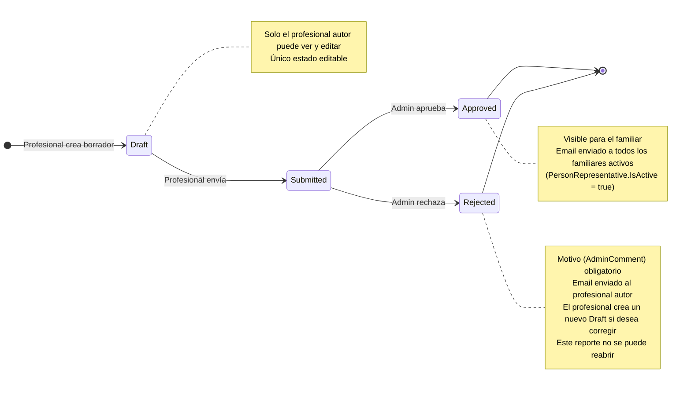

# Diagrama de Estado — Report

**Entidad:** `Report`  
**Campo de estado:** `Status` (varchar20)  
**Flujo:** `reportes-flujo-aprobacion.md`

---

## Estados

| Estado | Descripción |
|--------|-------------|
| `Draft` | Borrador creado por el profesional. Editable. No visible para el familiar. |
| `Submitted` | Enviado al admin para revisión. Solo lectura. No visible para el familiar. |
| `Approved` | Aprobado por el admin. Visible para el familiar. Email enviado al familiar. |
| `Rejected` | Rechazado por el admin con motivo obligatorio. Email enviado al profesional. |

---

## Diagrama

---

## Reglas de Transición

| Desde | Hacia | Actor | Condición |
|-------|-------|-------|-----------|
| — | `Draft` | Profesional | — |
| `Draft` | `Draft` | Profesional | Solo el autor del reporte |
| `Draft` | `Submitted` | Profesional | Solo el autor del reporte |
| `Submitted` | `Approved` | Admin Institucional / Global | — |
| `Submitted` | `Rejected` | Admin Institucional / Global | `AdminComment` obligatorio |
| `Rejected` | — | — | Estado terminal. Se crea un nuevo `Draft` separado |

> Un reporte en `Submitted`, `Approved` o `Rejected` devuelve `400 InvalidOperation` si se intenta editar.

---

## Visibilidad por Actor

| Estado | Profesional | Admin | Familiar |
|--------|:-----------:|:-----:|:--------:|
| `Draft` | ✅ Ve y edita | ❌ | ❌ |
| `Submitted` | ✅ Solo lectura | ✅ Ve y decide | ❌ |
| `Approved` | ✅ Solo lectura | ✅ Solo lectura | ✅ |
| `Rejected` | ✅ Ve con motivo | ✅ Solo lectura | ❌ |

---

## Notificaciones

| Evento | Destinatario | Template |
|--------|-------------|----------|
| `Submitted → Approved` | Familiares activos de la persona | `ReportApproved.html` |
| `Submitted → Rejected` | Profesional autor | `ReportRejected.html` |

Implementación: fire-and-forget con `Task.Run()` — no bloquea la respuesta HTTP.
