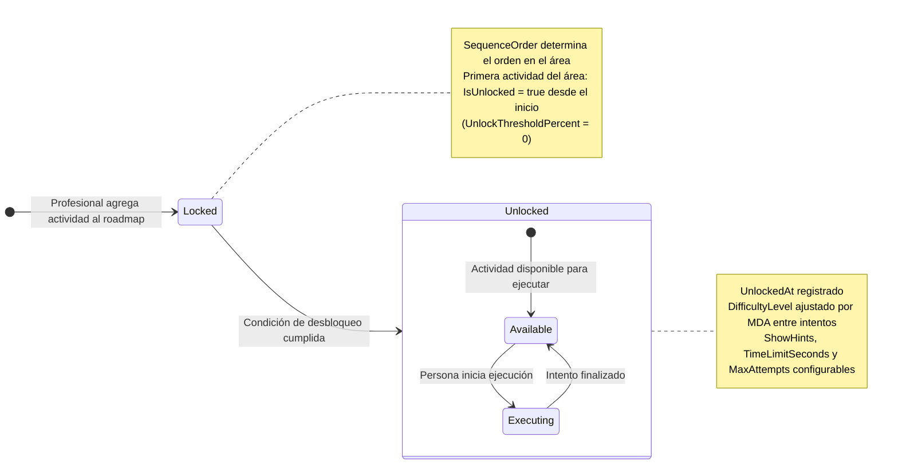
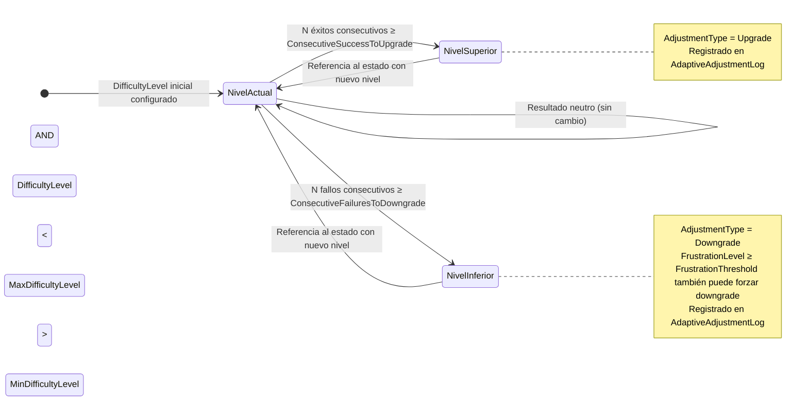

# Diagrama de Estado — PersonRoadmapActivity

**Entidad:** `PersonRoadmapActivity`  
**Campo de estado:** `IsUnlocked` (bool) + `UnlockedAt` (timestamptz)  
**Entidades relacionadas:** `ActivityResult` (resultado por intento), `AdaptiveEngineConfig`, `AdaptiveAdjustmentLog`

---

## Estados

| Estado | Condición | Descripción |
|--------|-----------|-------------|
| `Locked` | `IsUnlocked = false` | Actividad bloqueada en el roadmap. La persona no puede ejecutarla. |
| `Unlocked` | `IsUnlocked = true` | Actividad habilitada. La persona puede ejecutarla. |

---

## Diagrama — Ciclo de vida de la actividad en el roadmap



---

## Condición de Desbloqueo

```
Actividad N se desbloquea cuando:
  ActivityResult.ScorePercent (último intento de Actividad N-1)
    ≥ PersonRoadmapActivity.UnlockThresholdPercent / 100
```

La primera actividad de cada área (`SequenceOrder = 1`) tiene `UnlockThresholdPercent = 0`, por lo tanto se desbloquea inmediatamente al crear el roadmap.

---

## Motor de Dificultad Adaptativa (MDA)

El `AdaptiveEngineConfig` ajusta automáticamente el `DifficultyLevel` de la actividad dentro del roadmap en función del historial de intentos.



> Cada ajuste queda registrado en `AdaptiveAdjustmentLog` con `PreviousValue`, `NewValue`, `Reason` y `AdjustedAt`.

---

## ActivityResult — Registro de intentos

`ActivityResult` es **inmutable**: representa el resultado de un único intento sobre una `PersonRoadmapActivity`. No tiene estados propios; es el input principal del radar chart y del motor adaptativo.

| Campo | Descripción |
|-------|-------------|
| `AttemptNumber` | Número del intento (correlativo por actividad) |
| `ScorePercent` | Porcentaje de éxito normalizado (0.0 – 1.0) |
| `TimeSpentSeconds` | Duración del intento |
| `CompletedAt` | Marca temporal del fin del intento |
