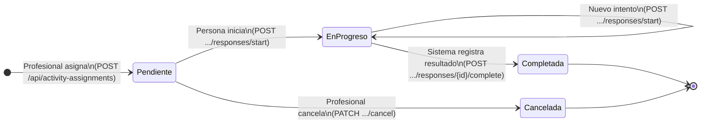
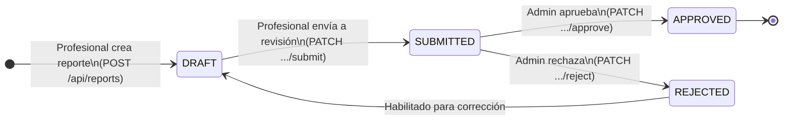
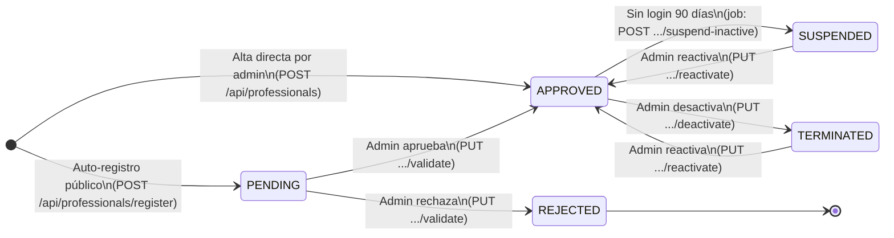
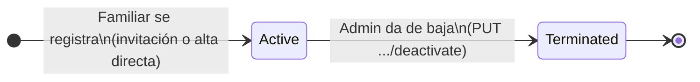

# Diagrama de Estados — InclusiON

**Artefacto:** 08 — Diagrama de Estado de las Entidades Principales  
**Práctica Profesionalizante II — Institución Cervantes**  
**Última actualización:** 2026-05-31

---

## Entidad: ActivityAssignment (Asignación de Actividad)

La entidad transaccional central del sistema. Registra que un profesional asignó una actividad terapéutica a una persona, y evoluciona a través del proceso de ejecución.

### Tabla de estados

| Estado | Puede ir a → | Quién genera la transición | Condición necesaria | Transiciones NO permitidas |
|--------|-------------|--------------------------|--------------------|-----------------------------|
| ⬤ INICIO ↓ | | | | |
| **Pendiente** | EnProgreso, Cancelada | Sistema (al crear) / Persona (al iniciar) | Profesional autorizado crea la asignación vía `POST /api/activity-assignments` | No puede nacer en Completada. |
| **EnProgreso** | Completada, EnProgreso | Persona al completar / al reintentar | La persona ejecutó la actividad y envió resultados | No puede volver a Pendiente. **No puede cancelarse.** |
| **Completada** | *(estado final)* | Sistema al recibir `POST .../responses/{id}/complete` | Sin condición de umbral — siempre se completa al enviar respuesta | No puede retroceder. Un resultado clínico es inmutable. |
| **Cancelada** | *(estado final)* | Profesional | La asignación debe estar en estado **Pendiente** — no se puede cancelar si ya está en progreso | No puede cancelarse desde EnProgreso ni Completada. No puede reactivarse. |

> **Nota:** No existe estado FAILED en la implementación actual. El `MaxAttempts` del roadmap es informativo; la transición final siempre es Completada.

### Diagrama

---

## Entidad: Report (Reporte de Progreso)

Documenta el progreso clínico de una persona. Tiene un flujo de aprobación explícito para garantizar la calidad del informe antes de compartirlo con la familia.

### Tabla de estados

| Estado | Puede ir a → | Quién genera la transición | Condición necesaria | Transiciones NO permitidas |
|--------|-------------|--------------------------|--------------------|-----------------------------|
| ⬤ INICIO ↓ | | | | |
| **DRAFT** | SUBMITTED | Profesional que creó el reporte | El profesional considera que el reporte está listo | No puede nacer en SUBMITTED. El borrador siempre se revisa antes de enviar. |
| **SUBMITTED** | APPROVED, REJECTED | Admin que revisa | El reporte está en espera de validación | No puede volver a DRAFT directamente. No puede editarse mientras está submitted. |
| **APPROVED** | *(estado final)* | Admin aprueba | El contenido del reporte es correcto y completo | No puede modificarse. El familiar puede verlo en este estado. |
| **REJECTED** | DRAFT | Admin rechaza con observación | El reporte requiere corrección | Al rechazarse vuelve a DRAFT para que el profesional pueda corregirlo. |

### Diagrama

---

## Entidad: Professional (Profesional)

Controla el ciclo de vida del profesional terapeuta dentro del sistema. Hay dos caminos de alta con estados iniciales distintos.

### Tabla de estados

| Estado | Puede ir a → | Quién genera la transición | Condición necesaria | Transiciones NO permitidas |
|--------|-------------|--------------------------|--------------------|-----------------------------|
| ⬤ INICIO ↓ | | | | |
| **PENDING** | APPROVED, REJECTED | Admin (no puede ser el propio profesional) | Profesional se registró por auto-registro público | No puede operar el sistema. No puede validarse a sí mismo. |
| **APPROVED** | SUSPENDED, TERMINATED | Sistema (inactividad) / Admin | Sin login por ≥ 90 días (→ SUSPENDED) o desactivación manual (→ TERMINATED) | No puede volver a PENDING. Un aprobado nunca necesita re-validación. |
| **REJECTED** | *(estado final)* | Admin | El auto-registro no cumple los requisitos | No puede reactivarse. Si el profesional insiste, debe hacer un nuevo auto-registro. |
| **SUSPENDED** | APPROVED | Admin reactiva | El admin considera que la suspensión ya no aplica | No puede ir a TERMINATED directamente desde SUSPENDED. |
| **TERMINATED** | APPROVED | Admin reactiva | El admin decide reincorporar al profesional | No puede ir a SUSPENDED. La reincorporación es directa a APPROVED. |

### Diagrama

---

## Entidad: FamilyRepresentative (Familiar / Representante)

Controla el acceso del familiar al portal de seguimiento. A diferencia del Profesional, el familiar **no tiene flujo de aprobación**: se activa directamente al registrarse (vía invitación o directamente por admin) y solo puede desactivarse.

### Tabla de estados

| Estado | Puede ir a → | Quién genera la transición | Condición necesaria | Transiciones NO permitidas |
|--------|-------------|--------------------------|--------------------|-----------------------------|
| ⬤ INICIO ↓ | | | | |
| **Active** | Terminated | Admin desactiva | El familiar dejó de tener relación activa con la institución | No puede volver a Active una vez Terminated (se debe crear un nuevo registro). |
| **Terminated** | *(estado final)* | Admin | Decisión administrativa de dar de baja al familiar | No puede reactivarse. |

> **Nota:** No existe flujo de aprobación (Pending/Rejected) para familiares. El familiar queda Active al registrarse. El historial de cambios se registra en `FamilyStatusHistory`.

### Diagrama

---

## Resumen de entidades transaccionales

| Entidad | Estados | Estado(s) final(es) | Rol que controla las transiciones |
|---|---|---|---|
| ActivityAssignment | Pendiente → EnProgreso → Completada / Cancelada (solo desde Pendiente) | Completada, Cancelada | Profesional (crea/cancela) + Persona (inicia/completa) |
| Report | DRAFT → SUBMITTED → APPROVED / REJECTED → DRAFT | APPROVED | Profesional (crea/envía) + Admin (aprueba/rechaza) |
| Professional | PENDING → APPROVED / REJECTED; APPROVED ↔ SUSPENDED / TERMINATED | REJECTED | Admin (validación) + Sistema (suspensión automática) |
| FamilyRepresentative | PENDING → APPROVED / REJECTED; APPROVED ↔ SUSPENDED | REJECTED | Admin |
