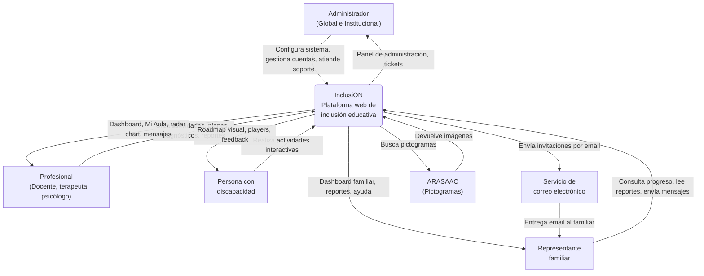

# INSTITUCIÓN CERVANTES — ANALISTA DE SISTEMAS

**Prácticas Profesionalizantes I — NMS42**

**Profesor:** Loza, Fernando Hugo.

**Alumnos:**
- Aparicio, Fernando — Mat. 30913
- Cochis, Germán Gabriel — Mat. 31106
- Decalli, Mariano Agustín — Mat. 31194
- Del Barrio, Sacha — Mat. 31293
- Wlk, Mirko — Mat. 31022

**Empresa:** InclusiON

**Fecha de entrega original:** 27/10/2025
**Última actualización:** 24/03/2026

---

## ÍNDICE

1. [Introducción](#introducción)
2. [Análisis](#análisis)
   - [Historia y evolución del sistema](#historia-y-evolución-del-sistema)
   - [Objetivo de profesionales](#objetivo-de-profesionales)
   - [Actividades desarrolladas](#actividades-desarrolladas)
   - [Organigrama y funciones](#organigrama-y-funciones)
   - [Políticas inclusivas y marco legal](#políticas-inclusivas-y-marco-legal)
   - [Valores y estrategias](#valores-y-estrategias)
   - [Personas a las que se dirige](#personas-a-las-que-se-dirige)
   - [Ambiente y contexto](#ambiente-y-contexto)
   - [Recursos](#recursos)
   - [Planes estratégicos](#planes-estratégicos)
   - [Funcionamiento](#funcionamiento)
   - [Controles](#controles)
   - [Tecnologías de información y comunicación](#tecnologías-de-información-y-comunicación)
   - [Problemas del sistema actual](#problemas-del-sistema-actual)
   - [Requerimientos](#requerimientos)
   - [Oportunidades](#oportunidades)
3. [Anteproyecto](#anteproyecto)
   - [Objetivo](#objetivo)
   - [Alcances](#alcances)
   - [Estudio de factibilidad](#estudio-de-factibilidad)
   - [Proyecto InclusiON](#proyecto-inclusion)
   - [Ámbito de aplicación](#ámbito-de-aplicación)
4. [Mapa global de procesos](#mapa-global-de-procesos)
   - [Procesos del sistema](#procesos-del-sistema)
   - [Fases del sistema](#fases-del-sistema)
   - [Actores y participantes](#actores-y-participantes)
   - [Información que maneja el sistema](#información-que-maneja-el-sistema)
5. [Arquitectura técnica](#arquitectura-técnica)
   - [Stack tecnológico](#stack-tecnológico)
   - [Arquitectura del sistema](#arquitectura-del-sistema)
   - [Diagrama de contexto](#diagrama-de-contexto)
6. [Metodología y organización](#metodología-y-organización)
   - [Sprint 0](#sprint-0)
   - [Roles del equipo](#roles-del-equipo)
   - [Ceremonias Scrum](#ceremonias-scrum)
7. [Estado actual del desarrollo](#estado-actual-del-desarrollo)
8. [Conclusión](#conclusión)
9. [Bibliografía](#bibliografía)

---

## INTRODUCCIÓN

En este proyecto buscamos introducir soluciones tecnológicas a personas con discapacidades y trabajar la inclusión en el ámbito educacional, tratando de fortalecer el vínculo entre profesionales, padres e instituciones con una plataforma de herramientas como reportes automatizados y juegos intuitivos que nivelen o refuercen las capacidades de los pacientes mediante estímulos medidos para brindar información valiosa para los profesionales y padres.

Es un proyecto que nos desafía tanto profesional como personalmente, ya que debemos introducirnos a un sector social que nos permite enriquecernos de información para lograr desarrollar una plataforma útil donde puedan vincularse aún más entre profesionales y padres, logrando aportar algo valioso a dicho sector mediante la tecnología y el relevamiento adecuado.

---

## ANÁLISIS

### Historia y evolución del sistema

La relación entre la tecnología y la discapacidad tiene raíces antiguas, pero su verdadero desarrollo comenzó a consolidarse en los últimos siglos, especialmente con los avances en ciencia, medicina e informática.

**Orígenes antiguos y primeras ayudas.** Las primeras tecnologías asistivas se remontan a la antigüedad. Civilizaciones como Egipto o Grecia ya utilizaban bastones, muletas y prótesis rudimentarias para personas con limitaciones físicas. En la Edad Media, las ayudas eran artesanales y principalmente funcionales, sin una mirada de inclusión social.

**Siglo XIX: avances médicos y mecánicos.** Durante el siglo XIX, con la Revolución Industrial, surgieron los primeros dispositivos ortopédicos más elaborados: sillas de ruedas metálicas, prótesis articuladas y audífonos mecánicos. El desarrollo de la medicina rehabilitadora tras las guerras mundiales impulsó el diseño de tecnologías para veteranos con amputaciones o lesiones.

**Siglo XX: la era electrónica y digital.** Con la llegada de la electrónica y luego la informática, la asistencia tecnológica dio un salto enorme. Aparecieron los primeros audífonos eléctricos, máquinas de escribir adaptadas, y sillas de ruedas motorizadas. La computación personal permitió desarrollar lectores de pantalla, sintetizadores de voz y teclados alternativos, facilitando la comunicación y el acceso a la información. También se expandieron las normas de accesibilidad y el diseño universal, promoviendo entornos inclusivos.

**Siglo XXI: inclusión digital y tecnología inteligente.** En la actualidad, la tecnología asistiva está integrada a la vida cotidiana gracias a la inteligencia artificial, la robótica y los dispositivos móviles. Existen aplicaciones de accesibilidad para personas con discapacidad visual, auditiva, motora o cognitiva. Los implantes cocleares, los exoesqueletos, las prótesis biónicas y los dispositivos controlados por la mente marcan una nueva etapa de autonomía. Además, la accesibilidad digital se ha convertido en un estándar en sitios web, software y plataformas educativas.

**Tendencias actuales y futuro.** El enfoque actual ya no es solo compensar limitaciones, sino potenciar las capacidades y promover la inclusión social, educativa y laboral. La tecnología inclusiva busca eliminar barreras y crear igualdad de oportunidades, con la participación activa de las propias personas con discapacidad en el diseño de soluciones.

### Objetivo de profesionales

**Misión:** El objetivo principal de un profesional que trabaja con personas con discapacidad es favorecer su desarrollo integral, autonomía y plena inclusión en la sociedad.

**Visión:** No es solo atender una limitación física, sensorial o cognitiva, sino potenciar las capacidades, promover la independencia y mejorar la calidad de vida de cada persona.

### Actividades desarrolladas

- **Evaluación y diagnóstico:** Analizar las capacidades, limitaciones y necesidades de cada persona. Elaborar informes y planes de intervención personalizados.
- **Diseño de planes de apoyo o rehabilitación:** Planificar estrategias educativas, terapéuticas o de inserción social. Establecer objetivos a corto, mediano y largo plazo según las posibilidades de la persona.
- **Intervención directa:** Realizar terapias físicas, ocupacionales, psicológicas o educativas. Enseñar habilidades para la vida diaria (alimentación, higiene, comunicación, desplazamiento). Promover el uso de tecnologías asistivas y recursos adaptados.
- **Orientación y acompañamiento familiar:** Brindar apoyo emocional y educativo a las familias. Orientar sobre cómo favorecer la autonomía y participación del familiar con discapacidad.
- **Trabajo interdisciplinario:** Coordinar acciones con médicos, docentes, psicólogos, fonoaudiólogos, trabajadores sociales, entre otros. Participar en reuniones y evaluaciones conjuntas para ofrecer una atención integral.
- **Promoción de la inclusión social y educativa:** Facilitar la integración en escuelas comunes, espacios culturales, deportivos o laborales. Sensibilizar a la comunidad sobre la discapacidad y los derechos humanos.
- **Capacitación y actualización profesional:** Participar en cursos, talleres y formaciones para mantenerse actualizado en nuevas metodologías, leyes y tecnologías inclusivas.

### Organigrama y funciones

| Actor | Función |
|-------|---------|
| **Administrador** | Configura el sistema completo: instituciones, roles, permisos, catálogos y usuarios. El admin global tiene acceso total; el institucional opera dentro del alcance de sus instituciones asignadas. Gestiona cuentas de usuario: reseteo de contraseñas, activación y desactivación. Administra el centro de ayuda y atiende tickets de soporte. |
| **Profesional** | Actor principal del flujo educativo. Evalúa personas, crea actividades con plantillas dinámicas, arma planes de trabajo (roadmap), monitorea el progreso mediante dashboards y radar charts, genera reportes formales y se comunica con la familia. |
| **Persona con discapacidad** | Destinatario del sistema. Accede a su portal AAC (Comunicación Aumentativa y Alternativa), ve su roadmap visual estilo Duolingo y realiza actividades interactivas. El sistema registra su progreso y ajusta la dificultad automáticamente mediante el Motor de Dificultad Adaptativa. |
| **Representante familiar** | Se registra por invitación del profesional. Consulta el progreso de su familiar, lee reportes de avance y se comunica con el profesional desde su portal dedicado. |
| **Institución educativa** | Unidad organizativa que agrupa profesionales y personas. Define el alcance de los administradores institucionales. No interactúa directamente con el sistema. |

### Políticas inclusivas y marco legal

#### Ley de Educación Nacional N.º 26.206 (2006)

La Ley de Educación Nacional establece los objetivos y principios de la política educativa en todo el país, incorporando explícitamente la inclusión educativa y la atención a la diversidad como ejes fundamentales:

- **Artículo 11:** Define los fines de la educación nacional, destacando la igualdad de oportunidades, la no discriminación y la inclusión. El inciso n) dispone *"brindar a las personas con discapacidades, temporales o permanentes, una propuesta pedagógica que les permita el máximo desarrollo de sus posibilidades, la integración y el pleno ejercicio de sus derechos"*.
- **Artículo 42:** Establece que la Educación Especial es una modalidad destinada a asegurar el derecho a la educación de las personas con discapacidad en todos los niveles del sistema, regida por el principio de inclusión educativa.
- **Artículos 43 al 45:** Desarrollan medidas concretas para la inclusión, incluyendo personal especializado, transporte adaptado, recursos técnicos y materiales accesibles, y accesibilidad física de todos los edificios escolares.
- **Artículo 88:** Dispone que el acceso y dominio de las TIC formarán parte de los contenidos curriculares indispensables para la inclusión en la sociedad del conocimiento.

#### Resolución CFE N.º 311/2016

Establece lineamientos específicos para la educación inclusiva de estudiantes con discapacidad:

- Propicia condiciones para la inclusión escolar y el acompañamiento de trayectorias escolares.
- Exige ajustes razonables y apoyos personalizados (adaptaciones curriculares, tecnología asistiva, adecuaciones en la evaluación).
- Establece criterios para la promoción, acreditación y titulación mediante el Proyecto Pedagógico Individual (PPI).
- Subraya la articulación entre escuela, familia y equipos interdisciplinarios.

#### Normativa de la provincia de Córdoba

- **Ley Provincial de Educación N.º 9870 (2010):** Consagra el derecho a la educación con igualdad y sin discriminación, definiendo la educación especial como modalidad que garantiza el derecho a la educación de personas con discapacidad bajo el principio de inclusión.
- **Resolución N.º 1825/2019:** Implementa la educación inclusiva en Córdoba conforme a la Res. CFE 311/16, ordenando la eliminación de barreras físicas, ambientales y de organización institucional. Fomenta el trabajo conjunto entre escuelas comunes y servicios de educación especial, y aprueba lineamientos para la implementación del PPI.

#### Convención sobre los Derechos de las Personas con Discapacidad (ONU) — Ley 27.044 (2014)

Argentina ratificó la Convención (Ley 26.378/2008) y le otorgó jerarquía constitucional mediante la Ley 27.044. Principios fundamentales:

- **Accesibilidad universal:** Eliminación de barreras físicas, comunicacionales y tecnológicas.
- **Educación inclusiva (Artículo 24):** Reconoce el derecho a la educación en igualdad de condiciones, prohibiendo la exclusión del sistema educativo general por motivos de discapacidad.
- **Participación y autonomía:** Garantiza la participación activa de las personas con discapacidad en las decisiones que afecten sus vidas.

### Valores y estrategias

**Valores principales:**
- **Respeto:** Reconocer la dignidad, los derechos y la individualidad de cada persona.
- **Empatía:** Comprender las emociones, necesidades y experiencias de la persona con discapacidad.
- **Responsabilidad:** Actuar con compromiso profesional, cumpliendo con ética y dedicación.
- **Solidaridad:** Trabajar por el bienestar y la inclusión, promoviendo la cooperación.
- **Paciencia:** Comprender que cada persona avanza a su propio ritmo.
- **Compromiso social:** Participar activamente en la construcción de una sociedad más justa e inclusiva.

**Estrategias:**
- Evaluación individualizada para diseñar planes de intervención personalizados.
- Atención integral e interdisciplinaria con múltiples especialistas.
- Estimulación y rehabilitación con técnicas específicas por tipo de discapacidad.
- Uso de tecnologías asistivas (lectores de pantalla, comunicación aumentativa, dispositivos adaptados).
- Educación inclusiva con materiales, tiempos y métodos de enseñanza adaptados.
- Acompañamiento emocional y motivacional.
- Orientación familiar y promoción de la inclusión social y laboral.

### Personas a las que se dirige

- Personas con discapacidades.
- Instituciones educativas.
- Familias.
- Otros profesionales.
- Sociedad en general.

### Ambiente y contexto

Los profesionales que atienden a personas con discapacidad se desempeñan en entornos variados: instituciones educativas, centros de rehabilitación, hospitales, organizaciones sociales, talleres laborales, hogares o espacios comunitarios. En todos estos lugares, el ambiente debe ser accesible, seguro y estimulante.

El contexto actual está influido por una mirada inclusiva y de derechos humanos, que busca dejar atrás el modelo asistencialista para adoptar un **modelo social**, en el que se reconoce a la persona con discapacidad como sujeto de derechos, capaz de tomar decisiones y participar activamente en la sociedad.

Los profesionales trabajan en un contexto **interdisciplinario**, en equipo con médicos, psicólogos, docentes, terapeutas ocupacionales, fonoaudiólogos y trabajadores sociales. La colaboración y la comunicación entre ellos son esenciales para brindar una atención integral.

### Recursos

| Tipo | Descripción |
|------|-------------|
| **Financieros** | Presupuestos institucionales, subsidios, becas y ayudas económicas para sostener la calidad y continuidad de las intervenciones. |
| **Materiales** | Mobiliario adaptado, materiales didácticos y de estimulación sensorial, instrumentos terapéuticos. |
| **Humanos** | Docentes de educación especial, psicólogos, kinesiólogos, terapeutas ocupacionales, fonoaudiólogos, médicos, trabajadores sociales. |
| **Tecnológicos** | Computadoras con software adaptado, lectores de pantalla, impresoras braille, sillas de ruedas eléctricas, aplicaciones móviles y plataformas virtuales accesibles. |
| **Edilicios** | Edificios accesibles con rampas, ascensores, baños adaptados y señalización táctil o sonora. |

### Planes estratégicos

**Corto plazo:** Evaluación inicial, diseño de plan personalizado, intervención directa, acompañamiento familiar, seguimiento y evaluación continua.

**Mediano plazo:** Consolidación de habilidades, inserción educativa/social/laboral, fortalecimiento de la autonomía, programas interdisciplinarios, promoción de la inclusión y sensibilización social.

**Largo plazo:** No se establecen planificaciones rígidas a largo plazo debido a la vinculación con el ámbito social y legal, que puede variar según nuevas leyes o normas sociales.

### Funcionamiento

El funcionamiento del profesional se basa en etapas secuenciales:

1. **Evaluación inicial:** Diagnóstico completo de capacidades, limitaciones, necesidades y entorno.
2. **Planificación:** Diseño de plan individualizado con objetivos y estrategias.
3. **Intervención directa:** Actividades terapéuticas, educativas o de rehabilitación adaptadas.
4. **Acompañamiento y orientación:** Apoyo emocional, motivación y orientación familiar.
5. **Monitoreo y seguimiento:** Evaluación de avances, ajuste del plan según progresos o dificultades.
6. **Evaluación final y proyección:** Balance del proceso, identificación de logros y áreas a mejorar.

### Controles

- **Control de evaluación inicial:** Verificar diagnóstico completo y actualizado.
- **Control de planificación:** Confirmar que los objetivos sean claros, alcanzables y medibles.
- **Control de intervención:** Supervisar que las actividades se ejecuten según lo planificado.
- **Control de seguridad y bienestar:** Garantizar la integridad física y emocional del paciente.
- **Control de seguimiento y progreso:** Registrar avances, comparar con objetivos, ajustar estrategias.
- **Control de comunicación y coordinación:** Información fluida entre profesional, familia y especialistas.
- **Control de documentación:** Registros precisos y actualizados, informes completos y accesibles.

### Tecnologías de información y comunicación

| Categoría | Ejemplos |
|-----------|----------|
| **Comunicación** | Software de comunicación aumentativa y alternativa (CAA), aplicaciones móviles, sistemas de voz sintetizada |
| **Educación y aprendizaje** | Plataformas educativas virtuales, programas adaptativos, recursos multimedia interactivos |
| **Control y seguimiento** | Bases de datos y sistemas de gestión, herramientas de teleasistencia y teleterapia |
| **Apoyo físico y movilidad** | Dispositivos de asistencia motriz, lectores de pantalla, teclados adaptados, software braille |
| **Inclusión social** | Redes sociales y comunidades virtuales, aplicaciones de información y orientación |

### Problemas del sistema actual

| Problema | Descripción |
|----------|-------------|
| **Información descentralizada** | Dificultad para realizar informes interdisciplinarios; la información no se encuentra en un solo lugar. |
| **Procesos manuales** | Consumo de tiempo al analizar las actividades realizadas por las personas con discapacidad. |
| **Accesibilidad** | Problemas de acceso o interacción con diversas plataformas por parte de personas con discapacidad. |
| **Seguimiento profesional** | El análisis de seguimiento es manual y conlleva mucho tiempo para ver resultados. |
| **Comunicación** | Distintos canales de comunicación entre familias y profesional, sin centralización. |
| **Estandarización de actividades** | Consumo de tiempo al asignar las actividades de forma manual. |
| **Sobrestimulación y frustración** | Muchas apps no manejan la estimulación y generan dependencias; no hay manejo de la frustración. |

### Requerimientos

#### Requerimientos funcionales

**Gestión de usuarios y roles:**
- Registrar, actualizar y dar de baja usuarios, roles, profesionales, instituciones, personas con discapacidad y representantes familiares.
- Gestión centralizada de cuentas: reseteo de contraseña, desactivación y reactivación de usuarios.
- Asignar roles y permisos diferenciados.

**Vinculación entre actores:**
- Relacionar profesional con persona con discapacidad y representante familiar.
- Asignar profesional a institución educativa.
- Sistema de invitaciones por email para registro de familiares.

**Actividades y seguimiento:**
- Crear, asignar y gestionar actividades personalizadas con plantillas dinámicas.
- Registrar respuestas de actividades (tiempos, aciertos, errores, patrones).
- Motor de dificultad adaptativa que ajusta automáticamente la complejidad.
- Plan de trabajo (roadmap) con progresión secuencial por área.

**Evaluación e informes:**
- Registrar y actualizar diagnósticos funcionales.
- Generar y emitir reportes de actividades y seguimiento.
- Dashboard con radar chart de habilidades.

**Comunicación:**
- Mensajería interna entre profesional y representantes familiares.
- Notificaciones automáticas del sistema.

**Onboarding y soporte:**
- Flujo guiado de primer ingreso para profesionales y familiares.
- Centro de ayuda con preguntas frecuentes.
- Sistema de tickets de soporte.

#### Requerimientos no funcionales

- **Seguridad y confidencialidad:** Autenticación JWT con múltiples métodos de login, encriptación de datos, control de accesos por roles, auditoría de acciones.
- **Marco legal:** Cumplimiento de Ley 26.206, Resolución CFE 311/16, Resolución 1825/19, Ley 27.044.
- **Accesibilidad y usabilidad:** 7 perfiles de accesibilidad (default, alto contraste, dislexia, baja visión, deuteranopía, protanopía, tritanopía) con modo claro y oscuro (14 combinaciones). 4 métodos de login adaptados al nivel de autonomía. Diseño responsivo.

### Oportunidades

- **Incorporación de tecnología accesible:** Herramientas digitales inclusivas que eliminan barreras tecnológicas.
- **Digitalización del seguimiento profesional:** Centralización de información y generación automática de reportes.
- **Fortalecimiento del trabajo interdisciplinario:** Entorno digital común para unificar informes y diagnósticos.
- **Difusión del enfoque inclusivo:** Promoción de leyes, resoluciones y buenas prácticas sobre educación inclusiva.
- **Entorno adaptable y escalable:** Herramienta flexible aplicable en diferentes instituciones y contextos.
- **Mejora en la comunicación:** Canal digital seguro entre profesionales, personas con discapacidad y familias.
- **Prevención de sobreestimulación y frustración:** Motor de dificultad adaptativa con detección de frustración y pausas automáticas.

---

## ANTEPROYECTO

### Objetivo

Diseñar y desarrollar una plataforma educativa inclusiva orientada a optimizar la enseñanza entre profesionales, alumnos y familias.

### Alcances

| Alcance | Descripción |
|---------|-------------|
| **Gestión integral de usuarios y roles** | Registrar, actualizar y administrar perfiles de profesionales, instituciones educativas, personas con discapacidad y representantes familiares. Sistema de roles y permisos diferenciados. Gestión centralizada de cuentas. |
| **Gestión de personas con discapacidad** | Registrar y administrar personas con discapacidad. Registrar y administrar diagnósticos funcionales. Perfil funcional y de habilidades por persona. |
| **Vinculación entre actores** | Relaciones entre profesionales, personas, familiares e instituciones. Flujo ordenado y centralizado de datos. |
| **Actividades y seguimiento personalizado** | Actividades con plantillas dinámicas (5 tipos). Plan de trabajo (roadmap) con progresión por área. Motor de dificultad adaptativa. Reportes automáticos de progreso. |
| **Comunicación** | Mensajería interna entre profesionales y familias. Invitaciones por email para registro de familiares. |
| **Informes y reportes** | Generación de reportes formales de progreso. Dashboard con indicadores visuales y radar chart. Exportación a PDF. |
| **Onboarding** | Flujo guiado de primer ingreso por rol: cambio de contraseña, completar perfil, tour del portal, pantalla de bienvenida. |
| **Soporte** | Centro de ayuda con FAQ. Sistema de tickets para reportar problemas. Guías contextuales dentro de la aplicación. |
| **Accesibilidad y usabilidad** | 7 perfiles de accesibilidad × 2 modos (claro/oscuro) = 14 combinaciones visuales. 4 métodos de login según nivel de autonomía. |
| **Seguridad y marco legal** | JWT con refresh tokens, auditoría de acciones, cumplimiento normativo. |

### Estudio de factibilidad

**Factibilidad técnica:**
- Compatibilidad multi-dispositivo y estándares de accesibilidad.
- Stack tecnológico probado: Angular 20 + ASP.NET Core + SQL Server.
- Seguridad mediante JWT, ASP.NET Identity y control de accesos por roles.
- Arquitectura escalable con patrón CQRS.

**Factibilidad económica:**
- Tecnologías open-source y licencias gratuitas para desarrollo.
- Hosting configurable según presupuesto.
- Modelo extensible para futuras funcionalidades.

**Factibilidad operativa:**
- Onboarding guiado para profesionales y familiares (wizard de perfil, tour del portal).
- Centro de ayuda (FAQ) y sistema de tickets de soporte.
- Integración natural al flujo de trabajo del profesional.
- Evaluación y retroalimentación continua.

### Proyecto InclusiON

El proyecto tiene el nombre **"InclusiON"**, para lograr una mezcla entre el objetivo principal del proyecto que es la **inclusión** y la palabra **ON** como símbolo tecnológico del "power on" para determinar que arranca un proceso de integración entre la inclusión y la tecnología.

### Ámbito de aplicación

El presente proyecto se desarrolla en el ámbito educativo y social, con un enfoque en la inclusión de personas con discapacidades. La propuesta consiste en el desarrollo de una plataforma digital destinada a promover la integración, el aprendizaje y el fortalecimiento de habilidades a través de herramientas tecnológicas accesibles e interactivas.

El sistema busca ofrecer un espacio colaborativo que vincule a profesionales, familias y personas con discapacidad, permitiendo el intercambio constante de información y recursos. Los profesionales pueden acceder fácilmente a los perfiles de los usuarios, crear actividades educativas personalizadas con plantillas dinámicas y realizar un seguimiento del progreso individual mediante dashboards, radar charts y reportes formales. Las familias cuentan con un portal dedicado que les permite visualizar los avances, recibir reportes y comunicarse directamente con el profesional.

---

## MAPA GLOBAL DE PROCESOS

### Procesos del sistema

El sistema InclusiON organiza sus procesos en **8 áreas funcionales** que cubren el ciclo completo de trabajo:

#### Configuración del Sistema
| # | Proceso | Qué resuelve |
|---|---------|--------------|
| 01 | Gestión de Instituciones | Crear y administrar las instituciones educativas donde operan los profesionales |
| 02 | Gestión de Roles y Permisos | Definir qué puede hacer cada tipo de usuario en la plataforma |
| 03 | Gestión de Catálogos | Cargar las listas de referencia: tipos de discapacidad, áreas de habilidad, niveles de autonomía, etc. |

#### Gestión de Usuarios
| # | Proceso | Qué resuelve |
|---|---------|--------------|
| 04 | Gestión de Profesionales | Registrar a los profesionales que van a usar la plataforma (alta por admin con contraseña temporal) |
| 05 | Gestión de Personas con Discapacidad | Registrar a las personas con su perfil funcional, accesibilidad y método de login |
| 06 | Gestión de Familiares | Registrar a los representantes familiares (alta directa por admin o auto-registro por invitación) |
| 07 | Gestión de Invitaciones | Que el profesional invite al familiar por email y este se registre con un link único |

#### Asignaciones
| # | Proceso | Qué resuelve |
|---|---------|--------------|
| 08 | Asignación de Profesionales | Vincular profesionales con instituciones, personas y áreas de habilidad |

#### Evaluación y Planificación
| # | Proceso | Qué resuelve |
|---|---------|--------------|
| 09 | Evaluación y Diagnóstico | Que el profesional evalúe a la persona y registre su diagnóstico funcional |
| 10 | Gestión de Actividades | Que el profesional cree actividades educativas con plantillas interactivas dinámicas |
| 11 | Plan de Trabajo (Roadmap) | Que el profesional arme un camino de aprendizaje secuenciado por área de habilidad |

#### Ejecución
| # | Proceso | Qué resuelve |
|---|---------|--------------|
| 12 | Resolución de Actividades | Que la persona realice las actividades en el portal AAC y el sistema registre su progreso |
| 13 | Dificultad Adaptativa (MDA) | Que el sistema suba o baje la dificultad automáticamente según el rendimiento |

#### Monitoreo y Reportes
| # | Proceso | Qué resuelve |
|---|---------|--------------|
| 14 | Seguimiento de Avances | Que el profesional vea el progreso de sus personas en un dashboard visual con radar chart |
| 15 | Generación de Informes | Que el profesional genere reportes formales y la familia los consulte y descargue |

#### Comunicación
| # | Proceso | Qué resuelve |
|---|---------|--------------|
| 16 | Comunicación entre Actores | Que profesionales y familias se comuniquen dentro de la plataforma (mensajería + notificaciones) |

#### Administración de Cuentas
| # | Proceso | Qué resuelve |
|---|---------|--------------|
| 17 | Gestión de Usuarios | Que el admin gestione cuentas de forma centralizada: resetear contraseñas, desactivar, reactivar, consultar actividad |
| 18 | Onboarding | Que cada usuario nuevo sea guiado en su primer ingreso al sistema (cambio de contraseña, completar perfil, tour) |

#### Soporte
| # | Proceso | Qué resuelve |
|---|---------|--------------|
| 19 | Soporte y Ayuda | Que los usuarios consulten un centro de ayuda (FAQ), reporten problemas y reciban asistencia del admin |

### Fases del sistema

#### Fase 1 — Configuración y Onboarding
**Objetivo:** Preparar el sistema y dar de alta a todos los actores.

```
Admin crea institución → Admin crea profesional → Admin crea persona
→ Admin asigna profesional ↔ persona → Profesional invita familiar
→ Familiar se registra → Onboarding de cada usuario → Sistema listo para operar
```

**Procesos involucrados:** 01 Instituciones, 02 Roles, 03 Catálogos, 04 Profesionales, 05 Personas, 06 Familiares, 07 Invitaciones, 08 Asignaciones, 17 Gestión de Usuarios, 18 Onboarding.

#### Fase 2 — Evaluación y Diagnóstico
**Objetivo:** Establecer el punto de partida del alumno antes de la intervención.

```
Profesional configura perfil de habilidades → Profesional edita perfil funcional
→ Profesional registra diagnóstico → Evaluación inicial completa
```

**Procesos involucrados:** 09 Evaluación y Diagnóstico.

#### Fase 3 — Intervención y Personalización
**Objetivo:** Diseñar el plan de trabajo personalizado basado en la evaluación.

```
Profesional crea actividades → Profesional arma roadmap
→ Profesional configura MDA → Plan de trabajo listo
```

**Procesos involucrados:** 10 Actividades, 11 Roadmap, 13 MDA configuración.

#### Fase 4 — Ciclo de Seguimiento y Mejora Continua
**Objetivo:** Ciclo operativo principal. El alumno trabaja, el sistema adapta, los actores monitorean.

```
Persona realiza actividad → Sistema registra respuesta → MDA evalúa rendimiento
→ ¿Ajusta dificultad? → Dashboard profesional → Profesional monitorea
→ Genera reporte de progreso → Familia consulta
→ ¿Ajustar plan? → Reforzar / Avanzar / Mantener
```

**Procesos involucrados:** 12 Resolución, 13 MDA auto, 14 Seguimiento, 15 Informes, 16 Comunicación, 19 Soporte.

### Actores y participantes

| Actor | Procesos en los que participa |
|-------|------------------------------|
| **Admin Global** | 01, 02, 03, 04, 05, 06, 08, 17, 19 |
| **Admin Institucional** | 04, 05, 06, 08, 17, 19 |
| **Profesional** | 07, 08, 09, 10, 11, 14, 15, 16, 18, 19 |
| **Persona con Discapacidad** | 12, 18 |
| **Familia** | 07, 14, 15, 16, 18, 19 |
| **Sistema (automático)** | 13 |

### Información que maneja el sistema

**Entrada al sistema:**

| Desde | Información |
|-------|-------------|
| Administrador | Datos de instituciones, profesionales, personas, familiares, catálogos, roles, permisos, gestión de cuentas, FAQ |
| Profesional | Diagnósticos, actividades, planes de trabajo, reportes, mensajes, invitaciones |
| Persona con discapacidad | Respuestas a actividades (tiempos, aciertos, errores, patrones) |
| Familiar | Mensajes al profesional, tickets de soporte |
| ARASAAC | Pictogramas para actividades |

**Salida del sistema:**

| Hacia | Información |
|-------|-------------|
| Administrador | Panel de administración, listados, gestión de cuentas, tickets de soporte |
| Profesional | Dashboard, Mi Aula, radar chart, detalle de persona, reportes, mensajes |
| Persona con discapacidad | Roadmap visual, actividades interactivas, feedback, celebraciones |
| Familiar | Dashboard familiar, reportes de progreso, mensajes, centro de ayuda |
| Servicio SMTP | Emails de invitación con link de registro |

**Flujos internos automáticos:**

| Proceso | Descripción |
|---------|-------------|
| Motor de Dificultad Adaptativa | Tras cada actividad, evalúa rendimiento y ajusta dificultad, tiempo, pistas e intentos |
| Desbloqueo de actividades | Cuando el porcentaje de éxito supera el umbral, la siguiente actividad del roadmap se desbloquea |
| Detección de frustración | Si la persona acumula más de 3 intentos fallidos, el sistema muestra una pausa y alerta al profesional |
| Cierre automático de tickets | Tickets de soporte sin actividad por 30 días se cierran automáticamente |

---

## ARQUITECTURA TÉCNICA

### Stack tecnológico

| Capa | Tecnología | Descripción |
|------|------------|-------------|
| **Frontend** | Angular 20 + CoreUI | Interfaz interactiva con 4 portales (AAC, Profesional, Familiar, Admin). Accesibilidad con 14 combinaciones visuales. |
| **Backend** | ASP.NET Core Web API (.NET) | Lógica de negocio con patrón CQRS. Handlers auto-registrados por reflexión. |
| **Base de datos** | SQL Server | Almacenamiento estructurado. Entity Framework Core con 36 configuraciones de entidades. |
| **Autenticación** | JWT + ASP.NET Identity | 5 métodos de login, refresh tokens, auditoría de accesos. |
| **Email** | MailKit (SMTP) | Envío de invitaciones por email con templates HTML. |
| **Comunicación API** | REST + JSON | Intercambio de datos vía endpoints RESTful. |

### Arquitectura del sistema

```
┌──────────────────────────────────────────────┐
│                 FRONTEND                      │
│            Angular 20 + CoreUI                │
│  ┌──────────┐ ┌──────┐ ┌──────┐ ┌──────┐    │
│  │AAC Portal│ │ Prof │ │ Fam  │ │Admin │    │
│  │  /app/*  │ │/pro/*│ │/fam/*│ │/admin│    │
│  └────┬─────┘ └──┬───┘ └──┬───┘ └──┬───┘    │
│       └───────────┴────────┴────────┘        │
│              HTTP + JWT Bearer                │
└──────────────────┬───────────────────────────┘
                   │ CORS
┌──────────────────▼───────────────────────────┐
│             InclusiON.Api                     │
│        ASP.NET Core Web API                   │
│   Controllers → Command/Query → Handler       │
├───────────────────────────────────────────────┤
│          InclusiON.Application                │
│   CQRS Handlers (auto-registrados)            │
│   ICommandHandler / IQueryHandler             │
│   Extensions: Paginación, Filtros             │
├───────────────────────────────────────────────┤
│         InclusiON.Infrastructure              │
│   JWT │ Password Hasher │ Repositories        │
│   Unit of Work │ Identity │ Mail Service      │
├───────────────────────────────────────────────┤
│            InclusiON.Data                     │
│   EF Core DbContext │ 36 Configurations       │
│   13+ Migraciones │ DatabaseSeeder            │
├───────────────────────────────────────────────┤
│           InclusiON.Domain                    │
│   39+ Entidades │ Base Classes │ Enums        │
├──────────────┬────────────────────────────────┤
│ InclusiON.DTOs │ InclusiON.Shared │ Semantic  │
│ Req/Res DTOs   │ Constantes      │ Search    │
└──────────────┴────────────────────────────────┘
                   │
            ┌──────▼──────┐
            │  SQL Server │
            └─────────────┘
```

### Diagrama de contexto



### Límites del sistema

**InclusiON incluye:**
- Gestión de usuarios, instituciones y relaciones entre actores
- Gestión centralizada de cuentas (reset password, activar/desactivar)
- Onboarding guiado por rol
- Creación y ejecución de actividades educativas interactivas con 5 tipos de plantilla
- Plan de trabajo personalizado (roadmap) con progresión automática
- Motor de dificultad adaptativa con detección de frustración
- Evaluación, diagnósticos funcionales y reportes de progreso
- Mensajería interna entre profesionales y familias
- Accesibilidad con 7 perfiles visuales, 2 modos y 4 métodos de login
- Centro de ayuda (FAQ) y sistema de tickets de soporte

**InclusiON no incluye:**
- Gestión administrativa de la institución (nómina, presupuesto, infraestructura)
- Historias clínicas médicas (solo diagnósticos funcionales educativos)
- Videollamadas o comunicación en tiempo real de voz/video
- Facturación o pagos
- Gestión de turnos o agenda presencial

---

## METODOLOGÍA Y ORGANIZACIÓN

### Sprint 0

**Objetivo:** Preparar el entorno de trabajo, seleccionar las herramientas tecnológicas y definir la organización del equipo.

**Herramientas seleccionadas:**

| Área | Herramienta |
|------|-------------|
| Comunicación interna | Microsoft Teams / WhatsApp |
| Gestión de tareas y versiones | GitHub |
| Entorno de desarrollo | Visual Studio Code / Visual Studio |
| Frontend | Angular 20 + CoreUI + TypeScript |
| Backend | C# (.NET / ASP.NET Core Web API) |
| Base de datos | SQL Server + Entity Framework Core |
| Documentación | Markdown + Mermaid (versionada en Git) |

### Roles del equipo

| Rol | Nombre | Responsabilidades |
|-----|--------|-------------------|
| Product Owner | Ferreyra, Candelaria / Vettorazzi, Catalina | Define requisitos funcionales y prioriza el Product Backlog. Supervisa que el producto responda a los objetivos de inclusión educativa. |
| Scrum Master | Decalli, Mariano | Facilita la aplicación de Scrum, organiza las ceremonias y elimina impedimentos. |
| Development Team | Aparicio, Fernando / Cochis, Germán / Del Barrio, Sacha / Wlk, Mirko | Implementan la solución técnica: frontend, backend, base de datos, pruebas y documentación. |

### Ceremonias Scrum

- **Sprint Planning:** Definición de objetivos, tareas y criterios de aceptación.
- **Daily Scrum:** Comunicación de avances, impedimentos y próximos pasos.
- **Sprint Review:** Presentación del incremento funcional y obtención de feedback.
- **Sprint Retrospective:** Análisis de lo que funcionó, problemas detectados y acciones de mejora.
- **Refinamiento del Backlog:** Priorización y ajuste de historias de usuario.

**Resultados del Sprint 0:**
- Conformación del equipo con roles definidos.
- Selección y validación de herramientas de desarrollo y comunicación.
- Definición de la plataforma tecnológica base.
- Creación del repositorio GitHub y documentación inicial.
- Elaboración del Product Backlog inicial.

---

## ESTADO ACTUAL DEL DESARROLLO

### Resumen de avance

| Track | Implementadas | Parciales | Pendientes | Total |
|-------|--------------|-----------|------------|-------|
| Backend | 7 | 2 | 11 | 20 |
| Frontend | 6 | 0 | 15 | 21 |

### Funcionalidades implementadas

| Funcionalidad | Estado |
|---------------|--------|
| Autenticación JWT (5 métodos de login + refresh tokens) | Implementado |
| CRUD Profesionales con contraseña temporal | Implementado |
| CRUD Personas con discapacidad (perfil funcional + accesibilidad) | Implementado |
| CRUD Familiares (alta directa + invitación por email) | Implementado |
| CRUD Instituciones Educativas | Implementado |
| Catálogos de referencia (6 tipos) | Implementado |
| Roles y permisos con panel de checkboxes | Implementado |
| Asignaciones profesional ↔ institución ↔ persona | Implementado |
| Sistema de invitaciones con email SMTP | Implementado |
| Perfil de habilidades (SkillProfile) | Implementado |
| Dashboard profesional con datos reales | Implementado |
| Mi Aula (portal profesional con cards de personas) | Implementado |
| Sistema de login visual (7 componentes Angular) | Implementado |
| Layouts por rol (AAC, Profesional, Familiar, Admin) | Implementado |
| Accesibilidad (7 perfiles × 2 modos = 14 combinaciones) | Implementado |
| Admin Global vs Institucional (JWT claims + filtrado) | Implementado |

### Historias de usuario por sprint

**Sprint 1 (Bases):** Catálogos, CRUD Profesionales, Asignaciones — Implementado.

**Sprint 2 (Actividades y Roadmap):** Áreas de habilidad, Templates, CRUD Actividades, Perfil de habilidades, Invitaciones, Roadmap — Parcialmente implementado.

**Sprint 3 (Ejecución):** Asignaciones de actividades, Respuestas, Radar/Dashboard — Pendiente.

**Sprint 4 (Avanzados):** Diagnósticos, Reportes, Mensajería, Búsqueda semántica, Motor adaptativo — Pendiente.

**Sprint 5 (Gestión, Onboarding y Soporte):** Gestión centralizada de usuarios, Onboarding wizard, Centro de ayuda y tickets — Pendiente.

### Documentación del proyecto

| Documento | Descripción |
|-----------|-------------|
| 19 procesos documentados | Flujos detallados con diagramas Mermaid, endpoints y participantes |
| 13 historias de usuario (HU) | Criterios de aceptación, descripción funcional |
| 41 historias técnicas (BE + FE) | Especificaciones de endpoints, componentes y criterios |
| Diagrama de contexto | Actores externos, flujos de entrada/salida, límites del sistema |
| Diccionario de datos | 18 entidades con campos, tipos y relaciones |
| Glosario | Términos del dominio del proyecto |
| Arquitectura técnica | Stack, capas, patrón CQRS, diagrama general |
| Referencias transversales | Accesibilidad (14 combinaciones) y autenticación (5 métodos) |

---

## CONCLUSIÓN

Luego de realizar el relevamiento, definir los alcances y determinar las funcionalidades del proyecto, nos sentimos plenamente motivados para afrontar un doble desafío. Por un lado, contribuir con un aporte tecnológico orientado a un sector socialmente vulnerable; y por otro, desarrollar un trabajo de tesis que, además de implicar un aprendizaje intelectual y técnico, nos invita a reflexionar desde una perspectiva humana.

Como grupo con experiencia previa de trabajo colaborativo, logramos distribuir los roles de acuerdo con las fortalezas individuales, minimizando las debilidades y transformándolas en oportunidades de crecimiento. Este enfoque nos permitió no solo consolidar el desarrollo del proyecto, sino también generar un valor agregado que refleja profesionalismo, compromiso y cohesión de equipo.

El desarrollo de InclusiON ha avanzado significativamente desde la entrega original del anteproyecto. La plataforma cuenta con una base sólida de 16 funcionalidades transversales implementadas, una arquitectura robusta con patrón CQRS, y un sistema de accesibilidad con 14 combinaciones visuales que garantiza que todos los usuarios puedan interactuar con la plataforma según sus capacidades. Los procesos del sistema han sido ampliados de 16 a 19, incorporando la gestión centralizada de usuarios, el onboarding guiado y el soporte, áreas que fortalecen la experiencia completa del usuario dentro de la plataforma.

Agradecemos profundamente el acompañamiento y la predisposición de los docentes de la Institución Cervantes, quienes, a través de su guía, dedicación y aportes, facilitaron nuestro progreso y contribuyeron a que el desarrollo del proyecto se lleve a cabo de manera ordenada y efectiva.

---

## BIBLIOGRAFÍA

- Ley Nº 26.206 – Ley de Educación Nacional (artículos sobre inclusión educativa). argentina.gob.ar.
- Resolución CFE Nº 311/2016 – "Promoción, acreditación, certificación y titulación de estudiantes con discapacidad". argentina.gob.ar.
- Ley Provincial de Córdoba Nº 9870/2010 – Ley de Educación Provincial (arts. 5 y 49 sobre inclusión). igualdadycalidadcba.gov.ar.
- Resolución Ministerial (Córdoba) Nº 1825/2019 – Implementación de la educación inclusiva en Córdoba. uepc.org.ar.
- Ley Nº 27.044/2014 – Otorga rango constitucional a la Convención de la ONU sobre Derechos de las Personas con Discapacidad. argentina.gob.ar.
- Convención sobre los Derechos de las Personas con Discapacidad, art. 24 (derecho a educación inclusiva). argentina.gob.ar.
