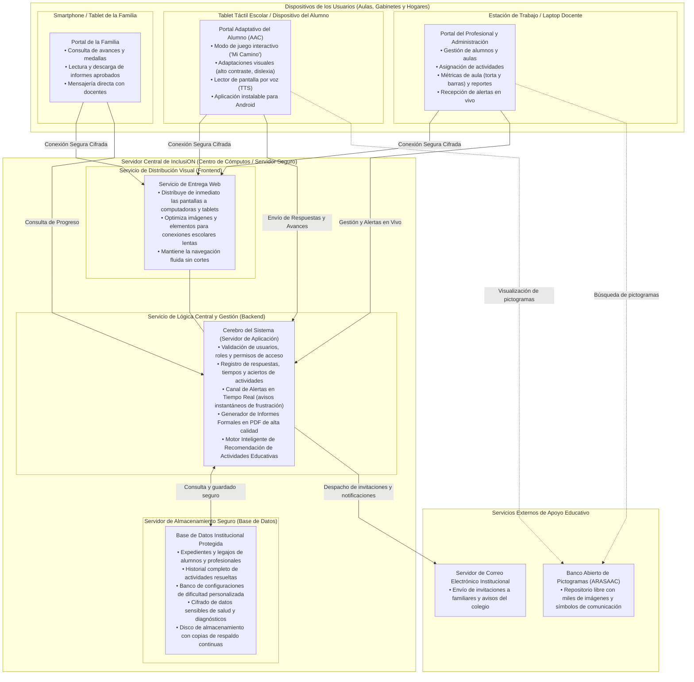

# 01 — Diagrama de Despliegue del Sistema InclusiON

**Definición de Arquitectura en Lenguaje de Negocio / Cliente**  
**Proyecto:** InclusiON — Plataforma de Gestión y Aprendizaje para la Inclusión Educativa  
**Destinatarios:** Directivos, Profesionales de la Educación y Salud, Familias y Evaluadores  

---

## 1. Introducción y Propósito

El **Diagrama de Despliegue** muestra cómo está instalada y distribuida la plataforma **InclusiON** en el mundo real: qué dispositivos utilizan las personas, dónde se alojan los datos confidenciales de la institución, cómo viaja la información de manera segura y cómo se conecta con servicios educativos externos (como el banco de pictogramas).

Este enfoque en **lenguaje del cliente** permite a directivos, docentes y comités evaluadores comprender de forma clara y visual la infraestructura sin necesidad de descifrar tecnicismos de programación.

---

## 2. Diagrama de Despliegue General (Visión del Cliente)

> 💡 *El diagrama superior muestra la topología operativa del sistema. A continuación se incluye la representación interactiva en Mermaid y el archivo fuente descargable en [PlantUML](./puml/01-despliegue.puml).*

---

## 3. Descripción de los Elementos del Despliegue

### 3.1. Dispositivos de los Usuarios (Puntos de Acceso)

1. **Estaciones de Trabajo y Laptops Docentes:**
   - **Dónde se usa:** En salas de profesores, gabinetes psicopedagógicos o secretarías escolares.
   - **Qué permite:** Diseñar planes de trabajo, crear actividades personalizadas, observar el radar gráfico de habilidades, redactar diagnósticos y recibir notificaciones instantáneas si un estudiante necesita apoyo en el aula.

2. **Tablets Táctiles de los Estudiantes:**
   - **Dónde se usa:** En el aula común o especial, en sesiones terapéuticas o en el hogar.
   - **Qué permite:** Jugar y resolver actividades educativas mediante interacción táctil simplificada. La aplicación está adaptada para funcionar tanto desde el navegador web como desde una aplicación instalable (APK) en tablets Android, garantizando que el estudiante no se distraiga con otras aplicaciones o botones ajenos al juego.

3. **Dispositivos Móviles de las Familias:**
   - **Dónde se usa:** En el teléfono o tablet del padre, madre o tutor.
   - **Qué permite:** Seguir día a día los logros del estudiante, celebrar sus medallas obtenidas, descargar los informes autorizados por la dirección y enviar mensajes al equipo terapéutico.

---

### 3.2. El Servidor Central de InclusiON

Toda la inteligencia de la plataforma reside en un servidor central protegido (que puede estar alojado en la propia institución o en un centro de datos seguro en la nube). Se compone de tres áreas coordinadas:

1. **Servicio de Distribución Visual:**
   - Se encarga de que cualquier usuario que abra la plataforma reciba las pantallas de inmediato, con tiempos de carga mínimos, incluso cuando la conexión de internet de la escuela sea inestable o lenta.

2. **Servicio de Lógica Central y Gestión:**
   - **Control de Acceso:** Verifica la identidad de cada persona y asegura que un docente solo acceda a los estudiantes a su cargo y que una familia solo vea los datos de su hijo.
   - **Canal de Alertas en Tiempo Real:** Si un alumno falla reiteradamente en una actividad o se bloquea por frustración, este módulo envía un aviso sonoro y visual inmediato a la pantalla del docente para que pueda intervenir pedagógicamente.
   - **Generador de Informes Oficiales en PDF:** Confecciona con precisión profesional los reportes de evolución listos para imprimir o entregar a obras sociales y ministerios de educación.
   - **Asistente Inteligente de Actividades:** Sugiere al terapeuta qué ejercicios convienen para cada estudiante de acuerdo a su perfil de habilidades, sin costo por consultas externas.

3. **Servidor de Almacenamiento Seguro:**
   - Es la caja fuerte digital de la institución. Guarda todos los expedientes pedagógicos, las respuestas a los juegos y las notas de evolución.
   - Cuenta con **mecanismos de cifrado** que aseguran que nadie ajeno a la institución pueda leer los diagnósticos o historiales de los estudiantes.

---

### 3.3. Servicios Externos Integrados

1. **Biblioteca Abierta de Pictogramas (ARASAAC):**
   - La plataforma se conecta de forma transparente con el catálogo público de ARASAAC (el estándar internacional de comunicación aumentativa y adaptada), permitiendo que docentes y terapeutas busquen e incorporen miles de símbolos gráficos en las actividades sin costo de licencias de imágenes.

2. **Servicio de Notificaciones por Correo Electrónico:**
   - Se encarga de hacer llegar los enlaces de invitación a los familiares cuando son dados de alta, así como avisos de informes nuevos disponibles para su lectura.

---

## 4. Medidas de Seguridad y Protección de la Privacidad

Dado que InclusiON gestiona información sobre la salud y educación de personas con discapacidad, el despliegue físico y lógico incorpora estrictas garantías:

1. **Canales Cifrados de Extremo a Extremo:** Toda la comunicación entre los celulares, computadoras y el servidor viaja cifrada mediante protocolos de seguridad bancaria (HTTPS), impidiendo que terceros puedan interceptar información en redes Wi-Fi públicas o escolares.
2. **Aislamiento Institucional:** Cada escuela o centro terapéutico opera de forma totalmente independiente: ningún profesional o administrador puede visualizar expedientes de otra institución.
3. **Ofuscación de Direcciones:** La plataforma no muestra identificadores internos ni números de legajo en las barras de navegación, evitando que personas curiosas o malintencionadas puedan adivinar enlaces a otros expedientes.
4. **Copias de Respaldo Continuas:** Los datos se resguardan de forma periódica para evitar cualquier pérdida de información ante cortes de energía o desperfectos técnicos.
