# 02 — Ambiente de Implementación y Definición Tecnológica

**Definición de Arquitectura en Lenguaje de Negocio / Cliente**  
**Proyecto:** InclusiON — Plataforma de Gestión y Aprendizaje para la Inclusión Educativa  
**Destinatarios:** Directivos, Profesionales de la Educación y Salud, Familias y Evaluadores  

---

## 1. Introducción y Enfoque

El **Ambiente de Implementación** define las herramientas, lenguajes y tecnologías elegidas para construir la plataforma **InclusiON**. 

Lejos de tratarse de una lista técnica abstracta, cada tecnología fue seleccionada con un **propósito pedagógico, operativo y de seguridad concreto**, respondiendo a las preguntas que se formulan los directivos y profesionales:
- ¿Es segura y confiable para guardar diagnósticos de salud?
- ¿Es rápida y fácil de usar en tablets escolares?
- ¿Es verdaderamente accesible para personas con diversas discapacidades?
- ¿Genera costos de licencia o mensualidades en dólares para la escuela?

---

## 2. Mapa Visual del Ambiente de Implementación

> 💡 *El esquema superior ilustra la integración de capas y componentes de la solución. A continuación se incluye la representación interactiva en Mermaid y el archivo fuente descargable en [PlantUML](./puml/02-ambiente-implementacion.puml).*

```mermaid
%%{init: {'flowchart': {'curve': 'linear'}}}%%
flowchart TD
    subgraph AMBIENTE ["Ambiente Tecnológico de Implementación — InclusiON"]
        subgraph CAPA_USUARIO ["1. Capa de Presentación e Interfaz (Frontend)"]
            UI_ANGULAR["Angular 20 Standalone\n• Navegación ágil sin recargas de pantalla\n• Portales adaptados por rol (Alumno, Docente, Familia, Admin)"]
            UI_CAPACITOR["Capacitor 8 (Android APK)\n• Aplicación táctil instalable para tablets escolares\n• Modo pantalla completa sin distracciones"]
            UI_A11Y["Motor de Accesibilidad Universal\n• 7 Perfiles visuales x 2 Modos (Luz/Oscuro)\n• Tipografías inclusivas: Lexend (Dislexia) y Atkinson (Baja Visión)\n• Lector en voz alta automático (Síntesis de voz en español)"]
        end

        subgraph CAPA_LENGUAJES ["2. Lenguajes de Programación"]
            LANG_CS["C# 13 (.NET 10)\nLógica de negocio robusta, segura y de alto rendimiento"]
            LANG_TS["TypeScript 5.8\nInteractividad en pantalla fluida y tipado estricto"]
            LANG_SCSS["SCSS / CSS3 Dinámico\nTemas visuales y variables de accesibilidad en vivo"]
            LANG_SQL["SQL / PostgreSQL\nOrganización de legajos y consultas estructuradas"]
        end

        subgraph CAPA_SERVIDOR ["3. Capa de Servicios y Procesamiento (Backend)"]
            BE_ASPNET["ASP.NET Core 10 Web API\nArquitectura limpia y procesamiento veloz de peticiones"]
            BE_SIGNALR["SignalR Core (Tiempo Real)\nAlertas docentes sonoras y visuales ante frustración del alumno"]
            BE_PDF["QuestPDF Engine\nGeneración de informes formales de evolución con firma institucional"]
            BE_AI["Motor Inteligente Local (ONNX)\nRecomendación de actividades personalizadas 100% privado"]
        end

        subgraph CAPA_DATOS ["4. Capa de Persistencia y Almacenamiento"]
            DB_PG["PostgreSQL 17\nMotor de base de datos relacional de grado institucional"]
            DB_VECTOR["Extensión pgvector\nBúsqueda y comparación inteligente sin costos de licencias en la nube"]
            DB_SECURITY["Módulo de Cifrado\nProtección de diagnósticos médicos y legajos de menores"]
        end

        subgraph CAPA_INFRA ["5. Infraestructura y Operación"]
            INFRA_DOCKER["Contenedores Docker & Docker Compose\nInstalación sencilla y homogénea en cualquier servidor"]
            INFRA_NGINX["Servidor Nginx Alpine\nDistribución rápida de imágenes y pantallas escolares"]
        end
    end

    CAPA_USUARIO --> CAPA_LENGUAJES
    CAPA_LENGUAJES --> CAPA_SERVIDOR
    CAPA_SERVIDOR --> CAPA_DATOS
    CAPA_SERVIDOR --- CAPA_INFRA
```

---

## 3. Lenguajes de Programación y su Valor en el Producto

| Lenguaje | Rol en la Plataforma | Beneficio Directo para la Institución y el Usuario |
|---|---|---|
| **C# (.NET 10)** | **Cerebro y Seguridad del Servidor** | Brinda la máxima solidez, rapidez y estabilidad en el procesamiento de datos. Asegura que la plataforma nunca se caiga en medio de una clase o sesión terapéutica y que los datos médicos y pedagógicos estén estrictamente protegidos. |
| **TypeScript** | **Interactividad en Pantalla (Web y Tablets)** | Permite que las pantallas de los juegos educativos, botones y menús funcionen con agilidad, sin errores visuales y respondiendo con precisión inmediata al toque táctil del estudiante en la tablet. |
| **SCSS (Hojas de Estilo Dinámicas)** | **Motor de Accesibilidad Visual** | Es el responsable de que la pantalla se transforme al instante según la necesidad del usuario: permite activar temas de alto contraste, adaptar colores para distintos tipos de daltonismo o aplicar fuentes especiales sin demoras. |
| **SQL** | **Organización y Consulta de Datos** | Lenguaje universal para consultar y ordenar la información de los legajos educativos, garantizando que el historial de progreso de cada estudiante se conserve íntegro a lo largo de los años. |

---

## 3. Base de Datos y Almacenamiento Seguro

### 3.1. Motor de Base de Datos Institucional (PostgreSQL 17)
- **¿Qué es?:** Es el sistema de almacenamiento donde residen todos los datos de la institución: legajos de alumnos, notas de evolución, historiales de actividades resueltas y diagnósticos.
- **Beneficio para el Cliente:**
  - **Cero Costo de Licenciamiento:** Es una tecnología libre y de código abierto de clase mundial, lo que significa que la institución no debe pagar suscripciones mensuales ni licencias por cantidad de alumnos.
  - **Fiabilidad y Copias de Seguridad:** Cuenta con protección total contra pérdidas de datos ante cortes imprevistos de electricidad o fallas de red.
  - **Cifrado de Información Sensible:** Los diagnósticos y datos médicos se almacenan protegidos mediante cifrado, garantizando el secreto profesional y el cumplimiento de las normativas de protección de datos personales.

### 3.2. Asistente Inteligente de Recomendación Pedagógica (pgvector)
- **¿Qué resuelve?:** Ayuda a los docentes a encontrar de inmediato qué actividades educativas se adaptan mejor al perfil de cada estudiante.
- **Diferencial Clave:** Funciona **100% de manera local dentro del propio servidor**. Esto significa que **nunca se envían datos de los niños a empresas de inteligencia artificial externas ni a la nube pública**, preservando la absoluta privacidad y eliminando costos de consumo de servicios externos.

---

## 4. Tecnologías de la Interfaz de Usuario (Frontend Web y Móvil)

### 4.1. Plataforma Visual Moderna (Angular 20)
- **Navegación Fluida:** Funciona como una aplicación moderna de una sola página: cuando el alumno o docente hace clic en una opción, el contenido cambia de forma instantánea sin la molesta "pantalla blanca" de recarga habitual de los sitios web antiguos.
- **Portales Especializados por Rol:** La interfaz se adapta por completo a quien ingresa:
  - *Portal del Alumno:* Pantalla despejada, sin menús distractores, botones grandes, colores adaptados y refuerzos sonoros positivos.
  - *Portal del Profesional:* Panel de control con métricas de aula (gráficos de torta de alto contraste y barras de niveles superados), gestión de estudiantes y creador de actividades.
  - *Portal Familiar:* Vista simplificada y cálida para ver medallas, avances y descargar reportes.
  - *Portal Administrativo:* Control global de la institución, sedes y docentes.

### 4.2. Aplicación Móvil Instalable para Tablets (Capacitor 8)
- **¿Qué aporta?:** Permite que la plataforma no dependa exclusivamente del navegador web, sino que se pueda instalar directamente como una **aplicación nativa en tablets con sistema operativo Android**.
- **Ventaja en el Aula:** El docente o terapeuta puede fijar la aplicación en pantalla completa para que el estudiante no salga accidentalmente al escritorio de la tablet ni abra otras aplicaciones durante la actividad pedagógica.

### 4.3. Herramientas de Accesibilidad Universal Incorporadas
- **Tipografías Especiales para Lectura:**
  - *Lexend:* Tipografía científicamente probada para facilitar el reconocimiento de caracteres en personas con dislexia, reduciendo la fatiga visual.
  - *Atkinson Hyperlegible:* Diseñada por el Instituto Braille, maximiza el contraste de las letras para alumnos con baja visión.
- **Lector de Pantalla por Voz (Síntesis de Voz Integrada):**
  - La plataforma lee en voz alta en español las consignas de los juegos y los nombres de los pictogramas, permitiendo que niños no alfabetizados o con dificultades de lectura jueguen de forma autónoma.

---

## 5. Tecnologías del Servidor y Servicios en Tiempo Real (Backend)

### 5.1. Servidor de Alta Capacidad (ASP.NET Core 10)
- Diseñado para responder en milésimas de segundo, permitiendo que múltiples aulas o consultorios utilicen la plataforma al mismo tiempo sin que el sistema se ralentice.

### 5.2. Canal de Notificaciones y Alertas en Vivo (SignalR)
- **Acompañamiento en el Momento Justo:** Conecta la tablet del alumno con la computadora del docente en tiempo real. Si un alumno acumula varios intentos fallidos o se bloquea por frustración, el docente recibe una alerta visual y sonora de inmediato para acercarse a brindar apoyo.

### 5.3. Generador Oficial de Informes en PDF (QuestPDF)
- **Documentación de Calidad:** Transforma los datos y gráficos de avance en reportes PDF estructurados, con membrete institucional, firma del profesional y formato formal apto para entregar a obras sociales, familias o autoridades ministeriales.

---

## 6. Herramientas de Gestión, Entorno y Versionado (Sprint 0)

| Herramienta | Área / Rol | Uso en InclusiON |
|---|---|---|
| **GitHub** | Control de versiones | Repositorios (`InclusiON.Server`, `InclusiON.Client`, `InclusiON.Documents`), ramas protegidas y Pull Requests. |
| **Jira** | Gestión ágil Scrum | Product Backlog, tableros de sprint, historias de usuario, DoR/DoD y métricas burndown. |
| **Visual Studio** | IDE Backend | Desarrollo en C# .NET 10, pruebas unitarias y migraciones de Entity Framework Core. |
| **Visual Studio Code** | Editor Frontend | Desarrollo en Angular 20, TypeScript, estilos SCSS y documentación en Markdown. |
| **Figma** | Diseño UX/UI | Prototipado de pantallas accesibles y verificación de contrastes WCAG 2.1. |
| **Teams / WhatsApp** | Comunicación | Coordinación diaria (*Daily Scrum*), planificación y resolución ágil de dudas. |
| **Word / Excel / Markdown** | Documentación | Requisitos funcionales, actas de ceremonias ágiles y métricas de desempeño. |

---

## 7. Infraestructura y Operación Simplificada (DevOps y Contenedores)

- **Paquete Listo para Usar (Docker):** Toda la solución (pantallas, servidor y base de datos) está empaquetada en "contenedores digitales". Esto significa que la instalación en el servidor del colegio se realiza en pocos pasos y funciona de forma idéntica en cualquier computadora, facilitando el mantenimiento técnico y las actualizaciones.
- **Distribución Rápida de Pantallas (Servidor Nginx):** Asegura que las imágenes, sonidos y pictogramas se descarguen con rapidez en los dispositivos del aula, ahorrando ancho de banda escolar.

---

## 8. Garantía de Calidad y Pruebas del Producto

Para asegurar que cada versión entregada funcione sin fallas, el desarrollo sigue rigurosos protocolos de calidad:
1. **Pruebas de Lógica y Seguridad:** Simulaciones automáticas que verifican que los cálculos de puntajes, umbrales de aprobación y permisos de acceso funcionen con exactitud matemática.
2. **Pruebas de Interfaz y Usabilidad:** Verificación de que cada botón responda y que los esquemas de accesibilidad cumplan con los contrastes requeridos por la normativa internacional WCAG 2.1.
3. **Control de Versiones Formal:** Cada cambio y mejora queda documentado y registrado cronológicamente en el repositorio del proyecto en GitHub con trazabilidad directa a los tickets de Jira.
