# 03 — Diagramas de Transición de Estados del Sistema InclusiON

**Definición de Arquitectura en Lenguaje de Negocio / Cliente**  
**Proyecto:** InclusiON — Plataforma de Gestión y Aprendizaje para la Inclusión Educativa  
**Destinatarios:** Directivos, Profesionales de la Educación y Salud, Familias y Evaluadores  

---

## 1. Introducción y Enfoque

En la plataforma **InclusiON**, cada elemento pedagógico, informe y usuario tiene un ciclo de vida claro y predecible. Esto asegura que la trayectoria del estudiante se registre de manera ordenada, que los informes tengan validez formal y que los datos personales de salud y educación estén siempre protegidos.

Este documento explica, en **lenguaje del cliente y del negocio**, cómo van cambiando de estado los elementos clave del sistema a medida que los distintos usuarios interactúan con ellos:
- **Estudiantes:** Realizan actividades, avanzan en su camino de aprendizaje o reciben ayuda si encuentran dificultades.
- **Profesionales (docentes y terapeutas):** Asignan actividades, adaptan desafíos, redactan informes y reciben alertas en vivo.
- **Familias:** Aceptan invitaciones, consultan el progreso de sus hijos y leen informes aprobados.
- **Directivos / Administradores:** Validan profesionales, revisan informes y gestionan la institución.

---

## 2. Ciclo de Vida de una Actividad Asignada al Alumno

Representa el recorrido de una actividad educativa desde que el profesional la selecciona para el alumno hasta que este la resuelve.

### 2.1. Estados de la Actividad

| Estado | Significado para el Usuario | ¿Qué puede pasar a continuación? |
|---|---|---|
| **Pendiente de Inicio** | La actividad fue asignada por el profesional y aparece en la lista de tareas del alumno, pero todavía no fue comenzada. | El alumno la inicia o el profesional decide cancelarla antes de que empiece. |
| **En Curso / En Práctica** | El alumno abrió la actividad y está interactuando con ella (jugando, respondiendo o probando nuevamente). | El alumno completa la actividad o vuelve a intentarla si necesita practicar. |
| **Completada** | El alumno finalizó la actividad y el sistema registró sus resultados (tiempo, aciertos y nivel de logro). | Estado final. Queda asentada en el legajo del estudiante para el seguimiento docente. |
| **Cancelada** | El profesional decidió anular la tarea asignada antes de que el estudiante la empiece (por ejemplo, si cambió el plan del día). | Estado final. La actividad ya no le aparece al alumno. |

> **Garantía de Fidelidad Pedagógica:** Una vez que la actividad está **Completada**, sus resultados quedan guardados de forma definitiva e inalterable para respaldar la evolución real del alumno.

### 2.2. Diagrama del Ciclo de la Actividad


> 💡 *Diagrama renderizado directamente. Archivo descargable en [PlantUML](./puml/03-estados-actividad.puml).*

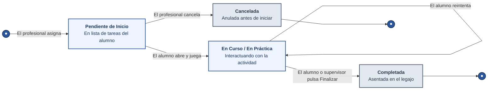

---

## 3. Niveles del Camino de Aprendizaje ("Mi Camino") y Alerta de Frustración

En su portal, el alumno ve un mapa visual de su camino de aprendizaje (similar a una aventura interactiva). Cada estación o nivel representa un desafío educativo que debe superar para avanzar.

### 3.1. Estados del Nivel para el Estudiante

| Estado | Lo que ve el Estudiante | Situación Pedagógica | ¿Cómo se avanza? |
|---|---|---|---|
| **Bloqueado** | Candado `🔒` | El nivel está cerrado porque el alumno aún no completó los niveles previos. | Se desbloquea automáticamente cuando aprueba el nivel anterior. |
| **Disponible** | Botón de Jugar `▶` | Nivel listo para jugar por primera vez. | El estudiante hace clic y comienza a realizar la actividad. |
| **En Práctica** | Botón `▶` con puntaje previo | El alumno realizó la actividad pero obtuvo menos del 60%. Se lo alienta a seguir practicando. | Puede volver a intentarlo las veces que necesite (hasta un máximo de 4 intentos continuos). |
| **Aprobado con Éxito** | Medalla verde `✓` con puntaje | El alumno logró el 60% o más de aciertos. Se celebra con animación de medalla y refuerzo positivo. | Se desbloquea de inmediato el siguiente nivel del camino. El alumno puede volver a jugar este nivel para repasar cuando quiera. |
| **Pausado por Frustración** | Candado de Alerta `🔒` y mensaje de apoyo | El estudiante no logró superar el nivel tras 4 intentos seguidos. Se frena el juego para evitar su desánimo o angustia. | La actividad se pausa y **el sistema le avisa en tiempo real al docente** para que intervenga, adapte la dificultad o le brinde apoyo personalizado. |

### 3.2. Diagrama de Avance en el Camino


> 💡 *Diagrama renderizado directamente. Archivo descargable en [PlantUML](./puml/04-estados-camino-aprendizaje.puml).*

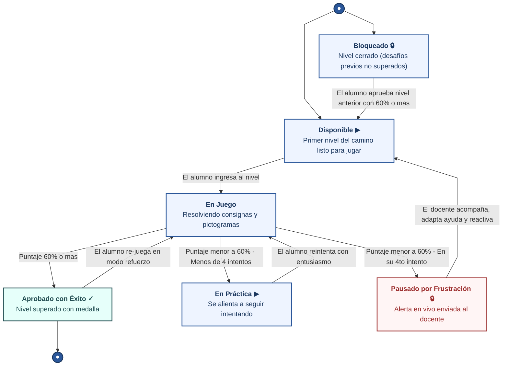

---

## 4. Motor de Adaptación Pedagógica Automática

Para que el estudiante no se aburra por ser muy fácil ni se frustre por ser muy difícil, el sistema evalúa su desempeño y ajusta automáticamente las condiciones de juego (nivel de desafío, tiempo para responder y pistas de ayuda), siempre dentro de los márgenes que el docente autorizó previamente.

### 4.1. Modos de Adaptación del Sistema

| Modo | ¿Cuándo ocurre? | Acción Automática del Sistema | Beneficio para el Alumno |
|---|---|---|---|
| **Ritmo Estable** | El alumno resuelve con comodidad dentro de los parámetros esperados. | Mantiene el nivel de desafío y las ayudas actuales. | Afianza el aprendizaje con tranquilidad. |
| **Desafío en Aumento** | El alumno acumula varios éxitos consecutivos con alto puntaje. | Sube un punto la dificultad (ejemplo: palabras más largas o más opciones) y disminuye el tiempo de ayuda. | Estimula el progreso y previene el aburrimiento. |
| **Mayor Apoyo / Andamiaje** | El alumno comete varios errores seguidos o le cuesta responder. | Reduce la dificultad, extiende el tiempo disponible y activa pistas visuales o de audio. | Brinda el andamiaje necesario para que no baje los brazos. |
| **Protección contra la Frustración** | Se detectan patrones de bloqueo o 4 intentos fallidos. | Pausa el nivel y genera una **alerta inmediata en la pantalla del docente**. | Cuidado emocional del alumno: un profesional se acerca a asistirlo. |

### 4.2. Diagrama de la Adaptación Pedagógica


> 💡 *Diagrama renderizado directamente. Archivo descargable en [PlantUML](./puml/05-estados-adaptacion-pedagogica.puml).*

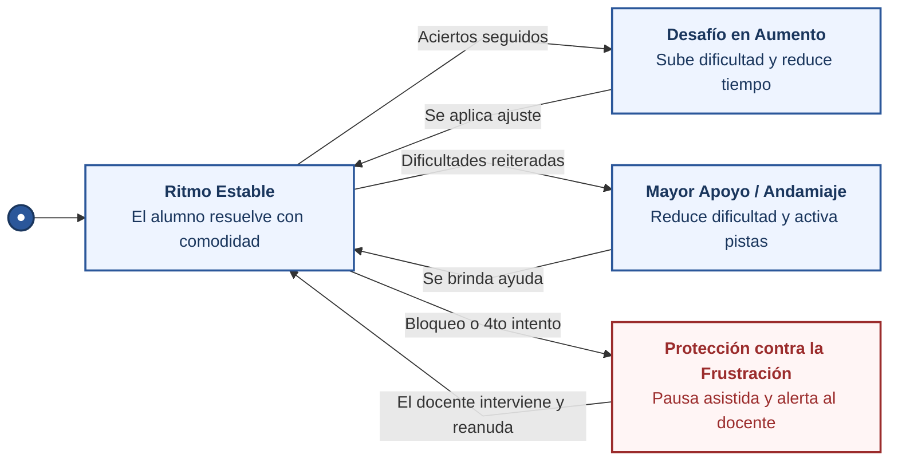

---

## 5. Ciclo de Vida del Informe Pedagógico y de Evolución

Los informes formales documentan el avance de la persona con discapacidad y se comparten con las familias y centros de salud. Tienen un circuito de revisión formal para asegurar que el contenido sea riguroso y constructivo.

### 5.1. Estados del Informe

| Estado | ¿Quién lo gestiona? | Descripción | ¿Es visible para la familia? |
|---|---|---|:---:|
| **Borrador** | Profesional (Docente / Terapeuta) | El profesional está redactando las observaciones, diagnósticos y conclusiones. Se puede editar libremente. | ❌ No |
| **Enviado a Revisión** | Equipo Directivo / Coordinación | El profesional finalizó la redacción y envió el informe a dirección para su control de calidad pedagógica. | ❌ No |
| **Aprobado** | Dirección de la Institución | La dirección revisó y aprobó el informe. Queda sellado de forma inmutable y disponible para descargar en PDF. | ✅ **Sí** |
| **Requiere Corrección** | Dirección y Profesional | La dirección observó algún dato incompleto o a mejorar y lo devolvió con notas para que el docente lo enmiende. | ❌ No |

### 5.2. Diagrama del Circuito del Informe


> 💡 *Diagrama renderizado directamente. Archivo descargable en [PlantUML](./puml/06-estados-informe-evolucion.puml).*

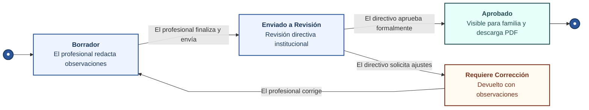

---

## 6. Ciclo de Vida de los Usuarios del Sistema

### 6.1. Cuenta del Profesional (Docente, Psicólogo, Fonoaudiólogo)

El acceso del personal que trabaja con estudiantes requiere verificación formal institucional para resguardar la seguridad de la comunidad educativa.


> 💡 *Diagrama renderizado directamente. Archivo descargable en [PlantUML](./puml/07-estados-profesional.puml).*

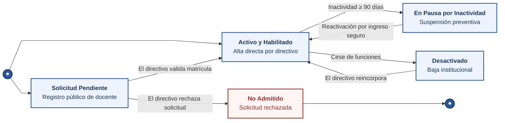

---

### 6.2. Cuenta del Representante Familiar

La familia es un pilar fundamental en el acompañamiento. Su acceso se habilita mediante una invitación segura enviada por el docente o por alta directa de la escuela.


> 💡 *Diagrama renderizado directamente. Archivo descargable en [PlantUML](./puml/08-estados-familiar.puml).*

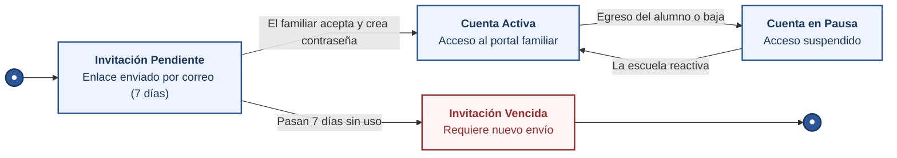

---

### 6.3. Invitaciones por Correo Electrónico para Familiares

Para que el familiar no tenga que hacer trámites complejos, el docente genera un enlace de invitación que le llega por correo.

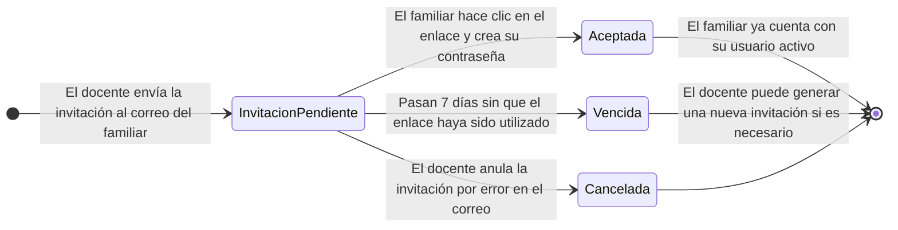

---

### 6.4. Sesión Segura del Usuario (Privacidad y Cuidado de Datos)

Para cumplir con las normas de confidencialidad médica y pedagógica, la plataforma protege el acceso de cada usuario.

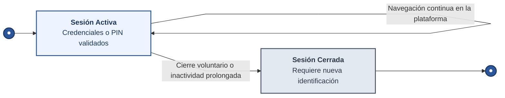

---

## 7. Cuadro Resumen de Estados para la Gestión Institucional

| Proceso del Sistema | Estado Inicial | Estados Intermedios | Estado Final | ¿Quién decide el avance? |
|---|---|---|---|---|
| **Actividades del Alumno** | Pendiente de Inicio | En Curso / En Práctica | Completada (o Cancelada) | El alumno jugando y el docente prescribiendo. |
| **Nivel en "Mi Camino"** | Bloqueado / Disponible | En Práctica | Aprobado con Éxito (o Pausado por Frustración) | El puntaje del alumno ($\ge 60\%$) o el límite de 4 intentos. |
| **Adaptación de Dificultad** | Ritmo Estable | Desafío en Aumento / Mayor Apoyo | Retorno a Ritmo Estable | El motor pedagógico según la racha de aciertos/errores. |
| **Informe de Evolución** | Borrador en Redacción | Enviado a Revisión / Requiere Corrección | Aprobado para la Familia | El profesional redactando y el directivo aprobando. |
| **Cuenta Profesional** | Solicitud Pendiente | Activa / En Pausa por Inactividad | Desactivada o No Admitida | La dirección validando matrículas y membresía. |
| **Acceso Familiar** | Invitación Pendiente | Cuenta Activa | Cuenta en Pausa | El familiar aceptando el correo y la escuela coordinando. |
