# 4. Diagramas de Procesos de Negocio (BPMN 2.0)

**Institución Cervantes — Carrera de Analista de Sistemas**  
**Cátedra:** Prácticas Profesionalizantes  
**Proyecto:** InclusiON — Plataforma de Gestión y Aprendizaje para la Inclusión Educativa  
**Enfoque de Redacción:** Lenguaje de Negocio y Cliente (Directivos, Profesionales, Familias y Evaluadores)  
**Notación:** BPMN 2.0 (Business Process Model and Notation) con Carriles (Swimlanes) y Conexiones Ortogonales  

---

## 4.1. Introducción y Notación BPMN 2.0 en InclusiON

El **Modelado de Procesos de Negocio (BPMN 2.0)** describe la secuencia lógica de actividades, decisiones, participantes y flujos de información que ocurren en el ecosistema escolar y terapéutico de **InclusiON**.

A diferencia de los diagramas puramente técnicos, BPMN permite que directivos, equipos de orientación escolar, comités evaluadores y docentes visualicen con claridad **quién hace qué, en qué momento, bajo qué reglas pedagógicas y a través de qué dispositivo**.

### Elementos Visuales Empleados

| Elemento BPMN | Representación Gráfica | Significado Pedagógico / Operativo |
|---|---|---|
| **Piscina (Pool)** | Contenedor principal | Representa el proceso de negocio completo (ej. Proceso Core, Emisión de Informes). |
| **Carril (Swimlane)** | Franja horizontal | Delimita las responsabilidades de cada actor: Docente, Alumno (AAC), Familia, Directivo o Servidor Central. |
| **Evento de Inicio** | Círculo verde fino `((●))` | Señal que desencadena el proceso (ej. prescripción docente, inicio de clase, arribo de resultados). |
| **Tarea de Usuario** | Rectángulo azul | Acción realizada por una persona en pantalla (ej. redactar, seleccionar pictograma, resolver consigna). |
| **Tarea del Sistema** | Rectángulo violeta | Operación automatizada (ej. calibrar dificultad, generar PDF, validar PIN, calcular aciertos). |
| **Compuerta Exclusiva (XOR)** | Diamante amarillo `◇` | Punto de bifurcación donde se evalúa una condición (ej. ¿alcanzó el 60% de aciertos?, ¿credenciales válidas?). |
| **Evento de Fin** | Círculo rojo doble `(((●)))` | Culminación exitosa o resolución de excepción del proceso. |
| **Flujo de Secuencia** | Flecha continua ortogonal | Dirección estricta del flujo operativo de una actividad a la siguiente. |
| **Flujo de Mensaje** | Flecha discontinua ortogonal | Comunicación o notificación enviada entre carriles o servicios externos (SMTP, SignalR). |

---

## 4.2. Mapa General de Procesos Principales de InclusiON

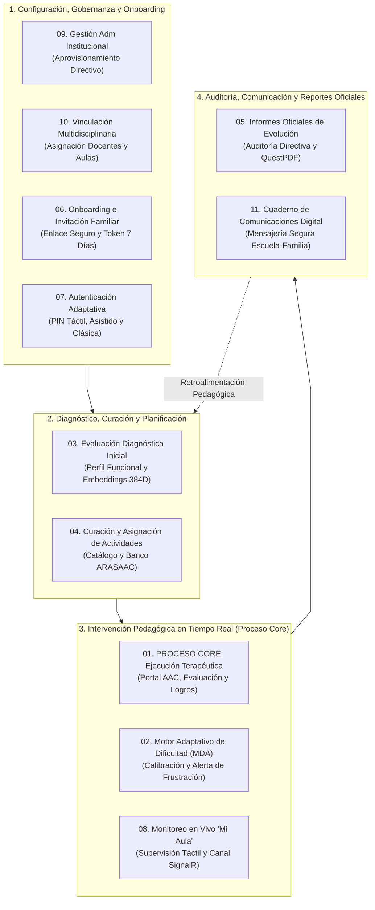

---

## 4.3. Catálogo Detallado de BPMN de Procesos Principales

---

### BPMN 01 — Proceso Core: Ejecución y Resolución de Actividades Terapéuticas

**Área:** Núcleo Operativo del Sistema (Core)  
**Propósito:** Es el corazón pedagógico de InclusiON. Modela el circuito integral desde que el terapeuta selecciona y asigna un ejercicio lúdico accesible, pasando por la resolución táctil en el portal AAC por parte del alumno, la evaluación algorítmica de respuestas, tiempos y nivel de apoyo en el servidor, hasta la calibración adaptativa y la visualización de logros por parte de la familia.


> 📁 *Archivo fuente editable en formato PlantUML con carriles y líneas ortogonales disponible en: [`./puml/09-bpmn-proceso-core.puml`](./puml/09-bpmn-proceso-core.puml)*

```mermaid
%%{init: {'flowchart': {'curve': 'linear'}}}%%
flowchart TD
    subgraph POOL_CORE ["Proceso Core — Ejecución y Resolución de Actividades Terapéuticas"]
        subgraph LANE_PROF ["Profesional / Docente (Gabinete Escolar)"]
            START_CORE((●)) --> T_SELECT["<b>1. Seleccionar o Crear Actividad</b><br/>Búsqueda en catálogo o creación adaptada"]
            T_SELECT --> T_ASSIGN["<b>2. Configurar y Prescribir Asignación</b><br/>Fecha límite, apoyos y estudiante destino"]
            T_REVIEW["<b>9. Revisar Desempeño y Skill Radar</b><br/>Análisis de métricas, tiempos y evolución"] --> END_CORE(((●)))
        end

        subgraph LANE_SISTEMA ["Servidor Central InclusiON (Backend / Motor Pedagógico)"]
            T_CREATE["<b>3. Registrar ActivityAssignment</b><br/>Estado inicial: Pendiente"]
            T_START_REC["<b>4. Registrar Inicio de Sesión</b><br/>Cambio de estado: En Progreso"]
            T_EVAL["<b>6. Evaluar Desempeño y Respuestas</b><br/>Cálculo de aciertos, latencia y nivel de soporte"]
            GW_UMBRAL{"<b>¿Supera umbral<br/>de aprobación?</b><br/>(≥ 60% aciertos)"}
            T_SUCCESS["<b>7. Consolidar Éxito y Desbloqueo</b><br/>Estado: Completada · Siguiente nivel activo"]
            T_ADAPT["<b>8. Calibrar Dificultad (MDA)</b><br/>Ajuste de complejidad o alerta de frustración"]
        end

        subgraph LANE_ALUMNO ["Estudiante con Discapacidad (Portal AAC en Tablet)"]
            T_VIEW["<b>Visualizar en 'Mi Camino'</b><br/>Acceso accesible con pictogramas ARASAAC"]
            T_LAUNCH["<b>Iniciar Actividad Lúdica</b><br/>Apertura de AAC Player"]
            T_PLAY["<b>5. Resolver Actividad Interactiva</b><br/>Interacción táctil, sonora y visual adaptada"]
            T_SUBMIT["<b>Enviar Respuestas y Telemetría</b><br/>Registro automático al concluir"]
        end

        subgraph LANE_FAMILIA ["Representante Familiar (Observador / Hogar)"]
            T_FAM_VIEW["<b>Consultar Avances y Medallas</b><br/>Visualización de logros aprobados"] --> END_FAM(((●)))
        end
    end

    %% Conexiones entre Carriles
    T_ASSIGN --> T_CREATE
    T_CREATE --> T_VIEW
    T_VIEW --> T_LAUNCH
    T_LAUNCH --> T_START_REC
    T_START_REC --> T_PLAY
    T_PLAY --> T_SUBMIT
    T_SUBMIT --> T_EVAL
    T_EVAL --> GW_UMBRAL

    GW_UMBRAL -->|Sí: Logro alcanzado| T_SUCCESS
    GW_UMBRAL -->|No: Requiere refuerzo| T_ADAPT

    T_SUCCESS --> T_REVIEW
    T_SUCCESS -.->|Notificación de avance| T_FAM_VIEW
    T_ADAPT -->|Reintento con nuevo nivel adaptado| T_VIEW

    classDef inicio fill:#D5E8D4,stroke:#23A027,stroke-width:2px,color:#274E13;
    classDef fin fill:#F8CECC,stroke:#B85450,stroke-width:3px,color:#783F04;
    classDef tareaProf fill:#DAE8FC,stroke:#2B579A,stroke-width:2px,color:#1A365D;
    classDef tareaSis fill:#E1D5E7,stroke:#9673A6,stroke-width:2px,color:#4A235A;
    classDef tareaAlu fill:#E6FFFA,stroke:#234E52,stroke-width:2px,color:#134E4A;
    classDef tareaFam fill:#FEFCBF,stroke:#B7791F,stroke-width:2px,color:#744210;
    classDef gateway fill:#FFFDC3,stroke:#AA7200,stroke-width:2px,color:#7F4F00;

    class START_CORE inicio;
    class END_CORE,END_FAM fin;
    class T_SELECT,T_ASSIGN,T_REVIEW tareaProf;
    class T_CREATE,T_START_REC,T_EVAL,T_SUCCESS,T_ADAPT tareaSis;
    class T_VIEW,T_LAUNCH,T_PLAY,T_SUBMIT tareaAlu;
    class T_FAM_VIEW tareaFam;
    class GW_UMBRAL gateway;
```

#### Participantes y Responsabilidades en el Proceso Core
1. **Profesional / Docente:** Prescribe actividades acordes al perfil del estudiante y analiza métricas de precisión y tiempo en el radar de habilidades.
2. **Servidor Central InclusiON:** Orquesta el ciclo de vida de la asignación, evalúa respuestas, calcula puntajes, actualiza el camino de aprendizaje y dispara la lógica adaptativa.
3. **Estudiante (Portal AAC):** Resuelve consignas mediante interfaces táctiles adaptadas (asociación imagen-palabra, completar letras, secuencias temporales).
4. **Representante Familiar:** Observa en tiempo real los logros y medallas desbloqueadas por su hijo desde su smartphone.

---

### BPMN 02 — Calibración del Motor de Dificultad Adaptativa (MDA) y Alertas de Frustración

**Área:** Inteligencia Pedagógica y Cuidado Emocional  
**Propósito:** Garantizar que el alumno se mantenga en su *Zona de Desarrollo Próximo* (Vygotsky). Si el alumno responde con facilidad sostenida ($\ge 80\%$), el sistema aumenta el desafío; si experimenta dificultades, otorga mayores apoyos. Ante 4 fallos consecutivos, bloquea preventivamente el ejercicio y despacha una alerta instantánea vía SignalR a la pantalla docente para que un profesional intervenga presencialmente antes de que aparezca frustración.


> 📁 *Archivo fuente editable en formato PlantUML disponible en: [`./puml/10-bpmn-motor-adaptativo.puml`](./puml/10-bpmn-motor-adaptativo.puml)*

```mermaid
%%{init: {'flowchart': {'curve': 'linear'}}}%%
flowchart TD
    subgraph POOL_MDA ["Proceso del Motor de Dificultad Adaptativa (MDA) y Alertas de Frustración"]
        subgraph LANE_MDA_SISTEMA ["Motor Pedagógico Adaptativo (Servidor Central)"]
            START_MDA((●)) --> T_RECV["<b>1. Recibir Intento de Actividad</b><br/>Respuestas, porcentaje, tiempo y apoyos"]
            T_RECV --> T_HIST["<b>2. Cargar Historial del Alumno</b><br/>Registro de últimos intentos en el área"]
            T_HIST --> GW_DECISION{"<b>¿Patrón de<br/>Desempeño?</b>"}

            GW_DECISION -->|Racha de Éxito ≥ 80%| T_UPGRADE["<b>3A. Aumentar Complejidad</b><br/>Nivel +1 (hasta 5) · Menos pistas · Menos tiempo"]
            GW_DECISION -->|Desempeño Estable| T_MAINTAIN["<b>3B. Mantener Dificultad</b><br/>Refuerzo de contenidos en nivel actual"]
            GW_DECISION -->|Racha de Fallas < 50%| GW_FRUSTRATION{"<b>¿Fallos consecutivos<br/>iguales a 4?</b>"}

            GW_FRUSTRATION -->|No: 1 a 3 fallos| T_DOWNGRADE["<b>4A. Reducir Complejidad</b><br/>Nivel -1 · Más pistas ARASAAC · Más tiempo"]
            GW_FRUSTRATION -->|Sí: 4 fallos acumulados| T_LOCK["<b>4B. Bloquear Nivel Preventivamente</b><br/>Pausar para evitar frustración emocional"]

            T_LOCK --> T_SIGNALR["<b>5. Despachar Alerta Prioritaria</b><br/>Envío vía SignalR en tiempo real"]
            
            T_UPGRADE --> T_LOG["<b>6. Registrar en AdaptiveAdjustmentLog</b><br/>Auditoría del cambio pedagógico"]
            T_MAINTAIN --> T_LOG
            T_DOWNGRADE --> T_LOG
            T_SIGNALR --> T_LOG

            T_LOG --> T_SYNC["<b>7. Sincronizar 'Mi Camino'</b><br/>Actualizar estado de nodos en el perfil"]
            T_SYNC --> END_MDA_SIS(((●)))
        end

        subgraph LANE_MDA_DOCENTE ["Docente / Terapeuta (Supervisión Presencial)"]
            T_SIGNALR -.->|Aviso sonoro y visual urgente| T_DOC_ALERT["<b>Recepción de Alerta de Frustración</b><br/>Notificación destacada en pantalla de aula"]
            T_DOC_ALERT --> T_DOC_INTERV["<b>Intervención Pedagógica Personalizada</b><br/>Apoyo presencial, contención y ajuste docente"]
            T_DOC_INTERV --> END_DOC_MDA(((●)))
        end

        subgraph LANE_MDA_ALUMNO ["Estudiante con Discapacidad (Tablet AAC)"]
            T_SYNC --> T_ALU_REFRESH["<b>Actualización Amigable de Pantalla</b><br/>Mensaje positivo y adaptación inmediata"]
            T_ALU_REFRESH --> END_ALU_MDA(((●)))
        end
    end

    classDef inicio fill:#D5E8D4,stroke:#23A027,stroke-width:2px,color:#274E13;
    classDef fin fill:#F8CECC,stroke:#B85450,stroke-width:3px,color:#783F04;
    classDef tareaSis fill:#E1D5E7,stroke:#9673A6,stroke-width:2px,color:#4A235A;
    classDef tareaProf fill:#DAE8FC,stroke:#2B579A,stroke-width:2px,color:#1A365D;
    classDef tareaAlu fill:#E6FFFA,stroke:#234E52,stroke-width:2px,color:#134E4A;
    classDef gateway fill:#FFFDC3,stroke:#AA7200,stroke-width:2px,color:#7F4F00;

    class START_MDA inicio;
    class END_MDA_SIS,END_DOC_MDA,END_ALU_MDA fin;
    class T_RECV,T_HIST,T_UPGRADE,T_MAINTAIN,T_DOWNGRADE,T_LOCK,T_SIGNALR,T_LOG,T_SYNC tareaSis;
    class T_DOC_ALERT,T_DOC_INTERV tareaProf;
    class T_ALU_REFRESH tareaAlu;
    class GW_DECISION,GW_FRUSTRATION gateway;
```

---

### BPMN 03 — Evaluación Diagnóstica Inicial y Perfil Funcional de Habilidades

**Área:** Admisión Pedagógica y Caracterización Clínica  
**Propósito:** Modela el proceso mediante el cual el equipo interdisciplinario (psicopedagogos, fonoaudiólogos, docentes de apoyo) evalúa las capacidades iniciales del estudiante en 4 ejes funcionales (comunicación aumentativa, motricidad fina, autonomía cognitiva, interacción social) y genera un perfil vectorial que el motor de IA utiliza para sugerir planes de trabajo a medida.


> 📁 *Archivo fuente editable en formato PlantUML disponible en: [`./puml/11-bpmn-evaluacion-diagnostico.puml`](./puml/11-bpmn-evaluacion-diagnostico.puml)*

```mermaid
%%{init: {'flowchart': {'curve': 'linear'}}}%%
flowchart TD
    subgraph POOL_DIAG ["Proceso de Evaluación Diagnóstica Inicial y Perfil Funcional"]
        subgraph LANE_DIAG_PROF ["Equipo Multidisciplinario (Psicopedagogo / Terapeuta)"]
            START_DIAG((●)) --> T_SOLIC["<b>1. Solicitar Apertura de Legajo</b><br/>Identificación del estudiante y datos familiares"]
            T_EVAL_FUNC["<b>3. Realizar Evaluación Funcional</b><br/>Valoración en 4 ejes: Comunicación, Motricidad, Cognición y Social"]
            T_SETPERFIL["<b>4. Registrar Perfil de Habilidades</b><br/>Ponderación cuantitativa y cualitativa por área"]
            T_APPROVE_PLAN["<b>7. Validar y Prescribir Roadmap</b><br/>Aprobación del plan de intervención personalizado"] --> END_DIAG(((●)))
        end

        subgraph LANE_DIAG_SIS ["Servidor Central InclusiON (Backend / Motor de IA)"]
            T_CREATE_LEGAJO["<b>2. Crear Legajo Digital Cifrado</b><br/>Generación de identidad protegida del menor"]
            T_SAVE_PERFIL["<b>5. Persistir Diagnóstico y Perfil</b><br/>Guardado en base relacional institucional"]
            T_GEN_EMBEDDING["<b>6. Generar Embedding Vectorial (384D)</b><br/>Mapeo de perfil funcional con ONNX Runtime"]
            T_MATCH_CATALOG["<b>Sugerir Actividades Compatibles</b><br/>Búsqueda de alta similitud de coseno en catálogo"]
        end
    end

    T_SOLIC --> T_CREATE_LEGAJO
    T_CREATE_LEGAJO --> T_EVAL_FUNC
    T_EVAL_FUNC --> T_SETPERFIL
    T_SETPERFIL --> T_SAVE_PERFIL
    T_SAVE_PERFIL --> T_GEN_EMBEDDING
    T_GEN_EMBEDDING --> T_MATCH_CATALOG
    T_MATCH_CATALOG --> T_APPROVE_PLAN

    classDef inicio fill:#D5E8D4,stroke:#23A027,stroke-width:2px,color:#274E13;
    classDef fin fill:#F8CECC,stroke:#B85450,stroke-width:3px,color:#783F04;
    classDef tareaProf fill:#DAE8FC,stroke:#2B579A,stroke-width:2px,color:#1A365D;
    classDef tareaSis fill:#E1D5E7,stroke:#9673A6,stroke-width:2px,color:#4A235A;

    class START_DIAG inicio;
    class END_DIAG fin;
    class T_SOLIC,T_EVAL_FUNC,T_SETPERFIL,T_APPROVE_PLAN tareaProf;
    class T_CREATE_LEGAJO,T_SAVE_PERFIL,T_GEN_EMBEDDING,T_MATCH_CATALOG tareaSis;
```

---

### BPMN 04 — Curación, Creación y Asignación de Actividades del Catálogo

**Área:** Gestión Curricular y Recursos Terapéuticos  
**Propósito:** Describe cómo el docente localiza actividades existentes mediante búsqueda semántica asistida o crea nuevos ejercicios interactivos integrando el repositorio oficial de pictogramas ARASAAC, estableciendo parámetros de tiempo, dificultad y apoyos antes de distribuirlas a las tablets escolares.


> 📁 *Archivo fuente editable en formato PlantUML disponible en: [`./puml/12-bpmn-asignacion-actividades.puml`](./puml/12-bpmn-asignacion-actividades.puml)*

```mermaid
%%{init: {'flowchart': {'curve': 'linear'}}}%%
flowchart TD
    subgraph POOL_ACT ["Proceso de Curación, Creación y Asignación de Actividades"]
        subgraph LANE_ACT_PROF ["Docente / Terapeuta (Planificación Educativa)"]
            START_ACT((●)) --> T_SEARCH_CAT["<b>1. Explorar Catálogo de Actividades</b><br/>Filtro por área de habilidad o búsqueda semántica"]
            GW_EXISTE{"<b>¿Existe actividad<br/>adecuada?</b>"}
            T_SELECT_EXIST["<b>2A. Seleccionar Actividad Existente</b><br/>Uso de recurso curricular validado"]
            T_CREATE_NEW["<b>2B. Crear Nueva Actividad</b><br/>Elegir plantilla: Asociación, Letra, Secuencia"]
            T_CONFIG_PARAMS["<b>3. Configurar Parámetros de Asignación</b><br/>Establecer fecha límite, reintentos y estudiante"]
            T_CONFIRM_SEND["<b>4. Confirmar Envío a Tablets</b><br/>Publicar para el aula o alumno particular"] --> END_ACT_PROF(((●)))
        end

        subgraph LANE_ACT_ARASAAC ["Banco Internacional ARASAAC (API Externa)"]
            T_FETCH_PICS["<b>Consultar Pictogramas Oficiales</b><br/>Descarga de símbolos libres de comunicación"]
        end

        subgraph LANE_ACT_SISTEMA ["Servidor Central InclusiON (Backend)"]
            T_CALC_SIM["<b>Búsqueda Semántica Vectorial</b><br/>Ranking por afinidad con el perfil"]
            T_STORE_ACT["<b>Persistir Actividad en Catálogo</b><br/>Generar embedding y almacenar plantilla"]
            T_DISPATCH_ASG["<b>5. Distribuir a la Tablet del Alumno</b><br/>Asignación en estado Pendiente lista para jugar"] --> END_ACT_SIS(((●)))
        end
    end

    T_SEARCH_CAT --> T_CALC_SIM
    T_CALC_SIM --> GW_EXISTE
    GW_EXISTE -->|Sí: Encontrada| T_SELECT_EXIST
    GW_EXISTE -->|No: Personalizada| T_CREATE_NEW
    T_CREATE_NEW -.->|Búsqueda de imágenes| T_FETCH_PICS
    T_FETCH_PICS -.->|Retorno de pictogramas| T_CREATE_NEW
    T_CREATE_NEW --> T_STORE_ACT
    T_STORE_ACT --> T_CONFIG_PARAMS
    T_SELECT_EXIST --> T_CONFIG_PARAMS
    T_CONFIG_PARAMS --> T_CONFIRM_SEND
    T_CONFIRM_SEND --> T_DISPATCH_ASG

    classDef inicio fill:#D5E8D4,stroke:#23A027,stroke-width:2px,color:#274E13;
    classDef fin fill:#F8CECC,stroke:#B85450,stroke-width:3px,color:#783F04;
    classDef tareaProf fill:#DAE8FC,stroke:#2B579A,stroke-width:2px,color:#1A365D;
    classDef tareaSis fill:#E1D5E7,stroke:#9673A6,stroke-width:2px,color:#4A235A;
    classDef tareaExt fill:#FFF0F5,stroke:#C71585,stroke-width:2px,color:#4A0033;
    classDef gateway fill:#FFFDC3,stroke:#AA7200,stroke-width:2px,color:#7F4F00;

    class START_ACT inicio;
    class END_ACT_PROF,END_ACT_SIS fin;
    class T_SEARCH_CAT,T_SELECT_EXIST,T_CREATE_NEW,T_CONFIG_PARAMS,T_CONFIRM_SEND tareaProf;
    class T_FETCH_PICS tareaExt;
    class T_CALC_SIM,T_STORE_ACT,T_DISPATCH_ASG tareaSis;
    class GW_EXISTE gateway;
```

---

### BPMN 05 — Circuito Formal de Informes Oficiales de Evolución y Entrega Familiar

**Área:** Reportes, Auditoría y Comunicación Institucional  
**Propósito:** Modela el flujo documental mediante el cual el profesional confecciona el informe pedagógico en estado borrador, el directivo o supervisor audita su contenido cualitativo y cuantitativo, el motor QuestPDF compila el documento inmutable con gráficos y sello institucional, y la familia recibe aviso por correo para consultarlo y descargarlo.


> 📁 *Archivo fuente editable en formato PlantUML disponible en: [`./puml/13-bpmn-informes-evolucion.puml`](./puml/13-bpmn-informes-evolucion.puml)*

```mermaid
%%{init: {'flowchart': {'curve': 'linear'}}}%%
flowchart TD
    subgraph POOL_REP ["Circuito Formal de Generación, Aprobación y Emisión de Informes"]
        subgraph LANE_REP_PROF ["Profesional / Docente (Redacción)"]
            START_REP((●)) --> T_REDACT["<b>1. Iniciar Informe de Evolución</b><br/>Estado: Borrador · Carga de métricas automáticas"]
            T_ADD_OBS["<b>2. Redactar Conclusiones y Metas</b><br/>Observaciones cualitativas pedagógicas"]
            T_SUBMIT_REV["<b>3. Enviar a Revisión Directiva</b><br/>Cambio de estado: Enviado a Revisión"]
            T_FIX_OBS["<b>Modificar y Corregir</b><br/>Atender señalamientos del directivo"]
        end

        subgraph LANE_REP_DIR ["Directivo / Supervisor Institucional (Auditoría)"]
            T_AUDIT["<b>4. Auditar Contenido y Rigor</b><br/>Lectura del informe y contraste pedagógico"]
            GW_APPROVE{"<b>¿Cumple estándares<br/>institucionales?</b>"}
            T_REJECT_REV["<b>Devolver con Observaciones</b><br/>Estado: Requiere Corrección"]
            T_APPROVE_DIR["<b>5. Aprobar y Firmar Digitalmente</b><br/>Estado: Aprobado formalmente"]
        end

        subgraph LANE_REP_SIS ["Servidor Central InclusiON (Motor QuestPDF & SMTP)"]
            T_COMPILE_PDF["<b>6. Compilar Documento Oficial PDF</b><br/>Generación inmutable con gráficos y sello"]
            T_NOTIFY_EMAIL["<b>7. Despachar Aviso por Correo</b><br/>Notificación automática a los tutores legales"]
        end

        subgraph LANE_REP_FAM ["Representante Familiar (Hogar)"]
            T_FAM_READ["<b>8. Consultar y Descargar Informe</b><br/>Acceso seguro desde el portal familiar"] --> END_REP_FAM(((●)))
        end
    end

    T_REDACT --> T_ADD_OBS
    T_ADD_OBS --> T_SUBMIT_REV
    T_SUBMIT_REV --> T_AUDIT
    T_AUDIT --> GW_APPROVE
    GW_APPROVE -->|No: Requiere ajustes| T_REJECT_REV
    T_REJECT_REV --> T_FIX_OBS
    T_FIX_OBS --> T_SUBMIT_REV
    GW_APPROVE -->|Sí: Aprobado| T_APPROVE_DIR
    T_APPROVE_DIR --> T_COMPILE_PDF
    T_COMPILE_PDF --> T_NOTIFY_EMAIL
    T_NOTIFY_EMAIL -.->|Correo institucional| T_FAM_READ

    classDef inicio fill:#D5E8D4,stroke:#23A027,stroke-width:2px,color:#274E13;
    classDef fin fill:#F8CECC,stroke:#B85450,stroke-width:3px,color:#783F04;
    classDef tareaProf fill:#DAE8FC,stroke:#2B579A,stroke-width:2px,color:#1A365D;
    classDef tareaDir fill:#EBF8FF,stroke:#3182CE,stroke-width:2px,color:#2A4365;
    classDef tareaSis fill:#E1D5E7,stroke:#9673A6,stroke-width:2px,color:#4A235A;
    classDef tareaFam fill:#FEFCBF,stroke:#B7791F,stroke-width:2px,color:#744210;
    classDef gateway fill:#FFFDC3,stroke:#AA7200,stroke-width:2px,color:#7F4F00;

    class START_REP inicio;
    class END_REP_FAM fin;
    class T_REDACT,T_ADD_OBS,T_SUBMIT_REV,T_FIX_OBS tareaProf;
    class T_AUDIT,T_REJECT_REV,T_APPROVE_DIR tareaDir;
    class T_COMPILE_PDF,T_NOTIFY_EMAIL tareaSis;
    class T_FAM_READ tareaFam;
    class GW_APPROVE gateway;
```

---

### BPMN 06 — Onboarding, Registro e Invitación Digital a Familias

**Área:** Gestión de Comunidad y Seguridad de Acceso  
**Propósito:** Describe la incorporación de tutores legales al sistema sin trámites burocráticos presenciales, mediante un enlace seguro con token de 7 días despachado por correo electrónico que vincula automáticamente la tutela del menor y habilita el portal de seguimiento familiar.


> 📁 *Archivo fuente editable en formato PlantUML disponible en: [`./puml/14-bpmn-onboarding-familiar.puml`](./puml/14-bpmn-onboarding-familiar.puml)*

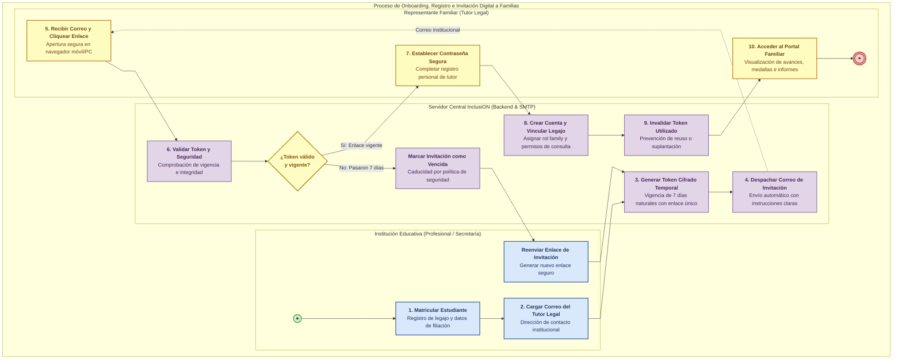

---

### BPMN 07 — Autenticación Multi-Método y Acceso Inclusivo Adaptativo

**Área:** Ciberseguridad y Accesibilidad de Entrada  
**Propósito:** Modela las vías de ingreso a la plataforma según la capacidad cognitiva y motriz del usuario: desde el login tradicional con correo/contraseña para docentes y directivos, pasando por el acceso familiar simplificado, hasta los métodos adaptativos para estudiantes (PIN numérico táctil de 4 dígitos o validación asistida por supervisor en aula).


> 📁 *Archivo fuente editable en formato PlantUML disponible en: [`./puml/15-bpmn-autenticacion-adaptativa.puml`](./puml/15-bpmn-autenticacion-adaptativa.puml)*

```mermaid
%%{init: {'flowchart': {'curve': 'linear'}}}%%
flowchart TD
    subgraph POOL_AUTH ["Proceso de Autenticación Multi-Método y Acceso Inclusivo"]
        subgraph LANE_AUTH_USER ["Usuario (Cualquier Actor del Sistema)"]
            START_AUTH((●)) --> T_ENTER_APP["<b>1. Ingresar a la Plataforma</b><br/>Detección de dispositivo y pantalla inicial"]
            GW_ROL_TYPE{"<b>¿Tipo de Usuario?</b>"}
            
            T_CRED_STD["<b>2A. Ingresar Email y Contraseña</b><br/>Credenciales de Docente o Administrador"]
            T_CRED_FAM["<b>2B. Ingresar Identificador Familiar</b><br/>Email del tutor y contraseña personal"]
            T_IDENT_ALU["<b>2C. Identificar Estudiante</b><br/>Selección táctil accesible con foto/avatar"]
            
            GW_METHOD_ALU{"<b>¿Método Adaptativo<br/>Configurado?</b>"}
            T_PIN_ALU["<b>3A. Ingresar PIN Táctil (4 dígitos)</b><br/>Teclado numérico simplificado accesible"]
            T_SUPERVISOR_AUTH["<b>3B. Validación Asistida</b><br/>Supervisor valida su credencial de acompañamiento"]
        end

        subgraph LANE_AUTH_BACKEND ["Servidor Central InclusiON (Seguridad / JWT)"]
            T_CHECK_DB["<b>4. Validar Identidad y Hash en BD</b><br/>Verificación segura sin guardar claves planas"]
            GW_VALID{"<b>¿Credenciales<br/>Correctas?</b>"}
            
            T_AUDIT_FAIL["<b>Registrar Intento Fallido</b><br/>Auditoría de seguridad y control de tasa (Rate Limit)"] --> END_AUTH_FAIL(((●)))
            
            T_ISSUE_JWT["<b>5. Emitir Tokens de Sesión</b><br/>Access Token (JWT con Claims) + Refresh Token"]
            T_REDIRECT["<b>6. Redireccionar al Portal del Rol</b><br/>Cargar tema visual de accesibilidad configurado"] --> END_AUTH_OK(((●)))
        end
    end

    T_ENTER_APP --> GW_ROL_TYPE
    GW_ROL_TYPE -->|Docente / Admin| T_CRED_STD
    GW_ROL_TYPE -->|Representante Familiar| T_CRED_FAM
    GW_ROL_TYPE -->|Estudiante PCD| T_IDENT_ALU

    T_IDENT_ALU --> GW_METHOD_ALU
    GW_METHOD_ALU -->|PIN Numérico| T_PIN_ALU
    GW_METHOD_ALU -->|Asistido| T_SUPERVISOR_AUTH

    T_CRED_STD --> T_CHECK_DB
    T_CRED_FAM --> T_CHECK_DB
    T_PIN_ALU --> T_CHECK_DB
    T_SUPERVISOR_AUTH --> T_CHECK_DB

    T_CHECK_DB --> GW_VALID
    GW_VALID -->|No: Error 401| T_AUDIT_FAIL
    GW_VALID -->|Sí: Autorizado| T_ISSUE_JWT
    T_ISSUE_JWT --> T_REDIRECT

    classDef inicio fill:#D5E8D4,stroke:#23A027,stroke-width:2px,color:#274E13;
    classDef fin fill:#F8CECC,stroke:#B85450,stroke-width:3px,color:#783F04;
    classDef tareaUser fill:#DAE8FC,stroke:#2B579A,stroke-width:2px,color:#1A365D;
    classDef tareaSis fill:#E1D5E7,stroke:#9673A6,stroke-width:2px,color:#4A235A;
    classDef gateway fill:#FFFDC3,stroke:#AA7200,stroke-width:2px,color:#7F4F00;

    class START_AUTH inicio;
    class END_AUTH_FAIL,END_AUTH_OK fin;
    class T_ENTER_APP,T_CRED_STD,T_CRED_FAM,T_IDENT_ALU,T_PIN_ALU,T_SUPERVISOR_AUTH tareaUser;
    class T_CHECK_DB,T_AUDIT_FAIL,T_ISSUE_JWT,T_REDIRECT tareaSis;
    class GW_ROL_TYPE,GW_METHOD_ALU,GW_VALID gateway;
```

---

### BPMN 08 — Monitoreo en Vivo y Alertas de Frustración en el Aula ("Mi Aula")

**Área:** Gestión de Clase e Intervención en Tiempo Real  
**Propósito:** Describe la interacción continua en el aula escolar entre las tablets de los alumnos y la computadora docente mediante SignalR (WebSockets). Si un estudiante acumula demoras o comete 4 fallos, su tarjeta en el panel docente parpadea en rojo con un aviso sonoro suave, permitiendo que el docente acuda presencialmente a acompañarlo y registrar el apoyo brindado.


> 📁 *Archivo fuente editable en formato PlantUML disponible en: [`./puml/16-bpmn-alertas-tiempo-real.puml`](./puml/16-bpmn-alertas-tiempo-real.puml)*

```mermaid
%%{init: {'flowchart': {'curve': 'linear'}}}%%
flowchart TD
    subgraph POOL_ALERT ["Proceso de Monitoreo en Vivo y Alertas de Frustración ('Mi Aula')"]
        subgraph LANE_ALU_TAB ["Estudiante con Discapacidad (Tablet Escolar)"]
            START_ALERT((●)) --> T_SOLVE["<b>1. Ejecutar Actividades en Clase</b><br/>Toques en pantalla, elecciones y reintentos"]
            T_RECEIVE_SUPPORT["<b>4. Recibir Ayuda Humana Presencial</b><br/>Contención cariñosa y explicación directa"]
            T_RESUME_PLAY["<b>5. Reanudar Ejercicio con Calma</b><br/>Continuar la experiencia de aprendizaje"] --> END_ALU_PLAY(((●)))
        end

        subgraph LANE_SIGNALR ["Canal SignalR en Tiempo Real (WebSockets / Servidor)"]
            T_TELEMETRY["<b>2. Analizar Flujo de Interacción</b><br/>Detección de patrones erráticos o demoras anómalas"]
            GW_ALERT_TRIGGER{"<b>¿Criterio de Alerta?<br/>(4 fallos o bloqueo)</b>"}
            T_BROADCAST_OK["<b>Actualizar Estado: Fluido (Verde)</b><br/>Métricas normales de avance en el aula"]
            T_DISPATCH_ALERT["<b>3. Disparar Evento Prioritario</b><br/>Envío instantáneo de socket a la pantalla docente"]
        end

        subgraph LANE_DOC_ROOM ["Docente de Aula / Terapeuta (Estación de Supervisión)"]
            T_MONITOR_DASH["<b>Monitorear Tablero 'Mi Aula'</b><br/>Visualización del estado de cada pupitre"]
            T_POPUP_ALERT["<b>Alarma Visual y Sonora Sutil</b><br/>Tarjeta roja parpadeante con nombre del alumno"]
            T_INTERVENE["<b>Intervención Pedagógica Inmediata</b><br/>Acercarse al alumno antes de que aparezca angustia"]
            T_LOG_INTERV["<b>Registrar Apoyo Docente en Sistema</b><br/>Constancia de mediación en la sesión"] --> END_DOC_MON(((●)))
        end
    end

    T_SOLVE --> T_TELEMETRY
    T_TELEMETRY --> GW_ALERT_TRIGGER

    GW_ALERT_TRIGGER -->|No: Avance regular| T_BROADCAST_OK
    T_BROADCAST_OK -.->|Refresco silencioso| T_MONITOR_DASH

    GW_ALERT_TRIGGER -->|Sí: Patrón crítico| T_DISPATCH_ALERT
    T_DISPATCH_ALERT -.->|Señal instantánea| T_POPUP_ALERT
    T_POPUP_ALERT --> T_INTERVENE
    T_INTERVENE --> T_RECEIVE_SUPPORT
    T_RECEIVE_SUPPORT --> T_RESUME_PLAY
    T_INTERVENE --> T_LOG_INTERV

    classDef inicio fill:#D5E8D4,stroke:#23A027,stroke-width:2px,color:#274E13;
    classDef fin fill:#F8CECC,stroke:#B85450,stroke-width:3px,color:#783F04;
    classDef tareaAlu fill:#E6FFFA,stroke:#234E52,stroke-width:2px,color:#134E4A;
    classDef tareaSig fill:#E1D5E7,stroke:#9673A6,stroke-width:2px,color:#4A235A;
    classDef tareaDoc fill:#DAE8FC,stroke:#2B579A,stroke-width:2px,color:#1A365D;
    classDef gateway fill:#FFFDC3,stroke:#AA7200,stroke-width:2px,color:#7F4F00;

    class START_ALERT inicio;
    class END_ALU_PLAY,END_DOC_MON fin;
    class T_SOLVE,T_RECEIVE_SUPPORT,T_RESUME_PLAY tareaAlu;
    class T_TELEMETRY,T_BROADCAST_OK,T_DISPATCH_ALERT tareaSig;
    class T_MONITOR_DASH,T_POPUP_ALERT,T_INTERVENE,T_LOG_INTERV tareaDoc;
    class GW_ALERT_TRIGGER gateway;
```

---

### BPMN 09 — Gestión y Aprovisionamiento de Administradores Institucionales

**Área:** Gestión Directiva y Gobernanza Institucional  
**Propósito:** Proceso administrativo mediante el cual se da de alta al Administrador Institucional (Director / Directora / Coordinador Escolar) responsable de la escuela, quien asume el control directivo para coordinar a los profesionales, estudiantes y familias.


> 📁 *Archivo fuente editable en formato PlantUML disponible en: [`./puml/17-bpmn-gestion-institucional.puml`](./puml/17-bpuml/17-bpmn-gestion-institucional.puml)*

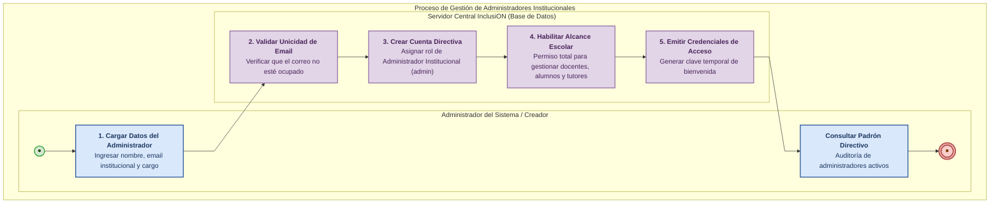

---

### BPMN 10 — Asignación Multidisciplinaria de Profesionales a Estudiantes y Aulas

**Área:** Organización Escolar y Gestión de Matrícula  
**Propósito:** Modela la asignación de profesionales (maestro integrador, fonoaudiólogo, psicopedagogo) a cada estudiante o sección áulica, validando matrículas y otorgando permisos de edición de diagnósticos y prescripción de actividades.


> 📁 *Archivo fuente editable en formato PlantUML disponible en: [`./puml/18-bpmn-vinculacion-profesionales.puml`](./puml/18-bpmn-vinculacion-profesionales.puml)*

```mermaid
%%{init: {'flowchart': {'curve': 'linear'}}}%%
flowchart TD
    subgraph POOL_ASSIGN ["Proceso de Asignación Multidisciplinaria de Profesionales y Aulas"]
        subgraph LANE_ASSIGN_ADM ["Administrador Institucional / Dirección Escolar"]
            START_ASG_PROF((●)) --> T_LIST_STU["<b>1. Seleccionar Estudiante o Aula</b><br/>Visualización de legajos matriculados en la sede"]
            T_CHOOSE_PROFS["<b>2. Seleccionar Equipo Multidisciplinario</b><br/>Designar Docente de Apoyo, Fonoaudiólogo y Psicopedagogo"]
            T_DEFINE_ROLES["<b>3. Establecer Nivel de Acceso</b><br/>Acceso principal (titular) o de consulta/apoyo"]
            T_CONFIRM_LINK["<b>4. Confirmar Vinculación</b><br/>Guardado formal del equipo terapéutico"] --> END_ASG_PROF(((●)))
        end

        subgraph LANE_ASSIGN_SIS ["Servidor Central InclusiON (Control de Acceso)"]
            T_VALIDATE_MAT["<b>Validar Matrículas y Actividad</b><br/>Comprobar habilitación profesional activa"]
            T_WRITE_ACCESS["<b>5. Registrar Relación de Tutela Pedagógica</b><br/>Permitir consultas a legajo mediante CanAccessPersonAsync"]
            T_NOTIFY_STAFF["<b>6. Notificar al Equipo Profesional</b><br/>Aparición del estudiante en su tablero 'Mi Aula'"]
        end
    end

    T_LIST_STU --> T_CHOOSE_PROFS
    T_CHOOSE_PROFS --> T_DEFINE_ROLES
    T_DEFINE_ROLES --> T_VALIDATE_MAT
    T_VALIDATE_MAT --> T_CONFIRM_LINK
    T_CONFIRM_LINK --> T_WRITE_ACCESS
    T_WRITE_ACCESS --> T_NOTIFY_STAFF

    classDef inicio fill:#D5E8D4,stroke:#23A027,stroke-width:2px,color:#274E13;
    classDef fin fill:#F8CECC,stroke:#B85450,stroke-width:3px,color:#783F04;
    classDef tareaAdm fill:#DAE8FC,stroke:#2B579A,stroke-width:2px,color:#1A365D;
    classDef tareaSis fill:#E1D5E7,stroke:#9673A6,stroke-width:2px,color:#4A235A;

    class START_ASG_PROF inicio;
    class END_ASG_PROF fin;
    class T_LIST_STU,T_CHOOSE_PROFS,T_DEFINE_ROLES,T_CONFIRM_LINK tareaAdm;
    class T_VALIDATE_MAT,T_WRITE_ACCESS,T_NOTIFY_STAFF tareaSis;
```

---

### BPMN 11 — Canal de Comunicación y Mensajería Segura Escuela-Familia

**Área:** Vínculo Comunidad-Escuela y Trazabilidad de Acuerdos  
**Propósito:** Proceso de comunicación directa y registrada entre docentes y tutores familiares. Reemplaza el cuaderno de comunicados en papel por un canal digital seguro con acuse de recibo y archivo en el legajo del menor.


> 📁 *Archivo fuente editable en formato PlantUML disponible en: [`./puml/19-bpmn-mensajeria-institucional.puml`](./puml/19-bpmn-mensajeria-institucional.puml)*

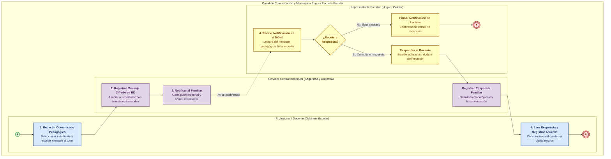

---

## 4.4. Cuadro Comparativo de Procesos Principales BPMN

| # | Proceso de Negocio | Actor Iniciador | Disparador (Trigger) | Decisión Clave (Gateway) | Resultado Exitoso (Happy Path) |
|---|---|---|---|---|---|
| **01** | **Proceso Core (Ejecución)** | Profesional | Prescripción pedagógica | ¿Supera umbral ($\ge 60\%$)? | Actividad completada, medalla otorgada y nuevo nivel desbloqueado en "Mi Camino". |
| **02** | **Motor Adaptativo (MDA)** | Servidor Central | Respuesta de actividad recibida | ¿Racha de aciertos o $\ge 4$ fallos? | Calibración de dificultad a nivel óptimo o alerta docente inmediata de frustración. |
| **03** | **Evaluación Diagnóstica** | Equipo Multidisciplinario | Alta de alumno o reevaluación | ¿Perfil funcional completo? | Generación de embedding vectorial 384D y sugerencia inteligente de actividades. |
| **04** | **Curación de Actividades** | Profesional | Planificación de clase | ¿Existe actividad en catálogo? | Nueva actividad creada con pictogramas ARASAAC y distribuida a tablets. |
| **05** | **Informes de Evolución** | Profesional | Cierre de período evaluativo | ¿Cumple estándares directivos? | PDF inmutable compilado por QuestPDF, firmado y notificado a la familia. |
| **06** | **Onboarding Familiar** | Escuela / Secretaría | Carga de email de tutor | ¿Token vigente ($\le 7$ días)? | Cuenta familiar activada, tutoría vinculada y acceso al portal familiar. |
| **07** | **Autenticación Adaptativa** | Cualquier Usuario | Apertura de la aplicación | ¿Tipo de usuario y credencial? | Sesión abierta con JWT seguro y tema visual adaptado (alto contraste, dislexia). |
| **08** | **Alertas en Vivo "Mi Aula"** | Estudiante jugando | Telemetría táctil en clase | ¿Patrón crítico o 4 fallos? | Alerta visual y sonora en laptop docente e intervención pedagógica presencial. |
| **09** | **Configuración Institucional** | Directivo Escolar | Configuración inicial de la sede escolar | ¿Denominación oficial y datos de contacto válidos? | Sede configurada, datos institucionales registrados y catálogos base inicializados. |
| **10** | **Vinculación de Equipo** | Directivo Escolar | Asignación de aula/alumno | ¿Matrículas profesionales activas? | Equipo multidisciplinario vinculado con acceso al legajo (`CanAccessPersonAsync`). |
| **11** | **Mensajería Segura** | Docente o Familiar | Redacción de comunicado | ¿Requiere respuesta del receptor? | Mensaje registrado en legajo, acuse de lectura firmado y notificación despachada. |
