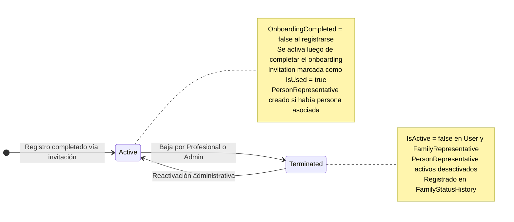

# Diagrama de Estado — FamilyRepresentative

**Entidad:** `FamilyRepresentative`  
**Campo de estado:** `Status` (varchar20)  
**Historial:** `FamilyStatusHistory`

---

## Estados

| Estado | Descripción |
|--------|-------------|
| `Active` | Familiar registrado y habilitado para acceder al portal. |
| `Terminated` | Perfil y cuenta desactivados hasta una reactivación administrativa. |

---

## Diagrama

---

## Reglas de Transición

| Desde | Hacia | Actor | Condición |
|-------|-------|-------|-----------|
| — | `Active` | Sistema (auto) | Familiar completa registro con código de `Invitation` válido |
| `Active` | `Terminated` | Profesional / Admin Institucional | Desactiva cuenta y vínculos activos; registrado en `FamilyStatusHistory` |
| `Terminated` | `Active` | Profesional / Admin Institucional con acceso al familiar | Nueva contraseña temporal; no restaura vínculos ni alumnos |

> A diferencia de `Professional`, el familiar no pasa por estado `Pending` ni requiere aprobación del admin. El acceso es inmediato al completar el registro.

---

## Vínculo Persona–Familiar (PersonRepresentative)

El estado de `FamilyRepresentative` es independiente del estado de cada vínculo `PersonRepresentative`. Un familiar `Active` puede tener vínculos activos e inactivos con distintas personas.

| Evento | Impacto en PersonRepresentative |
|--------|--------------------------------|
| Alta del vínculo | `PersonRepresentative.IsActive = true`; entrada en `PersonRepresentativeHistory` (tipo: `Linked`) |
| Baja del vínculo | `PersonRepresentative.IsActive = false`; entrada en `PersonRepresentativeHistory` (tipo: `Unlinked`) |
| `Terminated` del familiar | Todos los `PersonRepresentative` activos pasan a `IsActive = false` |
| Reactivación del familiar | No modifica `PersonRepresentative` ni el estado de alumnos; asignación futura explícita |
