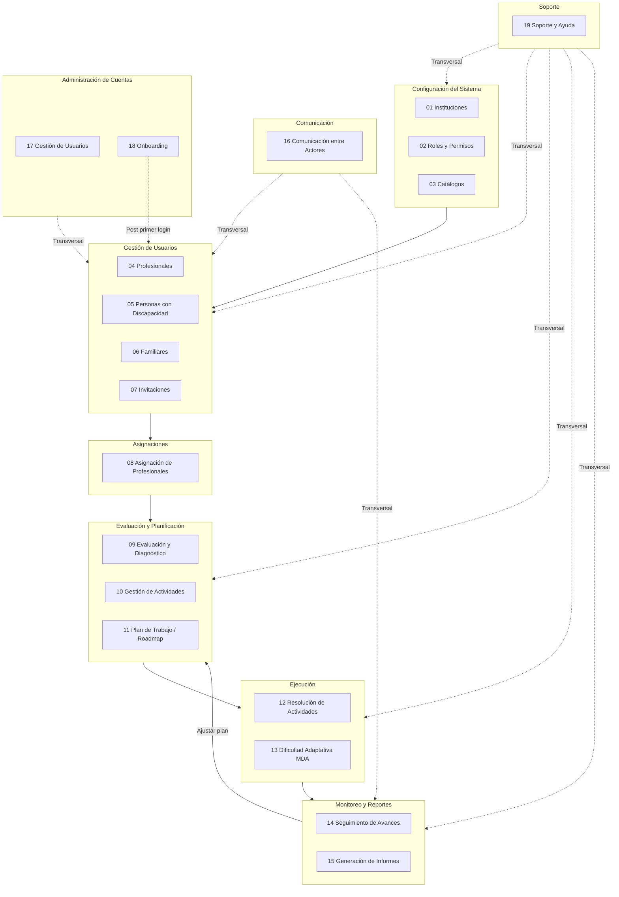
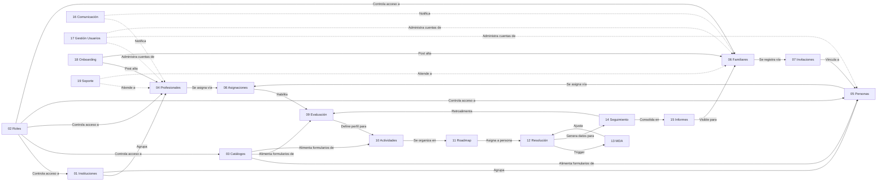
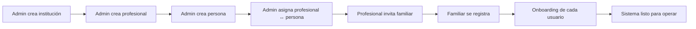
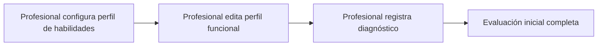
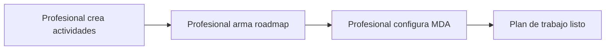
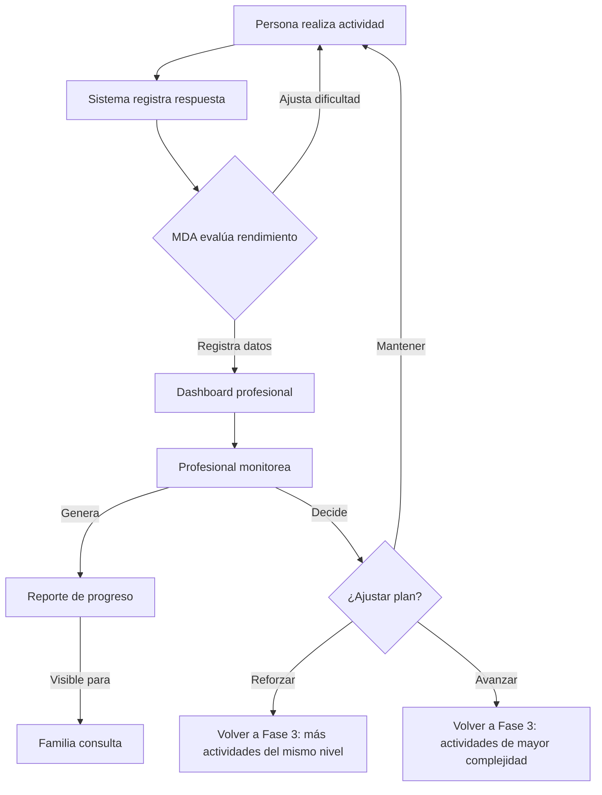

# Mapa Global de Procesos del Sistema InclusiON

## Visión general

El sistema InclusiON organiza sus procesos en 8 áreas funcionales que cubren el ciclo completo de trabajo con personas con discapacidad: desde la configuración inicial del sistema hasta el monitoreo continuo del progreso.

## Relación entre procesos

## Fases del sistema (DOCX)

El proyecto final define 4 fases secuenciales que agrupan los procesos:

### Fase 1 — Configuración y Onboarding
**Objetivo:** Preparar el sistema y dar de alta a todos los actores.

| Proceso | Descripción |
|---------|-------------|
| 01 Instituciones | Crear instituciones educativas |
| 02 Roles y Permisos | Configurar roles y crear admins institucionales |
| 03 Catálogos | Cargar tablas de referencia |
| 04 Profesionales | Alta de profesionales con credenciales |
| 05 Personas | Alta de personas con discapacidad |
| 06 Familiares | Alta directa o por invitación |
| 07 Invitaciones | Envío de email para registro de familiares |
| 08 Asignaciones | Vincular profesionales a instituciones y personas |
| 18 Onboarding | Guiar a cada usuario en su primer ingreso |

---

### Fase 2 — Evaluación y Diagnóstico
**Objetivo:** Establecer el punto de partida del alumno antes de la intervención.

| Proceso | Descripción |
|---------|-------------|
| 09 Evaluación | Configurar perfil de habilidades y perfil funcional |
| 09 Diagnóstico | Registrar diagnóstico funcional formal |

---

### Fase 3 — Intervención y Personalización
**Objetivo:** Diseñar el plan de trabajo personalizado basado en la evaluación.

| Proceso | Descripción |
|---------|-------------|
| 10 Actividades | Crear actividades con templates dinámicos |
| 11 Roadmap | Armar secuencia de actividades por área |
| 13 MDA config | Configurar parámetros del motor adaptativo |

---

### Fase 4 — Ciclo de Seguimiento y Mejora Continua
**Objetivo:** Ciclo operativo principal. El alumno trabaja, el sistema adapta, los actores monitorean.

| Proceso | Descripción |
|---------|-------------|
| 12 Resolución | La persona realiza actividades en el portal AAC |
| 13 MDA auto | El sistema ajusta dificultad automáticamente |
| 14 Seguimiento | Profesional y familia monitorean progreso |
| 15 Informes | Generación de reportes formales |
| 16 Comunicación | Mensajería entre profesional y familia |

El estado de avance de cada proceso se puede consultar en el [checklist de procesos](../Estado/checklist-procesos.md).

---

## Actores y sus procesos

| Actor | Procesos en los que participa |
|-------|------------------------------|
| **Admin Global** | 01, 02, 03, 04, 05, 06, 08, 17, 19 |
| **Admin Institucional** | 04, 05, 06, 08, 17, 19 |
| **Profesional** | 07, 08, 09, 10, 11, 14, 15, 16, 18, 19 |
| **Persona con Discapacidad** | 12, 18 |
| **Familia** | 07, 14, 15, 16, 18, 19 |
| **Sistema (automático)** | 13 |

## Referencias transversales

Estos documentos describen capacidades que soportan todos los procesos:

| Referencia | Descripción | Ubicación |
|------------|-------------|-----------|
| Accesibilidad | 7 perfiles × 2 modos = 14 combinaciones visuales | `References/REF-accesibilidad.md` |
| Autenticación | 5 métodos de login + JWT + refresh tokens | `References/REF-autenticacion.md` |
| Gestión de Usuarios | Administración centralizada de cuentas | `Process/17-gestion-usuarios.md` |
| Onboarding | Primer ingreso y configuración por rol | `Process/18-onboarding.md` |
| Soporte | Centro de ayuda, FAQ y tickets | `Process/19-soporte.md` |
