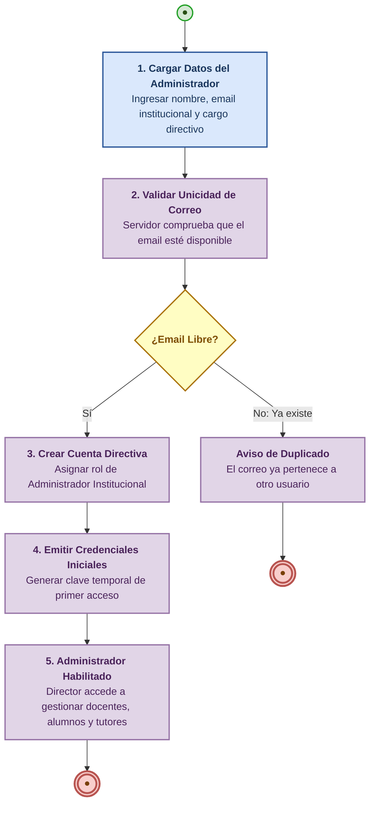

# Proceso 01 — Gestión de Administradores Institucionales

**Área:** Administración y Gestión Institucional  
**Actores:** Administrador del Sistema / Equipo Directivo Escolar

---

## Descripción del Proceso

Proceso de alta, aprovisionamiento de credenciales y asignación de perfil para el **Administrador Institucional** (Director / Directora / Coordinador Escolar). El Administrador Institucional es el rol directivo encargado de la gestión integral de la escuela: gestiona a los profesionales docentes, da de alta a los estudiantes (personas con discapacidad), vincula a los tutores familiares y audita los informes y métricas del centro escolar.

> [!NOTE]
> Por alcance de proyecto acordado, la plataforma no gestiona la creación de múltiples entidades corporativas externas, sino que opera directamente en la gestión de los 4 actores fundamentales:
> 1. **Administrador Institucional** (Dirección Escolar)
> 2. **Profesionales** (Docentes y Terapeutas)
> 3. **Familiares** (Tutores Legales)
> 4. **Alumnos** (Personas con Discapacidad)

---

## Pasos del Proceso

### 1. Carga de Datos del Administrador Institucional
Se registran los datos de filiación del directivo:
- Nombre y apellido completo.
- Correo electrónico institucional.
- Cargo o función directiva.
- **Endpoint:** `POST /api/users` (con `role: "admin"`)
- **Frontend:** Portal de Administración / Configuración Directiva

### 2. Validación de Unicidad y Seguridad
El servidor central valida que la dirección de correo no esté asignada a otra cuenta activa.
- Si el email ya existe, devuelve `409 Conflict`.
- Si está libre, procede con la creación de la entidad de usuario.

### 3. Asignación de Perfil Directivo
El sistema vincula el rol de Administrador Institucional (`admin`), otorgándole el alcance completo para:
- Aprovisionar docentes y terapeutas ([Proceso 05](./05-gestion-profesionales.md)).
- Gestionar legajos de estudiantes con discapacidad ([Proceso 04](./04-gestion-personas.md)).
- Vincular tutores familiares ([Proceso 06](./06-gestion-familiares.md)).
- Asignar equipos multidisciplinarios ([Proceso 08](./08-asignacion-profesionales.md)).
- Auditar y aprobar informes de evolución ([Proceso 15](./15-generacion-informes.md)).

### 4. Emisión de Credenciales de Primer Ingreso
Se genera una contraseña temporal cifrada y se notifica al directivo para que realice su primer ingreso e inicie su circuito de bienvenida ([Proceso 18 — Onboarding](./18-onboarding.md)).

---

## Diagrama de Flujo (Camino Principal)

