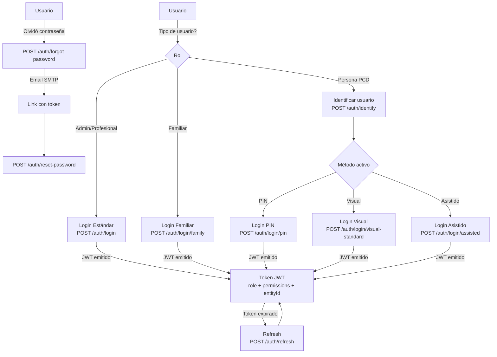

# Proceso 02 — Autenticación y Registro

**Área:** Seguridad y Acceso

## Descripción
Proceso de registro de usuarios y autenticación multi-método en la plataforma. El sistema soporta dos flujos paralelos: (1) registro y login estándar para administradores, profesionales y familiares; (2) login visual accesible para personas con discapacidad, con variantes PIN, asistido y visual estándar.

## Participantes
- **Admin Global** — Registra profesionales y admins institucionales
- **Profesional** — Se registra; inicia sesión con email/contraseña
- **Familiar** — Se registra vía invitación; inicia sesión con método familiar
- **Persona (PCD)** — Inicia sesión con PIN, método visual o login asistido
- **Sistema** — Valida credenciales, emite JWT, envía emails de recuperación

## Métodos de login

| Método | Endpoint | Rol | Descripción |
|--------|----------|-----|-------------|
| Estándar | `POST /api/auth/login` | Admin / Profesional | Email + contraseña |
| Familiar | `POST /api/auth/login/family` | Familiar | Email + contraseña simplificada |
| Visual Estándar | `POST /api/auth/login/visual-standard` | PCD | UserId + contraseña visual |
| PIN | `POST /api/auth/login/pin` | PCD | UserId + PIN numérico |
| Asistido | `POST /api/auth/login/assisted` | PCD | UserId + credenciales del supervisor |

## Pasos del proceso

### 1. Registro de Usuario
El admin global o el sistema crea un usuario. Los familiares se registran vía invitación aceptada.
- **Endpoint:** `POST /api/auth/register`
- **Frontend:** `/register` (formulario público)
- **Rate limiting:** `auth-sensitive`

### 2. Identificación de Persona (PCD)
Antes del login visual, el sistema identifica al usuario para determinar su método de autenticación configurado.
- **Endpoint:** `POST /api/auth/identify`
- **Respuesta:** método de login activo, deviceId, tipo de usuario

### 3. Login según Método
Cada rol utiliza el endpoint correspondiente a su método configurado.
- Los tokens JWT incluyen: `role`, `permissions`, `isGlobalAdmin`, `institutionId`, `entityId`
- **Refresh token:** `POST /api/auth/refresh` — renueva el access token sin re-login
- **Rate limiting por endpoint:** `auth-login`, `auth-pin`, `auth-refresh`

### 4. Recuperación de Contraseña
Flujo en dos pasos: solicitud por email y aplicación del token.
- **Solicitar:** `POST /api/auth/forgot-password` — siempre responde 200 (evita enumeración)
- **Aplicar:** `POST /api/auth/reset-password`
- **Frontend:** `/forgot-password`, `/reset-password?token=...`

### 5. Cambio de Contraseña
El usuario autenticado cambia su contraseña sin pasar por el flujo de recuperación.
- **Endpoint:** `PUT /api/auth/change-password` (requiere JWT)

## Estados de sesión
- **Válida** — JWT vigente, refresh token activo
- **Expirada** — Access token vencido, se renueva con refresh token
- **Revocada** — Logout o cambio de contraseña invalida refresh tokens

## Diagrama de flujo

