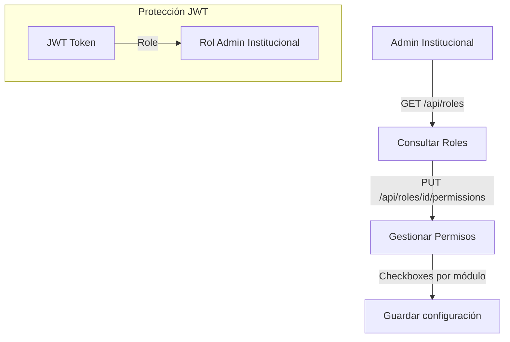

# Proceso 02 — Gestión de Roles y Permisos

**Área:** Configuración del Sistema

## Descripción
Proceso de configuración de los roles del sistema y consulta/asignación de permisos por rol. Los permisos se agrupan por módulo y controlan el acceso a funcionalidades específicas de la plataforma. El Administrador Institucional supervisa y parametriza los permisos según el marco de trabajo del establecimiento; los roles están predefinidos (Admin, Professional, FamilyRepresentative, PersonWithDisability).

## Participantes
- **Admin Institucional** — Consulta roles y supervisa matriz de permisos

## Pasos del proceso

### 1. Consulta de Roles
El admin institucional visualiza los roles del sistema con sus permisos actuales.
- **Listar roles:** `GET /api/roles`
- **Detalle de rol:** `GET /api/roles/{id}`
- **Permisos disponibles:** `GET /api/roles/available-permissions`
- **Frontend:** `/admin/roles` (DataTable con roles)

### 2. Asignación de Permisos
El admin institucional selecciona permisos mediante checkboxes agrupados por módulo y los asigna al rol.
- **Endpoint:** `PUT /api/roles/{id}/permissions`
- **Frontend:** `/admin/roles/{id}` (checkboxes por módulo)

### 3. Autorización por Recurso — Capa 3 (HU-IN-172)

Más allá de los permisos del rol, el acceso a entidades sensibles requiere un **vínculo explícito** entre el usuario y el recurso solicitado. Esta es la tercera capa de seguridad, aplicada después de verificar JWT y política de permiso.

#### Fuentes de verdad por rol

| Rol | Tabla de vínculo | Condición |
|-----|-----------------|-----------|
| Professional | `ProfessionalPersons` | `ProfessionalId` + `PersonId` + `IsActive = true` |
| FamilyRepresentative | `PersonRepresentatives` | `RepresentativeId` + `PersonId` + `IsActive = true` |
| Admin Institucional | `AdminInstitutions` | `AdminUserId` + `InstitutionId` |

#### Entidades sensibles en scope

`PersonWithDisability`, `PersonSkillProfile`, `Diagnosis`, `Report`, `ActivityResponse`, `PersonRoadmap`, `ActivityAssignment`, `Invitation`, `User` (consulta de terceros)

#### Implementación técnica

- **Interfaz:** `IResourceAuthorizationService` (Application)
- **Implementación:** `ResourceAuthorizationService` (Infrastructure) — inyectado vía DI

## Diagrama de flujo

```mermaid
flowchart TD
    AI[Admin Institucional] -->|GET /api/roles| ROLES[Consultar Roles]
    ROLES -->|PUT /api/roles/id/permissions| PERM[Gestionar Permisos]
    PERM -->|Checkboxes por módulo| SAVE[Guardar configuración]

    subgraph Protección JWT
        JWT[JWT Token] -->|Role| POL[Rol Admin Institucional]
    end
```
