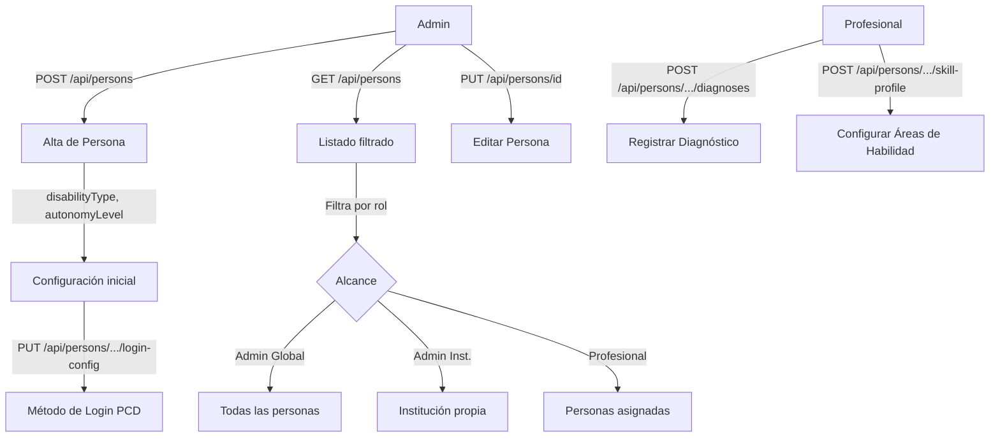

# Proceso 04 — Gestión de Personas con Discapacidad

**Área:** Personas

## Descripción
Proceso de alta, edición y administración de las personas con discapacidad (PCD) dentro de la plataforma. Incluye configuración del perfil de accesibilidad (método de login, nivel de autonomía), gestión de diagnósticos, perfil de habilidades y vinculación con representantes familiares.

## Participantes
- **Admin Global** — CRUD completo de personas en cualquier institución
- **Admin Institucional** — CRUD dentro de su institución
- **Profesional** — Consulta y edición limitada de sus personas asignadas; configura perfil de habilidades

## Pasos del proceso

### 1. Alta de Persona
El admin registra la persona con datos personales, tipo de discapacidad, nivel de autonomía e institución.
- **Endpoint:** `POST /api/persons`
- **Frontend:** `/admin/persons/new` (formulario)
- **Campos clave:** nombre, apellido, fechaNacimiento, disabilityTypeId, autonomyLevelId, institutionId

### 2. Consulta y Búsqueda
Lista paginada con filtros por tipo de discapacidad, nivel de autonomía, institución y estado.
- **Endpoint:** `GET /api/persons` (paginado, con filtros)
- **Alcance:** Admin Global ve todas; Admin Institucional ve las de su institución; Profesional ve sus asignadas

### 3. Edición de Persona
Modificación de datos personales y configuración de accesibilidad.
- **Endpoint:** `PUT /api/persons/{personId}`
- **Frontend:** `/admin/persons/{id}/edit`

### 4. Configuración de Login (PCD)
El admin configura el método de autenticación de la persona según su nivel de autonomía.
- **Endpoint:** `PUT /api/persons/{personId}/login-config`
- **Métodos disponibles:** STANDARD (id=1), PIN (id=2), ASSISTED (id=3) — catálogo configurable en BD
- **Vinculado a:** nivel de autonomía del catálogo

### 5. Gestión de Diagnósticos
El profesional registra los diagnósticos clínicos de la persona (CIE-10 o texto libre).
- **Crear:** `POST /api/persons/{personId}/diagnoses`
- **Listar:** `GET /api/persons/{personId}/diagnoses`
- **Actualizar:** `PUT /api/persons/{personId}/diagnoses/{diagnosisId}`

### 6. Perfil de Habilidades
El profesional configura qué áreas de habilidad se trabajarán con la persona.
- **Crear:** `POST /api/persons/{personId}/skill-profile`
- **Leer:** `GET /api/persons/{personId}/skill-profile`
- **Desactivar área:** `PUT /api/persons/{personId}/skill-profile/{areaId}`

### 7. Baja Lógica
Desactivación de la persona sin eliminar datos históricos ni asignaciones.
- **Endpoint:** `DELETE /api/persons/{personId}` (soft delete)

## Relaciones clave

```
PersonWithDisability
  ├── AutonomyLevel (catálogo)
  ├── DisabilityType (catálogo)
  ├── EducationalInstitution
  ├── PersonDiagnosis[]
  ├── PersonSkillProfile[] → SkillArea[]
  ├── ProfessionalPerson[] → Professional[]
  └── PersonRepresentative[] → FamilyRepresentative[]
```

## Diagrama de flujo


