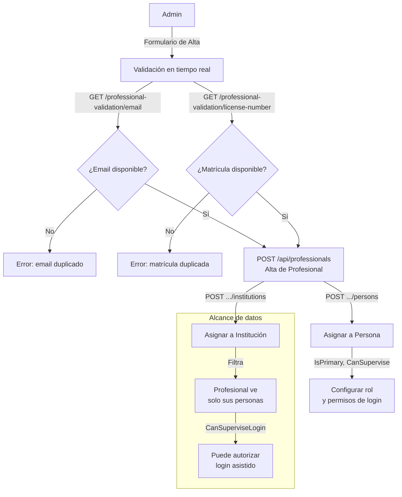
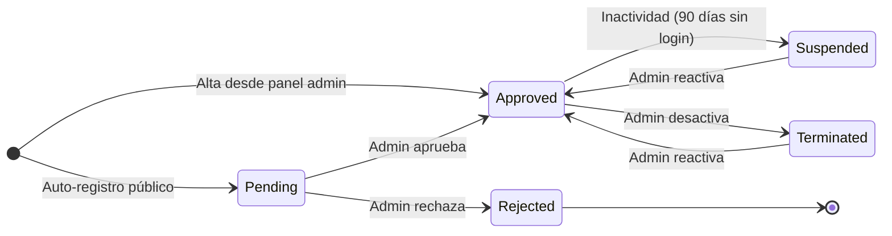

# Proceso 05 — Gestión de Profesionales

**Área:** Personas

## Descripción
Proceso de alta, validación y administración de profesionales terapeutas dentro de la plataforma. Incluye validación en tiempo real de email y matrícula, asignación a instituciones y personas, y configuración de permisos de supervisión de login.

## Participantes
- **Admin Global** — CRUD completo de profesionales; asigna a instituciones
- **Admin Institucional** — Crea profesionales dentro de su institución; asigna a personas

## Pasos del proceso

### 1. Validación Previa (en formulario)
Antes de enviar el alta, el frontend valida en tiempo real la disponibilidad de email y matrícula para evitar duplicados.
- **Validar email:** `GET /api/professional-validation/email?email=...`
- **Validar matrícula:** `GET /api/professional-validation/license-number?licenseNumber=...`
- **Respuesta:** `{ isAvailable: bool, message: string }`

### 2. Alta de Profesional
El admin registra al profesional con datos personales y profesionales.
- **Endpoint:** `POST /api/professionals`
- **Frontend:** `/admin/professionals/new`
- **Campos clave:** nombre, apellido, email, teléfono, especialidad, matrícula profesional

### 3. Consulta y Búsqueda
Lista paginada de profesionales con filtros por institución y estado.
- **Endpoint:** `GET /api/professionals`
- **Alcance:** Admin Global ve todos; Admin Institucional ve los de su institución

### 4. Detalle del Profesional
Vista completa con datos personales, instituciones asignadas y personas a cargo.
- **Endpoint:** `GET /api/professionals/{profId}`
- **Frontend:** `/admin/professionals/{id}` (tabs: Datos, Instituciones, Personas)

### 5. Edición
Modificación de datos del profesional.
- **Endpoint:** `PUT /api/professionals/{profId}`

### 6. Asignación a Institución
Vinculación del profesional a una o más instituciones educativas.
- **Asignar:** `POST /api/professionals/{profId}/institutions`
- **Listar:** `GET /api/professionals/{profId}/institutions`
- **Desasignar:** `DELETE /api/professionals/{profId}/institutions/{instId}`

### 7. Asignación a Personas
Vinculación del profesional a personas con discapacidad. Se define rol principal y permiso de supervisión de login asistido.
- **Asignar:** `POST /api/professionals/{profId}/persons`
- **Campos:** `IsPrimaryProfessional`, `CanSuperviseLogin`
- **Listar:** `GET /api/professionals/{profId}/persons`
- **Desactivar:** `PUT /api/professionals/{profId}/persons/{personId}/deactivate`

### 8. Baja Lógica
Desactivación del profesional sin eliminar historial.
- **Endpoint:** `DELETE /api/professionals/{profId}`

## Diagrama de flujo

## Estados del Profesional

## Dos caminos de alta

| Camino | Estado inicial | Descripción |
|--------|---------------|-------------|
| Auto-registro público | `Pending` | Profesional se registra desde `/register-professional`. Requiere validación del admin. |
| Alta desde panel admin | `Approved` | Admin crea el profesional directamente. Acceso activo con contraseña temporal. |

## Historial de estados

Cada cambio se registra en `ProfessionalStatusHistory`:
- Estado anterior y nuevo
- Observación/motivo obligatorio
- Usuario que realizó el cambio + timestamp

## Tabla de endpoints

| Método | Endpoint | Auth | Descripción |
|--------|----------|------|-------------|
| POST | `/api/professionals` | `professionals:create` | Alta directa (admin) |
| POST | `/api/professionals/register` | Público | Auto-registro |
| GET | `/api/professionals` | `professionals:read` | Listado activos |
| GET | `/api/professionals/pending` | `professionals:read` | Listado pendientes |
| GET | `/api/professionals/{id}` | `professionals:read` | Detalle |
| GET | `/api/professionals/me` | Auth | Mi perfil |
| PUT | `/api/professionals/{id}` | `professionals:update` | Editar |
| PUT | `/api/professionals/{id}/validate` | `professionals:update` | Aprobar/rechazar |
| PUT | `/api/professionals/{id}/deactivate` | `professionals:update` | Desactivar |
| PUT | `/api/professionals/{id}/reactivate` | `professionals:update` | Reactivar |
| GET | `/api/professionals/{id}/status-history` | `professionals:read` | Historial |
| POST | `/api/professionals/suspend-inactive` | `professionals:update` | Suspender inactivos |
| GET | `/api/professional-validation/email` | Auth | Validar email único |
| GET | `/api/professional-validation/license-number` | Auth | Validar matrícula |
