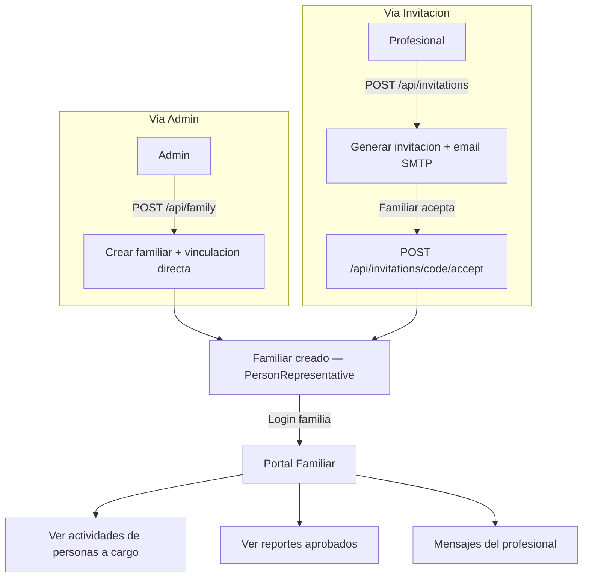

# Proceso 06 — Gestión de Familiares y Representantes

**Área:** Personas

## Descripción
Proceso de alta y administración de representantes familiares vinculados a personas con discapacidad. Los familiares acceden a un portal propio donde consultan actividades, progreso y reportes aprobados de sus personas a cargo. El alta puede darse por invitación (flujo profesional) o directa (flujo admin).

## Participantes
- **Admin Global / Institucional** — Alta directa de familiar y vinculación a persona
- **Profesional** — Genera invitaciones para familiares de sus personas asignadas
- **Familiar** — Se registra vía invitación; accede al portal familiar

## Vías de alta

| Vía | Quién la inicia | Endpoint | Vinculación automática |
|-----|----------------|----------|----------------------|
| Directa (admin) | Admin | `POST /api/family` | Sí, al crear |
| Invitación | Profesional | `POST /api/invitations` + `POST /api/invitations/{code}/accept` | Sí, al aceptar |

## Pasos del proceso

### 1. Alta Directa (vía admin)
El admin crea el familiar y lo vincula a una persona en una sola operación.
- **Endpoint:** `POST /api/family`
- **Crea:** usuario + perfil familiar + `PersonRepresentative`
- **Campos:** nombre, apellido, email, contraseña, relación, personId

### 2. Alta por Invitación (vía profesional)
Flujo en dos pasos documentado en [Proceso 07](./07-gestion-invitaciones.md).
El resultado final es el mismo: usuario + familiar + `PersonRepresentative`.

### 3. Consulta de Familiares
El profesional consulta los familiares vinculados a sus personas.
- **Endpoint:** `GET /api/family`

### 4. Portal Familiar — Dashboard
El familiar autenticado accede a su portal con lista de personas a cargo, actividades recientes, reportes aprobados y mensajes del profesional.

### 5. Portal Familiar — Actividades
El familiar ve el estado de las actividades de sus personas a cargo con filtros por estado.
- **Endpoint:** `GET /api/family/activities` (filtra por entityId del JWT)
- **Estados visibles:** Pendiente, En progreso, Completada, Cancelada

### 6. Portal Familiar — Reportes
El familiar accede a reportes aprobados y puede marcarlos como leídos.
- **Listar:** `GET /api/reports/family`
- **Marcar leído:** `PATCH /api/reports/{reportId}/mark-read`

## Relaciones del sistema

```
FamilyRepresentative (usuario)
  └── PersonRepresentative[]
        ├── PersonWithDisability
        ├── IsPrimary: bool
        └── HasInformedConsent: bool
```

## Diagrama de flujo


