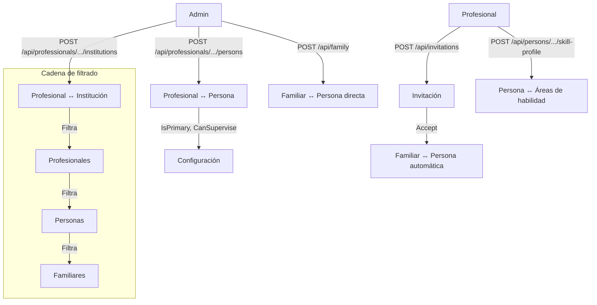
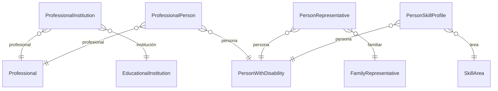

# Proceso 08 — Asignación de Profesionales

**Área:** Asignaciones y Vinculaciones

## Descripción
Proceso de vinculación de profesionales a instituciones educativas y a personas con discapacidad. Estas asignaciones determinan el alcance de trabajo del profesional: qué personas atiende y en qué instituciones opera. También se establece la vinculación familiar (vía invitación o directa) y el perfil de habilidades de cada persona.

## Participantes
- **Admin Global** — Asigna profesionales a instituciones y a personas
- **Admin Institucional** — Asigna profesionales a personas dentro de su institución
- **Profesional** — Configura perfil de habilidades de sus personas asignadas

## Relaciones del sistema

| Relación | Tabla intermedia | Campos clave | Quién gestiona |
|----------|-----------------|-------------|----------------|
| Profesional ↔ Institución | `ProfessionalInstitution` | ProfessionalId, InstitutionId, IsActive | Admin |
| Profesional ↔ Persona | `ProfessionalPerson` | ProfessionalId, PersonId, IsPrimaryProfessional, CanSuperviseLogin | Admin |
| Persona ↔ Familiar | `PersonRepresentative` | PersonId, RepresentativeId, IsPrimary, HasInformedConsent | Admin / Invitación |
| Persona ↔ Área de habilidad | `PersonSkillProfile` | PersonId, SkillAreaId, IsActive | Profesional |

## Pasos del proceso

### 1. Asignar Profesional a Institución
Desde el detalle del profesional (tab Instituciones), el admin vincula al profesional con una o más instituciones.
- **Asignar:** `POST /api/professionals/{profId}/institutions`
- **Listar:** `GET /api/professionals/{profId}/institutions`
- **Desasignar:** `DELETE /api/professionals/{profId}/institutions/{instId}`

### 2. Asignar Persona a Profesional
El admin asigna personas a profesionales. Se define si es profesional principal y si puede supervisar login asistido.
- **Asignar:** `POST /api/professionals/{profId}/persons`
- **Listar:** `GET /api/professionals/{profId}/persons`
- **Desactivar:** `PUT /api/professionals/{profId}/persons/{personId}/deactivate`
- **Frontend:** Tab "Personas a cargo" en detalle del profesional

### 3. Vinculación Familiar
Se establece la relación persona-familiar por dos vías:
- **Vía admin:** Al crear el familiar (`POST /api/family`), se lo vincula a una persona
- **Vía invitación:** Al aceptar la invitación (`POST /api/invitations/{code}/accept`), se crea automáticamente el `PersonRepresentative`

### 4. Perfil de Habilidades
El profesional configura qué áreas de habilidad se van a trabajar con la persona.
- **Crear perfil:** `POST /api/persons/{id}/skill-profile`
- **Leer perfil:** `GET /api/persons/{id}/skill-profile`
- **Desactivar área:** `PUT /api/persons/{id}/skill-profile/{areaId}`

### 5. Desvinculación (soft-delete)
Todas las relaciones soportan desactivación sin eliminar datos históricos.
- Profesional-Persona: `PUT /api/professionals/{profId}/persons/{personId}/deactivate`
- Profesional-Institución: `DELETE /api/professionals/{profId}/institutions/{instId}`

## Diagrama de flujo

## Diagrama de entidades

