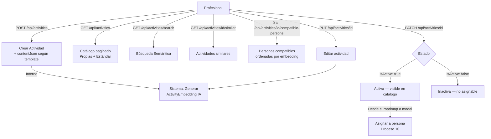

# Proceso 09 — Gestión de Actividades (Catálogo)

**Área:** Actividades

## Descripción
Proceso de creación, edición y administración del catálogo de actividades terapéuticas. El profesional diseña actividades configurando tipo de template, contenido JSON estructurado, soporte de accesibilidad y áreas de habilidad. El sistema genera embeddings de IA para búsqueda semántica y recomendación de actividades compatibles con cada persona.

## Participantes
- **Profesional** — CRUD completo de sus actividades; accede a actividades estándar (de la plataforma)
- **Sistema (IA)** — Genera embeddings semánticos al crear/actualizar actividades

## Tipos de template (actividades)

| Template | Código | Descripción |
|----------|--------|-------------|
| Completar Letra | `complete-letter` | Completar palabras con letras faltantes |
| Relacionar Imagen-Palabra | `match-image-word` | Unir imágenes con su nombre |
| Ordenar Secuencia | `order-sequence` | Ordenar pasos de una secuencia |
| Seleccionar Figura | `select-figure` | Identificar figura entre opciones |
| Suma Visual | `visual-sum` | Operaciones matemáticas con pictogramas |

## Pasos del proceso

### 1. Crear Actividad
El profesional define el contenido estructurado según el tipo de template elegido.
- **Endpoint:** `POST /api/activities`
- **Frontend:** `/pro/activities/new` (editor dinámico según templateTypeId)
- **Campos clave:** title, description, instructions, categoryId, skillAreaId, complexityLevel, estimatedDurationMinutes, templateTypeId, contentJson
- **Accesibilidad:** hasVisualSupport, hasAudioSupport, usesEasyReading, usesPictograms, requiresSupervision

### 2. Generar Embedding (automático)
Al crear o actualizar, el sistema llama al servicio de IA para generar el embedding semántico.
- **Interno:** `ActivityEmbedding` generado por vector embedding del título + descripción + instrucciones
- **Uso:** búsqueda semántica y compatibilidad persona-actividad

### 3. Consultar Catálogo
Lista paginada con filtros. El profesional ve sus actividades propias y las estándar del sistema.
- **Endpoint:** `GET /api/activities`
- **Filtros:** search, categoryId, skillAreaId, templateTypeId, isActive, isStandard

### 4. Búsqueda Semántica
El profesional busca actividades por texto libre (semántico, no solo exacto).
- **Endpoint:** `GET /api/activities/search?text=...&limit=10`
- **Motor:** embeddings vectoriales, ordenados por similitud coseno

### 5. Actividades Similares
Obtiene actividades similares a una existente (para variación o progresión).
- **Endpoint:** `GET /api/activities/{id}/similar?limit=5`

### 6. Personas Compatibles
Lista personas ordenadas por compatibilidad con la actividad (persona-activity matching por embedding).
- **Endpoint:** `GET /api/activities/{id}/compatible-persons?limit=10`

### 7. Editar Actividad
Actualización de contenido y metadatos. El embedding se regenera automáticamente.
- **Endpoint:** `PUT /api/activities/{id}`

### 8. Activar / Desactivar
Máquina de estados simple: activa ↔ inactiva. Las actividades inactivas no aparecen en el catálogo de asignación.
- **Endpoint:** `PATCH /api/activities/{id}`
- **Body:** `{ isActive: bool }`

## Diagrama de flujo

