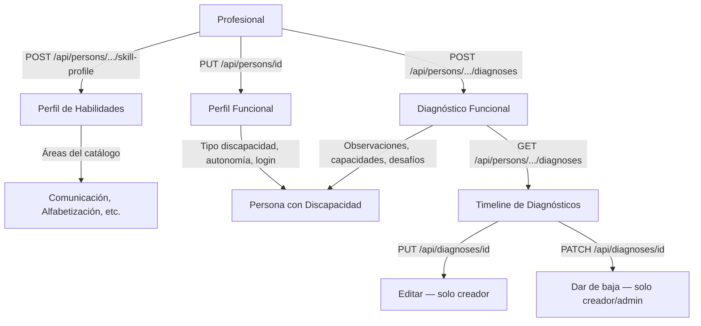

# Proceso 09 — Evaluación y Diagnóstico

**Área:** Evaluación y Planificación

## Descripción
Proceso donde el profesional evalúa a la persona con discapacidad, establece su perfil funcional y registra diagnósticos formales. Corresponde a la Fase 2 del DOCX: el profesional analiza capacidades, limitaciones y necesidades para establecer el punto de partida antes de la intervención. Todos los pasos están implementados.

## Participantes
- **Profesional** — Evalúa, configura perfiles y registra diagnósticos

## Pasos del proceso

### 1. Configuración del Perfil de Habilidades
El profesional selecciona las áreas de habilidad que se van a trabajar con la persona y establece niveles iniciales.
- **Crear perfil:** `POST /api/persons/{id}/skill-profile`
- **Leer perfil:** `GET /api/persons/{id}/skill-profile`
- **Desactivar área:** `PUT /api/persons/{id}/skill-profile/{areaId}`
- **Frontend:** Sección "Perfil de habilidades" en `/pro/persons/{id}`
- **Catálogo:** `GET /api/catalogs/skill-areas`

### 2. Edición del Perfil Funcional
El profesional edita los datos funcionales de la persona: tipo de discapacidad, nivel de autonomía, perfil de accesibilidad y método de login.
- **Endpoint:** `PUT /api/persons/{id}`
- **Método de login:** `PUT /api/persons/{id}/login-method`
- **Frontend:** `/pro/persons/{id}` (edición inline campo por campo)

### 3. Diagnóstico Funcional
El profesional registra diagnósticos formales con fecha, diagnóstico principal, observaciones, capacidades, desafíos, apoyos, objetivos y estrategias. Sólo el creador puede editar o dar de baja su diagnóstico.

- **Endpoints implementados:**
  - `GET /api/persons/{id}/diagnoses` — Lista de diagnósticos por fecha desc
  - `POST /api/persons/{id}/diagnoses` — Crear diagnóstico
  - `GET /api/diagnoses/{id}` — Detalle completo
  - `PUT /api/diagnoses/{id}` — Editar (solo el profesional creador)
  - `PATCH /api/diagnoses/{id}` — Baja lógica (`{ isActive: bool }`, valida autoría)
- **Frontend:** Timeline de diagnósticos en detalle de persona (`/pro/persons/{id}`) con filtro por fecha. Botón "Dar de baja" visible solo para el creador y para admins.

## Diagrama de flujo

## Endpoints

| Método | Endpoint | Auth | Descripción |
|--------|----------|------|-------------|
| GET | `/api/persons/{id}/skill-profile` | `persons:read` | Perfil de habilidades |
| POST | `/api/persons/{id}/skill-profile` | `persons:update` | Crear/actualizar perfil |
| PUT | `/api/persons/{id}/skill-profile/{areaId}` | `persons:update` | Desactivar área |
| PUT | `/api/persons/{id}` | `persons:update` | Editar perfil funcional |
| PUT | `/api/persons/{id}/login-method` | `persons:update` | Cambiar método de login |
| GET | `/api/persons/{id}/diagnoses` | `diagnoses:read` | Lista de diagnósticos |
| POST | `/api/persons/{id}/diagnoses` | `diagnoses:create` | Crear diagnóstico |
| GET | `/api/diagnoses/{id}` | `diagnoses:read` | Detalle |
| PUT | `/api/diagnoses/{id}` | `diagnoses:update` | Editar (solo creador) |
| PATCH | `/api/diagnoses/{id}` | `diagnoses:update` | Baja lógica |
