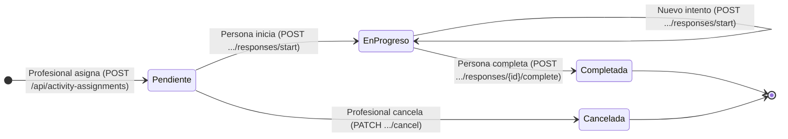
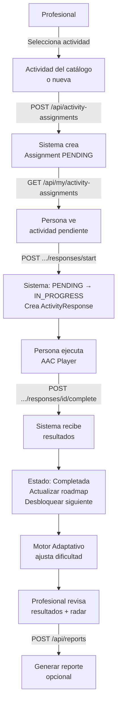

# Proceso 10 — PROCESO CORE: Ejecución de Actividades Terapéuticas

**Área:** Core  
**Prioridad:** Alta — proceso central de la plataforma

## Descripción
Proceso central de la plataforma InclusiON. El profesional asigna actividades terapéuticas a personas con discapacidad; la persona las ejecuta mediante el portal AAC accesible; el sistema evalúa los resultados capturando métricas de desempeño (% éxito, tiempo, soporte requerido, nivel de frustración); y el motor adaptativo ajusta la dificultad automáticamente según el historial de intentos.

## Participantes

| Participante | Rol en el proceso |
|---|---|
| Profesional | Selecciona y asigna actividades; revisa resultados |
| Sistema | Gestiona el ciclo de vida de la asignación; evalúa; actualiza roadmap |
| Persona (PCD) | Ejecuta actividades en el portal AAC |
| Familiar (observador) | Consulta progreso y reportes (lectura) |

## Ciclo de vida de una ActivityAssignment

```
Pendiente → EnProgreso → Completada
Pendiente → Cancelada (solo desde Pendiente, no desde EnProgreso)
```

## Pasos del proceso

### 1. Seleccionar / Crear Actividad
El profesional selecciona del catálogo o crea una actividad nueva.
- **Desde catálogo:** `GET /api/activities` con filtros (categoría, área, template)
- **Búsqueda semántica:** `GET /api/activities/search?text=...`
- **Personas compatibles:** `GET /api/activities/{id}/compatible-persons` (matching por IA)
- **Desde roadmap:** la actividad ya está pre-vinculada al plan de la persona

### 2. Configurar y Enviar Asignación
El profesional selecciona la persona, fecha límite y parámetros de evaluación.
- **Endpoint:** `POST /api/activity-assignments`
- **Frontend:** modal de asignación desde `/pro/activities/{id}` o desde roadmap
- **Campos:** personId, activityId, dueDate, isEvaluationActivity, sequenceOrder
- **Validación:** el profesional debe tener acceso de escritura a la persona (`CanAccessPersonAsync`)

### 3. Sistema: Crear Asignación (PENDING)
El sistema crea el registro `ActivityAssignment` con estado `PENDING`.
- El sistema busca personas con embeddings compatibles para sugerencias
- La asignación aparece en el listado de la persona

### 4. Persona: Ver Actividades Pendientes
La persona autenticada en el portal AAC ve sus actividades asignadas.
- **Endpoint:** `GET /api/my/activity-assignments` (usa entityId del JWT)
- **Frontend:** `/aac/activities` — lista accesible con pictogramas

### 5. Persona: Iniciar Actividad
La persona selecciona y arranca la actividad. El sistema registra el inicio.
- **Endpoint:** `POST /api/activity-assignments/{assignmentId}/responses/start`
- **Estado:** PENDING → IN_PROGRESS
- **Crea:** `ActivityResponse` con timestamp de inicio

### 6. Persona: Ejecutar Actividad (AAC Player)
La persona interactúa con el player específico según el tipo de template.
- **Players disponibles:** CompleteLetter, MatchImageWord, OrderSequence, SelectFigure, VisualSum
- **Frontend:** `/aac/player/{type}` — UI completamente accesible (pictogramas, audio, lectura fácil)

### 7. Persona: Completar Actividad
Al terminar, el frontend envía los resultados al sistema.
- **Endpoint:** `POST /api/activity-assignments/{assignmentId}/responses/{responseId}/complete`
- **Payload:** successPercentage, timeSpentSeconds, requiredSupport, frustrationLevel, responsePattern, observations

### 8. Sistema: Evaluar Respuesta
El sistema calcula el resultado y determina el nuevo estado de la asignación.
- **Estado:** IN_PROGRESS → COMPLETED (si % éxito ≥ umbral) o acumula intentos
- **Crea:** `ActivityResult` con métricas consolidadas
- **Actualiza:** PersonEmbedding con nuevo historial de desempeño

### 9. Motor Adaptativo (si configurado)
Si la actividad tiene `AdaptiveEngineConfig`, el sistema ajusta automáticamente dificultad y tiempo límite.
- **Sube dificultad:** tras N éxitos consecutivos (consecutiveSuccessToUpgrade)
- **Baja dificultad:** tras N fallos consecutivos (consecutiveFailuresToDowngrade)
- **Registra:** `AdaptiveAdjustmentLog` con antes/después del ajuste

### 10. Sistema: Actualizar Roadmap
Si la actividad pertenece al roadmap, se actualiza el progreso del área de habilidad correspondiente.
- **Desbloqueo automático:** siguiente actividad se desbloquea si % ≥ unlockThresholdPercent
- **Skill radar:** actualiza punto del área en el radar chart

### 11. Profesional: Revisar Resultados
El profesional consulta los resultados, el historial de intentos y el radar de habilidades.
- **Ver asignaciones de persona:** `GET /api/persons/{personId}/activity-assignments`
- **Roadmap con progreso:** `GET /api/persons/{personId}/roadmap`
- **Skill radar:** `GET /api/persons/{personId}/roadmap/skill-radar`
- **Historial adaptativo:** `GET /api/persons/{personId}/roadmap/areas/{areaId}/activities/{entryId}/adjustments`

### 12. Cancelar Asignación (opcional)
El profesional puede cancelar una asignación solo si está en estado **Pendiente**. Una vez que la persona inició la actividad (EnProgreso), no se puede cancelar.
- **Endpoint:** `PATCH /api/activity-assignments/{assignmentId}/cancel`

## Máquina de estados — ActivityAssignment



> Solo asignaciones en estado `Pendiente` pueden cancelarse. Una vez `EnProgreso`, no se puede cancelar. Una vez `Completada`, el estado es final e inmutable (historial clínico).

## Resultado por intento — ActivityResponse

| Resultado | Condición | Descripción |
|-----------|-----------|-------------|
| `Exito` | successPercentage ≥ 80% | Actividad dominada |
| `Parcial` | successPercentage ≥ 50% | Progreso parcial |
| `Fallido` | successPercentage < 50% | Requiere refuerzo |

## Métricas capturadas por intento

| Métrica | Tipo | Descripción |
|---------|------|-------------|
| successPercentage | float | % de respuestas correctas |
| timeSpentSeconds | int | Duración total del intento |
| requiredSupport | enum | Ninguno, Verbal, Físico, Total |
| frustrationLevel | int | Escala 1–5 |
| responsePattern | json | Patrón de respuestas individuales |
| observations | text | Notas libres del profesional/sistema |

## Diagrama de flujo


