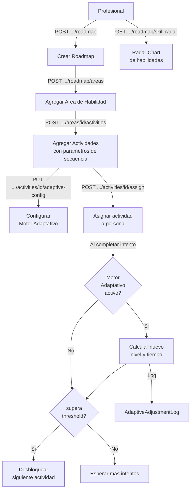

# Proceso 11 — Roadmap y Motor Adaptativo

**Área:** Progreso

## Descripción
Proceso de construcción y gestión del plan terapéutico personalizado (roadmap) de cada persona con discapacidad. El profesional organiza el roadmap en áreas de habilidad con actividades secuenciadas. El motor adaptativo ajusta automáticamente la dificultad y el tiempo límite según el historial de desempeño de la persona.

## Participantes
- **Profesional** — Crea el roadmap; agrega áreas y actividades; configura el motor adaptativo
- **Sistema (Motor Adaptativo)** — Ajusta parámetros automáticamente tras cada intento completado
- **Persona (PCD)** — Ejecuta actividades del roadmap; ve su progreso (vista simplificada)

## Estructura del roadmap

```
Roadmap (1 por persona)
  ├── RoadmapArea (n áreas de habilidad)
  │     └── RoadmapActivity[] (actividades secuenciadas)
  │           ├── sequenceOrder
  │           ├── unlockThresholdPercent
  │           ├── timeLimitSeconds
  │           ├── maxAttempts
  │           ├── showHints
  │           ├── difficultyLevel
  │           └── AdaptiveEngineConfig? (opcional)
  └── Notes
```

## Pasos del proceso

### 1. Crear Roadmap
El profesional inicializa el plan terapéutico de la persona. Solo puede existir un roadmap por persona.
- **Endpoint:** `POST /api/persons/{personId}/roadmap`
- **Conflict 409:** si ya existe un roadmap para esa persona

### 2. Agregar Área de Habilidad
El profesional agrega un área de trabajo al roadmap (ej: comunicación, motricidad, autonomía).
- **Endpoint:** `POST /api/persons/{personId}/roadmap/areas`
- **Campos:** skillAreaId, displayOrder
- **Conflict 409:** si el área ya existe en el roadmap

### 3. Agregar Actividades al Área
El profesional vincula actividades del catálogo al área del roadmap con parámetros específicos.
- **Endpoint:** `POST /api/persons/{personId}/roadmap/areas/{areaId}/activities`
- **Campos:** activityId, sequenceOrder, unlockThresholdPercent, timeLimitSeconds, maxAttempts, showHints, difficultyLevel

### 4. Reordenar Actividades
El profesional reordena las actividades de un área (drag & drop en el frontend).
- **Endpoint:** `PUT /api/persons/{personId}/roadmap/areas/{areaId}/activities/reorder`

### 5. Asignar desde Roadmap
El profesional asigna una actividad del roadmap directamente como `ActivityAssignment`, sin necesitar el ID encriptado.
- **Endpoint:** `POST /api/persons/{personId}/roadmap/areas/{areaId}/activities/{entryId}/assign`
- **Campos:** dueDate, isEvaluationActivity

### 6. Desbloqueo Automático
Al completar una actividad, el sistema evalúa si el % de éxito supera el `unlockThresholdPercent` de la siguiente actividad en la secuencia. Si lo supera, la siguiente se desbloquea automáticamente.

### 7. Configurar Motor Adaptativo
El profesional activa y parametriza el motor adaptativo por actividad del roadmap.
- **Endpoint:** `PUT /api/persons/{personId}/roadmap/areas/{areaId}/activities/{entryId}/adaptive-config`
- **Parámetros clave:**

| Parámetro | Descripción |
|-----------|-------------|
| isEnabled | Activar/desactivar el motor |
| minDifficultyLevel / maxDifficultyLevel | Rango de dificultad permitido |
| minTimeLimitSeconds / maxTimeLimitSeconds | Rango de tiempo |
| consecutiveSuccessToUpgrade | Éxitos seguidos para subir dificultad |
| consecutiveFailuresToDowngrade | Fallos seguidos para bajar dificultad |
| successThresholdPercent | % mínimo para considerar éxito |
| frustrationThreshold | Nivel de frustración para bajar dificultad |

### 8. Motor Adaptativo — Ajuste Automático
Después de cada intento completado, si el motor está activo, el sistema calcula el nuevo nivel de dificultad y tiempo límite y registra el ajuste.
- **Sube:** `consecutiveSuccess >= consecutiveSuccessToUpgrade` → `difficultyLevel++`
- **Baja:** `consecutiveFails >= consecutiveFailuresToDowngrade` O `frustrationLevel >= frustrationThreshold` → `difficultyLevel--`
- **Registra:** `AdaptiveAdjustmentLog` (historial consultable)

### 9. Consultar Progreso — Skill Radar
Vista de radar chart con el promedio de éxito por área del roadmap.
- **Endpoint:** `GET /api/persons/{personId}/roadmap/skill-radar`
- **Respuesta:** puntos (skillArea, avgSuccessPercent) para renderizar radar

### 10. Ver Roadmap Propio (PCD)
La persona ve su roadmap simplificado en el portal AAC.
- **Endpoint:** `GET /api/my/roadmap`
- **Nota:** devuelve 200 con data=null si aún no hay roadmap (no 404)

## Estados del Motor Adaptativo (MDA)

| Estado | Condición | Acción |
|--------|-----------|--------|
| `STABLE` | Rendimiento consistente | Mantener parámetros actuales |
| `PROGRESSING` | Éxitos consecutivos ≥ consecutiveSuccessToUpgrade | Aumentar dificultad dentro del rango max |
| `DIFFICULTY` | Fracasos consecutivos ≥ consecutiveFailuresToDowngrade | Reducir dificultad |
| `FRUSTRATION` | frustrationLevel ≥ frustrationThreshold | Reducir agresivamente + alerta al profesional |

### Pipeline de ajuste
```
Completar intento → Evaluar (éxito%, consecutivos, frustración, tiempo) → Calcular estado → Persistir → Adaptar parámetros → Unlock siguiente → AdaptiveAdjustmentLog
```

**Entidades:**
- `AdaptiveEngineConfig` — Rangos y umbrales por actividad del roadmap (1:0..1 con RoadmapActivity)
- `AdaptiveAdjustmentLog` — Historial de cada ajuste: `GET .../roadmap/areas/{areaId}/activities/{entryId}/adjustments`

## Diagrama de flujo


