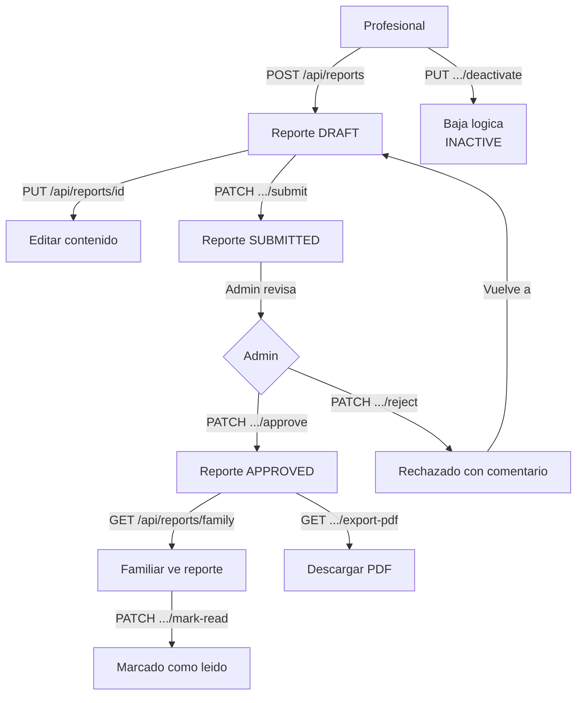

# Proceso 12 — Reportes de Progreso

**Área:** Reportes

## Descripción
Proceso de creación, revisión, aprobación y distribución de reportes de progreso terapéutico. El profesional redacta el reporte en borrador y lo envía al admin para aprobación. Una vez aprobado, el familiar puede consultarlo y exportarlo como PDF. El proceso implementa una máquina de estados con control de acceso diferenciado por rol.

## Participantes
- **Profesional** — Crea, edita y envía reportes a revisión
- **Admin** — Aprueba o rechaza reportes enviados
- **Familiar** — Consulta reportes aprobados; los marca como leídos
- **Sistema** — Exporta PDF; notifica estado

## Máquina de estados del reporte

```
DRAFT (Borrador)
  └→ [Profesional envía] → SUBMITTED (Enviado)
        ├→ [Admin aprueba] → APPROVED (Aprobado) → [Familiar ve + PDF]
        └→ [Admin rechaza] → DRAFT (con comentario de rechazo)

DRAFT → [Profesional desactiva] → INACTIVE (baja lógica)
```

## Pasos del proceso

### 1. Crear Reporte (Borrador)
El profesional crea el reporte en estado DRAFT con contenido estructurado.
- **Endpoint:** `POST /api/reports`
- **Validación:** el profesional debe tener acceso de escritura a la persona
- **Campos:** title, content, reportTypeId, reportDate, periodStartDate, periodEndDate, achievedGoals, areasToReinforce, futureRecommendations, nextObjectives

### 2. Editar Reporte
El profesional puede editar el reporte solo mientras está en DRAFT.
- **Endpoint:** `PUT /api/reports/{reportId}`
- **Restricción:** no permitido si status = SUBMITTED o APPROVED

### 3. Enviar a Revisión
El profesional envía el borrador al admin para aprobación. El estado pasa a SUBMITTED.
- **Endpoint:** `PATCH /api/reports/{reportId}/submit`

### 4. Aprobar Reporte
El admin revisa y aprueba el reporte. Estado: SUBMITTED → APPROVED.
- **Endpoint:** `PATCH /api/reports/{reportId}/approve`
- **Autorización:** policy `reports:approve` (solo admin)
- **Efecto:** el familiar puede consultar el reporte

### 5. Rechazar Reporte
El admin rechaza el reporte con un comentario para el profesional. Estado: SUBMITTED → DRAFT.
- **Endpoint:** `PATCH /api/reports/{reportId}/reject`
- **Body:** `{ comment: string }` — motivo obligatorio

### 6. Familiar: Ver Reportes Aprobados
El familiar consulta los reportes aprobados de sus personas a cargo.
- **Endpoint:** `GET /api/reports/family` (filtrado por entityId del JWT)
- **Filtros:** reportTypeId, dateFrom, dateTo

### 7. Familiar: Marcar como Leído
Operación idempotente; elimina el indicador "Nuevo" en la UI.
- **Endpoint:** `PATCH /api/reports/{reportId}/mark-read`

### 8. Exportar PDF
El profesional o familiar exporta un reporte aprobado como archivo PDF.
- **Endpoint:** `GET /api/reports/{reportId}/export-pdf`
- **Autorización:** policy `reports:export`
- **Respuesta:** archivo PDF con nombre `reporte-{id}-{fecha}.pdf`

### 9. Consultar Reportes (Profesional / Admin)
Lista paginada con filtros avanzados.
- **Endpoint:** `GET /api/reports`
- **Filtros:** search, personId, professionalId, reportTypeId, status, dateFrom, dateTo, institutionIds

## Diagrama de flujo


