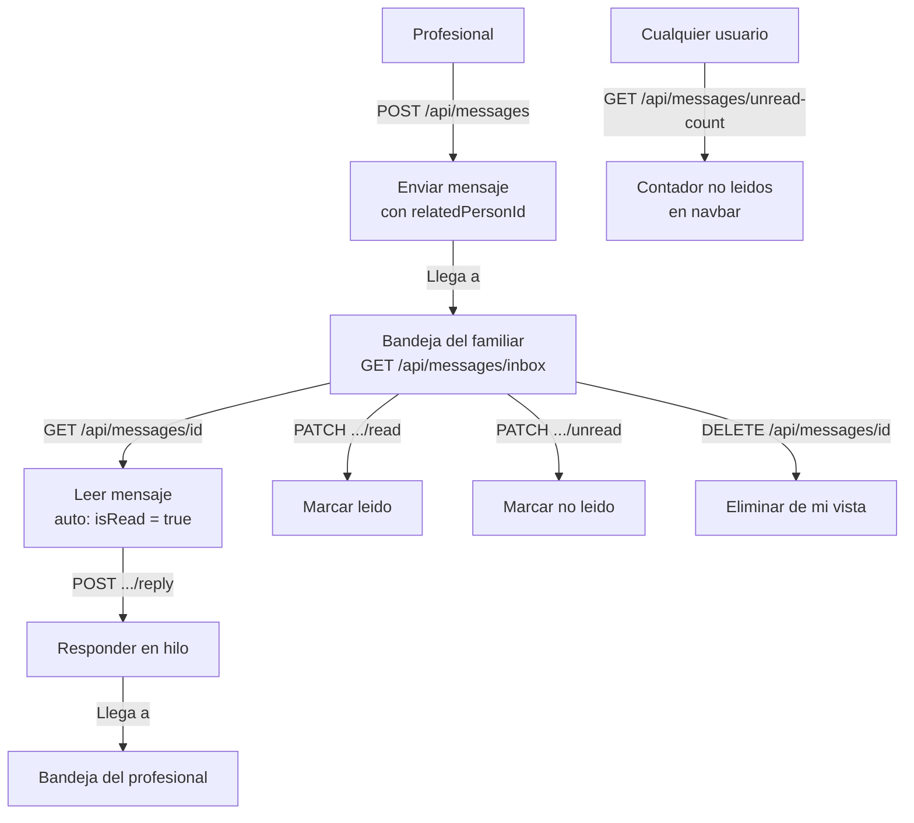

# Proceso 13 — Mensajería Interna

**Área:** Comunicación

## Descripción
Proceso de comunicación interna entre usuarios de la plataforma. Permite al profesional comunicarse con familiares y administradores a través de mensajes jerarquizados (hilos de conversación). Los mensajes pueden vincularse a una persona específica para contextualizar la comunicación.

## Participantes
- **Profesional** — Envía mensajes a familiares y admins; responde en hilos
- **Familiar** — Recibe mensajes del profesional; puede responder
- **Admin** — Consulta mensajes de su institución
- **Sistema** — Gestiona bandeja de entrada, contadores de no leídos

## Estructura de mensajes

```
Message (nivel superior)
  ├── senderId / receiverId
  ├── subject / content
  ├── relatedPersonId (opcional — contextualiza)
  ├── isRead: bool
  └── Replies[] (mensajes hijo, mismo modelo)
```

## Pasos del proceso

### 1. Redactar y Enviar Mensaje
El usuario envía un mensaje a otro usuario con asunto, contenido y opcionalmente la persona de contexto.
- **Endpoint:** `POST /api/messages`
- **Frontend:** `/pro/messages/new`, `/family/messages/new`
- **Campos:** receiverId, subject, content, relatedPersonId?

### 2. Consultar Bandeja de Entrada
Lista paginada de mensajes recibidos (solo mensajes de nivel superior, no respuestas).
- **Endpoint:** `GET /api/messages/inbox`
- **Filtros:** isRead, relatedPersonId, senderId
- **Paginado:** page, pageSize (max 50)

### 3. Consultar Mensajes Enviados
Lista paginada de mensajes enviados por el usuario autenticado.
- **Endpoint:** `GET /api/messages/sent`
- **Filtros:** isRead, relatedPersonId, receiverId

### 4. Leer Mensaje y Ver Hilo
El usuario abre un mensaje y ve el hilo completo de respuestas.
- **Endpoint:** `GET /api/messages/{messageId}`
- **Efecto:** marca el mensaje como leído automáticamente

### 5. Responder en Hilo
El usuario responde a un mensaje existente. La respuesta queda anidada bajo el mensaje original.
- **Endpoint:** `POST /api/messages/{messageId}/reply`

### 6. Marcar como Leído / No Leído
Operación explícita para gestionar el estado de lectura.
- **Marcar leído:** `PATCH /api/messages/{messageId}/read`
- **Marcar no leído:** `PATCH /api/messages/{messageId}/unread`

### 7. Contador de No Leídos
El sistema provee el conteo de mensajes no leídos para la campana de notificaciones.
- **Endpoint:** `GET /api/messages/unread-count`

### 8. Eliminar Mensaje (baja lógica)
El usuario puede eliminar un mensaje de su vista (baja lógica, el otro usuario aún lo ve).
- **Endpoint:** `DELETE /api/messages/{messageId}`

## Diagrama de flujo


