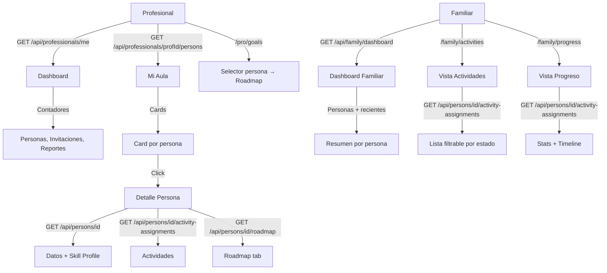

# Proceso 14 — Seguimiento de Avances

**Área:** Monitoreo y Reportes

## Descripción
Proceso de monitoreo del progreso de las personas con discapacidad por parte de profesionales y familiares. El profesional cuenta con dashboard, Mi Aula, detalle de persona y acceso al roadmap de objetivos. La familia tiene dashboard, vista de actividades y vista de progreso con estadísticas e historial.

## Participantes
- **Profesional** — Monitorea desde dashboard, Mi Aula y detalle de persona; gestiona roadmap desde `/pro/goals`
- **Familia** — Consulta progreso desde portal familiar: dashboard, actividades y progreso

## Pasos del proceso

### 1. Dashboard del Profesional
El profesional ve contadores reales: personas asignadas, invitaciones pendientes y aceptadas, reportes.
- **Endpoint:** `GET /api/professionals/me` + `GET /api/invitations`
- **Frontend:** `/pro/dashboard`

### 2. Mi Aula
Vista de cards con avatar coloreado de cada persona asignada. Permite acceso rápido al detalle.
- **Endpoint:** `GET /api/professionals/{profId}/persons`
- **Frontend:** `/pro/persons`

### 3. Detalle de Persona
Datos personales, tipo de discapacidad, nivel de autonomía, perfil de accesibilidad, método de login, perfil de habilidades, diagnósticos, actividades asignadas y roadmap.
- **Endpoints:** `GET /api/persons/{id}`, `GET /api/persons/{id}/skill-profile`, `GET /api/persons/{id}/activity-assignments`, `GET /api/persons/{id}/roadmap`
- **Frontend:** `/pro/persons/{id}` con tabs: Perfil · Actividades · Roadmap · Diagnósticos · Reportes

### 4. Objetivos / Roadmap del Profesional
El profesional accede al roadmap de cualquiera de sus personas asignadas desde una vista centralizada con selector de persona.
- **Endpoint:** `GET /api/persons/{id}/roadmap`
- **Frontend:** `/pro/goals` — selector de persona → `ProfessionalRoadmapTabComponent`

### 5. Radar Chart de Habilidades
Visualización gráfica del nivel por área de habilidad.
- **Estado:** Post-MVP

### 6. Dashboard Familiar
La familia ve: nombre de la persona, últimas actividades completadas, conteo de reportes aprobados y mensajes no leídos.
- **Endpoint:** `GET /api/family/dashboard`
- **Frontend:** `/family/dashboard`
- **Respuesta:** `FamilyDashboardResponse { persons[], unreadMessages }`; cada persona incluye `recentActivities[]`, `approvedReportsCount`, `latestReportTitle/Date`

### 7. Portal Familiar — Actividades
La familia consulta todas las actividades asignadas a una persona con filtros por estado (Pendiente / En progreso / Completada / Cancelada) y detalle de intentos.
- **Endpoint:** `GET /api/persons/{id}/activity-assignments`
- **Frontend:** `/family/activities` — selector de persona → lista filtrable con badges de estado, fechas y puntaje del último intento

### 8. Portal Familiar — Progreso
La familia ve estadísticas de progreso de una persona: completadas/total, score promedio, total de intentos, evaluaciones, y un historial de los últimos 15 intentos con fecha y resultado.
- **Endpoint:** `GET /api/persons/{id}/activity-assignments`
- **Frontend:** `/family/progress` — selector de persona → 4 stat cards + barra de progreso + timeline de intentos

## Diagrama de flujo

## Endpoints

| Método | Endpoint | Auth | Descripción |
|--------|----------|------|-------------|
| GET | `/api/professionals/me` | `professionals:read` | Perfil del profesional autenticado |
| GET | `/api/professionals/{id}/persons` | `assignments:read` | Personas asignadas al profesional |
| GET | `/api/persons/{id}` | `persons:read` | Detalle de persona |
| GET | `/api/persons/{id}/activity-assignments` | `activities:read` | Asignaciones con intentos |
| GET | `/api/persons/{id}/roadmap` | `roadmap:read` | Roadmap con áreas y actividades |
| GET | `/api/family/dashboard` | (familiar autenticado) | Dashboard con personas y actividades recientes |
