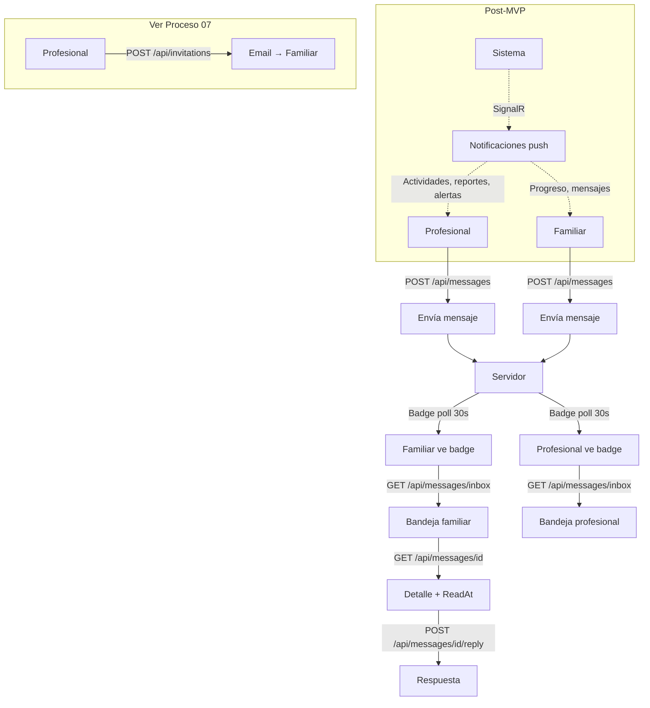

# Proceso 16 — Comunicación entre Actores

**Área:** Comunicación

## Descripción
Procesos de comunicación entre los distintos actores del sistema. Abarca la mensajería interna entre profesionales y familiares (implementada) y las notificaciones automáticas del sistema (Post-MVP). Las invitaciones por email están documentadas en el Proceso 07.

## Participantes
- **Profesional** — Envía y recibe mensajes desde `/pro/messages`
- **Familia** — Envía y recibe mensajes desde `/family/messages`
- **Sistema** — Genera badge de no leídos; notificaciones automáticas Post-MVP

## Canales de comunicación

### 1. Invitaciones por Email
Canal unidireccional para registro de familiares. Documentado en **Proceso 07 — Gestión de Invitaciones**.

### 2. Mensajería Interna ✅

Sistema de mensajes dentro de la plataforma entre profesional y familia.

**Endpoints implementados:**

| Método | Endpoint | Descripción |
|--------|----------|-------------|
| GET | `/api/messages/inbox` | Bandeja de entrada (paginada; filtros: `isRead`, `relatedPersonId`, `senderId`) |
| GET | `/api/messages/sent` | Mensajes enviados (paginada; filtros: `isRead`, `relatedPersonId`, `receiverId`) |
| GET | `/api/messages/{id}` | Detalle + replies; marca `ReadAt` automáticamente al abrir |
| POST | `/api/messages` | Enviar mensaje: `{ receiverId, subject, body, relatedPersonId? }` |
| POST | `/api/messages/{id}/reply` | Responder a un hilo: `{ body }` |
| PUT | `/api/messages/{id}/read` | Marcar como leído manualmente |
| GET | `/api/messages/contacts` | Lista de contactos disponibles (profesionales y familiares) |
| GET | `/api/messages/unread-count` | Conteo de no leídos para badge en sidebar |

**Frontend implementado:**
- `/messages` — Componente compartido (`MessagesComponent`) usado en ambos portales (pro y familia)
- Bandeja de entrada con indicador read/unread, preview de contenido, sender/receiver
- Vista de detalle con hilo de respuestas
- Composer para nuevo mensaje y respuesta (selector de destinatario desde `/api/messages/contacts`)
- `UnreadBadgeComponent` en sidebar — poll `GET /api/messages/unread-count` cada 30 s

### 3. Notificaciones Automáticas
Alertas del sistema ante eventos relevantes. **Estado: Post-MVP.**

Eventos previstos:
- Nueva actividad asignada
- Actividad completada por la persona
- Nuevo reporte disponible
- Mensaje recibido
- Alerta de frustración (Motor Adaptativo)

Se prevé integración con SignalR (`@microsoft/signalr` ya instalado).

## Diagrama de flujo

