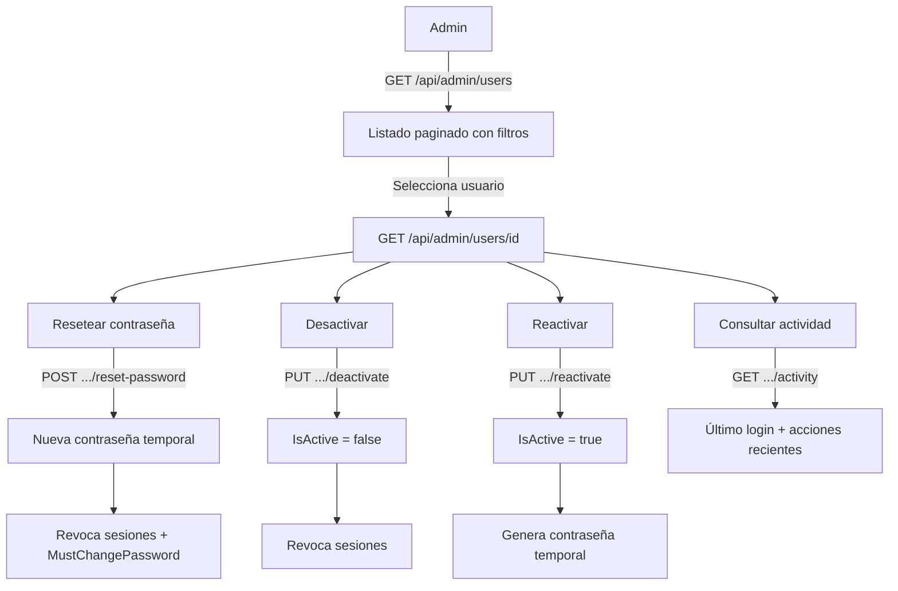

# Proceso 17 — Gestión de Usuarios

**Área:** Administración de Cuentas

## Descripción
Proceso centralizado de administración de cuentas de usuario del sistema. Cubre las operaciones transversales que el administrador realiza sobre cualquier cuenta (profesional, familiar, persona): listar usuarios, resetear contraseñas, desactivar, reactivar y consultar actividad. Este proceso complementa los procesos de dominio (04, 05, 06) con una capa de gestión de cuentas.

## Participantes
- **Admin Global** — Gestión completa de todas las cuentas del sistema
- **Admin Institucional** — Gestión de cuentas dentro de sus instituciones asignadas

## Pasos del proceso

### 1. Listar Usuarios
El admin consulta el listado centralizado de usuarios con filtros por rol, estado, institución y búsqueda por nombre/email.
- **Endpoint:** `GET /api/admin/users` (paginado)
- **Filtros:** role, isActive, institutionId, search (nombre/email)
- **Frontend:** `/admin/users` (DataTable)
- **Respuesta:** userId, email, fullName, role, isActive, lastLogin, createdAt, mustChangePassword

### 2. Ver Detalle de Usuario
El admin consulta el detalle de una cuenta con su información de actividad y estado.
- **Endpoint:** `GET /api/admin/users/{id}`
- **Frontend:** `/admin/users/{id}` (detalle)
- **Información:** Datos del usuario, rol, entidad asociada (profesional/familiar/persona), último login, fecha de creación, estado activo/inactivo, si tiene contraseña temporal pendiente

### 3. Resetear Contraseña
El admin genera una nueva contraseña temporal para un usuario. Se activa el flag `MustChangePassword` y se revocan todas las sesiones activas.
- **Endpoint:** `POST /api/admin/users/{id}/reset-password`
- **Transacción:** Genera nueva contraseña temporal + `MustChangePassword = true` + revoca RefreshTokens activos
- **Frontend:** Botón "Resetear contraseña" en detalle de usuario → modal de confirmación → muestra contraseña temporal con botón copiar
- **Auditoría:** Se registra en AccessAudit quién reseteó y cuándo

### 4. Desactivar Usuario
El admin desactiva la cuenta de un usuario. Se revoca el acceso inmediatamente.
- **Endpoint:** `PUT /api/admin/users/{id}/deactivate`
- **Transacción:** `IsActive = false` + revoca todos los RefreshTokens + desactiva entidad asociada
- **Validación:** No se puede desactivar a uno mismo
- **Frontend:** Botón "Desactivar" con modal de confirmación y motivo opcional

### 5. Reactivar Usuario
El admin reactiva una cuenta previamente desactivada. Se genera nueva contraseña temporal.
- **Endpoint:** `PUT /api/admin/users/{id}/reactivate`
- **Transacción:** `IsActive = true` + genera contraseña temporal + `MustChangePassword = true` + reactiva entidad asociada
- **Frontend:** Botón "Reactivar" visible solo en usuarios inactivos → muestra contraseña temporal

### 6. Consultar Actividad
El admin puede ver un resumen de actividad reciente del usuario: último login, cantidad de accesos, acciones recientes.
- **Endpoint:** `GET /api/admin/users/{id}/activity`
- **Respuesta:** lastLogin, loginCount, recentActions (últimas 10 del AccessAudit)
- **Frontend:** Sección "Actividad" en detalle de usuario

## Reglas de negocio
- El admin institucional solo ve y gestiona usuarios de sus instituciones asignadas
- No se puede desactivar al propio usuario
- El reset de contraseña siempre revoca sesiones existentes
- La reactivación siempre genera contraseña temporal nueva
- Todas las operaciones se auditan en AccessAudit

## Diagrama de flujo

