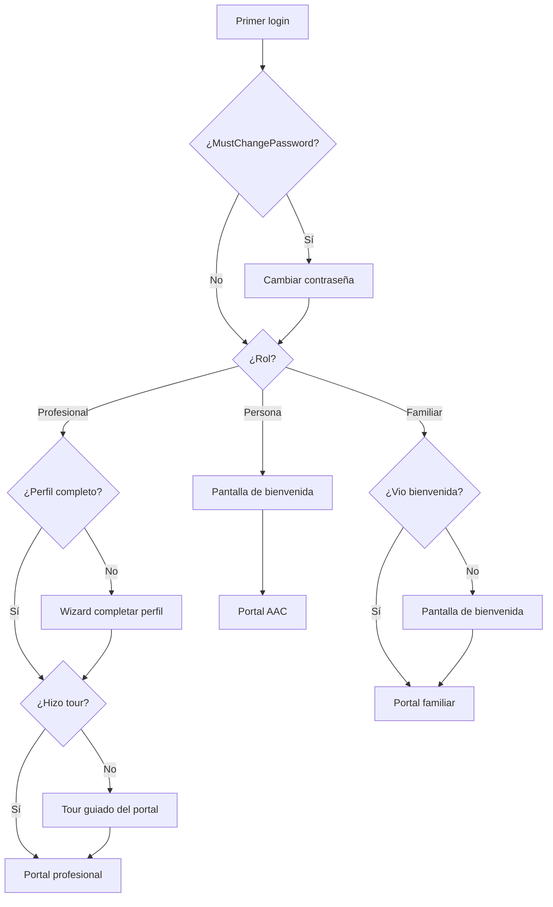

# Proceso 18 — Onboarding de Usuarios

**Área:** Experiencia de Usuario

## Descripción
Proceso de incorporación de un usuario nuevo al sistema. Cubre el flujo desde el primer login con contraseña temporal hasta que el usuario queda operativo en su portal correspondiente. Cada rol tiene un onboarding adaptado a sus necesidades: el profesional completa su perfil y conoce sus herramientas; el familiar confirma sus datos y accede al portal de seguimiento; la persona con discapacidad tiene una configuración asistida de accesibilidad y método de login.

## Participantes
- **Profesional** — Completa perfil profesional y recorre las secciones de su portal
- **Familiar** — Confirma datos y conoce el portal de familia
- **Persona con Discapacidad** — Configuración asistida de accesibilidad (guiado por profesional)
- **Admin** — No tiene onboarding (accede directamente)

## Pasos del proceso

### 1. Primer Login y Cambio de Contraseña
Todos los usuarios creados por admin reciben contraseña temporal (`MustChangePassword = true`). En el primer login, el sistema los redirige obligatoriamente a cambiar la contraseña antes de acceder a cualquier sección.
- **Endpoint:** `PUT /api/auth/change-password` (ya implementado)
- **Frontend:** `/change-password` (ya implementado)
- **Validación:** Mínimo 8 caracteres, 1 mayúscula, 1 número
- **Post-cambio:** `MustChangePassword = false`, se genera nuevo JWT

### 2. Completar Perfil (Profesional)
Tras cambiar la contraseña, si el profesional tiene campos de perfil incompletos, se muestra un wizard de completado.
- **Endpoint:** `PUT /api/professionals/me/profile`
- **Campos:** Especialidad, teléfono, matrícula profesional, foto (opcional)
- **Frontend:** `/pro/onboarding/profile` (wizard de 2 pasos)
- **Condición:** Se muestra solo si el perfil tiene campos obligatorios vacíos (`isProfileComplete = false`)

### 3. Tour del Portal (Profesional)
Al completar el perfil, el profesional ve un tour guiado de las secciones principales: Mi Aula, Personas, Actividades, Comunicación.
- **Frontend:** Componente `OnboardingTourComponent` con tooltips sobre la navegación
- **Persistencia:** `PUT /api/professionals/me/onboarding-complete`
- **Flag:** `hasCompletedOnboarding` en el perfil del profesional
- **Comportamiento:** Se muestra una sola vez; el profesional puede volver a verlo desde configuración

### 4. Confirmación de Datos (Familiar)
El familiar que se registró por invitación ya completó sus datos en el registro. En su primer login post-registro, se le muestra una pantalla de bienvenida con resumen de sus datos y la persona vinculada.
- **Frontend:** `/family/onboarding/welcome`
- **Contenido:** Nombre del familiar, persona vinculada, qué puede hacer en el portal (ver progreso, recibir reportes, comunicarse con el profesional)
- **Flag:** `hasCompletedOnboarding` en el perfil del familiar

### 5. Configuración de Accesibilidad (Persona con Discapacidad)
El profesional configura la accesibilidad y el método de login de la persona durante el alta (Proceso 05). No hay un onboarding autónomo de la persona — el primer acceso es asistido.
- **Proceso previo:** El profesional configuró método de login y perfil de accesibilidad (Proceso 05)
- **Primer acceso:** El profesional supervisa el primer login de la persona para verificar que el método funciona
- **Frontend persona:** Al entrar por primera vez, se muestra una pantalla de bienvenida simple con avatar y nombre

## Flujo por rol

### Profesional
```
Login → Cambiar contraseña → Completar perfil → Tour del portal → Portal profesional
```

### Familiar
```
Registro por invitación → Login → Pantalla de bienvenida → Portal familiar
```

### Persona con Discapacidad
```
(Profesional configura acceso) → Primer login asistido → Pantalla de bienvenida → Portal AAC
```

## Condiciones de completado
- **Profesional:** `mustChangePassword = false` AND `isProfileComplete = true` AND `hasCompletedOnboarding = true`
- **Familiar:** `hasCompletedOnboarding = true`
- **Persona:** Primer login exitoso registrado

## Diagrama de flujo


