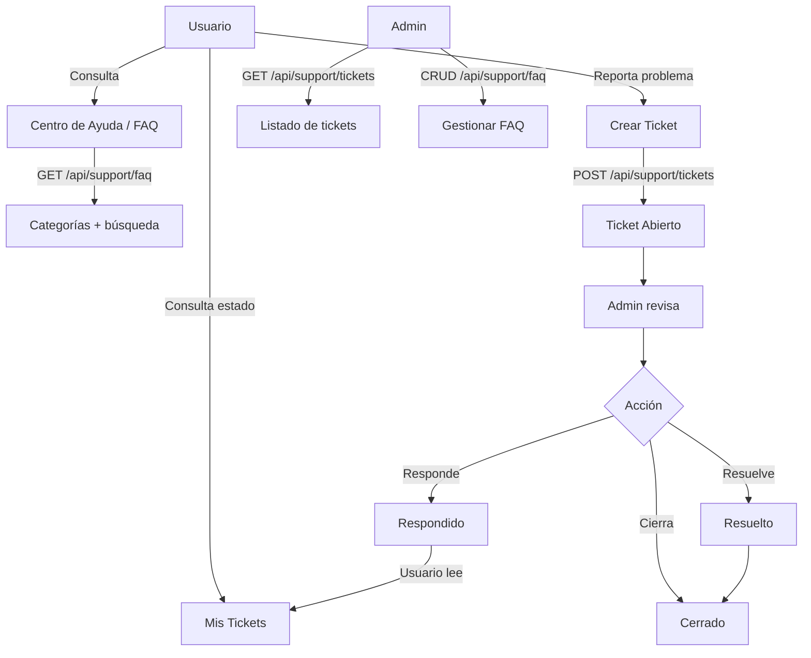

# Proceso 19 — Soporte y Ayuda

**Área:** Experiencia de Usuario

## Descripción
Proceso de soporte y asistencia para los usuarios de la plataforma. Incluye un centro de ayuda con preguntas frecuentes, guías contextuales dentro de la aplicación, y un canal de contacto para reportar problemas o solicitar asistencia. El objetivo es que los usuarios (especialmente profesionales y familiares) puedan resolver dudas sin depender del administrador.

## Participantes
- **Profesional** — Consulta ayuda, reporta problemas
- **Familiar** — Consulta ayuda, reporta problemas
- **Admin** — Gestiona el contenido de ayuda y atiende solicitudes de soporte

## Pasos del proceso

### 1. Centro de Ayuda (FAQ)
Sección de preguntas frecuentes organizadas por categoría. El contenido es gestionado por el admin y visible para todos los roles.
- **Endpoint:** `GET /api/support/faq` (público para usuarios autenticados)
- **Filtros:** category, search
- **Endpoint admin:** `POST /api/support/faq`, `PUT /api/support/faq/{id}`, `PUT /api/support/faq/{id}/deactivate`
- **Frontend usuario:** `/help` (accesible desde el menú de navegación de todos los portales)
- **Frontend admin:** `/admin/support/faq` (ABM de preguntas frecuentes)
- **Categorías:** Cuenta y acceso, Actividades, Reportes, Comunicación, Accesibilidad, General

### 2. Guías Contextuales
Tooltips y ayudas inline dentro de la aplicación que explican funcionalidades específicas en el momento que el usuario las necesita.
- **Implementación:** Componente `HelpTooltipComponent` reutilizable
- **Contenido:** Textos cortos asociados a secciones específicas del portal
- **Persistencia:** El usuario puede marcar "No volver a mostrar" por tooltip
- **No requiere endpoint:** El contenido es estático en el frontend

### 3. Reportar Problema
El usuario puede reportar un problema técnico o funcional desde cualquier sección del portal. El reporte incluye contexto automático (sección actual, rol, navegador).
- **Endpoint:** `POST /api/support/tickets`
- **Campos:** subject, description, category (Bug, Consulta, Sugerencia), priority (Baja, Media, Alta)
- **Contexto automático:** userId, role, currentUrl, userAgent, timestamp
- **Frontend:** Botón flotante "Reportar problema" → modal con formulario
- **Notificación:** El admin recibe el ticket y puede responder

### 4. Gestión de Tickets (Admin)
El admin ve el listado de tickets reportados, puede asignar estado y responder.
- **Endpoint listado:** `GET /api/support/tickets` (paginado, filtros: status, category, priority)
- **Endpoint detalle:** `GET /api/support/tickets/{id}`
- **Endpoint responder:** `POST /api/support/tickets/{id}/respond`
- **Endpoint estado:** `PUT /api/support/tickets/{id}/status`
- **Frontend:** `/admin/support/tickets` (DataTable + detalle con historial)

### 5. Mis Tickets (Usuario)
El usuario puede consultar el estado de sus tickets y ver las respuestas del admin.
- **Endpoint:** `GET /api/support/tickets/mine` (paginado)
- **Frontend:** `/help/tickets` (lista con estado y respuestas)

### Estados de ticket
- **Abierto** — Recién creado, pendiente de revisión
- **En Revisión** — Admin lo está analizando
- **Respondido** — Admin envió respuesta
- **Resuelto** — Problema solucionado
- **Cerrado** — Sin acción adicional

## Reglas de negocio
- Cualquier usuario autenticado puede crear tickets y consultar FAQ
- Solo el admin puede gestionar contenido de FAQ y responder tickets
- El admin institucional ve solo tickets de usuarios de sus instituciones
- Los tickets se cierran automáticamente después de 30 días sin actividad
- El contexto automático del ticket ayuda al admin a reproducir el problema

## Diagrama de flujo

