# Catálogo de Procesos Principales — InclusiON (Formato Confluence)

> **Instrucciones para Confluence:** Copia y pega directamente cada bloque en Confluence utilizando la macro **Mermaid** o el bloque de código Markdown. Todos los diagramas representan el **flujo del proceso principal** (camino exitoso y decisiones clave), con conexiones rectas y en lenguaje claro para clientes, directivos y evaluadores.

---

## Proceso 1 : Gestión de Administradores Institucionales

**Descripción:** Circuito para el alta, asignación de permisos y habilitación del Administrador Institucional (Equipo Directivo) encargado de coordinar docentes, alumnos y familias en la escuela.

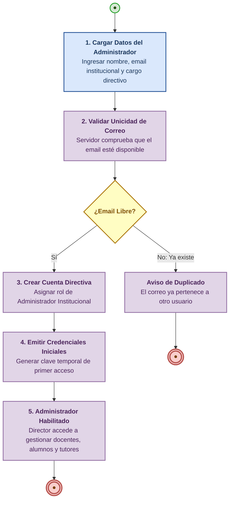

---

## Proceso 2 : Autenticación y Acceso Adaptativo Multi-Método

**Descripción:** Acceso seguro adaptado a la diversidad funcional del usuario (docente por credenciales, estudiante PCD por PIN táctil de 4 dígitos o validación asistida).

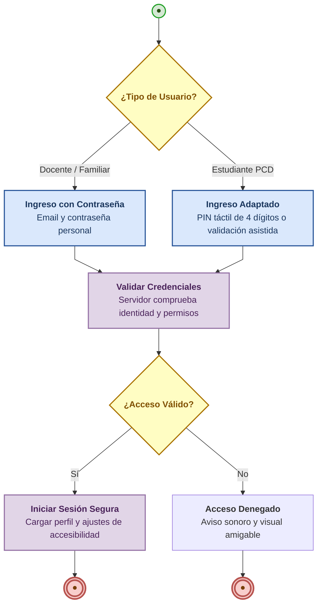

---

## Proceso 2b : Gestión de Roles y Permisos Institucionales

**Descripción:** Asignación y control de permisos por sede para garantizar que cada profesional y directivo acceda únicamente a sus alumnos correspondientes.

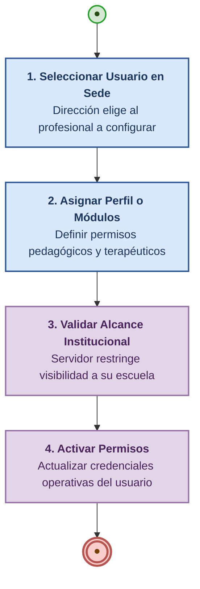

---

## Proceso 3 : Gestión de Catálogos del Sistema

**Descripción:** Circuito para consultar y enriquecer los catálogos maestros de apoyo (tipos de discapacidad, áreas de habilidad y adaptaciones).

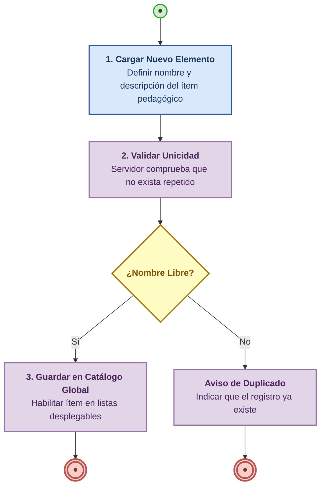

---

## Proceso 4 : Gestión de Personas con Discapacidad (Estudiantes)

**Descripción:** Alta pedagógica del estudiante, asignación del nivel de autonomía, selección del método de login adaptado e inicialización de su ruta de aprendizaje.

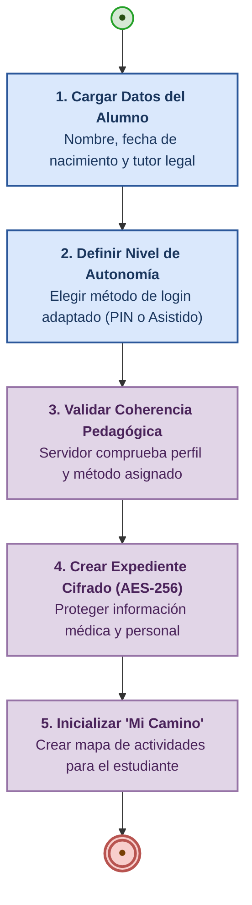

---

## Proceso 5 : Gestión de Profesionales (Aprovisionamiento Institucional)

**Descripción:** Incorporación del equipo docente y terapéutico. La creación es centralizada por la Dirección (sin auto-registro público), verificando matrícula y emitiendo credenciales institucionales.

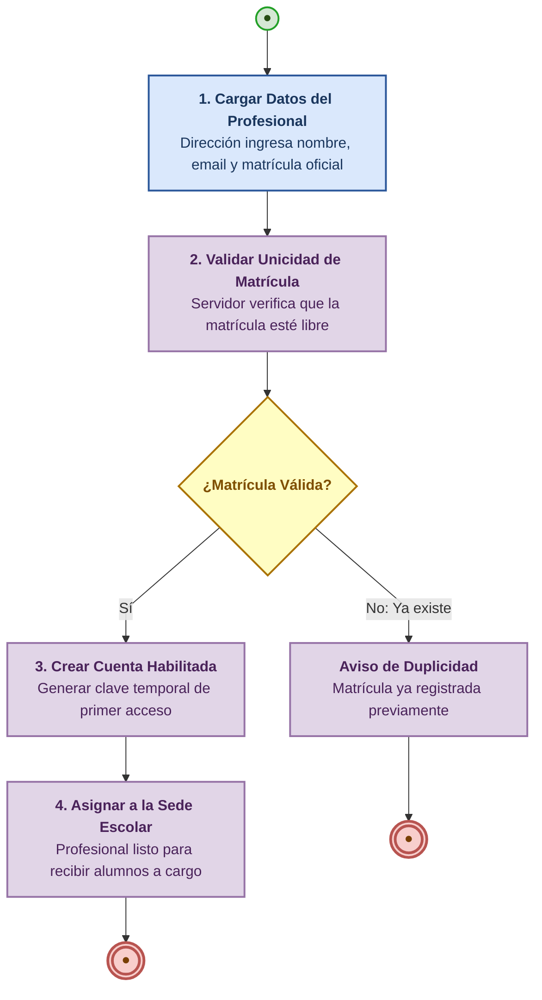

---

## Proceso 6 : Gestión de Familiares y Tutores Legales

**Descripción:** Vinculación oficial de los tutores legales al expediente escolar del alumno para darles acceso exclusivo al seguimiento pedagógico.

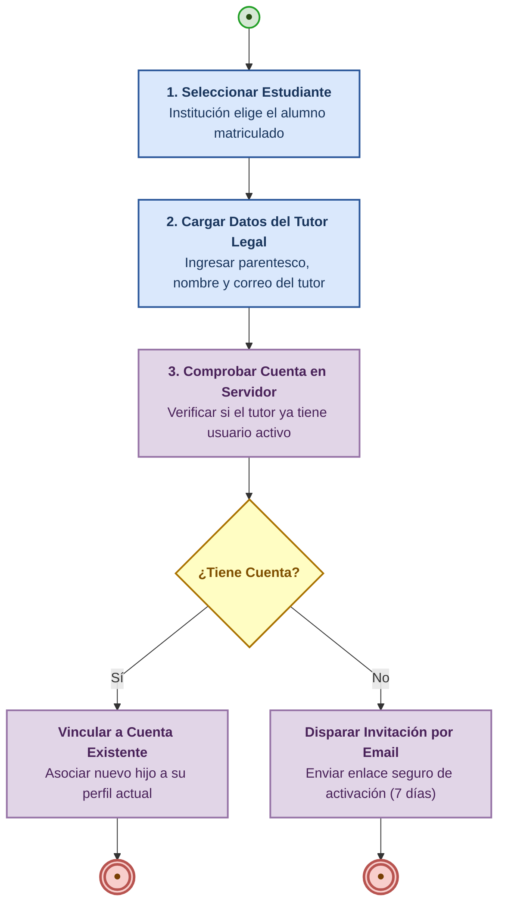

---

## Proceso 7 : Gestión de Invitaciones por Correo Electrónico

**Descripción:** Activación digital autónoma del familiar a través de un enlace seguro con vigencia de 7 días naturales.

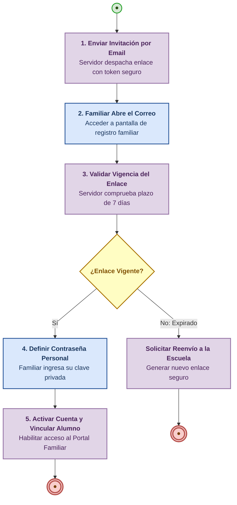

---

## Proceso 8 : Asignación Multidisciplinaria de Profesionales a Estudiantes

**Descripción:** Conformación del equipo de apoyo terapéutico y pedagógico para cada alumno dentro de la misma institución.

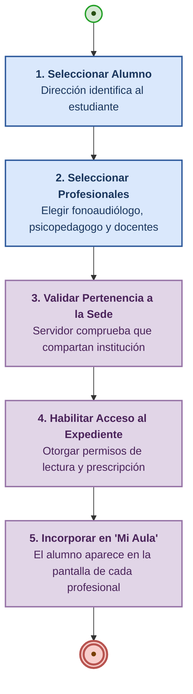

---

## Proceso 9 : Gestión y Curación de Actividades del Catálogo (ARASAAC)

**Descripción:** Creación y curación de actividades lúdicas con integración libre y directa del banco internacional de pictogramas ARASAAC.

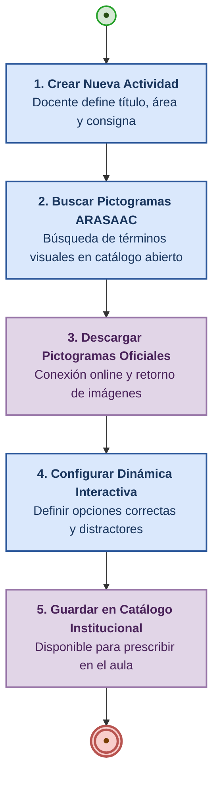

---

## Proceso 9b : Evaluación Diagnóstica Inicial y Perfil Funcional

**Descripción:** Evaluación integral de capacidades iniciales y cálculo automatizado del perfil de actividades recomendadas.

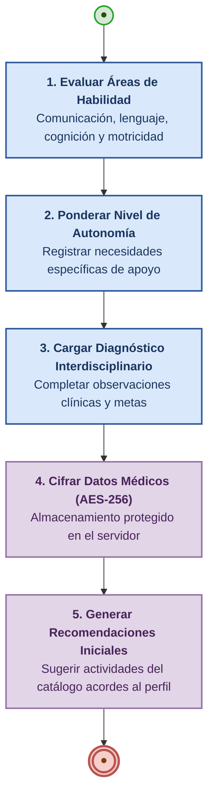

---

## Proceso 10 : PROCESO CORE — Ejecución de Actividades Terapéuticas

**Descripción:** Flujo central del producto. El docente prescribe la actividad, el alumno la resuelve en su tablet adaptada, el sistema evalúa el desempeño (**aprobación $\ge 60\%$**) y desbloquea el siguiente nivel con medalla para celebrar en familia.

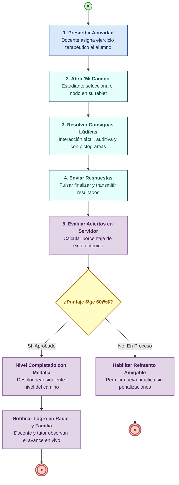

---

## Proceso 11 : Roadmap y Motor de Dificultad Adaptativa (MDA)

**Descripción:** Calibración automática de dificultad. Si el estudiante se traba y acumula **4 fallos consecutivos**, la actividad se pausa de forma preventiva y se envía una alerta sonora y visual inmediata a la pantalla del docente.

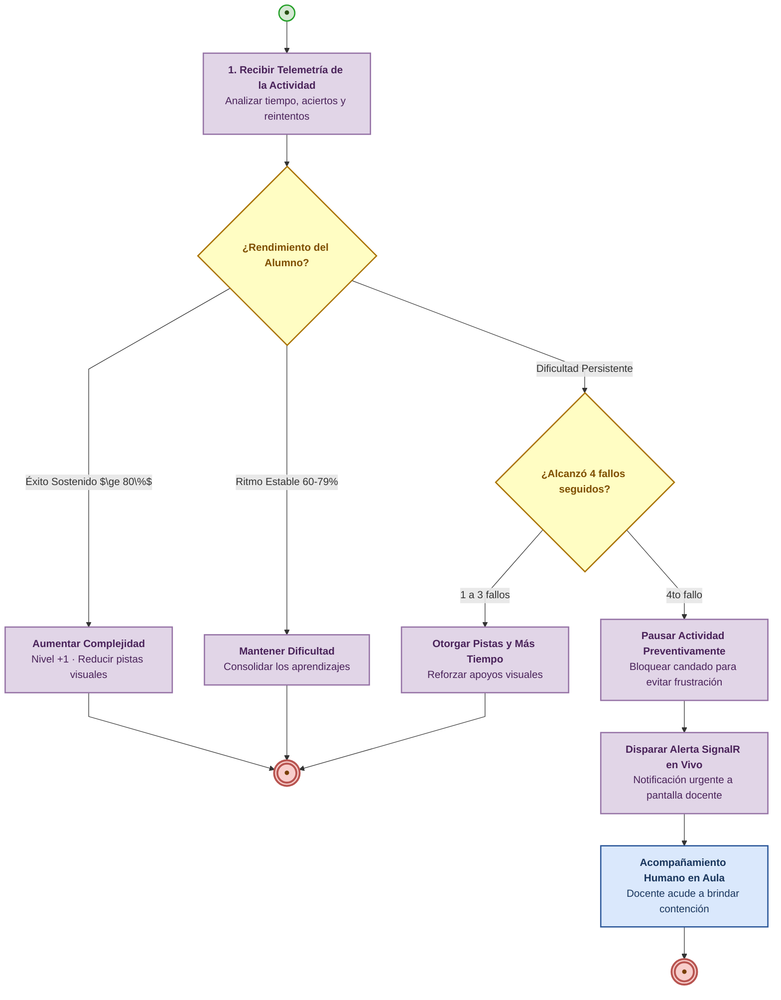

---

## Proceso 12 / 15 : Generación y Aprobación Formal de Informes de Evolución

**Descripción:** Circuito documental para redactar, auditar y emitir informes pedagógicos oficiales en formato PDF con firma y sello institucional.

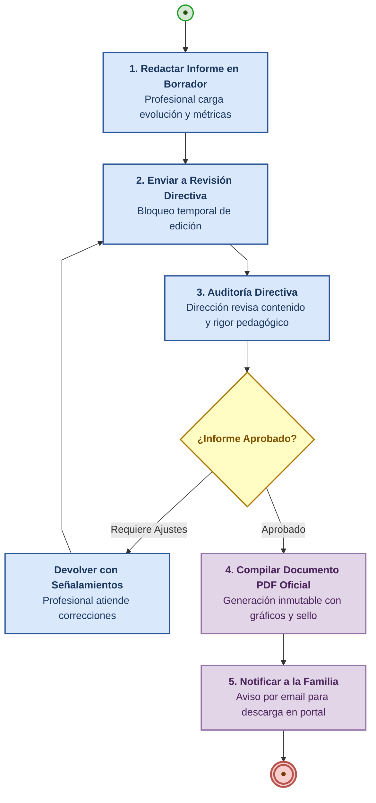

---

## Proceso 13 / 16 : Comunicación y Mensajería Segura Escuela-Familia

**Descripción:** Cuaderno de comunicaciones digital con cifrado de mensajes, registro cronológico en el legajo y acuse de lectura automático.

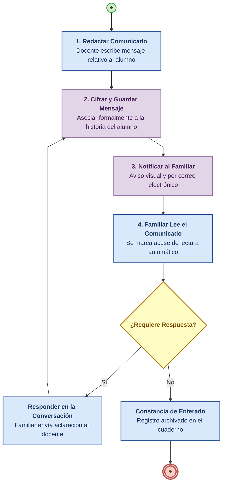

---

## Proceso 14 : Seguimiento de Avances y Monitoreo en Tiempo Real ("Mi Aula")

**Descripción:** Supervisión en directo de las tablets de los alumnos desde la pantalla del docente, con semáforos de progreso y alarmas ante dificultades.

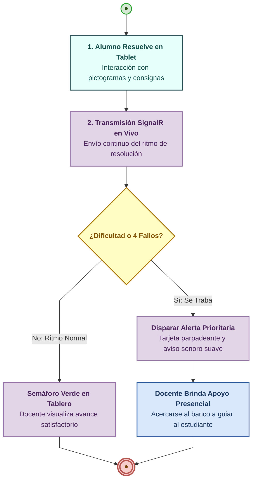

---

## Proceso 17 : Gestión Centralizada de Usuarios y Sesiones

**Descripción:** Administración de cuentas institucionales, reseteo de claves y desconexión obligatoria de sesiones ante eventualidades de seguridad.

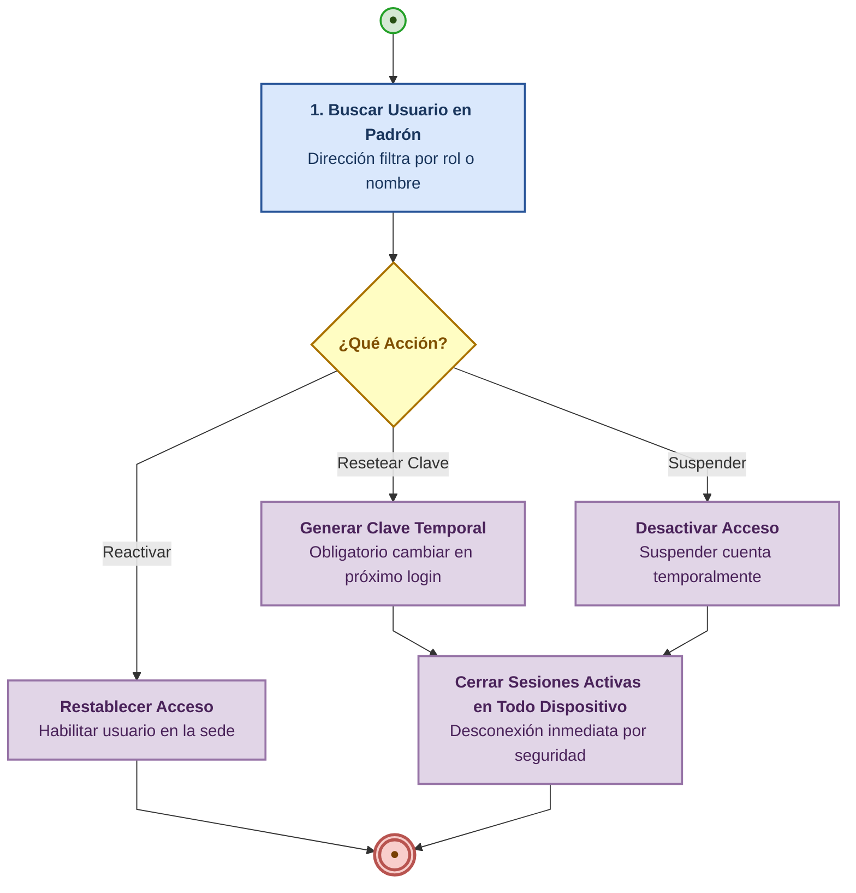

---

## Proceso 18 : Onboarding de Nuevos Usuarios

**Descripción:** Primer acceso a la plataforma, cambio de clave provisional obligatoria y visita guiada adaptada según el rol institucional.

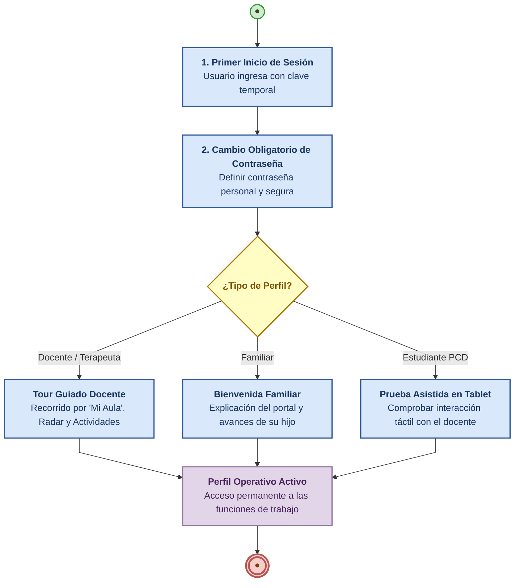

---

## Proceso 19 : Centro de Ayuda, FAQ y Tickets de Soporte

**Descripción:** Mesa de ayuda y resolución de dudas con autoservicio en preguntas frecuentes o creación de tickets con captura automática de contexto.

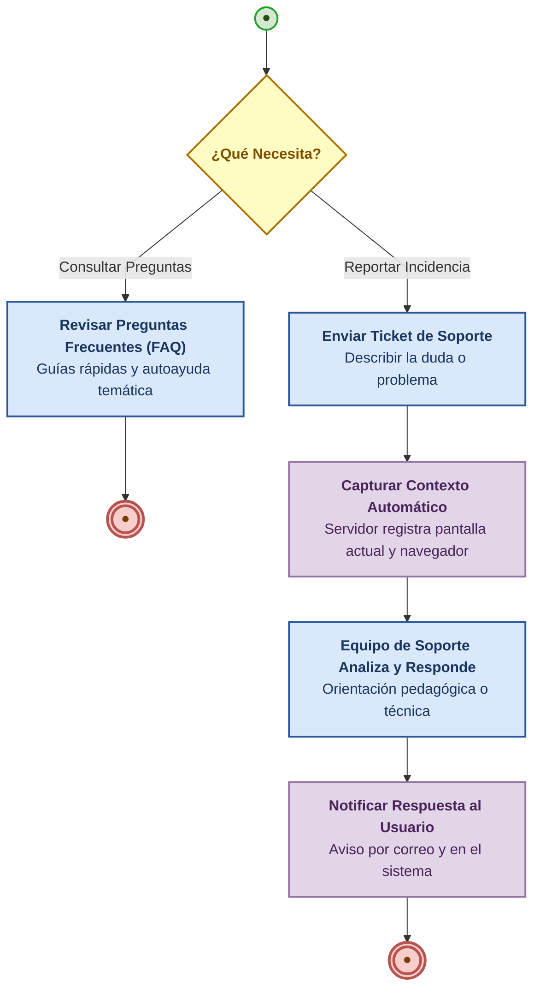
