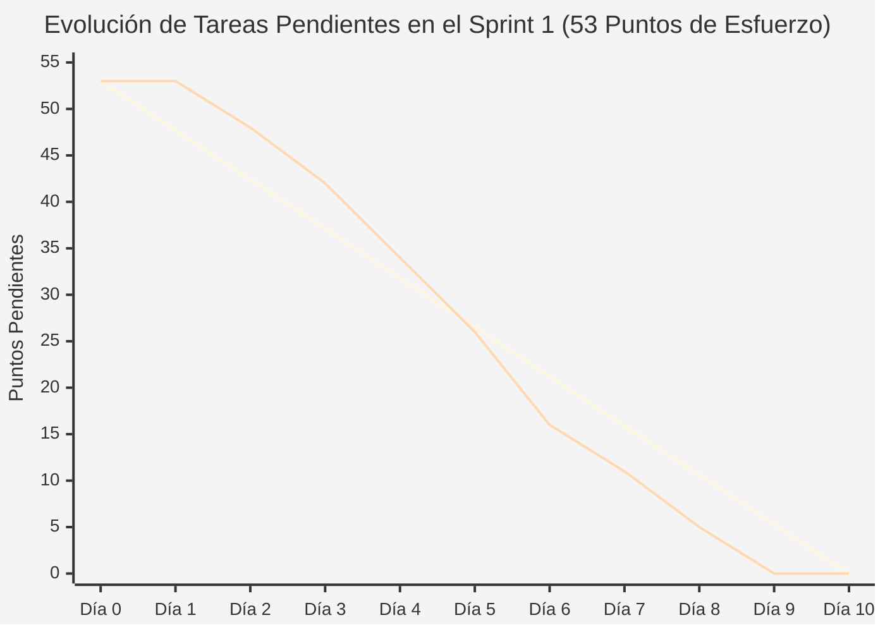

# Documentación de Gestión y Avance — Sprint 1 (Proyecto InclusiON)

**Nombre del Sprint:** Puesta en Marcha Institucional, Seguridad Escolar y Catálogos Educativos  
**Período de Trabajo:** 11 de marzo de 2025 al 24 de marzo de 2025 (2 semanas / 10 días hábiles)  
**Marco de Trabajo:** Práctica Profesionalizante II / Gestión y Administración de Proyectos  
**Objetivo de Negocio:** Poner en funcionamiento los cimientos del sistema para que una escuela especial pueda registrarse oficialmente, administrar las cuentas de su personal con total seguridad y unificar los criterios pedagógicos con los que trabajarán los docentes.  

---

### Módulos Escolares Implementados en este Sprint:
* **ABM 01 — Perfil y Datos Oficiales de la Escuela:** Carga y actualización de la sede escolar con su denominación oficial, domicilio, teléfonos y membrete oficial listo para emitir constancias e informes válidos ante obras sociales e inspecciones.
* **ABM 02 — Cuentas del Personal y Seguridad:** Panel para que la Dirección escolar cree accesos para sus docentes, blanquee contraseñas olvidadas y dé de baja de inmediato a quien ya no trabaje en el establecimiento, cortando su ingreso en tiempo real.
* **ABM 03 — Catálogos Estandarizados del Sistema:** Menús estandarizados con las materias oficiales, tipos de discapacidad (según la OMS y la CIF) y formatos de ejercicios, evitando que cada docente invente nombres distintos y logrando que todos los boletines salgan ordenados.

---

### Actores del Colegio que Participan en InclusiON:
1. **Administrador de la Institución (Director / Coordinador):** Es la máxima autoridad escolar. Cuida la legalidad del establecimiento, gestiona los accesos del personal docente y aprueba los informes oficiales antes de que salgan a las familias.
2. **Profesional (Docente / Terapeuta):** Quien trabaja en el día a día en el aula o consultorio. Arma los ejercicios, evalúa el progreso del estudiante y mantiene el contacto pedagógico.
3. **Persona con Discapacidad (Alumno):** El protagonista del aprendizaje. Interactúa con ejercicios visuales adaptados a sus necesidades sensoriales y motrices (usando pictogramas claros, sonido y accesos simplificados por PIN o ayuda docente).
4. **Representante Familiar (Padres / Tutores):** Acompañan desde casa, reciben las comunicaciones oficiales, leen los informes aprobados por la dirección y siguen los avances de su hijo.

*(Nota de alcance: El sistema está diseñado para que cada escuela funcione de manera 100% autónoma bajo el control directo de su equipo directivo, sin depender de intermediarios externos para sus operaciones del día a día).*

---

### Equipo de Trabajo:
* **Facilitador de Proyecto (Scrum Master):** Mariano Decalli
* **Referentes de Educación Especial (Product Owners):** Candelaria Ferreyra y Catalina Vettorazzi
* **Equipo de Análisis y Construcción:**
  * **Sacha Del Barrio:** Analista Funcional, Relevamiento Escolar, Calidad y Accesibilidad
  * **Mirko Ivo Wlk:** Responsable de Base de Datos, Lógica del Sistema y Seguridad
  * **Germán Cochis:** Responsable de Diseño Visual, Pantallas y Experiencia de Usuario
  * **Fernando Aparicio:** Soporte de Programación y Pruebas de Funcionamiento
* **Docentes Evaluadores:** Prof. González y Prof. Ferrando

---

## 1. Acta de Planificación del Sprint (Sprint Planning)

* **Fecha de Reunión:** 11 de marzo de 2025 (09:00 a 12:00 hs)
* **Modalidad:** Encuentro virtual de planificación de trabajo
* **Participantes:** Mariano Decalli, Sacha Del Barrio, Mirko Wlk, Germán Cochis, Fernando Aparicio, Candelaria Ferreyra y Catalina Vettorazzi.

### 1.1. Diagnóstico de la Escuela: ¿Qué problemas reales vinimos a resolver?
A partir del trabajo de campo presencial realizado por Sacha Del Barrio en escuelas de educación especial, se identificaron tres dolores cotidianos urgentes:
1. **El problema de las constancias sin membrete:** Cada vez que la escuela emite una nota o informe para presentar en una obra social o ministerio, los docentes tienen que copiar a mano encabezados, datos institucionales y teléfonos en hojas de Word desactualizadas, arriesgándose a rechazos formales.
2. **La rotación docente y las claves perdidas:** En las escuelas el personal rota con frecuencia y es común que se olviden las contraseñas. Sin una herramienta ágil, la dirección no tiene control de quién entra al sistema ni puede cerrar un acceso rápidamente cuando un profesional se desvincula. Esto es crítico: la Ley de Protección de Datos Personales (Ley 25.326) exige resguardar con máxima reserva la historia médica y familiar de los menores.
3. **El desorden en los legajos:** Cuando no hay un vocabulario común, un docente escribe "trastorno del desarrollo", otro "TEA" y otro inventa nombres para las materias. Esto provoca que los informes a fin de año sean incomparables y confusos para los padres.

### 1.2. Meta del Sprint (Sprint Goal)
> *"Poner en marcha la base operativa y segura de la escuela en InclusiON: permitir que la dirección configure los datos oficiales de su sede con membrete institucional, gestione las cuentas del personal con bloqueo inmediato de accesos cuando alguien se va, y consulte las materias y diagnósticos en los 6 catálogos oficiales para garantizar un trabajo escolar ordenado y confidencial."*

### 1.3. ¿Cuándo consideramos que una tarea está lista para empezar? (Definition of Ready - DoR)
Cada requerimiento escolar debió cumplir con estas condiciones antes de iniciarse:
* Estar redactado desde la necesidad de la escuela (*"Como director necesito..."* o *"Como docente quiero..."*).
* Tener claras las reglas de cuidado (por ejemplo: *"si un docente se va de la escuela, su acceso debe cerrarse al instante, pero sus informes pasados deben conservarse intactos"*).
* Haber sido validado por el Analista Funcional (Sacha) con el equipo pedagógico.
* Contar con una estimación de esfuerzo acordada por todo el equipo.

---

### 1.4. Lista de Tareas Comprometidas (Sprint Backlog)
El equipo estimó el esfuerzo de cada tarea mediante puntos de esfuerzo (Story Points), sumando un total de **53 Puntos** para las 2 semanas:

| Código | Requerimiento Escolar | Módulo | Prioridad | Esfuerzo | Responsables | ¿Qué beneficio concreto le da a la escuela? |
|:---:|---|:---:|:---:|:---:|---|---|
| **IN-21** | Registrar la sede escolar y datos institucionales de contacto | ABM 01 | Alta | 5 SP | Sacha Del Barrio (Funcional) / Mirko Wlk / Germán Cochis | La escuela queda registrada formalmente con sus datos de contacto y membrete oficial. |
| **IN-22** | Consultar la ficha y datos de contacto de la escuela | ABM 01 | Alta | 3 SP | Germán Cochis / Sacha Del Barrio | Permite revisar en una sola pantalla los teléfonos, sede y autoridades del colegio. |
| **IN-23** | Actualizar domicilio, teléfonos y membrete oficial | ABM 01 | Media | 3 SP | Sacha Del Barrio / Germán Cochis | Garantiza que cualquier constancia o informe salga siempre con los datos actualizados. |
| **IN-24** | Consultar los 4 perfiles del colegio (Director, Docente, Familia, Alumno) | ABM 02 | Alta | 3 SP | Mirko Wlk / Sacha Del Barrio | Deja en claro qué rol cumple cada persona y qué puede hacer dentro de la plataforma. |
| **IN-25** | Configurar los permisos de cada perfil institucional | ABM 02 | Alta | 5 SP | Germán Cochis / Mirko Wlk / Sacha Del Barrio | La dirección define con precisión qué pantallas ve cada miembro del equipo escolar. |
| **IN-26** | Crear la cuenta de la Dirección con contraseña provisoria | ABM 02 | Crítica | 5 SP | Sacha Del Barrio / Mirko Wlk | El director recibe su acceso seguro y el sistema lo obliga a poner una clave propia. |
| **IN-27** | Asignar la escuela correspondiente a cada directivo | ABM 02 | Alta | 3 SP | Fernando Aparicio / Sacha Del Barrio | Vincula formalmente a la autoridad escolar con su establecimiento. |
| **IN-28** | Separación estricta de información por colegio | ABM 01 / 02 | Crítica | 5 SP | Mirko Wlk / Sacha Del Barrio | Asegura que cada escuela trabaje en su propio espacio privado sin ver datos ajenos. |
| **IN-29** | Candado de seguridad para impedir accesos entre escuelas | ABM 02 | Crítica | 5 SP | Mirko Wlk / Fernando Aparicio / Sacha Del Barrio | Si alguien intenta mirar por curiosidad datos de otra escuela, el sistema lo frena y lo audita. |
| **IN-30** | Cartel de advertencia antes de cambiar permisos | ABM 02 | Media | 2 SP | Sacha Del Barrio / Germán Cochis | Avisa al directivo que al quitar permisos se cerrará la sesión de los docentes afectados. |
| **IN-31** | Cierre automático e inmediato de sesiones revocadas | ABM 02 | Alta | 3 SP | Mirko Wlk / Sacha Del Barrio | Si un docente renuncia o se lo da de baja, su sesión se cierra en el segundo en su computadora. |
| **IN-32** | Actualización instantánea de permisos en todo el sistema | ABM 02 | Alta | 2 SP | Mirko Wlk | Los cambios de seguridad impactan en vivo sin necesidad de reiniciar nada. |
| **IN-33** | Consultar los 6 catálogos oficiales del sistema | ABM 03 | Crítica | 3 SP | Sacha Del Barrio / Germán Cochis | Muestra las opciones estándar de patologías, materias y tipos de actividades. |
| **IN-34** | Agregar una nueva materia o diagnóstico al menú | ABM 03 | Media | 3 SP | Sacha Del Barrio / Fernando Aparicio | Permite incorporar opciones nuevas sin que se puedan escribir nombres repetidos. |
| **IN-35** | Desactivar una opción en desuso sin borrar el historial | ABM 03 | Media | 3 SP | Sacha Del Barrio / Fernando Aparicio | Si una materia no se da más, se oculta para adelante pero no se rompen los boletines viejos. |
| **Total**| **15 Tareas Escolares Comprometidas** | — | — | **53 SP** | **Equipo InclusiON** | **Cimientos de la Escuela Especial** |

---

### 1.5. ¿Cuándo consideramos que una tarea está terminada y aprobada? (Definition of Done - DoD)
Para dar por finalizado un requerimiento, el equipo acordó 5 condiciones irrenunciables:
1. **Fácil de entender y usar:** La pantalla tiene textos claros en español, botones legibles y buen contraste para que cualquier directivo o docente la use sin frustrarse.
2. **Seguridad probada:** Los datos de los menores quedan resguardados bajo candado y no hay forma de que una escuela acceda a los legajos de otra.
3. **No se pierde información histórica:** Las bajas son lógicas; nada de lo que ya se usó en el pasado para evaluar a un chico se borra físicamente.
4. **Validación funcional real:** Sacha Del Barrio prueba la pantalla simulando casos de la vida diaria escolar (ej: un docente que olvidó su clave, un intento de cargar dos veces la misma materia).
5. **Aprobación de las especialistas:** Las Product Owners revisan que el funcionamiento respete la realidad de los centros educativos.

---

## 2. Registro de Reuniones Diarias del Equipo (Daily Scrums)

El equipo se reunió todas las mañanas durante 15 minutos para sincronizar el avance, detectar trabas y ajustar tareas. A continuación se detallan 3 días representativos del trabajo:

### 2.1. Reunión Diaria 01 — 12 de marzo de 2025 (Puesta en Marcha y Trabajo de Campo)
* **Mariano Decalli (Facilitador):**
  * *¿Qué hice ayer?:* Cargué en el tablero de trabajo todas las tareas del sprint con sus reglas de negocio y organicé las prioridades de la semana.
  * *¿Qué haré hoy?:* Asegurar que todos tengan sus herramientas listas y coordinar que los programadores reciban a tiempo los datos relevados por Sacha.
  * *Impedimentos:* Ninguno.
* **Sacha Del Barrio (Analista Funcional):**
  * *¿Qué hice ayer?:* Visité una escuela de educación especial y me reuní con el equipo directivo. Revisé cómo son sus notas formales y qué datos legales (denominación oficial, domicilio y canales de contacto) son obligatorios para que no les reboten los trámites.
  * *¿Qué haré hoy?:* Redactar la lista definitiva de datos que debe pedir la pantalla de la institución escolar (IN-21 e IN-23) y trabajar con Germán para que el formulario sea claro, ordenado y no canse la vista.
  * *Impedimentos:* Ninguno; la directora de la escuela nos brindó toda la información necesaria.
* **Mirko Wlk (Lógica y Seguridad):**
  * *¿Qué hice ayer?:* Armé la base de datos inicial donde se guardarán las escuelas, las cuentas de los usuarios y los catálogos oficiales.
  * *¿Qué haré hoy?:* Programar la estructura para guardar los datos de la escuela asegurando la unicidad del registro y validaciones de contacto (IN-21).
  * *Impedimentos:* Ninguno; alineado con los datos del relevamiento de Sacha.
* **Germán Cochis (Diseño y Pantallas):**
  * *¿Qué hice ayer?:* Preparé el diseño base visual de la aplicación con tipografía clara y colores amigables.
  * *¿Qué haré hoy?:* Diseñar la pantalla donde la directora completará los datos de su sede escolar (nombre, domicilio, teléfono, correo) cuidando que sea muy sencilla de completar (IN-21, IN-22).
  * *Impedimentos:* Necesitaba la lista exacta de campos obligatorios, que Sacha me entrega hoy.
* **Fernando Aparicio (Pruebas y Soporte):**
  * *¿Qué hice ayer?:* Analicé cómo deben funcionar los catálogos de materias y diagnósticos para que no permitan errores.
  * *¿Qué haré hoy?:* Empezar a programar las pantallas de administración de catálogos y preparar casos de prueba con nombres duplicados para ver si el sistema los frena a tiempo.
  * *Impedimentos:* Ninguno.

---

### 2.2. Reunión Diaria 02 — 17 de marzo de 2025 (Privacidad de Datos y Catálogos Médicos)
* **Mariano Decalli (Facilitador):**
  * *¿Qué hice ayer?:* Gestioné una constancia universitaria que nos solicitó una de las escuelas para continuar con las consultas pedagógicas.
  * *¿Qué haré hoy?:* Hacer seguimiento de las tareas de seguridad (IN-28 y IN-29) que protegen la privacidad de los alumnos.
  * *Impedimentos:* Ninguno; trámite institucional resuelto.
* **Sacha Del Barrio (Analista Funcional):**
  * *¿Qué hice ayer?:* Me reuní con psicopedagogas escolares para chequear los 6 catálogos oficiales. Confirmamos que las categorías cubran diagnósticos reales (como TEA, Síndrome de Down o desafíos motores) y acordamos prohibir que los docentes escriban diagnósticos en texto libre para evitar confusiones.
  * *¿Qué haré hoy?:* Cargar los primeros datos de prueba de estos catálogos (IN-33, IN-34) y redactar junto a Germán el texto claro del cartel de advertencia cuando la directora cambia permisos (IN-30).
  * *Impedimentos:* Ninguno; vocabulario pedagógico unificado con éxito.
* **Mirko Wlk (Lógica y Seguridad):**
  * *¿Qué hice ayer?:* Terminé la gestión básica de escuelas (IN-21 a IN-23) y la definición de los 4 roles del sistema (IN-24).
  * *¿Qué haré hoy?:* Programar el candado de seguridad que aísla a cada colegio (IN-28 y IN-29): si un usuario de la "Escuela A" intenta consultar información de la "Escuela B", el sistema frena el pedido al instante y guarda un registro del intento por seguridad.
  * *Impedimentos:* Ninguno; la regla de aislamiento quedó definida con total claridad.
* **Germán Cochis (Diseño y Pantallas):**
  * *¿Qué hice ayer?:* Dejé conectada y funcionando la pantalla para ver y cargar los datos de la escuela.
  * *¿Qué haré hoy?:* Armar el panel de permisos donde la directora puede activar o desactivar secciones con botones fáciles de presionar (IN-25) y programar la ventana emergente de aviso (IN-30).
  * *Impedimentos:* Ninguno.
* **Fernando Aparicio (Pruebas y Soporte):**
  * *¿Qué hice ayer?:* Completé la carga de ítems en los catálogos con control de duplicados (IN-34).
  * *¿Qué haré hoy?:* Programar la pantalla donde se vincula formalmente al director con su establecimiento escolar (IN-27).
  * *Impedimentos:* Ninguno.

---

### 2.3. Reunión Diaria 03 — 21 de marzo de 2025 (Cierre de Sesiones, Accesibilidad y Preparación de la Demo)
* **Mariano Decalli (Facilitador):**
  * *¿Qué hice ayer?:* Coordiné la fecha y hora de la reunión de cierre con las Product Owners y los profesores de la cátedra.
  * *¿Qué haré hoy?:* Facilitar la jornada de pruebas finales entre todos para certificar que todo funcione a la perfección.
  * *Impedimentos:* Ninguno.
* **Sacha Del Barrio (Analista Funcional):**
  * *¿Qué hice ayer?:* Hice pruebas de punta a punta como si fuera la directora de una escuela: navegué solo con teclado, comprobé que los tamaños de letra sean bien legibles y revisé que al desactivar una materia vieja no se afecte ningún registro histórico (IN-23, IN-35).
  * *¿Qué haré hoy?:* Probar a fondo que el cierre de sesión funcione de verdad en otra computadora cuando se quita un permiso y armar el guión de presentación para la demostración con las familias y docentes.
  * *Impedimentos:* Ninguno; las pantallas se sienten muy cómodas para personas sin conocimientos informáticos avanzados.
* **Mirko Wlk (Lógica y Seguridad):**
  * *¿Qué hice ayer?:* Programé el mecanismo que expulsa al usuario al instante cuando se le dan de baja sus permisos (IN-31 y IN-32).
  * *¿Qué haré hoy?:* Verificar junto a Sacha y Germán que, si la directora apaga un permiso en su pantalla, la computadora del docente se bloquee en menos de un segundo y vuelva al inicio.
  * *Impedimentos:* Ninguno; tiempo de respuesta comprobado en menos de una décima de segundo.
* **Germán Cochis (Diseño y Pantallas):**
  * *¿Qué hice ayer?:* Dejé listo el cartel de advertencia de cambio de permisos y conecté los avisos visuales de éxito o error.
  * *¿Qué haré hoy?:* Ajustar detalles visuales en los catálogos escolares y dejar el sistema impecable para la demostración.
  * *Impedimentos:* Ninguno.
* **Fernando Aparicio (Pruebas y Soporte):**
  * *¿Qué hice ayer?:* Hice pruebas simulando dos escuelas distintas para verificar que fuera imposible cruzar datos entre ellas.
  * *¿Qué haré hoy?:* Comprobar que ningún usuario pueda ver escuelas desactivadas y acompañar la verificación final.
  * *Impedimentos:* Corregido un pequeño detalle donde se mostraban instituciones inactivas en un menú secundario.

---

## 3. Demostración y Revisión con el Cliente (Sprint Review)

* **Fecha de Realización:** 24 de marzo de 2025 (18:00 a 19:45 hs)
* **Participantes:** Equipo InclusiON completo, las especialistas en educación especial Candelaria Ferreyra y Catalina Vettorazzi, y los profesores evaluadores González y Ferrando.

### 3.1. ¿Qué le mostramos funcionando a la Escuela? (Demostración en Vivo)
El equipo presentó el sistema funcionando en vivo, mostrando cómo resuelve los problemas planteados:

1. **La Ficha Oficial y el Membrete de la Escuela (ABM 01):**
   * **Presentado por Sacha Del Barrio y Germán Cochis:** Se mostró el alta de una escuela real cargando su nombre oficial, correo, teléfono y dirección. Se demostró que estos datos quedan guardados y listos para encabezar automáticamente cualquier constancia que imprima el colegio, evitando errores manuales.
2. **Control Directivo de Cuentas y Accesos (ABM 02):**
   * **Presentado por Sacha Del Barrio y Mirko Wlk:** Se recorrieron los 4 perfiles del colegio (Director, Docente, Familia y Alumno). Se mostró cómo la dirección crea la cuenta de un nuevo docente asignándole una contraseña provisoria, y cómo el sistema lo obliga a cambiarla por una clave personal en su primer ingreso para garantizar privacidad.
3. **Demostración de Privacidad Estricta entre Escuelas:**
   * **Presentado por Mirko Wlk y Fernando Aparicio:** Se simuló un intento en el que un usuario de un colegio intentaba abrir la ficha de otra escuela vecina. El sistema bloqueó la acción de inmediato, mostró un cartel de acceso denegado y guardó el registro de quién intentó ingresar, cumpliendo con la Ley de Protección de Datos Personales.
4. **Cierre de Sesión en el Acto ante Desvinculación de Personal:**
   * **Presentado por Sacha Del Barrio y Germán Cochis:** Se mostró una situación común: un docente que deja la escuela. La directora desactivó su cuenta; en ese mismo instante, en otra computadora donde el docente estaba conectado, el sistema cerró la sesión automáticamente y mostró un mensaje avisando que sus permisos habían sido retirados.
5. **Menús Pedagógicos Estandarizados (ABM 03):**
   * **Presentado por Sacha Del Barrio y Fernando Aparicio:** Se recorrieron los 6 catálogos oficiales del sistema (patologías, niveles de autonomía, áreas de trabajo, tipos de ejercicios y métodos de acceso). Se demostró que no se pueden inventar nombres raros ni cargar materias repetidas, y que si una opción se da de baja, los boletines de años anteriores siguen intactos.

---

### 3.2. Devolución de las Especialistas y Profesores Evaluadores
* **Candelaria Ferreyra y Catalina Vettorazzi (Educación Especial / Product Owners):**
   * *Opinión:* *"Nos da muchísima tranquilidad ver cómo se cuidaron los datos. Que las constancias salgan con el membrete institucional oficial le ahorra horas de papelerío a las secretarias de las escuelas. Y que los diagnósticos estén basados en la CIF de la OMS es un salto de calidad enorme para que los informes sean serios y comparables."*
* **Profesor González (Evaluación Técnica):**
  * *Opinión:* Felicitó la decisión de poner candados de seguridad estrictos desde el primer día. Destacó que el cierre automático de sesiones y el aislamiento total entre colegios demuestran madurez en el cuidado de la información confidencial de los alumnos.
* **Profesor Ferrando (Evaluación Metodológica):**
  * *Opinión:* Ponderó positivamente la claridad con la que el equipo tradujo las necesidades reales de una escuela en tareas concretas, cumpliendo el 100% de los puntos comprometidos (53 de 53) y documentando cada paso con prolijidad.

### 3.3. Veredicto del Encuentro
* **Resultado:** **Incremento Aprobado por Unanimidad (100% de cumplimiento).**
* **Próximo Paso:** Se autoriza a comenzar el **Sprint 2**, donde se trabajará en la matriculación de los alumnos con sus legajos adaptados, la vinculación de sus familias y la asignación formal de docentes.

---

## 4. Retrospectiva del Equipo: ¿Cómo trabajamos y qué podemos mejorar? (Sprint Retrospective)

* **Fecha de Realización:** 24 de marzo de 2025 (20:00 a 21:30 hs)
* **Facilitador:** Mariano Decalli
* **Dinámica Utilizada:** *"Estrella de Mar"* (Qué mantener, qué hacer más, qué empezar a hacer, qué frenar y qué hacer menos).

```
                      ★ MANTENER
            - La comunicación rápida y fluida todos los días.
            - El trabajo de campo en las escuelas para no inventar nada.
            - La obsesión por cuidar la privacidad de los chicos.
                       /                    \
                      /                      \
   ▲ HACER MÁS                       ▼ HACER MENOS
   - Pruebas de uso reales en equipo. - Dejar tareas sin compartir varios días.
   - Diálogo previo entre diseño      - Suponer cosas sin consultar a las PO.
     y programación.                 /
            \                       /
             \                     /
   ● COMENZAR                        ■ DEJAR DE HACER
   - Instalar todos las mismas       - Subestimar lo que cuesta configurar
     versiones de prueba de una.       las herramientas al principio.
   - Congelar los formularios antes  - Dejar trámites de notas a último momento.
     de empezar a dibujar pantallas.
```

### 4.1. Compromisos de Mejora Concretos para el Próximo Sprint
1. **Instalación fácil para todos (Responsable: Mirko Wlk):** Dejar listo un archivo para que cualquier miembro del equipo levante la aplicación completa en su computadora con un solo clic.
2. **Definir bien los datos antes de programar las pantallas (Responsables: Sacha Del Barrio y Germán Cochis):** Armar la lista de datos del alumno y de la familia antes de empezar a diseñar los formularios del Sprint 2.
3. **Gestión anticipada de visitas a escuelas (Responsables: Mariano Decalli y Sacha Del Barrio):** Tramitar con tiempo los permisos formales en la facultad para visitar las salas de clase durante el próximo sprint.

---

## 5. Métricas de Trabajo y Rendimiento del Equipo

### 5.1. Horas de Trabajo Planificadas vs. Reales (Capacidad)
* **Tiempo Planificado:** 175 horas totales entre los 5 integrantes (unas 3 horas y media diarias por persona).
* **Tiempo Real Dedicado:** 178 horas de trabajo efectivo.
* **Eficiencia:** **100% de cumplimiento** (se completaron los 53 puntos de esfuerzo estimados).

| Integrante del Equipo | Rol Principal en el Sprint | Hs Planificadas | Hs Reales | Esfuerzo Liderado | ¿En qué aportó principalmente? |
|---|---|:---:|:---:|:---:|---|
| **Mariano Decalli** | Facilitación y Gestión de Proyecto | 35 h | 34 h | Gestión de equipo | Coordinación de reuniones, tablero de tareas, actas y destrabe de impedimentos. |
| **Sacha Del Barrio** | Analista Funcional, Calidad y Accesibilidad | 35 h | 36 h | **15 SP** | Visitas a escuelas, definición del membrete institucional, catálogos CIF, pruebas de accesibilidad y UAT. |
| **Mirko Ivo Wlk** | Lógica del Sistema y Base de Datos | 40 h | 44 h | **18 SP** | Estructura de base de datos, candados de seguridad entre escuelas y cierre de sesiones en el acto. |
| **Germán Cochis** | Diseño Visual y Pantallas | 35 h | 34 h | **11 SP** | Pantallas de la escuela, panel de permisos, avisos visuales y navegación clara. |
| **Fernando Aparicio** | Soporte de Programación y Pruebas | 30 h | 30 h | **9 SP** | Pantallas de catálogos escolares, vinculación de autoridades y pruebas de seguridad. |
| **Total del Equipo** | **Sprint 1 — Cimientos de la Escuela** | **175 h** | **178 h** | **53 SP (100%)** | **Objetivo cumplido en tiempo y forma** |

```mermaid
%%{init: {'theme': 'base', 'themeVariables': { 'primaryColor': '#4F46E5', 'secondaryColor': '#10B981'}}}%%
xychart-beta
    title "Horas de Trabajo en el Sprint 1: Planificadas vs. Reales Invertidas"
    x-axis ["M. Decalli", "S. Del Barrio", "M. Wlk", "G. Cochis", "F. Aparicio", "Promedio Equipo"]
    y-axis "Horas de Trabajo" 0 --> 50
    bar [35, 35, 40, 35, 30, 35]
    bar [34, 36, 44, 34, 30, 35.6]
```



---

### 5.2. Avance Diario del Trabajo (Burndown Chart)
El siguiente gráfico muestra cómo el equipo fue resolviendo los 53 puntos de esfuerzo día tras día a lo largo de las 2 semanas, cerrando tareas de forma sostenida hasta llegar a cero el día de la presentación:

| Día de Trabajo | Fecha | Puntos que debían quedar | Puntos que realmente quedaron | ¿Qué se terminó de resolver ese día? |
|:---:|:---:|:---:|:---:|---|
| **Día 0** | 11/03/2025 | 53.0 | 53.0 | Reunión de planificación y carga de tareas. |
| **Día 1** | 12/03/2025 | 47.7 | 53.0 | Preparación de herramientas y relevamiento presencial en la escuela. |
| **Día 2** | 13/03/2025 | 42.4 | 48.0 | Se resolvió **IN-21** (Alta de la escuela y datos de contacto en el sistema). |
| **Día 3** | 14/03/2025 | 37.1 | 42.0 | Se cerraron **IN-22** (Consulta de la escuela) y **IN-33** (Consulta de los 6 catálogos). |
| **Día 4** | 17/03/2025 | 31.8 | 34.0 | Se cerraron **IN-24** (Los 4 roles escolares) y **IN-26** (Cuenta directiva con clave provisoria). |
| **Día 5** | 18/03/2025 | 26.5 | 26.0 | Se cerraron **IN-27** (Asignar directivo a sede), **IN-34** y **IN-35** (Gestión de catálogos). |
| **Día 6** | 19/03/2025 | 21.2 | 16.0 | Se cerraron **IN-23** (Membrete oficial), **IN-25** (Permisos) y **IN-30** (Cartel de advertencia). |
| **Día 7** | 20/03/2025 | 15.9 | 11.0 | Se cerró **IN-28** (Separación estricta de la información por colegio). |
| **Día 8** | 21/03/2025 | 10.6 | 5.0 | Se cerraron **IN-31** y **IN-32** (Cierre inmediato de sesiones y actualización en vivo). |
| **Día 9** | 24/03/2025 | 5.3 | 0.0 | Se cerró **IN-29** (Candado de seguridad entre colegios) y pruebas finales completas. |
| **Día 10**| 24/03/2025 | 0.0 | **0.0** | **Demostración aprobada al 100% y reunión de retrospectiva.** |



---

## 6. Conclusiones y Estado del Proyecto tras el Sprint 1

1. **La Escuela ya tiene su espacio digital oficial:** Quedó resuelto el registro de la sede con su membrete institucional listo para encabezar cualquier documentación oficial.
2. **Seguridad y Confidencialidad garantizadas:** El colegio tiene el control total para otorgar y revocar accesos a su personal en el instante, asegurando que nadie ajeno a la institución pueda ver información sensible de los chicos.
3. **Vocabulario común para todo el equipo docente:** Con los 6 catálogos normalizados según la OMS/CIF, la escuela cuenta con una base sólida y ordenada para empezar a cargar materias, diagnósticos y ejercicios sin confusiones.
4. **Listos para el Sprint 2:** Con esta base firme y segura, el equipo está listo para encarar el alta de alumnos con sus legajos adaptados, la invitación a las familias y la asignación de docentes en las aulas.
