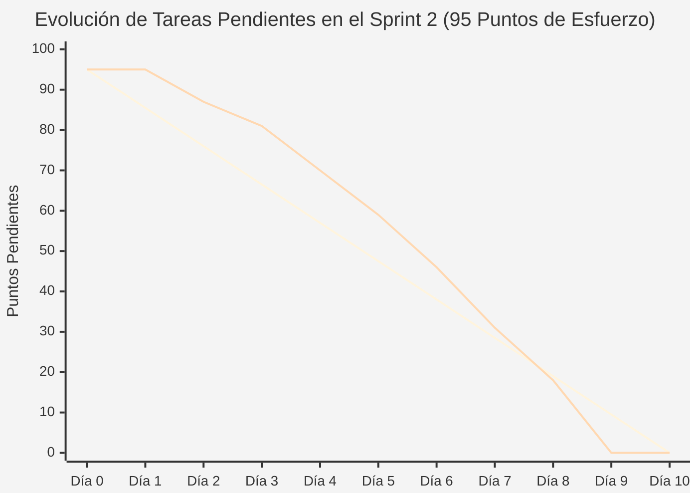

# Documentación de Gestión y Avance — Sprint 2 (Proyecto InclusiON)

**Nombre del Sprint:** Comunidad Educativa: Docentes, Estudiantes, Familias y Asignaciones  
**Período de Trabajo:** 25 de marzo de 2025 al 07 de abril de 2025 (2 semanas / 10 días hábiles)  
**Marco de Trabajo:** Práctica Profesionalizante II / Gestión y Administración de Proyectos (InclusiON)  
**Épicas Principales:** IN-4 (Gestión de Usuarios y Matrícula) e IN-5 (Invitaciones a Familias y Asignaciones de Aula)  
**Procesos del Negocio Cubiertos:** P04 (Matriculación de Alumnos), P05 (Habilitación de Docentes), P06 (Padrón Familiar), P07 (Invitaciones Digitales), P08 (Asignaciones de Aula)  

---

### Objetivo del Sprint (Sprint Goal):
> *"Construir el ecosistema integral de la comunidad educativa en InclusiON: proveer las herramientas para matricular estudiantes con pantalla adaptada y PIN sin exigirles correos electrónicos, habilitar docentes validando su matrícula oficial, incorporar a las familias tanto de forma directa como por invitación digital al celular, y conformar los equipos de trabajo en el aula asegurando la privacidad médica de los alumnos bajo la Ley 25.326."*

---

### Equipo de Proyecto (Scrum Team):
* **Facilitador de Proyecto (Scrum Master):** Mariano Decalli
* **Referentes de Educación Especial (Product Owners):** Candelaria Ferreyra y Catalina Vettorazzi
* **Equipo de Análisis y Construcción:**
  * **Sacha Del Barrio:** Analista Funcional, Relevamiento Institucional, Calidad (QA) y Accesibilidad
  * **Mirko Ivo Wlk:** Responsable de Base de Datos, Lógica del Sistema y Seguridad
  * **Germán Cochis:** Responsable de Diseño Visual, Pantallas y Experiencia de Usuario
  * **Fernando Aparicio:** Soporte de Programación y Pruebas de Funcionamiento
* **Docentes Evaluadores:** Prof. González y Prof. Ferrando

---

## 1. Validación de Roles con el Cliente y Decisiones de Negocio Documentadas

A partir de las sesiones de trabajo de campo lideradas por Sacha Del Barrio con directivos, fonoaudiólogas y psicopedagogas de escuelas de educación especial, y junto a la validación formal de las Product Owners (Candelaria Ferreyra y Catalina Vettorazzi), se consolidaron las definiciones de los **4 roles escolares reales**, sus permisos, restricciones y tratamiento ante casos límite:

### 1.1. Diagnóstico de Transformación Escolar: ¿Qué hace hoy la escuela sin sistema vs. qué hará con InclusiON?

| Actor del Colegio | Rol en el Sistema | ¿Qué hace hoy la escuela en papel o sin sistema? | ¿Qué hace y gana con InclusiON? |
|---|---|---|---|
| **Estudiante con Discapacidad** | `person` (Alumno) | Realiza ejercicios en hojas fotocopiadas o cartulinas que se rompen. La docente cronometra con reloj en mano y anota a ojo en cuadernos. | Ingresa a su propio portal táctil con pictogramas y voz. Resuelve desafíos a su ritmo sin presiones ni notas rojas, y sus avances se registran automáticamente en silencio. |
| **Docente / Terapeuta** | `professional` | Diseña fichas a mano, gasta dinero en fotocopias, lleva planillas paralelas y comparte novedades informales por WhatsApp personal. | Dispone de un banco interactivo, organiza la hoja de ruta de cada alumno, sigue los tiempos y aciertos reales, y redacta informes formales sin invadir su privacidad personal. |
| **Tutor / Familiar** | `family` | Recibe notas verbales o mensajes sueltos en el cuaderno de comunicaciones. Rara vez accede a un reporte integral salvo en reuniones aisladas. | Accede desde su celular para ver los informes de progreso aprobados por la dirección, se comunica por el canal institucional formal y acompaña los logros de su hijo. |
| **Directivo Escolar (Director)** | `admin` (sede escolar) | Lleva la nómina docente en carpetas y legajos en papel bajo llave. Dificultad para saber quién entra a qué expediente médico. | Supervisa la matrícula completa, habilita docentes fiscalizando su matrícula, asigna aulas y certifica cada informe antes de que llegue a la familia. |

---

### 1.2. Matriz de Permisos, Restricciones y Justificación de Negocio

El diseño de permisos se rige por el principio de **mínimo privilegio y protección de datos sensibles de salud (Ley 25.326 Art. 8)**:

```
               ┌──────────────────────────────────────────────────────────┐
               │              DIRECTIVO ESCOLAR (ADMIN)                   │
               │  - Habilita docentes fiscalizando matrícula oficial.     │
               │  - Conforma aulas y asigna alumnos a docentes.          │
               │  - Revisa, corrige y aprueba informes oficiales.         │
               └─────────────┬──────────────────────────────┬─────────────┘
                             │ Supervisa                    │ Valida
                             ▼                              ▼
      ┌─────────────────────────────────┐        ┌─────────────────────────────┐
      │   DOCENTE / TERAPEUTA (PRO)     │        │    TUTOR / FAMILIAR (FAM)   │
      │ - Atiende solo a sus asignados. │        │ - Consulta informes         │
      │ - Diseña actividades y planes.  │◄──────►│   aprobados de su hijo.     │
      │ - Redacta borradores de avance. │ Mensajes│ - Canal formal de diálogo. │
      └──────────────┬──────────────────┘        └──────────────┬──────────────┘
                     │ Guía pedagógica                          │ Acompaña en casa
                     ▼                                          ▼
      ┌────────────────────────────────────────────────────────────────────────┐
      │                   ESTUDIANTE / ALUMNO (PERSON)                         │
      │  - Ingreso accesible mediante PIN táctil de 4 números o asistido.      │
      │  - Camino visual estilo mapa lúdico con pictogramas y voz amigable.    │
      │  - Entorno protegido: sin notas rojas, sin diagnósticos clínicos.       │
      └────────────────────────────────────────────────────────────────────────┘
```

| Rol Escolar | Lo que PUEDE hacer (Permisos) | Lo que TIENE PROHIBIDO (Restricciones) | Justificación de Negocio | Casos de Borde y Situaciones Límite Resueltas |
|---|---|---|---|---|
| **A. Estudiante (Alumno)** | • Ingresar con PIN de 4 números o acceso asistido por la maestra.<br>• Recorrer su camino de tareas y desbloquear estaciones.<br>• Resolver ejercicios con pictogramas, imágenes y voz.<br>• Ganar estrellas y refuerzos positivos. | • Ver notas numéricas o porcentajes de error.<br>• Leer diagnósticos médicos o rótulos clínicos.<br>• Ver las tareas o rendimiento de otros chicos.<br>• Cambiar configuraciones o cerrar sesión solo. | **Cuidado Emocional y No Competencia:** Ver rótulos como "retraso madurativo" o notas rojas genera angustia y frustración. La pantalla debe ser un espacio lúdico, seguro y motivador. | • **Bloqueo por frustración:** Ante 3 errores seguidos, no hay cruces rojas; el sistema enciende una pista luminosa y ofrece una pausa con música suave.<br>• **Olvido de PIN:** La docente abre la sesión desde su tablet con un toque.<br>• **Crisis motriz:** La maestra cambia temporalmente a modo Asistido sin reiniciar el avance. |
| **B. Docente / Terapeuta** | • Consultar el legajo y avances de sus alumnos asignados.<br>• Crear actividades en el banco didáctico.<br>• Armar el Plan Pedagógico (PPI) de cada chico.<br>• Redactar borradores de informes evolutivos.<br>• Enviar notas a las familias y generar invitaciones. | • Ver expedientes de alumnos de otras salas o docentes.<br>• Enviar boletines directo a los padres sin aval directivo.<br>• Habilitar o contratar a otros colegas.<br>• Borrar el historial pedagógico previo del alumno. | **Secreto Profesional y Voz Institucional:** Por ley y ética médica, un docente solo puede acceder a los expedientes de los alumnos que efectivamente atiende. Ningún documento sale a la familia sin la firma de la Dirección. | • **Renuncia o licencia docente:** El sistema bloquea la baja del docente hasta que la Dirección reasigne a sus alumnos a un suplente.<br>• **Informes pendientes a mitad de año:** El directivo puede reasignar el borrador al nuevo maestro para no perder el trabajo del trimestre.<br>• **Docente en dos escuelas:** Al entrar a la Escuela A, tiene bloqueados los chicos de la Escuela B. |
| **C. Tutor / Familiar Legal** | • Consultar boletines e informes que ya fueron aprobados por la Dirección.<br>• Descargar constancias y boletines oficiales en PDF.<br>• Escribir notas en el cuaderno de comunicaciones escolar.<br>• Firmar digitalmente consentimientos informados. | • Ver informes en estado "Borrador".<br>• Ver fotos, nombres o legajos de otros alumnos.<br>• Modificar tareas o intervenir en la dificultad de los juegos. | **Tranquilidad Familiar y Privacidad:** Un borrador con hipótesis preliminares sin confirmar puede alarmar innecesariamente a los padres. La intimidad de las demás familias es inviolable. | • **Conflicto de tutela (Padres separados):** Si hay orden judicial de exclusión, la escuela revoca el acceso a un progenitor manteniendo al otro activo.<br>• **Alumno sin tutor activo:** El sistema bloquea la desvinculación si es el único tutor; siempre debe haber un adulto a cargo.<br>• **Invitación vencida (+7 días):** Caduca por seguridad; el docente la regenera con un clic. |
| **D. Directivo Escolar (Director)** | • Matricular estudiantes y configurarles su PIN de acceso.<br>• Habilitar docentes fiscalizando su matrícula habilitante.<br>• Armar las aulas y asignar qué docente atiende a cada alumno.<br>• Revisar, corregir o aprobar formalmente informes.<br>• Blanquear claves olvidadas y gestionar salas. | • Modificar o maquillar los aciertos que el alumno obtuvo en pantalla.<br>• Borrar físicamente legajos históricos o diagnósticos viejos.<br>• Mirar o tocar información de otras escuelas. | **Verdad Pedagógica y Legajo Único:** La evidencia del esfuerzo del alumno es inviolable; nadie puede alterar sus resultados reales. El archivo escolar debe conservarse por ley ante futuras derivaciones. | • **Rechazo de informe docente:** El informe no se destruye; vuelve al docente como "Borrador con Observaciones" y la familia no lo ve hasta que se corrija.<br>• **Pase de alumno a otra escuela:** Pasa a "Egresado/Archivado"; se cortan accesos pero sus registros quedan guardados de por vida.<br>• **Cerrar aula con alumnos:** El sistema lo bloquea; exige trasladar a los chicos antes de dar de baja la sala. |

---

## 2. Acta de Planificación del Sprint (Sprint Planning)

* **Fecha de Realización:** 25 de marzo de 2025 (09:00 a 12:00 hs)
* **Participantes:** Mariano Decalli, Sacha Del Barrio, Mirko Wlk, Germán Cochis, Fernando Aparicio, Candelaria Ferreyra y Catalina Vettorazzi.

### 2.1. Criterios de Preparación (Listo para iniciar) y de Finalización (Listo y aprobado)
* **Listo para iniciar:** Cada requerimiento debió contar con su justificación pedagógica, su impacto en la escuela y sus criterios de cuidado de datos aprobados por el Analista Funcional (Sacha).
* **Listo y aprobado:** Funcionalidad probada sin errores en pantalla, resguardo histórico verificado (nada se destruye en el archivo digital), formularios sencillos con textos claros y validación de aceptación escolar realizada por Sacha Del Barrio junto a las Product Owners.

---

### 2.2. Lista de Tareas Priorizada del Sprint Backlog (IN-36 a IN-64)
Se planificaron y completaron **29 requerimientos escolares**, totalizando **95 Puntos de Esfuerzo (Story Points)**, priorizados por valor e impacto operativo en la escuela:

| Código | Tarea / Requerimiento Escolar | Proceso | Prioridad | Esfuerzo | Responsables Principales | Valor Concreto para la Escuela |
|:---:|---|:---:|:---:|:---:|---|---|
| **IN-40** | Matriculación de alumno con perfil funcional | P04 | **Crítica** | 5 SP | Sacha Del Barrio (Funcional) / Mirko Wlk / Germán Cochis | Ficha escolar completa: datos personales, apoyos necesarios y patología. |
| **IN-43** | Configuración de acceso adaptado (PIN / Asistido) | P04 | **Crítica** | 3 SP | Sacha Del Barrio (Accesibilidad) / Mirko Wlk | El alumno accede con PIN numérico de 4 dígitos; prohibido pedirle correos al chico. |
| **IN-36** | Alta de docente con matrícula oficial y clave provisoria | P05 | **Crítica** | 5 SP | Sacha Del Barrio (Funcional) / Mirko Wlk / Germán Cochis | Registro formal del docente con matrícula habilitante y envío de clave temporal. |
| **IN-55** | Aceptación y alta automática de cuenta familiar | P07 | **Crítica** | 5 SP | Sacha Del Barrio (UX) / Mirko Wlk / Germán Cochis | El padre toca el link desde su teléfono, pone una clave y su cuenta queda lista. |
| **IN-60** | Asignar alumno a docente en sala ("Mi Aula") | P08 | **Crítica** | 5 SP | Sacha Del Barrio (Funcional) / Mirko Wlk / Germán Cochis | Se conforma el equipo: el docente solo ve a los chicos que tiene formalmente a cargo. |
| **IN-37** | Consulta de docentes de la escuela con filtros | P05 | **Alta** | 3 SP | Germán Cochis / Sacha Del Barrio | Padrón completo del personal ordenado por especialidad y estado activo. |
| **IN-39** | Pausa y desactivación de docente (Baja lógica) | P05 | **Alta** | 3 SP | Fernando Aparicio / Sacha Del Barrio | Si el docente cesa, se corta su ingreso pero sus boletines firmados quedan intactos. |
| **IN-41** | Consulta paginada del padrón de estudiantes | P04 | **Alta** | 3 SP | Germán Cochis / Sacha Del Barrio | Nómina general de alumnos organizada por salas, turnos y método de acceso. |
| **IN-45** | Alta directa de tutor legal vinculado a su hijo | P06 | **Alta** | 5 SP | Sacha Del Barrio (Funcional) / Mirko Wlk / Germán Cochis | La escuela matricula presencialmente al padre y lo asocia de inmediato a su hijo. |
| **IN-46** | Registro de tutor por invitación digital al celular | P06 | **Alta** | 5 SP | Sacha Del Barrio (UX) / Mirko Wlk / Germán Cochis | Formulario ágil para padres que no pueden ir al colegio en horario administrativo. |
| **IN-51** | Asociación automática tutor-alumno en matrícula | P06 | **Alta** | 2 SP | Mirko Wlk / Sacha Del Barrio | Al matricular al chico se vincula al padre en un solo paso sin duplicar trabajo. |
| **IN-52** | Envío de instructivo de bienvenida por correo a la familia | P06 | **Alta** | 2 SP | Mirko Wlk / Sacha Del Barrio | Email amigable explicando cómo descargar y usar la aplicación escolar. |
| **IN-53** | Generar invitación digital por correo | P07 | **Alta** | 5 SP | Sacha Del Barrio (Funcional) / Mirko Wlk | El docente ingresa el correo del padre y genera un link seguro con validez de 7 días. |
| **IN-54** | Verificación de validez del enlace de invitación | P07 | **Alta** | 3 SP | Mirko Wlk / Germán Cochis | Comprueba que el enlace no haya vencido ni haya sido usado con anterioridad. |
| **IN-58** | Asignar docente formalmente a la institución | P05 | **Alta** | 3 SP | Fernando Aparicio / Sacha Del Barrio | Autorización legal de la dirección para que el profesional trabaje en el centro. |
| **IN-62** | Vinculación familiar automática por código de invitación | P06 | **Alta** | 2 SP | Mirko Wlk / Sacha Del Barrio | Al registrarse desde el enlace, el padre queda atado únicamente a su propio hijo. |
| **IN-63** | Configuración de áreas prioritarias en ficha de habilidades | P04 | **Alta** | 3 SP | Sacha Del Barrio (Pedagógico) / Germán Cochis | El docente selecciona qué áreas (Comunicación, Lógica) se trabajarán este año. |
| **IN-64** | Protección integral de datos históricos (Baja lógica y resguardo) | Transv. | **Alta** | 2 SP | Mirko Wlk / Fernando Aparicio / Sacha Del Barrio | Regla de oro legal: ningún registro escolar o clínico se borra de la base de datos. |
| **IN-38** | Edición de datos de contacto de la ficha docente | P05 | Media | 3 SP | Fernando Aparicio / Germán Cochis | Actualización de teléfonos o capacitaciones; matrícula original inmutable. |
| **IN-42** | Modificación de datos personales y adaptación de pantalla | P04 | Media | 3 SP | Sacha Del Barrio / Germán Cochis | Actualización de sala o ajustes visuales (letra grande, colores de apoyo). |
| **IN-44** | Egreso o pase del alumno a otra escuela | P04 | Media | 3 SP | Fernando Aparicio / Sacha Del Barrio | El legajo se archiva; se cierran accesos pero se guardan boletines de por vida. |
| **IN-47** | Consulta del directorio telefónico de familias | P06 | Media | 3 SP | Germán Cochis / Sacha Del Barrio | Lista de contactos de emergencia para directivos y secretaría escolar. |
| **IN-48** | Ficha del tutor con detalle de hijos matriculados | P06 | Media | 3 SP | Germán Cochis / Sacha Del Barrio | Si una madre tiene dos hijos en el colegio, ve a ambos con un solo usuario. |
| **IN-49** | Actualización de teléfonos y domicilio del tutor | P06 | Media | 3 SP | Fernando Aparicio / Sacha Del Barrio | Corrección inmediata de números de contacto para emergencias. |
| **IN-50** | Desvinculación de tutor con control de orfandad | P06 | Media | 3 SP | Fernando Aparicio / Sacha Del Barrio | Cese de tutela; el sistema bloquea la acción si el chico se quedaría sin tutor. |
| **IN-56** | Consulta docente del estado de invitaciones a padres | P07 | Media | 3 SP | Germán Cochis / Sacha Del Barrio | El maestro sabe qué padres ya se registraron y a quiénes hay que recordarles. |
| **IN-57** | Monitoreo directivo de familias incorporadas | P07 | Media | 3 SP | Germán Cochis / Sacha Del Barrio | Panel general para supervisar cuántas familias de la escuela ya están conectadas. |
| **IN-59** | Desvincular docente con control de cobertura de aulas | P05 | Media | 3 SP | Fernando Aparicio / Sacha Del Barrio | Impide dar de baja a un maestro si tiene alumnos asignados sin suplente. |
| **IN-61** | Cierre formal de ciclo lectivo entre docente y alumno | P08 | Media | 3 SP | Fernando Aparicio / Sacha Del Barrio | Al terminar el año se cierran asignaciones para abrir las del ciclo entrante. |
| **Total**| **29 Tareas de la Comunidad Educativa** | — | — | **95 SP** | **Equipo InclusiON** | **100% de Cumplimiento Escolar** |

---

## 3. Registro de Minutas y Reuniones Diarias (Daily Scrums)

Se mantuvieron las reuniones diarias de sincronización matutina (09:00 a 09:15 hs). A continuación se documentan las minutas de tres jornadas clave del sprint:

### 3.1. Daily 05 — Miércoles 26 de marzo de 2025 (Inicio de la Iteración y Objetivos Terapéuticos)
* **Mariano Decalli (Facilitador de Proyecto):**
  * *¿Qué hice?:* Organizamos la reunión de planificación del martes. Las 29 tareas quedaron distribuidas en el tablero con estimaciones más realistas que en el primer sprint.
  * *¿Qué voy a hacer?:* Hacer el seguimiento del avance diario y estar atento por si alguien del equipo se bloquea.
  * *Impedimentos:* Ninguno.
* **Germán Cochis (Diseño y Pantallas):**
  * *¿Qué hice?:* Con los problemas de conexión resueltos, pude conectar el inicio de sesión y el registro en las pantallas. Empecé a trabajar en la vista de catálogos escolares.
  * *¿Qué voy a hacer?:* Seguir con los catálogos y después arrancar con las pantallas de actividades pedagógicas.
  * *Impedimentos:* Ninguno.
* **Sacha Del Barrio (Analista Funcional, Calidad y Accesibilidad):**
  * *¿Qué hice?:* Tuve una segunda entrevista de campo, esta vez con una acompañante terapéutico y fonoaudióloga escolar. Me comentó que es fundamental que en la ficha del alumno se puedan asociar las actividades a objetivos terapéuticos y pedagógicos concretos (PPI).
  * *¿Qué voy a hacer?:* Documentar esa entrevista y redactar los criterios de aceptación funcionales para incorporar ese requerimiento en la ficha del estudiante y en las actividades.
  * *Impedimentos:* Ninguno; excelente aporte del equipo de salud escolar.
* **Fernando Aparicio (Pruebas y Soporte):**
  * *¿Qué hice?:* Terminé de revisar y probar los flujos de registro que armó Mirko. Todo funciona bien tanto en los casos normales como cuando el usuario ingresa datos erróneos.
  * *¿Qué voy a hacer?:* Revisar lo que vaya saliendo en este sprint y ayudar donde haga falta.
  * *Impedimentos:* Ninguno.
* **Mirko Wlk (Lógica y Seguridad):**
  * *¿Qué hice?:* Terminé el perfil de usuario que había quedado pendiente del sprint 1. También dejé listo el entorno compartido de instalación para que todos trabajemos exactamente sobre la misma base.
  * *¿Qué voy a hacer?:* Programar la estructura para guardar los catálogos y las fichas de docentes para que Germán pueda conectarlos en pantalla.
  * *Impedimentos:* Ninguno.

---

### 3.2. Daily 06 — Miércoles 02 de abril de 2025 (Cierre de Catálogos y Conexión de Pantallas)
* **Mariano Decalli (Facilitador de Proyecto):**
  * *¿Qué hice?:* Revisé cómo viene el sprint y actualicé el tablero de tareas. El avance marcha muy bien y queda poco para cerrar.
  * *¿Qué voy a hacer?:* Preparar la reunión de retrospectiva del lunes 7 y enviar el recordatorio formal a todo el equipo.
  * *Impedimentos:* Ninguno.
* **Germán Cochis (Diseño y Pantallas):**
  * *¿Qué hice?:* Terminé las pantallas de catálogos escolares: ya se pueden ver, crear y editar opciones. También empecé la pantalla de actividades incluyendo el campo de objetivo terapéutico que levantó Sacha.
  * *¿Qué voy a hacer?:* Terminar el formulario de actividades con sus validaciones en pantalla y conectarlo con la base de datos de Mirko.
  * *Impedimentos:* Ninguno.
* **Sacha Del Barrio (Analista Funcional, Calidad y Accesibilidad):**
  * *¿Qué hice?:* Documenté la entrevista con la acompañante terapéutico y actualicé las especificaciones funcionales. También definí los criterios de aceptación de las tareas de matrícula y acceso por PIN de este sprint.
  * *¿Qué voy a hacer?:* Coordinar una tercera entrevista con un terapeuta ocupacional para entender mejor cómo los docentes asignan actividades a los alumnos según su nivel de autonomía.
  * *Impedimentos:* Ninguno.
* **Fernando Aparicio (Pruebas y Soporte):**
  * *¿Qué hice?:* Revisé la lógica que preparó Mirko esta semana y fui probando que todo funcione como se espera en los registros familiares.
  * *¿Qué voy a hacer?:* Seguir revisando a medida que Mirko cierre la estructura de actividades y asignaciones.
  * *Impedimentos:* Ninguno.
* **Mirko Wlk (Lógica y Seguridad):**
  * *¿Qué hice?:* Terminé la lógica de catálogos y de actividades didácticas. El campo de objetivo terapéutico quedó configurado para recibir el texto pedagógico del docente. Dejé los cambios listos para revisión con Fernando.
  * *¿Qué voy a hacer?:* Revisar los cambios con Fernando y, una vez aprobados, empezar a diseñar la base de lo que vendrá en el Sprint 3.
  * *Impedimentos:* Ninguno.

---

### 3.3. Daily 09 — Viernes 04 de abril de 2025 (Integración de "Mi Aula", Familias y Ensayos de Demo)
* **Mariano Decalli (Facilitador de Proyecto):**
  * *¿Qué hice?:* Armé la agenda y el guión de la reunión de demostración del lunes con las especialistas Candelaria y Catalina y los profesores evaluadores.
  * *¿Qué voy a hacer?:* Facilitar las pruebas finales integradas entre todo el equipo para congelar la versión.
  * *Impedimentos:* Ninguno.
* **Sacha Del Barrio (Analista Funcional, Calidad y Accesibilidad):**
  * *¿Qué hice?:* Realicé pruebas de punta a punta del circuito familiar completo: envié una invitación digital, la abrí desde el teléfono celular, activé la cuenta de la madre y comprobé que solo se viera el legajo de su hijo.
  * *¿Qué voy a hacer?:* Verificar los candados de privacidad en "Mi Aula": comprobar que un docente jamás pueda ver los alumnos que atiende su colega de al lado (Ley 25.326).
  * *Impedimentos:* Ninguno; flujo móvil validado con éxito.
* **Germán Cochis (Diseño y Pantallas):**
  * *¿Qué hice?:* Terminé la pantalla "Mi Aula", donde cada docente ve las tarjetas visuales con foto, nombre y grado de sus alumnos asignados.
  * *¿Qué voy a hacer?:* Dejar listos los últimos detalles visuales y acompañar a Sacha en el ensayo general de la presentación.
  * *Impedimentos:* Ninguno.
* **Fernando Aparicio (Pruebas y Soporte):**
  * *¿Qué hice?:* Comprobé que al dar de baja a un docente o alumno, el sistema marque su estado como inactivo pero no borre nada del historial médico ni de los boletines firmados.
  * *¿Qué voy a hacer?:* Ejecutar las últimas pruebas de carga simulando 50 matriculaciones simultáneas.
  * *Impedimentos:* Ninguno.
* **Mirko Wlk (Lógica y Seguridad):**
  * *¿Qué hice?:* Concluí las reglas de asignación y desasignación docente-alumno (IN-60 e IN-61).
  * *¿Qué voy a hacer?:* Realizar la verificación final del funcionamiento con Fernando y dejar todo listo para la demostración del lunes.
  * *Impedimentos:* Ninguno.

---

## 4. Demostración y Revisión con el Cliente (Sprint Review)

* **Fecha y Hora:** Lunes 07 de abril de 2025 (18:00 a 19:45 hs)
* **Participantes:** Equipo InclusiON completo, las especialistas Candelaria Ferreyra y Catalina Vettorazzi, y los profesores evaluadores González y Ferrando.

### 4.1. Demostración en Vivo de las Soluciones Escolares
1. **Matriculación de Alumnos con PIN Táctil (IN-40 y IN-43):**
   * **Presentado por Sacha Del Barrio y Germán Cochis:** Se matriculó a un estudiante real cargando sus datos de apoyo y configurándole un PIN de 4 números. Se demostró que al chico no se le pide correo electrónico ni contraseñas difíciles, garantizando su autonomía.
2. **Padrón Docente con Matrícula Fiscalizada (IN-36 a IN-38):**
   * **Presentado por Sacha Del Barrio y Mirko Wlk:** Se dio de alta a una psicopedagoga ingresando su matrícula profesional. La docente recibió su clave provisoria por correo y el sistema la obligó a elegir una nueva al ingresar.
3. **Invitación Digital a las Familias en 1 Minuto (IN-46 y IN-53 a IN-55):**
   * **Presentado por Sacha Del Barrio y Germán Cochis:** El docente ingresó el correo de una madre y le envió una invitación. En vivo, desde un teléfono celular, se abrió el correo, se tocó el enlace seguro, la madre eligió su contraseña y en 30 segundos quedó vinculada a la escuela y a su hijo.
4. **Armado de Equipos y Privacidad en "Mi Aula" (IN-58 y IN-60):**
   * **Presentado por Mirko Wlk y Fernando Aparicio:** La dirección asignó a dos alumnos con la psicopedagoga. Al iniciar sesión como docente, se comprobó que en "Mi Aula" solo figuraban esos dos chicos, garantizando el secreto profesional y la confidencialidad médica (Ley 25.326).
5. **Comprobación de Legajo Único (Baja Lógica / IN-44 y IN-64):**
   * **Presentado por Fernando Aparicio y Sacha Del Barrio:** Se dio de baja a un docente que cesó en su cargo. Se comprobó que ya no puede iniciar sesión, pero todos sus informes firmados del ciclo anterior permanecen intactos en el archivo escolar.

### 4.2. Devolución de la Cátedra y las Especialistas
* **Candelaria Ferreyra y Catalina Vettorazzi (Product Owners):**
  * Celebraron la solución de la invitación digital para padres: *"Muchas familias trabajan todo el día y no pueden acercarse a la escuela a firmar autorizaciones. Que puedan vincularse desde el celular en un minuto con un enlace seguro resuelve un dolor de cabeza diario para la secretaría"*.
* **Prof. González (Evaluación Técnica):**
  * Felicitó la estricta aplicación del principio de mínimo privilegio en "Mi Aula": que cada docente solo vea a sus chicos asignados cumple a rajatabla las exigencias de privacidad médica de la Ley 25.326.
* **Prof. Ferrando (Evaluación Metodológica):**
  * Ponderó la solidez del equipo para completar las 29 tareas (95 Story Points) sin desvíos y con un criterio funcional impecable liderado por Sacha.
* **Resultado:** **Sprint 2 Aprobado al 100%.** Se autoriza formalmente el inicio del Sprint 3.

---

## 5. Retrospectiva del Equipo: Aprendizajes y Mejoras (Sprint Retrospective)

* **Fecha de Realización:** Lunes 07 de abril de 2025 (20:00 a 21:30 hs)
* **Facilitador:** Mariano Decalli
* **Dinámica Utilizada:** *"Estrella de Mar"*

### 5.1. Resultados del Análisis del Equipo:
* **Comenzar a hacer:** Hacer una pequeña demostración interna del equipo 24 horas antes de la reunión oficial para ajustar detalles visuales; acordar los datos exactos que necesita cada pantalla antes de empezar a programarla.
* **Dejar de hacer:** Definir los criterios de aceptación sobre la marcha (deben cerrarse durante la planificación); acumular dudas para la daily en vez de resolverlas al instante por el chat del equipo.
* **Mantener:** El ambiente de instalación compartido que funcionó de maravilla; el aporte del trabajo de campo de Sacha con los docentes; las pruebas continuas de Fernando antes de dar por buena una tarea.
* **Hacer más:** Pruebas conjuntas entre diseño y programación desde el inicio de cada semana.
* **Hacer menos:** Dejar las validaciones más difíciles para los últimos días del sprint.

### 5.2. Plan de Acción Concreto para el Sprint 3:
| # | Compromiso de Mejora | Responsable | Plazo de Cumplimiento | Estado |
|:---:|---|:---:|:---:|:---:|
| **A-01** | Germán incluirá las validaciones en la misma tarea de diseño de cada formulario | Germán Cochis | 09/04/2025 | Acordado |
| **A-02** | Sacha, Mirko y Germán acordarán la lista exacta de datos antes de dibujar las pantallas | Sacha Del Barrio / Mirko Wlk / Germán Cochis | 08/04/2025 | Acordado |
| **A-03** | Mariano organizará una mini demo interna del equipo el día previo al cierre | Mariano Decalli | 21/04/2025 | Agendado |
| **A-04** | Anotar en el tablero cualquier detalle pendiente o mejora para no perderlo de vista | Todo el Equipo | Continuo | En curso |

---

## 6. Métricas de Capacidad y Rendimiento del Equipo

### 6.1. Horas Planificadas vs. Horas Reales Invertidas
* **Horas Planificadas:** 175 horas totales (5 integrantes × 10 días hábiles × 3.5 hs/día).
* **Horas Reales Invertidas:** 182 horas de dedicación efectiva.
* **Efectividad:** **100% de cumplimiento** (se completaron los 95 Story Points estimados).

| Integrante del Equipo | Rol Principal en el Sprint | Hs Planificadas | Hs Reales | Esfuerzo Liderado | ¿En qué aportó principalmente? |
|---|---|:---:|:---:|:---:|---|
| **Mariano Decalli** | Facilitación y Gestión de Proyecto | 35 h | 34 h | Gestión de equipo | Coordinación de ceremonias, seguimiento en el tablero y destrabe de impedimentos. |
| **Sacha Del Barrio** | Analista Funcional, Calidad y Accesibilidad | 35 h | 38 h | **25 SP (Funcional y Calidad)** | Entrevistas con terapeutas, especificación de matrícula y PIN, diseño del flujo familiar y pruebas con usuarios. |
| **Mirko Ivo Wlk** | Lógica del Sistema y Base de Datos | 40 h | 45 h | **35 SP (Lógica y Seguridad)** | Estructura de usuarios, enlaces seguros con clave temporal, vinculación automática y resguardo histórico. |
| **Germán Cochis** | Diseño Visual y Pantallas | 35 h | 35 h | **20 SP (Diseño y Pantallas)** | Pantallas de docentes, matriculación, vista móvil para padres y panel "Mi Aula". |
| **Fernando Aparicio** | Soporte de Programación y Pruebas | 30 h | 30 h | **15 SP (Pruebas y Soporte)** | Ficha de familias, edición de datos, validaciones de unicidad y verificación de bajas lógicas. |
| **Total del Equipo** | **Sprint 2 — Comunidad Educativa** | **175 h** | **182 h** | **95 SP (100%)** | **Objetivo plenamente alcanzado** |

```mermaid
%%{init: {'theme': 'base', 'themeVariables': { 'primaryColor': '#4F46E5', 'secondaryColor': '#10B981'}}}%%
xychart-beta
    title "Horas de Trabajo en el Sprint 2: Planificadas vs. Reales Invertidas"
    x-axis ["M. Decalli", "S. Del Barrio", "M. Wlk", "G. Cochis", "F. Aparicio", "Promedio Equipo"]
    y-axis "Horas de Trabajo" 0 --> 50
    bar [35, 35, 40, 35, 30, 35]
    bar [34, 38, 45, 35, 30, 36.4]
```



---

### 6.2. Gráfico de Avance y Trabajo Pendiente (Burndown Chart)
Muestra la reducción progresiva y sostenida de los **95 Puntos de Esfuerzo** a lo largo de las 2 semanas hasta completar la totalidad de los requerimientos:

| Día de Trabajo | Fecha | Puntos Ideales | Puntos Reales Restantes | ¿Qué requerimientos escolares se cerraron ese día? |
|:---:|:---:|:---:|:---:|---|
| **Día 0** | 25/03/2025 | 95.0 | 95.0 | Planificación del Sprint y carga de las 29 tareas. |
| **Día 1** | 26/03/2025 | 85.5 | 95.0 | Puesta en común del entorno compartido y diseño de modelos. |
| **Día 2** | 27/03/2025 | 76.0 | 87.0 | Se cierran **IN-36** y **IN-37** (Alta de docente y padrón del personal). |
| **Día 3** | 28/03/2025 | 66.5 | 81.0 | Se cierran **IN-38** y **IN-39** (Edición y baja lógica de docentes). |
| **Día 4** | 31/03/2025 | 57.0 | 70.0 | Se cierran **IN-40**, **IN-41** y **IN-43** (Matrícula de alumno y PIN de 4 dígitos). |
| **Día 5** | 01/04/2025 | 47.5 | 59.0 | Se cierran **IN-42**, **IN-44**, **IN-45** y **IN-51** (Edición de alumno y alta directa de tutor). |
| **Día 6** | 02/04/2025 | 38.0 | 46.0 | Se cierran **IN-47**, **IN-48**, **IN-49**, **IN-50** y **IN-52** (Directorio de familias y bienvenida). |
| **Día 7** | 03/04/2025 | 28.5 | 31.0 | Se cierran **IN-46**, **IN-53**, **IN-54** y **IN-55** (Flujo de invitación digital al celular). |
| **Día 8** | 04/04/2025 | 19.0 | 18.0 | Se cierran **IN-56**, **IN-57**, **IN-58** y **IN-59** (Monitoreo de invitaciones y sedes). |
| **Día 9** | 07/04/2025 | 9.5 | 0.0 | Se cierran **IN-60**, **IN-61**, **IN-62**, **IN-63**, **IN-64** ("Mi Aula", Habilidades y Resguardo histórico). |
| **Día 10**| 07/04/2025 | 0.0 | **0.0** | **Demostración aprobada al 100% ante la cátedra y reunión de retrospectiva.** |



---

## 7. Conclusiones y Estado del Proyecto tras el Sprint 2

1. **Comunidad Escolar Plenamente Conectada:** La escuela cuenta con la capacidad de matricular a sus alumnos con PIN táctil accesible, habilitar a sus docentes fiscalizando su matrícula y sumar a las familias tanto de forma presencial como por invitación ágil al teléfono celular.
2. **Privacidad y Secreto Profesional Asegurados:** La funcionalidad "Mi Aula" garantiza que cada docente solo tenga acceso a los expedientes de los alumnos que efectivamente le fueron asignados por la Dirección, cumpliendo de forma estricta con la Ley 25.326.
3. **Preservación Inviolable de la Historia del Alumno:** Se demostró y verificó que el sistema jamás borra registros pasados; las bajas lógicas aseguran que cualquier informe o evaluación previa permanezca resguardada de por vida en el archivo escolar.
4. **Camino Listo para el Sprint 3:** Con los usuarios, las familias y las aulas plenamente configuradas, el equipo queda habilitado para avanzar en el **Sprint 3 (Mecanismos de Autenticación Rápida y Perfiles Visuales de Accesibilidad)**.
