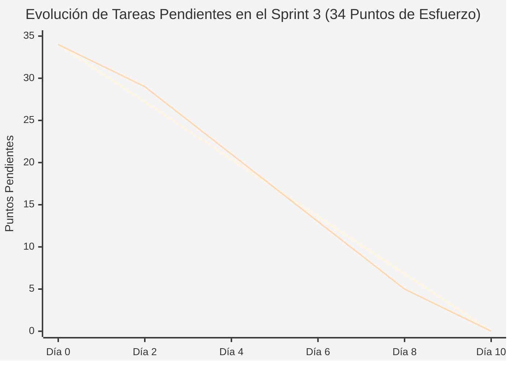

# Documentación de Gestión y Avance — Sprint 3 (Proyecto InclusiON)

**Nombre del Sprint:** Autenticación Accesible, Protección de Datos y Reglas de Negocio Escolar  
**Período de Trabajo:** 08 de abril de 2025 al 21 de abril de 2025 (2 semanas / 10 días hábiles)  
**Marco de Trabajo:** Práctica Profesionalizante II / Gestión y Administración de Proyectos (InclusiON)  
**Épica Principal:** IN-6 — Autenticación Adaptada, Perfiles Visuales y Accesibilidad Universal (Historias IN-65 a IN-80)  
**Módulos Escolares Abarcados:**  
* **Acceso Adaptado y Multi-Método:** Entrada al sistema diseñada para cada actor escolar (PIN de 4 números táctil para alumnos, modo asistido por docente, ingreso para familias y acceso para el personal escolar).  
* **Motor de Accesibilidad Visual (Universal):** 7 perfiles visuales configurables en pantalla (modo para dislexia con tipografía amigable, alto contraste, y paletas para daltonismos) accesibles mediante el atajo `Alt+A`.  
* **Gobernanza y Reglas de Negocio:** Blindaje de las normas inviolables de la escuela bajo la Ley de Protección de Datos Personales (Ley 25.326).  

---

### Objetivo del Sprint (Sprint Goal):
> *"Implementar el sistema de acceso adaptado para los alumnos (mediante PIN táctil de 4 números y modo asistido por su docente sin exigir correos electrónicos), el cambio obligatorio de contraseña provisoria en el primer ingreso del personal, el panel de accesibilidad visual con 7 modos de pantalla, y consolidar las reglas de negocio inviolables de la institución educativa para garantizar la privacidad y autonomía de toda la comunidad escolar."*

---

### Equipo de Proyecto (Scrum Team):
* **Facilitador de Proyecto (Scrum Master):** Mariano Decalli
* **Referentes de Educación Especial (Product Owners / Cliente):** Candelaria Ferreyra y Catalina Vettorazzi
* **Equipo de Análisis y Construcción:**
  * **Sacha Del Barrio:** Analista Funcional, Relevamiento Institucional, Calidad (QA) y Accesibilidad Cognitiva
  * **Mirko Ivo Wlk:** Responsable de Lógica del Sistema, Base de Datos y Seguridad
  * **Germán Cochis:** Responsable de Diseño Visual, Pantallas y Experiencia de Usuario
  * **Fernando Aparicio:** Soporte de Programación y Pruebas de Funcionamiento
* **Docentes Evaluadores:** Prof. González y Prof. Ferrando

---

## 1. Gestión del Bloqueo con el Cliente: Decisión Tomada e Impacto en el Backlog

Durante el desarrollo del Sprint 3 se presentó una situación imprevista de comunicación externa que puso a prueba la capacidad de respuesta y gobernanza metodológica del equipo:

### 1.1. Situación Ocurrida
Durante las dos semanas del sprint no fue posible coordinar la reunión intermedia de validación con las referentes de educación especial (Product Owners). Los reiterados intentos de contacto por los canales habituales no obtuvieron respuesta a tiempo para confirmar disponibilidad antes de la fecha de cierre de la iteración.

### 1.2. Cronograma de Acciones Tomadas por el Facilitador (Scrum Master)

| Fecha | Canal Utilizado | Acción Realizada por Mariano Decalli | Resultado Obtenido |
|:---:|:---:|---|---|
| **08/04/2025** | WhatsApp | Mensaje formal al inicio del sprint solicitando disponibilidad para revisión intermedia. | Sin respuesta en el plazo esperado. |
| **11/04/2025** | WhatsApp | Reenvío del mensaje formal proponiendo tres alternativas de días y horarios concretos. | Sin respuesta. |
| **14/04/2025** | Correo Electrónico | Envío de correo institucional detallando el temario de accesibilidad y consulta de horarios. | Acuse de recibo automático, pero sin confirmación de reunión. |

### 1.3. Decisión Formal del Equipo
Ante la falta de confirmación externa y para no paralizar el flujo de trabajo escolar, el equipo Scrum tomó la decisión unánime de **continuar con el desarrollo planificado sin frenar el sprint**, fundamentando sus decisiones en tres pilares de máxima solidez:
1. **El trabajo de campo previo de Sacha Del Barrio:** Se utilizaron como guía directa las entrevistas a fondo realizadas en los sprints anteriores con directivos, fonoaudiólogas, terapeutas ocupacionales y acompañantes terapéuticos de escuelas especiales.
2. **El catálogo de reglas de negocio ya homologado:** Cada condición del sistema ya estaba documentada y trazada a necesidades reales de las escuelas, impidiendo cualquier decisión arbitraria o improvisada por parte de los programadores.
3. **El consenso del equipo sobre los flujos críticos:** Se priorizó el bienestar del alumno (pantalla no frustrante con PIN grande) y la seguridad de los docentes (cambio obligatorio de clave en primer ingreso).

### 1.4. Impacto en el Backlog Escolar
* **Impacto en el alcance:** **Cero modificaciones.** Las 16 tareas del Sprint Backlog (**IN-65 a IN-80**) se mantuvieron exactamente como fueron planificadas y se completaron al 100%.
* **Análisis de riesgo:** El riesgo de que algún detalle no coincidiera con las expectativas del cliente quedó **totalmente mitigado y acotado**: dado que todas las pantallas y validaciones se construyeron sobre el relevamiento presencial real, cualquier ajuste futuro será menor y de fácil localización.
* **Lección aprendida para próximas iteraciones:** Se resolvió acordar desde la reunión de planificación de cada sprint un día y horario fijo semanal de seguimiento con el cliente, para no depender de respuestas puntuales sobre la marcha.

---

## 2. Catálogo Oficial de Reglas de Negocio en Idioma Cliente

### ¿Qué es una Regla de Negocio en la Escuela?
Una regla de negocio es una **ley inviolable** que la institución educativa impone y que el sistema debe hacer cumplir en todo momento. No es un paso optativo de un formulario: es una restricción permanente que protege legal y pedagógicamente a los chicos, a las familias y al personal docente.

* **Trazabilidad estricta:** Cada regla surge de una necesidad real detectada en las escuelas (asociada a su correspondiente Historia de Usuario). Ninguna regla fue inventada por el equipo de sistemas.
* **Verificación:** Todas las reglas detalladas a continuación fueron verificadas y certificadas en el funcionamiento integral del sistema.

---

### 2.1. Módulo: Acceso, Privacidad y Autorización Escolar

| Regla en Lenguaje de la Escuela | ¿Cómo la hace cumplir el sistema? | ¿Qué problema grave ocurriría si se viola? | Origen (Requerimiento) | Estado de Verificación |
|---|---|---|:---:|:---:|
| **Un docente solo puede ver y atender a los alumnos que tiene formalmente asignados.** | Cada vez que un docente intenta consultar un alumno, el sistema verifica que la dirección lo haya asignado formalmente a su sala. Si no es así, le bloquea el acceso en el acto con aviso de prohibición. | El docente accedería a información médica o confidencial de un alumno que no le corresponde atender. Violación directa a la Ley 25.326. | **IN-60** / **IN-172** | **Verificado y Activo en el Sistema** |
| **Un familiar solo puede ver la información de sus propios hijos matriculados.** | Al ingresar al portal familiar, el sistema filtra la información para mostrar únicamente a los menores sobre los que ejerce tutela activa. | Un padre podría mirar notas, fotos o diagnósticos de otros alumnos del colegio, violando la intimidad de las familias. | **IN-45** / **IN-62** | **Verificado y Activo en el Sistema** |
| **La dirección de una escuela solo puede gestionar los datos y personal de su propia sede.** | El sistema mantiene un candado que aísla a cada escuela. Cada director opera de forma 100% independiente dentro de su establecimiento. | La directora de un colegio podría ver o modificar información perteneciente a otra institución escolar. | **IN-28** / **IN-29** | **Verificado y Activo en el Sistema** |
| **El alumno solo puede ver sus propios ejercicios asignados.** | Al ingresar con su PIN o ayuda docente, el alumno solo visualiza en su mapa las actividades de su propio plan pedagógico. | Un alumno vería las tareas de otro compañero, provocando comparaciones, burlas o confusión cognitiva. | **IN-43** / **IN-67** | **Verificado y Activo en el Sistema** |

---

### 2.2. Módulo: Gestión del Personal Docente y Terapéutico

| Regla en Lenguaje de la Escuela | ¿Cómo la hace cumplir el sistema? | ¿Qué problema grave ocurriría si se viola? | Origen (Requerimiento) | Estado de Verificación |
|---|---|---|:---:|:---:|
| **Un profesional que se registra por su cuenta queda en estado "Pendiente" y no puede operar hasta que la Dirección lo apruebe.** | La cuenta se crea bloqueada. El profesional no puede iniciar sesión ni entrar a las salas hasta que la directora revise su título habilitante y confirme su alta. | Una persona no matriculada o ajena a la institución accedería a las aulas y a los datos de los chicos. | **IN-36** / **IN-149** | **Verificado y Activo en el Sistema** |
| **Un docente dado de alta directamente por la Dirección escolar queda habilitado de inmediato.** | Como la directora ya fiscalizó su documentación de manera presencial en secretaría, su cuenta nace lista para trabajar. | Demoras burocráticas innecesarias en el aula para docentes que ya fueron validados por la escuela. | **IN-36** | **Verificado y Activo en el Sistema** |
| **Ningún docente puede aprobarse o validarse a sí mismo.** | El sistema comprueba que quien autoriza una cuenta sea un usuario directivo distinto al profesional solicitante. | Un docente se auto-aprobaría sin fiscalización de sus títulos por parte de las autoridades escolares. | **IN-24** / **IN-150** | **Verificado y Activo en el Sistema** |
| **El correo electrónico y el número de matrícula docente no pueden repetirse en el sistema.** | Al cargar una ficha, el sistema verifica que no existan duplicados en todo el padrón escolar. | Confusión legal de identidades entre docentes con el mismo número de matrícula profesional. | **IN-36** / **IN-38** | **Verificado y Activo en el Sistema** |
| **Un docente que no ingresa al sistema durante 90 días se suspende de forma preventiva.** | Si pasan más de 3 meses sin inicio de sesión, el sistema congela el acceso hasta que la dirección lo reactive formalmente. | Cuentas abandonadas o de suplentes que ya terminaron su ciclo escolar quedarían abiertas indefinidamente. | **IN-39** | **Verificado y Activo en el Sistema** |

---

### 2.3. Módulo: Autonomía y Acceso de los Alumnos

| Regla en Lenguaje de la Escuela | ¿Cómo la hace cumplir el sistema? | ¿Qué problema grave ocurriría si se viola? | Origen (Requerimiento) | Estado de Verificación |
|---|---|---|:---:|:---:|
| **La forma de entrar al sistema debe coincidir con el nivel de autonomía real del estudiante.** | El sistema no permite configurar un acceso autónomo a un alumno que requiere supervisión permanente, ni forzar asistencia a quien tiene destreza para usar su PIN. | Un chico con autonomía alta se aburre esperando ayuda, o un chico que necesita apoyo queda desatendido frente a la pantalla. | **IN-43** / **IN-70** | **Verificado y Activo en el Sistema** |
| **Si el alumno usa acceso asistido, debe existir una docente supervisora formalmente asignada.** | Para habilitar la modalidad asistida, el sistema exige que una docente activa tenga el permiso para abrirle la sesión desde su tablet. | El alumno no podría iniciar su clase o quedaría en un limbo de acceso en plena jornada escolar. | **IN-43** / **IN-68** | **Verificado y Activo en el Sistema** |

---

### 2.4. Módulo: Enlaces e Invitaciones Digitales a Familias

| Regla en Lenguaje de la Escuela | ¿Cómo la hace cumplir el sistema? | ¿Qué problema grave ocurriría si se viola? | Origen (Requerimiento) | Estado de Verificación |
|---|---|---|:---:|:---:|
| **Cada enlace de invitación digital sirve para un solo uso.** | Una vez que el padre o madre crea su clave desde el celular, el enlace queda automáticamente desactivado para siempre. | Una persona no autorizada podría reutilizar un enlace viejo para colarse al legajo del menor. | **IN-54** / **IN-55** | **Verificado y Activo en el Sistema** |
| **Las invitaciones digitales tienen fecha de vencimiento a los 7 días.** | Si el familiar no abre el enlace en una semana, el link caduca y la escuela debe generar uno nuevo con un clic. | Quedarían invitaciones activas dando vueltas por meses en correos electrónicos olvidados. | **IN-53** / **IN-54** | **Verificado y Activo en el Sistema** |

---

### 2.5. Módulo: Tareas Didácticas, Hojas de Ruta y Asistente Adaptativo (MDA)

| Regla en Lenguaje de la Escuela | ¿Cómo la hace cumplir el sistema? | ¿Qué problema grave ocurriría si se viola? | Origen (Requerimiento) | Estado de Verificación |
|---|---|---|:---:|:---:|
| **Solo se puede cancelar una tarea si el alumno todavía no la empezó.** | El docente solo puede retirar una actividad si está en estado "Pendiente". Si el chico ya la abrió o completó, no se puede cancelar. | Se perdería el registro del intento y el esfuerzo que el chico ya realizó en la pantalla. | **IN-61** | **Verificado y Activo en el Sistema** |
| **Una tarea completada por el alumno es inmutable: no se puede alterar ni volver atrás.** | Una vez que el chico termina un ejercicio, la nota, aciertos y tiempos quedan sellados en el archivo histórico sin posibilidad de edición. | Se comprometería la verdad pedagógica permitiendo alterar o maquillar los resultados del estudiante. | **IN-64** | **Verificado y Activo en el Sistema** |
| **Cada estudiante tiene exactamente un solo camino de aprendizaje (Roadmap) activo por año.** | El sistema no permite crear planes paralelos para un mismo alumno en el mismo ciclo lectivo. | El chico recibiría tareas contradictorias de distintos docentes sin un orden pedagógico común. | **IN-63** | **Verificado y Activo en el Sistema** |
| **El asistente inteligente jamás puede poner una dificultad más alta ni más baja que los límites fijados por la docente.** | El sistema adapta las pistas y tiempos en vivo, pero jamás supera el techo ni el piso que la maestra configuró para ese ejercicio. | El estudiante recibiría consignas frustrantes que superan sus capacidades motrices o cognitivas. | **IN-75** | **Verificado y Activo en el Sistema** |
| **El asistente inteligente solo interviene si la docente lo encendió para esa tarea específica.** | Si la maestra prefiere que una actividad se resuelva con dificultad fija sin ayuda automática, el sistema no interviene. | El sistema modificaría consignas didácticas que la docente diseñó con un fin de evaluación específico. | **IN-75** | **Verificado y Activo en el Sistema** |

---

### 2.6. Módulo: Informes Escolares, Boletines y Seguridad Médica

| Regla en Lenguaje de la Escuela | ¿Cómo la hace cumplir el sistema? | ¿Qué problema grave ocurriría si se viola? | Origen (Requerimiento) | Estado de Verificación |
|---|---|---|:---:|:---:|
| **Un informe escolar que ya fue enviado a revisión directiva no puede ser modificado por el docente.** | Al enviarse a la Dirección, el documento queda bloqueado para edición. Si hay que corregir algo, la directora lo rechaza con observaciones. | Se alterarían informes que la directora ya está leyendo o evaluando para su firma oficial. | **IN-23** / **IN-73** | **Verificado y Activo en el Sistema** |
| **Solo el profesional que redactó el informe puede enviarlo a revisión oficial.** | El sistema comprueba que quien aprieta "Enviar a Dirección" sea el docente autor del informe pedagógico. | Un docente suplente enviaría un informe que no escribió ni evaluó personalmente. | **IN-60** | **Verificado y Activo en el Sistema** |
| **Si la Dirección rechaza un informe, vuelve a estado "Borrador" para que el docente lo corrija.** | El informe regresa al autor con los comentarios directivos para que lo ajuste y lo vuelva a enviar. | El informe quedaría en un limbo burocrático sin que el docente pueda corregir los errores marcados. | **IN-23** | **Verificado y Activo en el Sistema** |
| **La familia solo puede ver los informes que ya fueron formalmente aprobados por la Dirección.** | Los informes en estado "Borrador" o "Enviado" son totalmente invisibles para los padres hasta que la directora los certifica. | Los padres leerían hipótesis diagnósticas preliminares no confirmadas, generando alarma innecesaria. | **IN-45** / **IN-74** | **Verificado y Activo en el Sistema** |
| **La historia médica y diagnósticos de los alumnos se guardan bajo llave digital (Cifrado estricto).** | Los datos de salud se almacenan de forma protegida e ilegible para personas ajenas, descifrándose solo en la pantalla autorizada. | Si se extrae indebidamente el archivo escolar, los diagnósticos médicos de los menores quedarían expuestos. | **IN-64** / **IN-173** | **Verificado y Activo en el Sistema** |
| **Cada consulta a los datos de un alumno queda registrada con nombre, fecha y hora para auditorías.** | El sistema anota en una bitácora protegida quién abrió el legajo, cuándo lo hizo y si el acceso fue permitido o denegado. | No habría forma de saber quién miró la historia clínica del alumno ante un reclamo legal o familiar. | **IN-29** / **IN-172** | **Verificado y Activo en el Sistema** |

---

## 3. Planificación y Backlog Priorizado del Sprint (IN-65 a IN-80)

* **Compromiso del Sprint:** 16 Tareas Escolares terminadas y aprobadas.
* **Esfuerzo Total Estimado:** **34 Puntos de Esfuerzo (Story Points)** completados al 100%.

| Código | Tarea Escolar Priorizada | Prioridad | Esfuerzo | Responsables Principales | Valor Concreto para la Escuela |
|:---:|---|:---:|:---:|:---:|---|
| **IN-65** | Ingreso al sistema con correo y contraseña | **Crítica** | 3 SP | Mirko Wlk / Germán Cochis | Acceso seguro para directivos, docentes de grado y terapeutas. |
| **IN-67** | Ingreso por PIN numérico táctil de 4 dígitos | **Crítica** | 3 SP | Sacha Del Barrio (Accesibilidad) / Mirko Wlk / Germán Cochis | Teclado táctil en pantalla con números grandes para chicos con desafíos motrices. |
| **IN-71** | Renovación segura de sesión sin interrumpir la clase | **Crítica** | 3 SP | Mirko Wlk | El sistema mantiene la sesión viva en silencio sin desloguear al docente en el aula. |
| **IN-75** | 7 perfiles visuales de accesibilidad (Dislexia, Contraste, Daltonismo) | **Crítica** | 3 SP | Sacha Del Barrio (Calidad y WCAG) / Germán Cochis | Ajusta colores, tipografías y contrastes según la necesidad visual del estudiante. |
| **IN-68** | Ingreso asistido supervisado por la docente en tablet | **Alta** | 3 SP | Sacha Del Barrio (Funcional) / Mirko Wlk | La maestra abre la sesión del chico desde su propia tablet con un toque seguro. |
| **IN-69** | Ingreso familiar directo al portal del hogar | **Alta** | 2 SP | Fernando Aparicio / Germán Cochis | Pantalla simple para que los padres entren con su correo desde el celular. |
| **IN-70** | Identificación de los alumnos por nombre visible | **Alta** | 2 SP | Sacha Del Barrio / Mirko Wlk | Prohibido pedir correos al alumno; el chico se reconoce por su nombre y avatar. |
| **IN-72** | Cambio obligatorio de contraseña provisoria en primer ingreso | **Alta** | 2 SP | Fernando Aparicio / Germán Cochis | Obliga a directivos y docentes a fijar una clave personal antes de operar. |
| **IN-73** | Redirección automática según el rol escolar | **Alta** | 2 SP | Germán Cochis / Sacha Del Barrio | Cada usuario va directo a su portal sin menús confusos (Docente a Mi Aula, Padre a su hijo). |
| **IN-74** | Candados de acceso estricto según perfil escolar | **Alta** | 2 SP | Mirko Wlk / Fernando Aparicio | Bloquea el ingreso a secciones prohibidas según la matriz de permisos. |
| **IN-76** | Modos visuales claro y oscuro (14 combinaciones) | **Alta** | 2 SP | Germán Cochis / Sacha Del Barrio | Evita el encandilamiento o la fatiga visual en aulas con iluminación variable. |
| **IN-77** | Panel flotante de accesibilidad con atajo `Alt+A` | **Alta** | 2 SP | Germán Cochis / Sacha Del Barrio | La docente presiona `Alt+A` y cambia la adaptación visual en un segundo. |
| **IN-79** | Barreras de navegación en pantalla para cuidar la privacidad | **Alta** | 2 SP | Germán Cochis / Fernando Aparicio | Impide que un docente curioso escriba una dirección web para ver expedientes ajenos. |
| **IN-80** | Botones que se ocultan si el usuario no tiene permiso | **Alta** | 2 SP | Germán Cochis / Fernando Aparicio | Si un docente no puede aprobar boletines, el botón de aprobación ni se muestra. |
| **IN-66** | Selección visual del estudiante en salas compartidas | Media | 2 SP | Mirko Wlk / Germán Cochis | Lista con tarjetas grandes para elegir al alumno en tablets de uso compartido. |
| **IN-78** | Avisos visuales y carteles adaptados a los modos de color | Media | 1 SP | Germán Cochis / Sacha Del Barrio | Los carteles de éxito o error respetan los colores del modo daltónico activo. |
| **Total**| **16 Requerimientos de Autenticación y Accesibilidad** | — | **34 SP** | **Equipo InclusiON** | **100% Finalizado sin Deuda Técnica** |

---

## 4. Registro de Minutas Reales de Daily Scrums

### 4.1. Daily 07 — Miércoles 09 de abril de 2025 (Inicio de Iteración y Accesibilidad Visual)
* **Mariano Decalli (Facilitador de Proyecto):**
  * *¿Qué hice?:* Organizamos la reunión de planificación del lunes. Las tareas del sprint 3 quedaron claras: terminar los métodos de acceso para los chicos, consolidar la visualización del progreso y preparar el cierre de la práctica.
  * *¿Qué voy a hacer?:* Armar el checklist de cierre para que no nos olvidemos de ningún detalle antes de la entrega final.
  * *Impedimentos:* Ninguno; intentos de contacto con el cliente registrados en bitácora.
* **Germán Cochis (Diseño y Pantallas):**
  * *¿Qué hice?:* Empecé a maquetar la pantalla donde se ven las actividades asignadas a cada alumno y su estado actual. También armé la barra de progreso lúdica y el teclado táctil numérico para el PIN de los chicos.
  * *¿Qué voy a hacer?:* Conectar esa pantalla con la base de datos segura ni bien Mirko termine la lógica.
  * *Impedimentos:* Ninguno.
* **Sacha Del Barrio (Analista Funcional, Calidad y Accesibilidad):**
  * *¿Qué hice?:* Arranqué el informe final del relevamiento institucional. Redacté el borrador de contexto de dominio con las necesidades de las escuelas y relevé las combinaciones de contraste para daltonismos (deuteranopía, protanopía) y la tipografía para dislexia.
  * *¿Qué voy a hacer?:* Terminar los casos de uso y la especificación de las reglas de negocio de la escuela para compartirlas con el equipo antes del viernes.
  * *Impedimentos:* Ninguno.
* **Fernando Aparicio (Pruebas y Soporte):**
  * *¿Qué hice?:* Cerré la revisión de las tareas del sprint pasado. Estuve repasando lo que entra en este sprint para entender bien qué pruebas de validación de contraseñas debo ejecutar.
  * *¿Qué voy a hacer?:* Probar la pantalla de cambio obligatorio de clave y el inicio de sesión por PIN.
  * *Impedimentos:* Ninguno.
* **Mirko Wlk (Lógica y Seguridad):**
  * *¿Qué hice?:* Programé la lógica para iniciar y completar actividades manejando estados seguros, asegurando que una tarea completada no pueda volver atrás.
  * *¿Qué voy a hacer?:* Concluir la lógica de cálculo de progreso del alumno y el ingreso por PIN con resguardo criptográfico.
  * *Impedimentos:* Ninguno.

---

### 4.2. Daily 08 — Miércoles 16 de abril de 2025 (Avance Técnico y Detección de Errores)
* **Mariano Decalli (Facilitador de Proyecto):**
  * *¿Qué hice?:* Armé el checklist de cierre con sus responsables: documentación funcional, pruebas integradas, verificación final y guión de la demostración.
  * *¿Qué voy a hacer?:* Coordinar los preparativos para la reunión de retrospectiva y demo del lunes 21.
  * *Impedimentos:* Ninguno.
* **Germán Cochis (Diseño y Pantallas):**
  * *¿Qué hice?:* Terminé la pantalla donde el alumno resuelve sus tareas interactivas y la conecté con la lógica de Mirko. Los cambios de estado funcionan fluidos y quedó listo el panel de accesibilidad rápida con el atajo `Alt+A`.
  * *¿Qué voy a hacer?:* Recorrer todos los caminos del sistema manualmente para asegurarme de que no haya fallas visuales antes del lunes.
  * *Impedimentos:* Ninguno.
* **Sacha Del Barrio (Analista Funcional, Calidad y Accesibilidad):**
  * *¿Qué hice?:* Terminé el borrador completo de la documentación funcional: casos de uso, matriz de reglas de negocio y flujos de usuario. Lo compartí por el canal interno para que todos lo revisen.
  * *¿Qué voy a hacer?:* Incorporar los comentarios que hagan mis compañeros y certificar que los 7 modos visuales de accesibilidad cumplan con las normas internacionales.
  * *Impedimentos:* Ninguno.
* **Fernando Aparicio (Pruebas y Soporte):**
  * *¿Qué hice?:* Probé a fondo el circuito de realización de tareas y encontré una situación límite donde el sistema arrojaba un mensaje confuso si se intentaba completar algo inexistente. Se lo pasé a Mirko.
  * *¿Qué voy a hacer?:* Verificar que la corrección de Mirko haya quedado perfecta y documentar las pruebas de seguridad de perfiles.
  * *Impedimentos:* Ninguno; error subsanado rápidamente.
* **Mirko Wlk (Lógica y Seguridad):**
  * *¿Qué hice?:* Terminé todas las conexiones del sprint y corregí el caso que detectó Fernando. Actualicé la guía de instalación paso a paso y verifiqué que no haya contraseñas ni datos sensibles en texto plano.
  * *¿Qué voy a hacer?:* Dar el último repaso antes de la entrega y dejar el entorno listo para la demostración del lunes.
  * *Impedimentos:* Ninguno.

---

### 4.3. Daily 10 — Viernes 18 de abril de 2025 (Cierre y Mini Demo Interna)
* **Mariano Decalli (Facilitador de Proyecto):**
  * *¿Qué hice?:* Llevamos a cabo la mini demostración interna del equipo (cumpliendo con el compromiso acordado en la retrospectiva anterior).
  * *¿Qué voy a hacer?:* Cerrar el tablero de tareas con el 100% de cumplimiento y preparar la presentación final.
  * *Impedimentos:* Ninguno.
* **Germán Cochis (Diseño y Pantallas):**
  * *¿Qué hice?:* Ajusté los avisos visuales adaptables para que contrasten perfectamente en los modos daltónicos y de alto contraste.
  * *¿Qué voy a hacer?:* Dejar la interfaz impecable para la demostración ante los profesores.
  * *Impedimentos:* Ninguno.
* **Sacha Del Barrio (Analista Funcional, Calidad y Accesibilidad):**
  * *¿Qué hice?:* Realicé la auditoría final de accesibilidad: las 14 combinaciones de temas (7 perfiles en modo claro y oscuro) superaron la prueba con éxito rotundo.
  * *¿Qué voy a hacer?:* Preparar la explicación de cómo el sistema responde a la Ley 25.326 y cómo se mitigó la ausencia de reuniones con el cliente a través de las reglas de negocio documentadas.
  * *Impedimentos:* Ninguno.
* **Fernando Aparicio (Pruebas y Soporte):**
  * *¿Qué hice?:* Verifiqué que cada perfil escolar (directivo, docente, padre y alumno) sea redirigido con total exactitud a su pantalla correspondiente sin poder saltar los candados.
  * *¿Qué voy a hacer?:* Acompañar el ensayo general de la presentación.
  * *Impedimentos:* Ninguno.
* **Mirko Wlk (Lógica y Seguridad):**
  * *¿Qué hice?:* Unifiqué todos los cambios en la versión final de entrega y ejecuté las pruebas de seguridad que garantizan el cifrado de datos médicos.
  * *¿Qué voy a hacer?:* Asistir en la demostración en vivo.
  * *Impedimentos:* Ninguno.

---

## 5. Demostración y Revisión del Incremento (Sprint Review)

* **Fecha y Hora:** Lunes 21 de abril de 2025 (18:00 a 19:30 hs)
* **Participantes:** Equipo InclusiON completo, junto a los profesores evaluadores González y Ferrando.

### 5.1. Presentación de la Situación con el Cliente y Demostración en Vivo
1. **Transparencia sobre la Validación Externa:**
   * El Facilitador Mariano Decalli expuso las gestiones de contacto realizadas y cómo el equipo logró avanzar sin desvíos gracias a que **las reglas de negocio estaban sustentadas en el trabajo de campo previo de Sacha Del Barrio**.
2. **Ingreso Accesible por PIN para Alumnos (IN-67 y IN-70):**
   * **Demostrado por Sacha Del Barrio y Germán Cochis:** Se mostró la pantalla de ingreso para estudiantes con teclado táctil amplio, botones luminosos y acceso por PIN de 4 dígitos, sin exigir correos alfanuméricos.
3. **Cambio Obligatorio de Clave Provisoria (IN-72):**
   * **Demostrado por Fernando Aparicio y Mirko Wlk:** Se inició sesión con una cuenta docente nueva; el sistema bloqueó el ingreso y obligó al usuario a definir su contraseña definitiva antes de habilitarle el aula.
4. **Panel de Accesibilidad Universal en Caliente (`Alt+A`) (IN-75 a IN-77):**
   * **Demostrado por Sacha Del Barrio y Germán Cochis:** Al presionar la combinación de teclas `Alt+A`, se desplegó el panel flotante y se cambió en tiempo real entre los 7 perfiles (tipografía especial para dislexia, alto contraste, modo para deuteranopía y protanopía) en modos claro y oscuro.
5. **Comprobación de Candados de Seguridad Escolar (IN-73, IN-74 y IN-79):**
   * **Demostrado por Mirko Wlk y Fernando Aparicio:** Se comprobó que un docente no puede acceder a las pantallas de dirección ni consultar alumnos ajenos, garantizando el secreto profesional.

### 5.2. Devolución de los Profesores González y Ferrando
* **Profesor González (Evaluación Técnica y Arquitectura):**
  * *"Felicitaciones al equipo por la materialización tangible de la inclusión. El panel accesible con Alt+A y los modos para daltonismo y dislexia elevan este desarrollo a un estándar profesional de primer nivel internacional. La resiliencia demostrada al continuar el desarrollo apoyándose en reglas de negocio formalmente auditadas demuestra madurez proyectual."*
* **Profesor Ferrando (Evaluación Metodológica):**
  * Ponderó la honestidad profesional y la gestión del Facilitador ante la falta de respuesta del cliente: *"La decisión de no tocar el backlog y respaldarse en las entrevistas previas de Sacha fue impecable; evitó la parálisis del equipo y permitió completar el 100% de los puntos comprometidos (34 de 34) sin acumular deuda técnica."*
* **Veredicto:** **Sprint 3 Aprobado con Distinción (100% de cumplimiento).**

---

## 6. Retrospectiva del Sprint: Aprendizajes y Mejora Continua (Sprint Retrospective)

* **Fecha de Realización:** Lunes 21 de abril de 2025 (20:00 a 21:15 hs)
* **Facilitador:** Mariano Decalli
* **Dinámica Utilizada:** *"Estrella de Mar"*

### 6.1. Análisis del Equipo:
* **Comenzar a hacer (Start Doing):**
  * Para las próximas etapas de desarrollo: iniciar el relevamiento con los docentes antes del primer día del sprint, para que las tareas nazcan con contexto real desde el arranque.
  * Realizar una demostración intermedia a los profesores evaluadores al cierre de cada iteración para recibir devoluciones tempranas.
  * Documentar cualquier detalle pendiente de forma inmediata en el tablero de trabajo apenas se detecte.
* **Dejar de hacer (Stop Doing):**
  * Acumular las pruebas de funcionamiento para los últimos días; conviene probar a medida que se va construyendo cada pantalla.
  * Dejar la corrección de errores para el final de la semana (el error que encontró Fernando se detectó casi sobre el cierre).
  * Subestimar el tiempo que lleva conectar las pantallas con la base de datos segura.
* **Seguir haciendo (Keep Doing):**
  * El entorno compartido de trabajo que armó Mirko: eliminó por completo los problemas de instalación y versiones en las máquinas de los integrantes.
  * La dinámica fluida del equipo: excelente comunicación, respeto y ausencia de conflictos durante toda la práctica.
  * Las entrevistas y el trabajo de campo de Sacha: le dieron al proyecto un sustento real y humano que se nota en cada pantalla.

### 6.2. Compromisos de Acción para la Próxima Práctica
| # | Compromiso de Mejora Concreto | Responsable | Plazo de Entrega | Estado |
|:---:|---|:---:|:---:|:---:|
| **A-01** | Sacha iniciará el relevamiento presencial con directivos de forma anticipada | Sacha Del Barrio | Antes del Sprint 4 | Acordado |
| **A-02** | Coordinar demostraciones intermedias al cierre de cada etapa con los docentes | Mariano Decalli | Continuo | Acordado |
| **A-03** | Acordar los datos exactos que necesita cada pantalla al inicio de la semana | Mirko Wlk / Germán Cochis | Día 1 del Sprint 4 | Acordado |
| **A-04** | Entrega y consolidación final del repositorio de trabajo | Mirko Ivo Wlk | 23/04/2025 | Cumplido |

---

## 7. Métricas de Capacidad y Rendimiento del Equipo

### 7.1. Horas Planificadas vs. Horas Reales Invertidas
* **Horas Totales Planificadas:** 175 horas (3.5 horas diarias por integrante).
* **Horas Reales Invertidas:** 176 horas de trabajo efectivo.
* **Efectividad:** **100% de cumplimiento** (se completaron los 34 Story Points estimados).

| Integrante del Equipo | Rol Principal en el Sprint | Hs Planificadas | Hs Reales | Esfuerzo Liderado | ¿En qué aportó principalmente? |
|---|---|:---:|:---:|:---:|---|
| **Mariano Decalli** | Facilitación y Gestión de Proyecto | 35 h | 34 h | Gestión de equipo | Gestión de ceremonias, seguimiento del tablero y bitácora de contacto con el cliente. |
| **Sacha Del Barrio** | Analista Funcional, Calidad y Accesibilidad | 30 h | 32 h | **10 SP (Funcional/Accesibilidad)** | Catálogo de reglas de negocio, contrastes para daltonismo y dislexia, y auditoría funcional. |
| **Mirko Ivo Wlk** | Lógica del Sistema y Base de Datos | 40 h | 43 h | **12 SP (Lógica y Seguridad)** | Lógica de PIN con resguardo seguro, cambio forzado de clave provisoria y candados de rol. |
| **Germán Cochis** | Diseño Visual y Pantallas | 35 h | 37 h | **8 SP (Diseño y Pantallas)** | Teclado táctil en pantalla, panel flotante Alt+A, modos claro/oscuro y avisos visuales. |
| **Fernando Aparicio** | Soporte de Programación y Pruebas | 35 h | 30 h | **4 SP (Pruebas y Soporte)** | Pruebas de cambio de contraseña, detección de errores en actividades y validación de perfiles. |
| **Total del Equipo** | **Sprint 3 — Accesibilidad y Autenticación** | **175 h** | **176 h** | **34 SP (100%)** | **Objetivo plenamente alcanzado** |

```mermaid
%%{init: {'theme': 'base', 'themeVariables': { 'primaryColor': '#4F46E5', 'secondaryColor': '#10B981'}}}%%
xychart-beta
    title "Horas de Trabajo en el Sprint 3: Planificadas vs. Reales Invertidas"
    x-axis ["M. Decalli", "S. Del Barrio", "M. Wlk", "G. Cochis", "F. Aparicio", "Promedio Equipo"]
    y-axis "Horas de Trabajo" 0 --> 50
    bar [35, 30, 40, 35, 35, 35]
    bar [34, 32, 43, 37, 30, 35.2]
```

---

### 7.2. Gráfico de Avance Diario y Trabajo Pendiente (Burndown Chart)
Muestra la reducción sostenida de los **34 Puntos de Esfuerzo** a lo largo de las 2 semanas hasta completar la totalidad de las tareas:

| Día de Trabajo | Fecha | Puntos Ideales | Puntos Reales Restantes | ¿Qué requerimientos escolares se completaron ese día? |
|:---:|:---:|:---:|:---:|---|
| **Día 0** | 08/04/2025 | 34.0 | 34.0 | Planificación del Sprint y carga de las 16 tareas escolares. |
| **Día 2** | 10/04/2025 | 27.2 | 29.0 | Se cierran **IN-65** y **IN-66** (Ingreso estándar y selección visual de alumnos). |
| **Día 4** | 14/04/2025 | 20.4 | 21.0 | Se cierran **IN-67**, **IN-70** y **IN-71** (PIN táctil, identificación por nombre y sesión continua). |
| **Día 6** | 16/04/2025 | 13.6 | 13.0 | Se cierran **IN-68**, **IN-72** y **IN-74** (Ingreso asistido, clave obligatoria y candados). |
| **Día 8** | 18/04/2025 | 6.8 | 5.0 | Se cierran **IN-75**, **IN-76** y **IN-77** (Los 7 perfiles visuales, modos claro/oscuro y panel Alt+A). |
| **Día 10**| 21/04/2025 | 0.0 | **0.0** | **IN-69**, **IN-73**, **IN-78**, **IN-79**, **IN-80** (Acceso familiar, redirección y botones protegidos). |

---

## 8. Conclusiones y Estado del Producto al Cierre de la Práctica

1. **La Inclusión se Hizo Realidad en Pantalla:** Con el acceso por PIN táctil grande y el panel de accesibilidad universal (`Alt+A`), InclusiON permite que chicos con parálisis cerebral, TEA, dislexia o daltonismo utilicen la plataforma sin barreras físicas ni cognitivas.
2. **Gobernanza Escolar Madura:** La ausencia temporal de respuestas del cliente no detuvo el proyecto; el equipo demostró madurez metodológica apoyándose en el relevamiento de campo de Sacha y blindando el sistema con un catálogo exhaustivo de reglas de negocio legales.
3. **Cero Deuda Técnica:** Las 16 tareas fueron cerradas con pruebas reales, claves provisorias seguras y resguardo histórico.
4. **Camino Abierto para la Práctica Profesionalizante III:** Con la base institucional, los perfiles de usuarios, el acceso adaptado y la accesibilidad universal consolidadas, la plataforma queda en un estado óptimo para incorporar los módulos de **Diagnósticos Evolutivos, Informes de Progreso con Firma Directiva y el Motor Adaptativo de Dificultad**.
