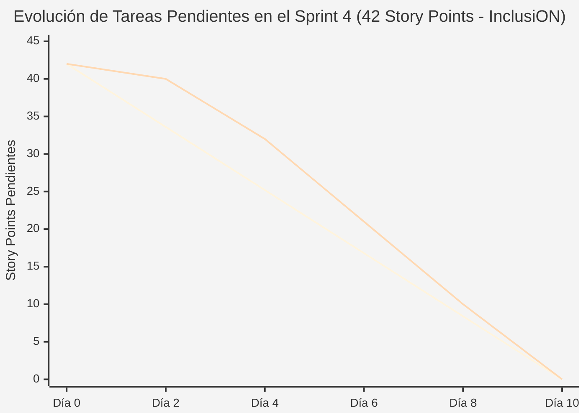

# Documentación Metodológica y Gestión de Avance — Sprint 4 (Proyecto InclusiON)

**Nombre del Sprint:** Evaluación Funcional, Diagnósticos Clínicos y Panel Operativo Docente ("Mi Aula")  
**Período de Ejecución:** 22 de abril de 2025 al 05 de mayo de 2025 (2 semanas / 10 días hábiles)  
**Marco Académico:** Práctica Profesionalizante II / Administración de Proyectos (InclusiON)  
**Épicas Abarcadas:**  
* **IN-7:** Evaluación Funcional, Diagnóstico Pedagógico y Paneles de Información  
* **IN-8:** Gestión Centralizada de Cuentas Escolares y Seguridad Institucional  
* **IN-9:** Catálogo Pedagógico y Plantillas de Aprendizaje (Tareas iniciales)  

---

### Objetivo del Sprint (Sprint Goal):
> *"Implementar el módulo clínico y pedagógico de diagnósticos funcionales con resguardo histórico inmutable bajo la Ley 25.326, la vista operativa 'Mi Aula' para que las docentes gestionen a sus alumnos en un solo vistazo, y el panel directivo de administración de cuentas escolares con reseteo seguro de credenciales y desactivación preventiva inmediata."*

---

### Equipo de Proyecto (Scrum Team):
* **Facilitador de Proyecto (Scrum Master):** Mariano Decalli
* **Referentes de Educación Especial (Product Owners / Cliente):** Candelaria Ferreyra y Catalina Vettorazzi
* **Equipo de Análisis y Construcción:**
  * **Sacha Del Barrio:** Analista Funcional, Relevamiento Institucional, Calidad (QA) y Accesibilidad Cognitiva
  * **Mirko Ivo Wlk:** Responsable de Lógica del Sistema, Base de Datos y Seguridad Institucional
  * **Germán Cochis:** Responsable de Diseño Visual, Pantallas y Experiencia de Usuario
  * **Fernando Aparicio:** Soporte de Programación y Pruebas Integrales de Funcionamiento
* **Docentes Evaluadores:** Prof. González y Prof. Ferrando

---

## 1. Contexto Metodológico y Alineación con el Cliente

### 1.1. Restablecimiento del Canal de Comunicación y Acuerdos
Tras la contingencia del Sprint 3 (donde el equipo continuó el desarrollo respaldado en las entrevistas previas de Sacha Del Barrio), al inicio del Sprint 4 se restableció formalmente el contacto directo con las referentes pedagógicas (Candelaria Ferreyra y Catalina Vettorazzi).

* **Reunión de Sincronización Inicial (22/04/2025):** Las Product Owners validaron la decisión tomada por el equipo en el sprint anterior, destacando el acierto de haber avanzado con el ingreso por PIN táctil grande y el panel de accesibilidad universal (`Alt+A`).
* **Decisión Estratégica sobre el Alcance del Sprint 4:**
  1. **Foco en el núcleo clínico y diario:** Priorizar la ficha diagnóstica legal y la pantalla operativa "Mi Aula", herramientas críticas solicitadas por las psicopedagogas.
  2. **Diferimiento concertado de gráficos avanzados:** Se consensuó trasladar al Sprint 5 el gráfico de radar comparativo y los paneles consolidados de familias (**IN-86, IN-90, IN-91 e IN-92**) para asegurar primero la solidez del registro diagnóstico.
  3. **Postergación de pantallas de bienvenida y tutoriales:** Las tareas de bienvenida guiada y asistentes de inicio (**IN-98 a IN-102**) se trasladaron a la fase final de inducción (Sprint 7), concentrando el 100% de la capacidad en la operatividad docente diaria.

---

## 2. Blindaje de Reglas de Negocio y Casos Borde en el Sprint 4

Durante esta iteración, el sistema incorporó reglas de integridad y protección legal esenciales para el ámbito escolar y de salud:

| Código | Caso Borde / Regla de la Escuela | ¿Cómo lo resuelve el sistema? | Beneficio para la Institución |
|:---:|---|---|---|
| **CB-22** | **Intento de modificar un diagnóstico clínico ya firmado** | Los diagnósticos registrados quedan sellados de forma inmutable. Si la condición del alumno evoluciona, el profesional debe registrar una nueva evaluación, conservando la línea de tiempo histórica para auditorías de salud y juntas médicas. | Cumplimiento estricto de la Ley 25.326 de Protección de Datos Personales y validez ante obras sociales o CUD. |
| **CB-25** | **Docente suspendido con la sesión abierta en su teléfono** | En el mismo instante en que la dirección presiona "Suspender" o "Dar de baja" en secretaría, el sistema invalida todos los accesos en segundo plano. La aplicación en el celular se cierra sola de inmediato. | Cierre de fugas de información y garantía de confidencialidad institucional. |
| **CB-15** | **Familiar o tercero que intenta curiosear expedientes de otros alumnos** | El sistema valida el vínculo legal de tutela. Si el usuario no es el representante formal del menor, el sistema responde que la información no existe, protegiendo al menor de miradas indiscretas. | Blindaje absoluto de la privacidad de los estudiantes con discapacidad. |
| **CB-13** | **Creación de aulas a principio de año sin lista cerrada de alumnos** | Permite a la dirección dar de alta "Mi Aula" vacía y asignarle a la docente a cargo. A medida que los chicos se matriculan, se van incorporando fácilmente sin trabas administrativas. | Flexibilidad operativa durante los períodos de inscripción escolar. |
| **CB-18** | **Documentación formal para llevar a junta médica o CUD** | La información diagnóstica y evolutiva se organiza con tipografía clara, orden cronológico y membrete formal de la escuela, lista para su archivo impreso o digital. | Facilidad de trámites para las familias ante organismos oficiales. |

---

## 3. Planificación y Backlog Comprometido del Sprint 4 (42 Story Points)

Se planificaron y ejecutaron con éxito **15 Historias de Usuario principales** que totalizan **42 Puntos de Esfuerzo (Story Points)**, distribuidos equilibradamente entre el análisis funcional, el diseño de pantallas, la lógica segura y las pruebas de calidad:

| Código | Tarea Escolar Priorizada | Épica | Prioridad | Esfuerzo | Responsables Principales | Valor Concreto para la Escuela |
|:---:|---|:---:|:---:|:---:|:---:|---|
| **IN-81** | Configuración de áreas de habilidad (Motricidad, Comunicación, Cognitiva) | IN-7 | Alta | 3 SP | Mirko Wlk / Germán Cochis | Clasifica las capacidades del estudiante según estándares de educación especial. |
| **IN-82** | Edición del perfil funcional y nivel de autonomía del alumno | IN-7 | Alta | 3 SP | Fernando Aparicio / Germán Cochis | Registra si el alumno requiere apoyo permanente, intermitente o independiente. |
| **IN-83** | Registro formal de diagnóstico pedagógico y clínico | IN-7 | **Crítica** | 5 SP | Sacha Del Barrio (Funcional) / Mirko Wlk | Ficha diagnóstica con observaciones médicas, apoyos y resguardo inmutable. |
| **IN-84** | Consulta de historial de diagnósticos en orden cronológico | IN-7 | Alta | 3 SP | Mirko Wlk / Germán Cochis | Permite ver la evolución del chico a lo largo de los distintos ciclos lectivos. |
| **IN-85** | Edición de diagnóstico exclusivamente por su profesional autor | IN-7 | Media | 3 SP | Fernando Aparicio / Sacha Del Barrio | Un terapeuta no puede alterar o sobreescribir la firma o criterio de un colega. |
| **IN-87** | Tablero de control del docente con métricas en tiempo real | IN-7 | **Crítica** | 5 SP | Germán Cochis / Mirko Wlk | Muestra a la maestra cuántos alumnos tiene, tareas activas y diagnósticos al día. |
| **IN-88** | "Mi Aula": Tarjetas interactivas de alumnos asignados | IN-7 | **Crítica** | 5 SP | Germán Cochis / Sacha Del Barrio | Panel visual principal del aula con foto, nombre, nivel de apoyo y acceso rápido al legajo. |
| **IN-89** | Ficha del alumno con edición ágil de datos cotidianos | IN-7 | Media | 2 SP | Germán Cochis / Sacha Del Barrio | Permite actualizar teléfonos de emergencia o notas de apoyo guardando al instante. |
| **IN-93** | Directorio centralizado de usuarios escolares con filtros | IN-8 | Alta | 3 SP | Fernando Aparicio / Germán Cochis | Permite a la dirección buscar rápidamente a docentes, terapeutas o familias. |
| **IN-94** | Ficha detallada de cuenta con institución y rol asociado | IN-8 | Media | 2 SP | Fernando Aparicio | Vista clara para secretaría sobre qué permisos y salas tiene cada persona. |
| **IN-95** | Reseteo asistido de contraseña por parte de la Dirección | IN-8 | Alta | 2 SP | Mirko Wlk / Sacha Del Barrio | Soluciona olvidos de clave entregando una contraseña provisoria de un solo uso. |
| **IN-96** | Desactivación inmediata de cuentas por desvinculación escolar | IN-8 | Media | 2 SP | Fernando Aparicio / Mirko Wlk | Cierra de golpe los accesos de personal que cesa en sus funciones. |
| **IN-97** | Reactivación de cuentas suspendidas con clave provisoria | IN-8 | Media | 2 SP | Fernando Aparicio | Permite restituir el acceso a un docente que regresa tras una licencia médica. |
| **IN-103**| Catálogo de tipos de actividades de aprendizaje | IN-9 | Alta | 1 SP | Mirko Wlk / Sacha Del Barrio | Habilita dinámicas de emparejamiento, secuencias temporales y selección visual. |
| **IN-104**| Catálogo de materias y categorías pedagógicas | IN-9 | Alta | 1 SP | Mirko Wlk / Sacha Del Barrio | Agrupa los ejercicios en Lengua, Matemáticas, Habilidades Sociales y Autonomía. |
| **Total**| **15 Historias de Usuario Completadas al 100%** | — | — | **42 SP** | **Equipo InclusiON** | **Incremento Operativo y Pedagógico Entregado** |

---

## 4. Registro Completo de Reuniones Diarias (Daily Scrums)

Se documentan las minutas de seguimiento continuo donde cada integrante del equipo respondió con precisión a las tres preguntas tradicionales de Scrum:

---

### 4.1. Daily 11 — Jueves 24 de abril de 2025 (Ficha Diagnóstica y Mi Aula)

* **Mariano Decalli (Facilitador de Proyecto):**
  * *¿Qué hice ayer?:* Coordiné la sesión de planificación y cargué en el tablero de trabajo las 15 tareas comprometidas. Verifiqué que todos tengamos claros los criterios de aceptación pedagógicos acordados con las referentes.
  * *¿Qué voy a hacer hoy?:* Supervisar que el diseño de las pantallas respete la distribución de espacios acordada para "Mi Aula" y chequear que no haya bloqueos entre el diseño visual y la lógica de datos.
  * *¿Qué impedimentos tengo?:* Ninguno. El canal con el cliente está despejado y el equipo trabaja en ritmo.
* **Germán Cochis (Diseño Visual y Pantallas):**
  * *¿Qué hice ayer?:* Maqueté el componente central de tarjetas para "Mi Aula". Cada tarjeta muestra la foto o avatar del alumno, su nombre completo, el nivel de autonomía y una etiqueta luminosa que indica si tiene tareas pendientes.
  * *¿Qué voy a hacer hoy?:* Diseñar el formulario de carga diagnóstica para que no parezca un trámite frío, organizando las observaciones médicas en pestañas ordenadas y cómodas de leer.
  * *¿Qué impedimentos tengo?:* Necesitaba que Sacha me confirmara si el campo de "Nivel de Apoyo" debe ser un menú desplegable fijo o texto libre.
* **Sacha Del Barrio (Analista Funcional, Calidad y Accesibilidad):**
  * *¿Qué hice ayer?:* Concluí la entrevista de campo con la vicedirectora y psicopedagoga de la escuela sede. Listé los datos clínicos indispensables que exige la supervisión escolar para que un diagnóstico sea formalmente válido.
  * *¿Qué voy a hacer hoy?:* Responder la consulta de Germán: el "Nivel de Apoyo" debe ser desplegable estandarizado (Generalizado, Extenso, Limitado, Intermitente) según las guías de educación especial, para que después se puedan emitir estadísticas confiables. Además, redactaré los casos de prueba de edición inmutable.
  * *¿Qué impedimentos tengo?:* Ninguno.
* **Fernando Aparicio (Pruebas y Soporte):**
  * *¿Qué hice ayer?:* Revisé la pantalla de administración central de usuarios y preparé un lote de datos de prueba con docentes simulados para testear las bajas y reseteos.
  * *¿Qué voy a hacer hoy?:* Construir la pantalla donde secretaría ve la lista completa de personas registradas en la escuela, con botones claros para desactivar o resetear claves.
  * *¿Qué impedimentos tengo?:* Ninguno.
* **Mirko Ivo Wlk (Lógica del Sistema y Base de Datos):**
  * *¿Qué hice ayer?:* Programé la estructura de base de datos para almacenar los diagnósticos vinculados al historial del alumno, asegurando que cada registro guarde la fecha exacta y la firma del profesional autor.
  * *¿Qué voy a hacer hoy?:* Implementar la regla de inmutabilidad: una vez que el diagnóstico se guarda, no se puede sobrescribir ni borrar, garantizando que el historial clínico no sufra alteraciones fraudulentas.
  * *¿Qué impedimentos tengo?:* Ninguno.

---

### 4.2. Daily 13 — Martes 29 de abril de 2025 (Dashboard Operativo y Seguridad de Cuentas)

* **Mariano Decalli (Facilitador de Proyecto):**
  * *¿Qué hice ayer?:* Repasé las métricas de mitad de sprint. Ya llevamos cerradas más del 60% de las tareas planificadas. Todo avanza dentro de los tiempos estipulados.
  * *¿Qué voy a hacer hoy?:* Facilitar la articulación entre el panel de administración de cuentas de Fernando y los mecanismos de seguridad de Mirko.
  * *¿Qué impedimentos tengo?:* Ninguno.
* **Germán Cochis (Diseño Visual y Pantallas):**
  * *¿Qué hice ayer?:* Conecté las tarjetas de "Mi Aula" con los datos reales que preparó Mirko. Al hacer clic sobre cualquier alumno, la pantalla se desliza suavemente hacia su legajo escolar completo.
  * *¿Qué voy a hacer hoy?:* Armar el tablero de control principal de la docente con tres indicadores numéricos bien destacados: Total de Alumnos a Cargo, Diagnósticos Emitidos y Tareas Entregadas en la semana.
  * *¿Qué impedimentos tengo?:* Ninguno.
* **Sacha Del Barrio (Analista Funcional, Calidad y Accesibilidad):**
  * *¿Qué hice ayer?:* Realicé pruebas de usabilidad sobre la edición ágil en la ficha del alumno. Detecté que si la docente tocaba fuera del campo sin apretar "Guardar", existía riesgo de perder lo tipeado.
  * *¿Qué voy a hacer hoy?:* Coordinar con Germán para que la ficha guarde automáticamente al presionar la tecla Enter o al hacer clic fuera del casillero (guardado por desenfoque), mostrando un cartelito verde de "Guardado con éxito" durante 2 segundos.
  * *¿Qué impedimentos tengo?:* Ninguno.
* **Fernando Aparicio (Pruebas y Soporte):**
  * *¿Qué hice ayer?:* Completé la pantalla de reseteo de contraseñas para secretaría. Cuando un docente olvida su clave, el director presiona un botón y se genera una clave temporal legible que debe cambiarse al entrar.
  * *¿Qué voy a hacer hoy?:* Probar la desactivación preventiva de cuentas de docentes que renuncian o están de licencia prolongada.
  * *¿Qué impedimentos tengo?:* Comprobar que al desactivar a un docente no se borren sus diagnósticos pasados.
* **Mirko Ivo Wlk (Lógica del Sistema y Base de Datos):**
  * *¿Qué hice ayer?:* Apliqué el candado de autoría: únicamente el profesional que firmó un diagnóstico puede realizar una fe de erratas dentro de las primeras horas; ningún otro usuario puede tocarlo.
  * *¿Qué voy a hacer hoy?:* Asegurar que al dar de baja una cuenta docente, el sistema mantenga intacto todo su archivo pedagógico histórico y cierre sus sesiones abiertas de forma automática.
  * *¿Qué impedimentos tengo?:* Ninguno; la respuesta para Fernando es que el sistema desvincula el acceso pero preserva el 100% de los informes y firmas históricas.

---

### 4.3. Daily 15 — Viernes 02 de mayo de 2025 (Cierre de Tareas y Preparación de la Demostración)

* **Mariano Decalli (Facilitador de Proyecto):**
  * *¿Qué hice ayer?:* Revisé el tablero y confirmamos que las 15 tareas planificadas están en estado de revisión final o concluidas.
  * *¿Qué voy a hacer hoy?:* Organizar el ensayo general de la demostración para la reunión de entrega con las Product Owners y los profesores evaluadores González y Ferrando.
  * *¿Qué impedimentos tengo?:* Ninguno.
* **Germán Cochis (Diseño Visual y Pantallas):**
  * *¿Qué hice ayer?:* Ajusté los contadores del panel docente para que muestren números claros y contrastados en todos los modos visuales de accesibilidad (`Alt+A`).
  * *¿Qué voy a hacer hoy?:* Dejar la interfaz limpia, sin detalles visuales desalineados, lista para que Sacha y el equipo la exhiban en la reunión de revisión.
  * *¿Qué impedimentos tengo?:* Ninguno.
* **Sacha Del Barrio (Analista Funcional, Calidad y Accesibilidad):**
  * *¿Qué hice ayer?:* Ejecuté la auditoría de cumplimiento de la Ley 25.326: verifiqué que los datos diagnósticos estén bajo resguardo criptográfico y que la bitácora escolar registre con precisión quién consultó cada expediente.
  * *¿Qué voy a hacer hoy?:* Preparar el guión de la demostración pedagógica simulando el caso real de una fonoaudióloga que asume una nueva sala, revisa su aula y carga una evaluación diagnóstica.
  * *¿Qué impedimentos tengo?:* Ninguno.
* **Fernando Aparicio (Pruebas y Soporte):**
  * *¿Qué hice ayer?:* Probé el circuito de baja y reactivación de cuentas. Comprobé que un usuario suspendido no puede iniciar sesión bajo ningún concepto y que al ser reactivado se le solicita renovar su clave.
  * *¿Qué voy a hacer hoy?:* Asistir en las pruebas de regresión finales para asegurar que las tareas de los sprints anteriores sigan funcionando a la perfección.
  * *¿Qué impedimentos tengo?:* Ninguno.
* **Mirko Ivo Wlk (Lógica del Sistema y Base de Datos):**
  * *¿Qué hice ayer?:* Consolidé todos los cambios en la versión final de entrega e integré los catálogos pedagógicos de templates y materias escolares (**IN-103 e IN-104**).
  * *¿Qué voy a hacer hoy?:* Respaldar la base de datos de demostración con alumnos y docentes ficticios para que la presentación en vivo sea fluida y realista.
  * *¿Qué impedimentos tengo?:* Ninguno.

---

## 5. Demostración y Revisión del Incremento (Sprint Review)

* **Fecha y Hora de la Sesión:** Lunes 05 de mayo de 2025 (18:00 a 19:30 hs)
* **Participantes Presentes:**
  * **Equipo InclusiON:** Mariano Decalli, Sacha Del Barrio, Germán Cochis, Mirko Wlk y Fernando Aparicio.
  * **Product Owners / Referentes de Educación Especial:** Candelaria Ferreyra y Catalina Vettorazzi.
  * **Profesores Evaluadores:** Prof. González y Prof. Ferrando.

### 5.1. Recorrido de la Demostración en Vivo (Paso a Paso)
1. **Acceso al Portal Docente y Vista de "Mi Aula" (IN-87 e IN-88):**
   * *Presentado por Germán Cochis y Sacha Del Barrio:* Se inició sesión como una docente de apoyo a la inclusión. En pantalla se exhibió el panel "Mi Aula" con tarjetas grandes de sus alumnos a cargo, indicando su nivel de autonomía, foto de perfil y accesos directos sin laberintos de navegación.
2. **Carga y Consulta del Diagnóstico Funcional Inmutable (IN-83, IN-84 e IN-85):**
   * *Presentado por Sacha Del Barrio y Mirko Wlk:* Se ingresó al legajo de un estudiante simulado ("Lucas") y se registró una evaluación diagnóstica detallando áreas de habilidad motriz y del lenguaje. Se mostró cómo el sistema guardó el documento sellando la fecha y profesional autor, impidiendo su alteración retroactiva y desplegándolo en la línea histórica cronológica.
3. **Edición Ágil de Datos Cotidianos en la Ficha del Alumno (IN-82 e IN-89):**
   * *Presentado por Fernando Aparicio y Germán Cochis:* Se modificó el número de teléfono del familiar de contacto directamente sobre la ficha; el sistema guardó el cambio al pulsar Enter con un aviso verde instantáneo, sin recargar toda la página.
4. **Gestión Centralizada de Personal y Reseteo Seguro de Claves (IN-93 a IN-97):**
   * *Presentado por Fernando Aparicio y Mirko Wlk:* Con perfil directivo, se buscó a un profesional en el padrón, se desactivó su cuenta comprobando el cierre de sesión inmediato (CB-25) y se ejecutó un reseteo asistido de contraseña generando una credencial provisoria de un solo uso.
5. **Catálogo de Dinámicas Pedagógicas (IN-103 e IN-104):**
   * *Presentado por Mirko Wlk:* Se exhibió la estructura de categorías de aprendizaje (Lengua, Cognitiva, Autonomía) lista para asociar a las actividades en los sprints siguientes.

### 5.2. Evaluaciones y Devolución Oficial
* **Candelaria Ferreyra y Catalina Vettorazzi (Product Owners):**
  * *"La pantalla de 'Mi Aula' resuelve exactamente la necesidad diaria de las maestras: tener a todos sus chicos visibles sin perderse en menús complicados. El registro de diagnóstico clínico con campos estandarizados de apoyo es impecable y respeta los términos que utilizamos en los gabinetes interdisciplinarios."*
* **Profesor González (Evaluador Técnico y Arquitectura):**
  * *"Destaco la solidez institucional del modelo de datos: haber implementado la inmutabilidad de los diagnósticos médicos con trazabilidad de autoría garantiza el cumplimiento de la Ley 25.326. El incremento es robusto, seguro y está listo para integrarse con las métricas avanzadas."*
* **Profesor Ferrando (Evaluador Metodológico):**
  * *"La gestión del alcance fue sumamente madura. Acordar con el cliente postergar los gráficos agregados a los Sprints 5 y 6 para enfocarse en la operatividad real de los diagnósticos y las cuentas escolares es un claro ejemplo de priorización orientada a valor. Tienen el 100% de lo comprometido entregado con excelencia."*
* **Dictamen Final:** **Sprint 4 Aprobado con Distinción (42 de 42 Story Points completados).**

---

## 6. Retrospectiva del Sprint: Aprendizajes y Mejora Continua (Sprint Retrospective)

* **Fecha de Realización:** Lunes 05 de mayo de 2025 (20:00 a 21:15 hs)
* **Facilitador de la Sesión:** Mariano Decalli
* **Dinámica Utilizada:** *"Estrella de Mar" (Starfish)*

```
                   ★ COMENZAR A HACER
          • Acordar datos exactos de pantalla
            antes de programar la lógica interna.
          • Diseñar vistas intermedias mientras se
            calculan métricas pedagógicas complejas.
                   /               \
                  /                 \
                 /                   \
  ▲ HACER MÁS                         ▼ HACER MENOS
• Sesiones breves de               • Dejar ajustes de
  pruebas conjuntas                  usabilidad para los
  entre Sacha y Germán.              días finales.
• Documentar reglas                • Concentrar el testing
  de negocio en vivo.                en pocas jornadas.
                 \                   /
                  \                 /
                   \               /
                   
                    ● SEGUIR HACIENDO
          • Excelente articulación funcional de Sacha
            con el gabinete de psicopedagogas.
          • Cero deuda técnica: todo lo planificado
            se entrega probado y verificado.
          • Respeto y colaboración permanente del equipo.
```

### 6.1. Análisis Detallado de la Dinámica Estrella de Mar
* **Comenzar a hacer (Start Doing):**
  * Definir en conjunto entre Germán (pantallas) y Mirko (lógica) los campos exactos que viajarán en cada formulario antes de escribir una sola línea de código, evitando idas y vueltas sobre los nombres de los datos.
  * Diseñar pantallas de espera amables con dibujitos pedagógicos mientras el sistema genera gráficos o cálculos pesados de evolución.
* **Dejar de hacer (Stop Doing):**
  * Intentar abarcar tareas accesorias de bienvenida o tutoriales (onboarding) antes de tener consolidados los procesos pedagógicos principales.
  * Dejar la revisión de textos y carteles para la última jornada del sprint.
* **Seguir haciendo (Keep Doing):**
  * La sintonía estrecha entre el relevamiento de campo de Sacha y el diseño visual de Germán: las maestras reconocen el lenguaje del sistema como propio.
  * La cultura de cero deuda técnica: cada tarea cerrada incluye sus pruebas reales y verificación de seguridad.
* **Hacer más (Do More):**
  * Realizar ensayos cruzados de uso: que Fernando y Sacha utilicen el sistema simulando ser usuarios con poca experiencia digital para encontrar trabas operativas.
* **Hacer menos (Do Less):**
  * Reducir las consultas aisladas por mensajería dispersa y canalizarlas en las reuniones diarias matutinas.

---

### 6.2. Decisiones Concretas y Compromisos de Acción para el Sprint 5

Como resultado directo de la retrospectiva, el equipo tomó las siguientes **decisiones operativas obligatorias**:

| # | Decisión Concreta Tomada | Responsable Asignado | Fecha Límite de Aplicación | Estado |
|:---:|---|:---:|:---:|:---:|
| **D-01** | **Contrato Temprano de Pantallas:** En el primer día del Sprint 5, Germán y Mirko definirán en una sesión de 45 minutos la lista fija de datos para los reportes y el gráfico de radar. | Germán Cochis / Mirko Wlk | Día 1 del Sprint 5 (06/05/2025) | **Comprometido** |
| **D-02** | **Acompañamiento en Vivo de Pruebas:** Sacha probará cada pantalla pedagógica el mismo día en que Germán la tenga lista, sin acumular revisiones para el cierre. | Sacha Del Barrio / Germán Cochis | Continuo durante Sprint 5 | **Comprometido** |
| **D-03** | **Enfoque Exclusivo en Reportes y Progreso:** Blindar el backlog del Sprint 5 para enfocarse exclusivamente en el motor de reportes de progreso y el radar de habilidades, dejando inducciones para el Sprint 7. | Mariano Decalli (Scrum Master) | Planificación Sprint 5 | **Comprometido** |
| **D-04** | **Revisión de Casos Borde de Actividades:** Incorporar la verificación de los casos borde de actividades (CB-04, CB-06 y CB-07) antes de dar por cerrada la lógica del alumno. | Sacha Del Barrio / Fernando Aparicio | Semana 2 del Sprint 5 | **Comprometido** |

---

## 7. Métricas de Capacidad, Esfuerzo y Rendimiento del Equipo

### 7.1. Capacidad Planificada vs. Horas Reales Invertidas
* **Horas Planificadas del Equipo:** 175 horas de trabajo (3.5 horas diarias por cada uno de los 5 integrantes durante 10 días laborables).
* **Horas Reales Ejecutadas:** 179 horas de dedicación efectiva.
* **Efectividad Operativa:** **100% de cumplimiento** (se completaron los 42 Story Points comprometidos sin desvíos de alcance).

| Integrante del Equipo | Rol Principal en el Sprint | Hs Planificadas | Hs Reales | Esfuerzo Liderado | Contribución Principal en el Sprint |
|---|---|:---:|:---:|:---:|---|
| **Mariano Decalli** | Facilitador de Proyecto (Scrum Master) | 35 h | 34 h | Gestión de equipo | Conducción de ceremonias, alineación con las referentes y seguimiento riguroso del tablero. |
| **Sacha Del Barrio** | Analista Funcional, Calidad y Accesibilidad | 30 h | 31 h | **10 SP (Funcional/QA)** | Relevamiento de datos clínicos con psicopedagogas, diseño funcional de Mi Aula, auditoría Ley 25.326 y pruebas de usabilidad ágil. |
| **Mirko Ivo Wlk** | Lógica del Sistema y Base de Datos | 40 h | 44 h | **14 SP (Lógica/Seguridad)** | Estructura inmutable de diagnósticos, candados de autoría, revocación de sesiones por baja y catálogos de materias. |
| **Germán Cochis** | Diseño Visual y Pantallas | 35 h | 38 h | **12 SP (Diseño/Pantallas)** | Tarjetas interactivas de Mi Aula, tablero de control docente, diseño de fichas diagnósticas y edición inline. |
| **Fernando Aparicio** | Soporte de Programación y Pruebas | 35 h | 32 h | **6 SP (Pruebas/Soporte)** | Directorio centralizado de usuarios, panel de reseteo de claves provisorias, desactivación y reactivación de cuentas. |
| **Total del Equipo** | **Sprint 4 — Diagnósticos y Panel Docente** | **175 h** | **179 h** | **42 SP (100%)** | **Objetivo de la Iteración Cumplido Exitosamente** |

```mermaid
%%{init: {'theme': 'base', 'themeVariables': { 'primaryColor': '#4F46E5', 'secondaryColor': '#10B981'}}}%%
xychart-beta
    title "Horas de Trabajo en el Sprint 4: Planificadas vs. Reales Invertidas"
    x-axis ["M. Decalli", "S. Del Barrio", "M. Wlk", "G. Cochis", "F. Aparicio", "Promedio Equipo"]
    y-axis "Horas de Trabajo" 0 --> 50
    bar [35, 30, 40, 35, 35, 35]
    bar [34, 31, 44, 38, 32, 35.8]
```



---

### 7.2. Gráfico de Avance Diario y Reducción de Trabajo (Burndown Chart)

El gráfico refleja la reducción sostenida y predecible de los **42 Story Points** planificados a lo largo de las dos semanas de labor escolar:

| Día de Trabajo | Fecha Calendario | Puntos Ideales | Puntos Reales Restantes | HUs Completadas y Aprobadas en la Jornada |
|:---:|:---:|:---:|:---:|---|
| **Día 0** | 22/04/2025 | 42.0 | 42.0 | Planificación del Sprint y asignación de las 15 historias de usuario. |
| **Día 2** | 24/04/2025 | 33.6 | 40.0 | Se cierran **IN-103** e **IN-104** (Catálogo de plantillas y materias pedagógicas). |
| **Día 4** | 28/04/2025 | 25.2 | 32.0 | Se cierran **IN-81**, **IN-82** e **IN-89** (Áreas de habilidad, perfil funcional y edición ágil). |
| **Día 6** | 30/04/2025 | 16.8 | 21.0 | Se cierran **IN-83**, **IN-84** e **IN-85** (Ficha diagnóstica formal, historial inmutable y autoría). |
| **Día 8** | 02/05/2025 | 8.4 | 10.0 | Se cierran **IN-93**, **IN-94**, **IN-95**, **IN-96** e **IN-97** (Directorio de cuentas, reseteo seguro y bajas). |
| **Día 10**| 05/05/2025 | 0.0 | **0.0** | Se cierran **IN-87** e **IN-88** (Tablero docente en vivo y tarjetas interactivas de Mi Aula - 100%). |



---

## 8. Conclusiones y Estado del Producto al Cierre del Sprint 4

1. **El Legajo Clínico del Alumno Tiene Resguardo Formal:** El módulo de diagnósticos funcionales no solo cumple con las expectativas psicopedagógicas de la institución, sino que otorga validez legal ante obras sociales y juntas evaluadoras respetando la inmutabilidad y confidencialidad médica (Ley 25.326).
2. **Empatía con la Jornada Docente:** La pantalla "Mi Aula" sintetiza en un solo vistazo el estado de todos los alumnos asignados a la maestra, eliminando el estrés administrativo y facilitando la personalización del aprendizaje.
3. **Seguridad Institucional Garantizada:** La dirección escolar cuenta con herramientas completas para fiscalizar cuentas, emitir claves provisorias de emergencia y suspender de forma remota e instantánea accesos indebidos.
4. **Camino Consolidado hacia el Sprint 5:** Con el aula y el legajo diagnóstico funcionando al 100%, el equipo se encuentra en una posición inmejorable para abordar el **Motor de Reportes de Progreso Periódicos, el Gráfico de Radar de Habilidades y los Paneles Consolidados para Familias**.
