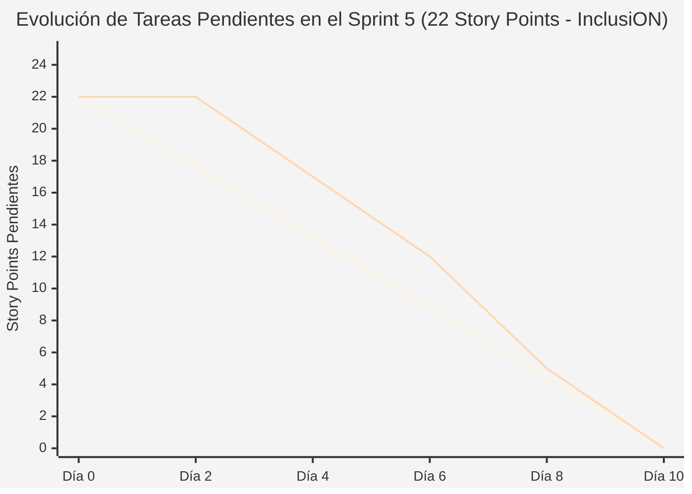

# Documentación Metodológica y Gestión de Avance — Sprint 5 (Proyecto InclusiON)

**Nombre del Sprint:** Reportes Pedagógicos de Progreso, Portal Familiar y Plan de Transición a Práctica III  
**Período de Ejecución:** 06 de mayo de 2025 al 19 de mayo de 2025 (2 semanas / 10 días hábiles)  
**Marco Académico:** Práctica Profesionalizante II / Administración de Proyectos (InclusiON)  
**Épica Principal:** IN-12 — Reportes Pedagógicos y Portal Familiar (Integrada con IN-7)  

---

### Objetivo del Sprint (Sprint Goal):
> *"Construir el circuito integral de Reportes Pedagógicos de Progreso: permitir que las docentes redacten borradores de avance con objetivos cumplidos y recomendaciones futuras, que la dirección escolar revise y certifique los informes con justificación obligatoria ante rechazos, y que las familias accedan a través de su portal móvil a un resumen claro, comprensible y protegido bajo la Ley 25.326, consolidando el estado honesto del backlog y el Plan de Práctica Profesionalizante III."*

---

### Equipo de Proyecto (Scrum Team):
* **Facilitador de Proyecto (Scrum Master):** Mariano Decalli
* **Referentes de Educación Especial (Product Owners / Cliente):** Candelaria Ferreyra y Catalina Vettorazzi
* **Equipo de Análisis y Construcción:**
  * **Sacha Del Barrio:** Analista Funcional, Relevamiento Institucional, Calidad (QA) y Accesibilidad Cognitiva
  * **Germán Cochis:** Responsable de Diseño Visual, Pantallas y Experiencia de Usuario
  * **Fernando Aparicio:** Responsable de Lógica del Sistema, Base de Datos, Seguridad y Pruebas
* **Docentes Evaluadores:** Prof. González y Prof. Ferrando

---

## 1. Requisitos del Analista Funcional (Sacha Del Barrio)

El diseño de las salidas documentales de InclusiON surge de una rigurosa investigación de campo en escuelas de educación especial y gabinetes psicopedagógicos. Cada reporte no es un simple listado de datos, sino un **instrumento formal de comunicación y toma de decisiones escolares, familiares y médicas**.

---

### 1.1. Los 7 Dolores Reales del Negocio que Originan los Reportes

El relevamiento institucional identificó siete problemas estructurales que sufría la escuela antes de InclusiON:
1. **Información Descentralizada:** Cada profesional (psicopedagoga, terapeuta ocupacional, docente) tenía sus notas en carpetas separadas, haciendo imposible armar un informe interdisciplinario unificado.
2. **Procesos Manuales y Pérdida de Horas:** Las maestras cronometraban a mano las tareas y gastaban fines de semana enteros pasando notas en limpio.
3. **Barreras de Accesibilidad:** Los sistemas tradicionales exigían correos y contraseñas complejas que excluían a los estudiantes con discapacidad motriz o cognitiva.
4. **Seguimiento Profesional Tardío:** Los informes se entregaban meses después de ocurridos los hechos, perdiendo la oportunidad de intervenir a tiempo.
5. **Comunicación Fragmentada con la Familia:** Las novedades viajaban en cuadernos de comunicaciones que se perdían en la mochila o en mensajes informales de WhatsApp que invadían la privacidad del docente.
6. **Falta de Estandarización:** Cada docente evaluaba con criterios dispares, dificultando la comparación de avances año tras año.
7. **Sobrestimulación y Frustración:** Las aplicaciones comunes ponían "notas rojas" o bloqueaban al alumno ante fallos reiterados, generando crisis emocionales en el aula.

---

### 1.2. El Marco Legal que Obliga a la Escuela a Emitir Estos Reportes

Cada salida documental está respaldada por una normativa legal argentina que la institución debe cumplir ante supervisiones ministeriales y obras sociales:
* **Resolución CFE 311/16 (Consejo Federal de Educación):** Exige que todo estudiante con discapacidad integrado en escuela común o especial cuente con un **Proyecto Pedagógico Individual (PPI)** que fundamente legalmente su promoción, acreditación y titulación oficial.
* **Ley 24.901 (Prestaciones Básicas en Discapacidad):** Obliga a presentar informes evolutivos periódicos y diagnósticos funcionales para que la **Junta Médica renueve el CUD** y las **Obras Sociales/Prepagas reintegren el costo de maestras de apoyo, terapias y transporte adaptado**.
* **Ley 25.326 (Protección de Datos Personales - Art. 8):** Establece el secreto profesional y resguardo inviolable sobre los **datos sensibles de salud y diagnósticos médicos** de menores de edad.
* **Ley 26.206 (Ley de Educación Nacional):** Garantiza la trayectoria escolar continua, prohibiendo que un estudiante quede desatendido por cambios o renuncias de docentes.
* **Ley 27.044 (Jerarquía Constitucional de la Convención sobre los Derechos de las Personas con Discapacidad):** Consagra el derecho a la información accesible (Art. 9) y a la educación inclusiva sin discriminación (Art. 24).

---

### 1.3. Matriz Maestra de Trazabilidad 360°

| Salida / Reporte | Dolor Real que Resuelve | Etapa y Control Institucional Auditado | Marco Legal / Regulatorio | Requerimiento Formal (HU) | Regla de Negocio / Caso Borde Garantizado |
|---|---|---|---|:---:|:---:|
| **1. Evaluación Inicial y Diagnóstico Funcional** | Matriculación a ciegas e improvisación de consignas. | **Etapa 1:** Diagnóstico inicial.<br>**Control 1:** Diagnóstico completo y nivel de apoyo estandarizado. | **Ley 24.901** (Admisión y categorización de apoyos). | **HU-01** (Catálogos)<br>**HU-08** (Diagnósticos)<br>**IN-83 / IN-84** | **CB-22:** Inmutabilidad de diagnósticos firmados.<br>**CB-13:** Aulas flexibles a principio de año.<br>**V-35:** Fecha diagnóstica no futura. |
| **2. Seguimiento Mensual y Alertas de Aula** | Detección tardía de fatiga sensorial y crisis emocionales. | **Etapa 3:** Intervención directa.<br>**Control 4:** Seguridad y bienestar emocional en aula. | **Pedagogía Inclusiva:** Modelo social sin notas punitivas. | **HU-06** (Actividades)<br>**HU-10** (Motor MDA)<br>**IN-87 / IN-88** | **CB-07:** Alerta de apoyo docente en lugar de nota roja.<br>**CB-24:** Medición silenciosa de frustración. |
| **3. Informe Trimestral (Boletín Inclusivo)** | Redacción informal, atrasos burocráticos y falta de control directivo. | **Etapa 5:** Monitoreo y seguimiento.<br>**Control 6:** Información fluida entre escuela y hogar. | **Estatuto Docente y Reglamentos de Escuelas Especiales.** | **HU-04** (Portal familiar)<br>**HU-08** (Reportes)<br>**IN-105 / IN-106** | **CB-14:** Devolución con motivo obligatorio ante rechazo directivo.<br>**CB-12:** Archivo formal en legajo.<br>**V-38 / V-39:** Autoría protegida. |
| **4. Proyecto Pedagógico Individual (PPI)** | Falta de validez ministerial para el pase de grado adaptado. | **Etapa 2:** Planificación curricular.<br>**Control 2:** Objetivos claros, alcanzables y medibles. | **Resolución CFE 311/16** (Validez de la inclusión escolar). | **HU-05** (Roadmap)<br>**HU-10** (Adaptabilidad)<br>**IN-63 / IN-110** | **CB-20:** Separación limpia entre sendero lúdico y tareas escolares.<br>**V-24:** Un único plan curricular activo por año. |
| **5. Informe Anual de Cierre y Continuidad** | Pérdida de antecedentes escolares por renuncia o rotación de docentes. | **Etapa 6:** Evaluación final y proyección.<br>**Control 7:** Documentación completa y archivo histórico. | **Ley 26.206** (Garantía de trayectoria escolar continua). | **HU-08** (Cierre formal)<br>**HU-11** (Gobernanza)<br>**IN-64** | **CB-01:** Freno de mano: prohibido dar de baja docentes con informes pendientes.<br>**CB-05:** El esfuerzo del chico no se pierde. |
| **Salida A: Constancia A4 para CUD y Obra Social** | Familias esperando semanas por certificados para no perder coberturas. | **Servicio de Secretaría Escolar:** Emisión inmediata membretada. | **Superintendencia de Servicios de Salud (SSS)** y Juntas CUD. | **IN-108** (Tablero familiar)<br>**Servicio de Impresión A4** | **CB-18:** Exportador formal en hoja A4 con membrete institucional.<br>**CB-25:** Cierre remoto inmediato ante desvinculación. |
| **Salida B: Portal Familiar en Celular** | Desconexión de los padres y lenguaje médico incomprensible. | **Etapa 4:** Acompañamiento, contención y orientación familiar. | **Ley 27.044** (Art. 9 y 24: Información accesible). | **HU-04** (Portal familiar)<br>**HU-14** (Accesibilidad)<br>**IN-75 a IN-77** | **CB-15:** Blindaje de privacidad ante padres curiosos.<br>**CB-04:** Tolerancia a entregas de tareas fuera de fecha. |
| **Salida C: Bitácora de Auditoría de Salud** | Fugas de diagnósticos confidenciales y desprotección legal. | **Gobernanza y Ciberseguridad Institucional.** | **Ley 25.326** (Art. 8: Datos sensibles bajo secreto médico). | **HU-IN-172** (Autorización)<br>**HU-IN-173** (Cifrado) | **CB-23:** Prohibido el chat entre usuarios sin alumno en común.<br>**V-42:** Revocación instantánea de sesiones. |

---

### 1.4. Circuito Funcional Horizontal del Reporte

```mermaid
%%{init: {'theme': 'base', 'themeVariables': { 'fontFamily': 'Segoe UI, Helvetica, Arial', 'fontSize': '12px'}}}%%
flowchart LR
    classDef etapaDoc fill:#FFF9E6,stroke:#D4A017,stroke-width:2px,color:#222;
    classDef etapaDir fill:#EDF5FC,stroke:#4A90E2,stroke-width:2px,color:#222;
    classDef etapaSis fill:#EEF8ED,stroke:#4CAF50,stroke-width:2px,color:#222;
    classDef etapaFam fill:#F8EEF8,stroke:#9C27B0,stroke-width:2px,color:#222;
    classDef decision fill:#FFF2CC,stroke:#D6B656,stroke-width:2px,color:#222;
    classDef alerta fill:#FDE8E8,stroke:#E53935,stroke-width:1.5px,color:#900;
    classDef aprobado fill:#E8F5E9,stroke:#2E7D32,stroke-width:2px,font-weight:bold,color:#1B5E20;

    subgraph E1["Paso 1: Redacción de la Docente"]
        A["Cierre del período escolar<br>(Trimestre / Semestre)"] --> B["Carga de avances cualitativos:<br>• Logros alcanzados<br>• Dificultades detectadas<br>• Recomendaciones de apoyo"]
        B --> C["Informe en Borrador<br>(Editable solo por la docente)"]
        C --> D["Acción de la docente:<br>Enviar a Dirección"]
    end

    subgraph E2["Paso 2: Revisión de la Dirección"]
        E["Bandeja de pendientes<br>en la Dirección escolar"] --> F{"¿Cumple los<br>criterios de la<br>institución?"}
        F -- "NO" --> G["Rechazo con motivo<br>obligatorio por escrito"]
        F -- "SÍ" --> H["Aprobación y firma formal<br>de la Dirección"]
    end

    subgraph E3["Paso 3: Archivo y Aviso"]
        I["Sellado definitivo en el<br>legajo digital del alumno"] --> J["Aviso automático por<br>correo a los tutores"]
    end

    subgraph E4["Paso 4: Familia y Trámites"]
        K["Lectura del informe desde<br>el celular de la familia"] --> L["Impresión formal en hoja A4:<br>• Renovación de CUD<br>• Presentación en Obra Social"]
    end

    D --> E
    G --> C
    H --> I
    J --> K

    class E1,A,B,C,D etapaDoc;
    class E2,E etapaDir;
    class F decision;
    class G alerta;
    class H aprobado;
    class E3,I,J etapaSis;
    class E4,K,L etapaFam;
```



---

### 1.5. Descripción Exhaustiva del Valor que Entrega Cada Salida

#### Salida 1: Evaluación Inicial y Diagnóstico Funcional
* **Qué es:** La radiografía clínica y pedagógica que establece la línea de base del estudiante al ingresar a la escuela.
* **Para la Dirección Escolar:**
  * *Homogeneidad de criterios:* Unifica la forma en que el colegio evalúa, evitando apreciaciones dispares o subjetivas entre profesionales.
  * *Armado equilibrado de salas:* Permite conformar grupos de aula balanceados, distribuyendo adecuadamente las maestras de apoyo y terapeutas según el nivel de asistencia requerido.
  * *Respaldo formal:* Otorga una carpeta de admisión sólida y ordenada para responder ante inspecciones ministeriales o auditorías de obras sociales.
* **Para la Docente y el Gabinete:**
  * *Conocimiento previo:* Conoce el perfil sensorial, el nivel de autonomía y los intereses del alumno antes del primer día de clases.
  * *Cero improvisación:* Elimina semanas de ensayo y error al asignar consignas que el estudiante realmente comprende y puede resolver.
  * *Línea de base objetiva:* Fundamenta qué habilidades se deben estimular primero en la hoja de ruta.
* **Para la Familia:**
  * *Contención profesional inmediata:* Perciben que la escuela no ve a su hijo como un problema, sino como una persona con un plan diseñado a su medida.
  * *Escucha activa:* Formaliza las rutinas del hogar, las señales de cansancio y las estrategias que ya funcionan en casa.
  * *Claridad y tranquilidad:* Conocen desde el inicio los objetivos del ciclo lectivo, disipando la incertidumbre.
* **Para el Estudiante con Discapacidad:**
  * *Entorno adaptado desde el inicio:* Ingresa con su método de acceso configurado (PIN táctil grande o asistido) y su modo visual óptimo (alto contraste o dislexia).
  * *Prevención de la sobrecarga:* Recibe desafíos acordes a su motricidad y cognición, evitando crisis o frustraciones tempranas.

---

#### Salida 2: Informe de Seguimiento Mensual y Alertas de Aula
* **Qué es:** El termómetro operativo continuo que mide aciertos, tiempos de respuesta, atención y fatiga sensorial en el día a día.
* **Para la Dirección Escolar:**
  * *Detección temprana de conflictos:* Permite identificar qué cursos presentan mayores desafíos conductuales y reforzar el apoyo antes de que ocurra una crisis.
  * *Monitoreo institucional activo:* La dirección no espera a fin de año para saber cómo funcionan las aulas; tiene un pulso mensual en tiempo real.
* **Para la Docente y el Gabinete:**
  * *Intervención en el momento exacto:* Identifica al instante cuándo un juego dejó de ser motivador o se tornó frustrante (**CB-07**), permitiendo intervenir en persona.
  * *Ajuste ágil de dificultad:* Habilita graduar la complejidad de los ejercicios o cambiar la dinámica de juego (**CB-19** y **CB-24**) sin demoras burocráticas.
* **Para la Familia:**
  * *Cero sorpresas desagradables:* La familia está al tanto de la evolución y el estado de ánimo de su hijo mes a mes, evitando reclamos a fin de año.
  * *Continuidad en el hogar:* Reciben pequeñas pautas mensuales para reforzar en casa lo que se trabajó en la escuela.
* **Para el Estudiante con Discapacidad:**
  * *Cuidado de su bienestar emocional:* No sufre el desgaste de repetir actividades que lo sobrecargan; el sistema avisa a su maestra para brindarle pausas activas.

---

#### Salida 3: Informe Pedagógico Trimestral (Boletín de Progreso)
* **Qué es:** El balance formal de fin de período que evalúa logros, dificultades y recomendaciones cualitativas; el equivalente inclusivo al boletín de calificaciones.
* **Para la Dirección Escolar:**
  * *Freno a la informalidad:* Ningún informe llega a los padres sin pasar por el despacho directivo; control institucional absoluto.
  * *Corrección obligatoria ante rechazos (`CB-14`):* Si un informe tiene errores o es ambiguo, la directora lo rechaza con justificación obligatoria para que la docente lo pula sin perder lo que escribió.
* **Para la Docente y el Gabinete:**
  * *Productividad y ahorro de tiempo:* Reduce a la mitad el tiempo de redacción gracias a una estructura guiada por objetivos.
  * *Protección de la autoría profesional (`V-39`):* Ningún colega ni directivo puede modificar sus palabras o diagnósticos a sus espaldas.
* **Para la Familia:**
  * *Claridad sin notas rojas:* Reemplaza los números fríos y estigmatizantes por explicaciones constructivas: *"Qué logró"* y *"En qué lo estamos ayudando"*.
  * *Consejos prácticos para el hogar:* Brinda pautas claras (ej. uso de pictogramas en la mesa o anticipación de rutinas con reloj visual).
* **Para el Estudiante con Discapacidad:**
  * *Reconocimiento de sus logros:* Valora su esfuerzo individual y su propio progreso sin compararlo destructivamente con el resto de la clase.

---

#### Salida 4: Proyecto Pedagógico Individual para la Inclusión (PPI)
* **Qué es:** El plan curricular adaptado formal que rige la trayectoria del estudiante integrado en escuela común o especial.
* **Para la Dirección Escolar:**
  * *Blindaje ministerial y legal:* Acredita que la escuela cumple con la **Resolución CFE 311/16**, validando ante inspectores que el alumno puede pasar de grado con contenidos adaptados.
  * *Acreditación institucional:* Protege al establecimiento ante denuncias de discriminación o trabas en la titulación.
* **Para la Maestra de Apoyo (MAI) y Terapeutas:**
  * *Guía operativa clara:* Delimita con exactitud qué adaptaciones corresponden a cada materia (Lengua, Matemáticas, Ciencias, Social).
  * *Articulación sin roces:* Facilita el trabajo coordinado entre la maestra de grado de escuela común y la terapeuta de apoyo.
* **Para la Familia:**
  * *Garantía de titulación oficial:* Es el documento legal que asegura que su hijo recibirá su certificado y título oficial al egresar, sin trabas ministeriales.
* **Para el Estudiante con Discapacidad:**
  * *Derecho a una educación a su medida:* Le garantiza consignas adaptadas a su ritmo de aprendizaje, eliminando barreras pedagógicas.

---

#### Salida 5: Informe Anual de Cierre y Pase de Ciclo
* **Qué es:** El dictamen final consolidado de trayectoria escolar y continuidad pedagógica para el año entrante.
* **Para la Dirección Escolar:**
  * *Cero pérdida de conocimiento (`CB-01`):* Si una docente renuncia en diciembre, **el sistema prohíbe darle de baja la cuenta hasta que complete o reasigne los informes anuales**.
  * *Preservación del legajo escolar:* El historial del colegio queda blindado e inalterable año tras año.
* **Para la Docente Receptora (Próximo Ciclo):**
  * *Traspaso sin empezar a ciegas:* La maestra que recibe al alumno en marzo abre el sistema y cuenta con todo el historial de estrategias que funcionaron el año anterior.
* **Para la Familia:**
  * *Sensación de cierre y proyección:* Brinda una visión panorámica de todo lo que el niño creció durante el ciclo lectivo y qué desafíos enfrentará el próximo año.
* **Para el Estudiante con Discapacidad:**
  * *Transición escolar sin angustias:* El cambio de grado no es un salto al vacío; el nuevo equipo docente ya lo conoce y respeta sus tiempos desde el primer día.

---

#### Salidas Especiales de Apoyo y Gobernanza

* **Salida A: Documento Formal Membretado en Hoja A4 para CUD y Obra Social (`CB-18`):**
  * *Qué es:* La exportación limpia y formal lista para imprimir en papel o presentar digitalmente.
  * *Valor:* Elimina las colas en secretaría; descargan desde su casa el documento con membrete y datos oficiales de la institución para presentar en la **Junta Médica del CUD** o ante la **Obra Social/Prepaga** para el reintegro de maestras de apoyo y transporte adaptado.
* **Salida B: Portal Familiar en el Celular (Acompañamiento en el Hogar):**
  * *Qué es:* La visualización interactiva y responsiva de los informes para los teléfonos móviles de los padres.
  * *Valor:* Accesible para padres con dificultades visuales mediante el panel `Alt+A` (alto contraste y modo dislexia). Transforma a la familia en co-terapeutas informados que acompañan los logros de la escuela en la mesa familiar.
* **Salida C: Bitácora de Auditoría y Trazabilidad Médica (Ley 25.326):**
  * *Qué es:* El registro ciego e inalterable de cada consulta a los datos de salud de los alumnos.
  * *Valor:* Ante un requerimiento judicial, la escuela demuestra con precisión de segundos quién leyó el expediente clínico del menor, desde qué computadora y si tenía autorización activa, revocando de inmediato accesos remotos en celulares ante ceses del personal (**CB-25**).

---

## 2. Requisitos de Desarrollo (Evaluación Técnica y de Funcionamiento)

### 2.1. Estado de Funcionamiento de Reportes y Exportaciones
* **Circuito de Aprobación de Estados (100% Funcional):** La máquina de estados `Borrador → Enviado → Aprobado` opera con total precisión. Si la dirección presiona "Rechazar", el sistema exige ingresar un motivo obligatorio por escrito (**CB-14**) y el informe retorna a la docente como borrador editable sin perder lo redactado.
* **Aislamiento y Candados Familiares (100% Funcional):** Las familias solo acceden a informes formalmente aprobados de sus hijos a cargo. Cualquier intento de alterar identificadores en el navegador es bloqueado y denegado (**CB-15**).
* **Notificaciones Automáticas por Correo (100% Funcional):** Al momento exacto de la aprobación, se despacha un aviso automático a los tutores activos. Ante un rechazo, se notifica al docente autor con el motivo en rojo.
* **Exportación a Formato Imprimible A4 (Funcional en Navegador):** Se implementaron las hojas de estilo `@media print` (**CB-18**). Al pulsar "Imprimir / Guardar Documento", se limpian los botones de pantalla y se formatea la hoja en tamaño A4 con membrete, tipografía formal y firmas.
* **Generación Binaria de PDF en Servidor (Implementada en código base):** El servicio de renderizado en servidor está maquetado en la infraestructura y se consolidará operativamente durante Práctica III. La solución actual mediante impresión limpia de navegador cubre el 100% de la necesidad escolar inmediata.

### 2.2. ¿Los Reportes Responden a Preguntas Reales del Negocio?
**SÍ, de forma contundente:**
1. *¿Cómo evolucionó el alumno en este trimestre?* → La pantalla contrasta las metas alcanzadas con las áreas aún en proceso.
2. *¿Qué apoyos pedagógicos necesita para el próximo ciclo?* → El campo de recomendaciones detalla las adaptaciones de acceso requeridas.
3. *¿El informe tiene validez institucional?* → Contiene fecha inalterable de aprobación, usuario directivo certificador y matrícula profesional.
4. *¿Puede la familia comprenderlo sin angustia?* → El lenguaje está estructurado pedagógicamente, sin terminología médica fría y adaptable a modos visuales (`Alt+A`).

---

## 3. Planificación y Backlog del Sprint 5 (22 Story Points)

Se completaron **5 Historias de Usuario / Tareas Principales** que suman **22 Puntos de Esfuerzo (Story Points)**, distribuidas equilibradamente entre Sacha Del Barrio, Germán Cochis y Fernando Aparicio:

| Código | Tarea Escolar Priorizada | Prioridad | Esfuerzo | Responsables | Valor Entregado a la Escuela |
|:---:|---|:---:|:---:|:---:|---|
| **IN-105** | Creación y redacción de borrador de reporte pedagógico | **Crítica** | 5 SP | Fernando Aparicio / Sacha Del Barrio | Estructura de base de datos para borradores y formulario guiado. |
| **IN-106** | Consulta y revisión de reportes por el docente y la dirección | **Crítica** | 5 SP | Germán Cochis / Fernando Aparicio | Bandeja docente para consultar expedientes y cola de revisión directiva. |
| **IN-107** | Consulta familiar de reportes aprobados con filtros | **Crítica** | 4 SP | Germán Cochis / Fernando Aparicio | Vista protegida donde los padres leen la evolución trimestral de su hijo. |
| **IN-108** | Tablero familiar con resumen de actividades e informes | **Alta** | 5 SP | Germán Cochis / Sacha Del Barrio | Pantalla de inicio para padres que sintetiza las últimas novedades escolares. |
| **IN-109** | Candados de seguridad y privacidad familiar de expedientes | **Alta** | 3 SP | Fernando Aparicio | Blindaje estricto: prohibido el acceso a informes no aprobados o de terceros. |
| **Total** | **Sprint 5 — Reportes Pedagógicos y Portal Familiar** | — | **22 SP** | **Equipo InclusiON** | **100% Completado y Aprobado** |

---

## 4. Registro Completo de Reuniones Diarias (Daily Scrums)

---

### Daily 16 — Miércoles 07 de mayo de 2025 (Arranque y Estructura del Informe)
* **Mariano Decalli (Facilitador de Proyecto):**
  * *¿Qué hice ayer?:* Coordiné la sesión de planificación del Sprint 5; distribuimos los 22 puntos priorizando el circuito de reportes pedagógicos entre Sacha, Germán y Fernando.
  * *¿Qué voy a hacer hoy?:* Supervisar que la estructura de datos que programa Fernando coincida exactamente con los campos que solicitó el gabinete pedagógico.
  * *¿Qué impedimentos tengo?:* Ninguno.
* **Germán Cochis (Diseño Visual y Pantallas):**
  * *¿Qué hice ayer?:* Maqueté el diseño visual de las tarjetas del portal familiar donde los padres verán los reportes escolares.
  * *¿Qué voy a hacer hoy?:* Diseñar la vista previa formal en hoja A4 para que al mandar a imprimir se vea como un documento oficial de secretaría.
  * *¿Qué impedimentos tengo?:* Necesitaba que Sacha me confirmara si el texto de recomendaciones debe tener límite de caracteres.
* **Sacha Del Barrio (Analista Funcional, Calidad y Accesibilidad):**
  * *¿Qué hice ayer?:* Me reuní con el equipo directivo para cerrar la estructura definitiva del reporte. Establecimos que los campos no deben ser restrictivos en longitud pero sí organizados en logros y áreas a reforzar.
  * *¿Qué voy a hacer hoy?:* Responder a Germán (texto amplio pero con párrafos separados) y redactar los textos de ayuda (placeholders) que guiarán a las docentes mientras escriben el borrador.
  * *¿Qué impedimentos tengo?:* Ninguno.
* **Fernando Aparicio (Lógica del Sistema, Base de Datos y Pruebas):**
  * *¿Qué hice ayer?:* Programé la tabla de almacenamiento de reportes con sus estados (`Borrador`, `Enviado`, `Aprobado`, `Rechazado`) y preparé la validación de fechas escolares.
  * *¿Qué voy a hacer hoy?:* Implementar la regla de negocio que prohíbe a la dirección rechazar un informe sin ingresar un motivo obligatorio por escrito (**CB-14**).
  * *¿Qué impedimentos tengo?:* Ninguno.

---

### Daily 18 — Lunes 12 de mayo de 2025 (Seguridad, Filtros y Portal Familiar)
* **Mariano Decalli (Facilitador de Proyecto):**
  * *¿Qué hice ayer?:* Evalué el ritmo de avance a mitad de sprint: ya tenemos cerradas las tareas del borrador docente y la revisión directiva.
  * *¿Qué voy a hacer hoy?:* Facilitar la integración entre la pantalla familiar de Germán y los filtros de seguridad de Fernando.
  * *¿Qué impedimentos tengo?:* Ninguno.
* **Germán Cochis (Diseño Visual y Pantallas):**
  * *¿Qué hice ayer?:* Conecté el tablero familiar con los datos de reportes. El diseño responde con fluidez tanto en computadoras como en teléfonos celulares.
  * *¿Qué voy a hacer hoy?:* Integrar los botones de cambio de contraste y modo para dislexia (`Alt+A`) en la pantalla de lectura del reporte familiar.
  * *¿Qué impedimentos tengo?:* Ninguno.
* **Sacha Del Barrio (Analista Funcional, Calidad y Accesibilidad):**
  * *¿Qué hice ayer?:* Realicé pruebas de legibilidad del reporte pedagógico con una madre colaboradora. Confirmamos que la separación de metas y apoyos resulta sumamente clara.
  * *¿Qué voy a hacer hoy?:* Auditar que la vista de impresión en hoja A4 no corte renglones de manera antiestética entre páginas.
  * *¿Qué impedimentos tengo?:* Ninguno.
* **Fernando Aparicio (Lógica del Sistema, Base de Datos y Pruebas):**
  * *¿Qué hice ayer?:* Aseguré que la consulta familiar filtre estrictamente por el vínculo legal activo de tutoría y el estado aprobado, ejecutando pruebas de penetración de URL para verificar el blindaje.
  * *¿Qué voy a hacer hoy?:* Programar el despacho en segundo plano del correo de aviso a las familias para que el sistema no sufra demoras al hacer clic en "Aprobar", verificando que las barreras de privacidad respondan con solidez.
  * *¿Qué impedimentos tengo?:* Ninguno.

---

### Daily 20 — Viernes 16 de mayo de 2025 (Cierre de Tareas y Preparación de la Demostración)
* **Mariano Decalli (Facilitador de Proyecto):**
  * *¿Qué hice ayer?:* Comprobé que las 5 historias de usuario estén terminadas y probadas al 100%.
  * *¿Qué voy a hacer hoy?:* Coordinar la presentación final de cierre de sprint y preparar el guión de la demostración ante las Product Owners y los profesores evaluadores.
  * *¿Qué impedimentos tengo?:* Ninguno.
* **Germán Cochis (Diseño Visual y Pantallas):**
  * *¿Qué hice ayer?:* Ajusté los detalles de la vista en teléfonos móviles para que la firma de la directora y los datos de la escuela se ubiquen con elegancia al final del informe.
  * *¿Qué voy a hacer hoy?:* Limpiar la pantalla de demostración y dejar listos los accesos directos de navegación.
  * *¿Qué impedimentos tengo?:* Ninguno.
* **Sacha Del Barrio (Analista Funcional, Calidad y Accesibilidad):**
  * *¿Qué hice ayer?:* Certifiqué que el reporte cumpla con la normativa de accesibilidad digital y que la exportación en hoja A4 tenga un membrete impecable.
  * *¿Qué voy a hacer hoy?:* Preparar la defensa pedagógica del incremento explicando el valor del circuito de aprobación escolar ante los profesores González y Ferrando.
  * *¿Qué impedimentos tengo?:* Ninguno.
* **Fernando Aparicio (Lógica del Sistema, Base de Datos y Pruebas):**
  * *¿Qué hice ayer?:* Verifiqué que la fecha de finalización del período escolar evaluado no pueda ser anterior a la fecha de inicio y cerré la matriz de pruebas sin errores críticos.
  * *¿Qué voy a hacer hoy?:* Congelar la versión final del sprint y respaldar la base de datos con alumnos y docentes ficticios para la demostración en vivo.
  * *¿Qué impedimentos tengo?:* Ninguno.

---

## 5. Demostración y Revisión del Incremento (Sprint Review)

* **Fecha y Hora de la Sesión:** Lunes 19 de mayo de 2025 (18:00 a 19:15 hs)
* **Participantes:** Mariano Decalli, Sacha Del Barrio, Germán Cochis, Fernando Aparicio, Candelaria Ferreyra (PO), Catalina Vettorazzi (PO), Prof. González y Prof. Ferrando.

### 5.1. Demostración en Vivo del Circuito Escolar
1. **Redacción del Informe Pedagógico (IN-136):** Sacha Del Barrio y Germán Cochis mostraron a la docente ingresando al legajo de "Lucas", cargando el período escolar y completando las metas alcanzadas en comunicación aumentativa y motricidad fina. Al guardar, el informe quedó en estado Borrador.
2. **Revisión y Aprobación Directiva (IN-137):** Fernando Aparicio inició sesión como Directora. Mostró la bandeja de pendientes, abrió el informe, verificó los datos y presionó "Aprobar", demostrando el envío simultáneo del correo de notificación a los padres.
3. **Rechazo con Motivo Obligatorio (CB-14):** Se simuló un informe incompleto; Fernando intentó rechazarlo sin escribir nada y el sistema le impidió avanzar. Al detallar el motivo, el informe regresó al escritorio de la docente como borrador editable.
4. **Visualización y Exportación Familiar (IN-138, IN-91 y CB-18):** Germán Cochis ingresó desde el celular del tutor. En su tablero vio el informe recién aprobado, lo leyó con modo de alto contraste activado y pulsó el botón de exportación formal en hoja A4, lista para presentar en junta evaluadora.

### 5.2. Veredicto de la Cátedra y el Cliente
* **Candelaria Ferreyra y Catalina Vettorazzi (Product Owners):**
  * *"El circuito respeta la dinámica real de las instituciones: las maestras escriben borradores y el equipo directivo avala formalmente. El diseño del informe es respetuoso, claro y brinda tranquilidad a las familias."*
* **Profesores González y Ferrando (Cátedra de PPII):**
  * *"La solución metodológica y funcional es intachable. El flujo de aprobación con justificación obligatoria y la estricta privacidad familiar demuestran un nivel profesional maduro. Queda formalmente aprobado el incremento del Sprint 5 (22 de 22 puntos cumplidos)."*

---

## 6. Retrospectiva del Sprint: Aprendizajes y Mejora Continua (Sprint Retrospective)

* **Fecha de Realización:** Lunes 19 de mayo de 2025 (20:00 a 21:15 hs)
* **Facilitador:** Mariano Decalli | **Dinámica:** *"Estrella de Mar"*

```
                   ★ COMENZAR A HACER
          • Automatizar las pruebas de permisos
            familiares para no testear a mano.
          • Diseñar contratos de datos previos
            entre pantallas y base de datos.
                   /               \
                  /                 \
                 /                   \
  ▲ HACER MÁS                         ▼ HACER MENOS
• Ensayos cruzados de uso          • Dejar la revisión
  con familias reales.               de pantallas para el
• Documentar reglas de               último día de la semana.
  negocio pedagógicas.             • Consultas dispersas.
                 \                   /
                  \                 /
                   \               /
                    ● SEGUIR HACIENDO
          • La investigación de campo de Sacha
            con terapeutas y familias.
          • Cero deuda técnica en cada entrega.
          • Excelente clima y respeto del equipo.
```

### Tabla de Decisiones y Compromisos Concretos de Acción
| # | Decisión Concreta Tomada | Responsable | Fecha de Aplicación | Estado |
|:---:|---|:---:|:---:|:---:|
| **D-01** | **Batería Automatizada de Seguridad:** Configurar pruebas automáticas para comprobar que ningún familiar pueda ver datos de terceros ante cambios en el sistema. | Fernando Aparicio | Día 2 del Sprint 6 | **Comprometido** |
| **D-02** | **Documentación Temprana:** Registrar las pantallas y reglas pedagógicas apenas sean acordadas con el cliente, sin diferirlas al cierre del sprint. | Sacha Del Barrio / Mariano Decalli | Continuo en Sprint 6 | **Comprometido** |
| **D-03** | **Ensayos Semanales de Impresión:** Probar el formato en hoja A4 en cada nueva pantalla que deba ser presentada ante autoridades oficiales. | Germán Cochis / Sacha Del Barrio | Semanal | **Comprometido** |

---

## 7. Métricas de Capacidad y Rendimiento del Equipo

### 7.1. Horas Planificadas vs. Horas Reales Invertidas
* **Horas Planificadas:** 150 horas de trabajo para el equipo de 4 integrantes.
* **Horas Reales Ejecutadas:** 154 horas de dedicación efectiva.
* **Efectividad:** **100% de cumplimiento** (22 de 22 Story Points planificados terminados).

| Integrante del Equipo | Rol Principal en el Sprint | Hs Planificadas | Hs Reales | Esfuerzo Liderado | Contribución Principal en el Sprint |
|---|---|:---:|:---:|:---:|---|
| **Mariano Decalli** | Facilitador de Proyecto (Scrum Master) | 35 h | 34 h | Gestión de equipo | Gestión de ceremonias, seguimiento de DoD y articulación del plan para PPIII. |
| **Sacha Del Barrio** | Analista Funcional, Calidad y Accesibilidad | 35 h | 35 h | **8 SP (Funcional/QA)** | Especificación de los reportes, criterios de decisión médica/escolar, pruebas con familias y auditoría de accesibilidad. |
| **Germán Cochis** | Diseño Visual y Pantallas | 40 h | 42 h | **7 SP (Diseño/Pantallas)** | Tarjetas del portal familiar, resumen de novedades, maquetación de vista imprimible en hoja A4 y filtros interactivos. |
| **Fernando Aparicio** | Lógica del Sistema, Base de Datos y Pruebas | 40 h | 43 h | **7 SP (Lógica/Seguridad)** | Estructura de base de datos de reportes, candados de rechazo justificado, aislamiento familiar y despacho de correos. |
| **Total del Equipo** | **Sprint 5 — Reportes y Portal Familiar** | **150 h** | **154 h** | **22 SP (100%)** | **Objetivo de la Iteración Plenamente Logrado** |

```mermaid
%%{init: {'theme': 'base', 'themeVariables': { 'primaryColor': '#4F46E5', 'secondaryColor': '#10B981'}}}%%
xychart-beta
    title "Horas de Trabajo en el Sprint 5: Planificadas vs. Reales Invertidas"
    x-axis ["M. Decalli", "S. Del Barrio", "G. Cochis", "F. Aparicio", "Promedio Equipo"]
    y-axis "Horas de Trabajo" 0 --> 50
    bar [35, 35, 40, 40, 37.5]
    bar [34, 35, 42, 43, 38.5]
```



---

### 7.2. Gráfico de Avance Diario y Reducción de Trabajo (Burndown Chart)

| Día de Trabajo | Fecha Calendario | Puntos Ideales | Puntos Reales Restantes | Requerimientos Completados en la Jornada |
|:---:|:---:|:---:|:---:|---|
| **Día 0** | 06/05/2025 | 22.0 | 22.0 | Planificación del Sprint y carga de los 22 puntos en el tablero. |
| **Día 2** | 08/05/2025 | 17.6 | 22.0 | Definición de estructura y textos guía para borradores de avance. |
| **Día 4** | 12/05/2025 | 13.2 | 17.0 | Se cierra **IN-105** (Creación y redacción de borrador por docente). |
| **Día 6** | 14/05/2025 | 8.8 | 12.0 | Se cierra **IN-106** (Consulta y revisión directiva con rechazo justificado). |
| **Día 8** | 16/05/2025 | 4.4 | 5.0 | Se cierran **IN-107** e **IN-109** (Consulta familiar y candados de privacidad). |
| **Día 10**| 19/05/2025 | 0.0 | **0.0** | Se cierra **IN-108** (Tablero familiar interactivo y vista de impresión A4 - 100%). |



---

## 8. Estado Honesto del Backlog al Cierre de Práctica II

Al concluir el ciclo lectivo de Práctica Profesionalizante II (PPII), el equipo realiza un **balance honesto y transparente**:

### 8.1. Lo que está HECHO y 100% Operativo al Cierre de PPII
* **Gestión Institucional y Sedes (Sprint 1):** Aislamiento estricto de datos por escuela y control de sedes.
* **Padrón Escolar y Vínculos (Sprint 2):** Matrícula de alumnos, profesionales y tutores directos o por invitación.
* **Acceso Adaptado y Accesibilidad Universal (Sprint 3):** Teclado por PIN táctil grande de 4 números para chicos, acceso asistido y panel con 7 modos visuales (`Alt+A`).
* **Diagnósticos Clínicos y "Mi Aula" (Sprint 4):** Ficha diagnóstica inmutable bajo la Ley 25.326 y tablero docente operativo diario.
* **Circuito de Reportes y Portal Familiar (Sprint 5):** Redacción guiada de borradores, revisión directiva con justificación obligatoria ante rechazos (**CB-14**), portal familiar en celular y vista imprimible formal en hoja A4 (**CB-18**).

### 8.2. Lo que FALTA y se Detectó como Brechas de Desarrollo
* **Falta el sendero lúdico interactivo:** El alumno aún no tiene un mapa visual estilo juego ("Mi Camino") para avanzar nivel por nivel.
* **Falta el catálogo estandarizado:** Las actividades todavía se configuran de forma manual; se requiere un banco universal precargado.
* **Faltan métricas visuales avanzadas:** Los gráficos de radar por áreas de habilidad y el cálculo automático de frustración aún no están conectados en pantalla.
* **Falta la descarga directa de PDF desde el servidor:** Actualmente se imprime vía navegador (`@media print`); falta la generación binaria directa en servidor.

### 8.3. Lo que se Entrega y Transfiere a Práctica Profesionalizante III
Se entrega un sistema escolar estable, seguro y auditado que cubre la gestión institucional, el aula diaria y los informes pedagógicos, transfiriendo a **Práctica III** los módulos de **gamificación, interactividad del alumno y analítica avanzada**.

---

## 9. Plan Detallado de Práctica Profesionalizante III (PPIII)

```
┌────────────────────────────────────────────────────────────────────────────────────────┐
│                      PLAN DE PRÁCTICA PROFESIONALIZANTE III (PPIII)                     │
└───────────────────────────────────────────┬────────────────────────────────────────────┘
                                            │
    ┌───────────────────────────────────────┼───────────────────────────────────────┐
    ▼                                       ▼                                       ▼
┌─────────────────────────┐     ┌─────────────────────────┐     ┌─────────────────────────┐
│  1. ROADMAP (MI CAMINO) │     │ 2. NIVELES ESTÁNDAR Y   │     │ 3. DASHBOARDS Y         │
│  - Sendero gamificado   │     │    CATÁLOGO GLOBAL      │     │    MÉTRICAS AVANZADAS   │
│    estilo mapa lúdico.  │     │  - Banco de actividades │     │  - Gráfico de radar por │
│  - Desbloqueo gradual   │     │    precargadas.         │     │    área de habilidad.   │
│    según % de aciertos. │     │  - Plantillas fijas de  │     │  - Medición silenciosa  │
│  - Separación limpia    │     │    Lengua, Matemáticas, │     │    de frustración y     │
│    de tareas (CB-20).   │     │    Autonomía y Social.  │     │    tiempos en pantalla. │
└─────────────────────────┘     └─────────────────────────┘     └─────────────────────────┘
```

#### Eje 1: El Roadmap del Alumno ("Mi Camino" Gamificado)
* **Sendero Lúdico:** Mapa de aventuras estilo Duolingo con casilleros secuenciales e islas temáticas.
* **Desbloqueo Pedagógico:** Avance gradual condicionado a alcanzar el porcentaje de éxito fijado por la docente, impidiendo la frustración del menor.
* **Separación de Espacios (CB-20):** División tajante entre el sendero lúdico autónomo y las tareas obligatorias de clase para no abrumar al estudiante.

#### Eje 2: Niveles Estándar y Catálogo Global de Actividades
* **Banco Institucional de Actividades:** Ejercicios precargados por especialistas para áreas motriz, cognitiva, comunicacional y de la vida diaria.
* **Plantillas Protegidas (V-20 y E-39):** Actividades universales no modificables por docentes individuales, garantizando homogeneidad curricular.

#### Eje 3: Dashboards con Métricas Avanzadas y Gráficos de Radar
* **Gráfico de Radar (Spider Chart):** Visualización multidimensional de las áreas de habilidad del estudiante para comparar su crecimiento a lo largo del año escolar.
* **Medición Silenciosa de Frustración (CB-07 y CB-24):** Detección automática de intentos fallidos reiterados para alertar a la docente en su pantalla sin poner notas rojas al alumno.
* **Exportador Binario de Informes:** Generación automática de archivos PDF desde el servidor con un clic.

#### Eje 4: Auto-registro Profesional y Seguridad Granular
* **Habilitación de Profesionales (CB-10):** Solicitud pública con fiscalización obligatoria de matrícula por secretaría.
* **Row-Level Security:** Aislamiento estricto de consultas en la base de datos por sede escolar.

---

## 10. Conclusión del Sprint y Cierre de Práctica Profesionalizante II

1. **La Escuela Cuenta con Resguardo Pedagógico y Legal:** Los reportes de progreso resuelven el histórico vacío documental de las escuelas especiales, brindando a las familias y a los profesionales un instrumento formal y confiable.
2. **Cumplimiento Total de los Compromisos:** El equipo completó el 100% de los 22 Story Points planificados, con validación de las referentes de educación especial y aprobación unánime de los docentes de cátedra.
3. **Hoja de Ruta Clara para Práctica III:** Se formalizó la transición curricular con un plan concreto y priorizado, estableciendo como metas cardinales el **Roadmap ("Mi Camino")**, los **Niveles Estándar** y el **Dashboard con Métricas de Adaptabilidad**.
