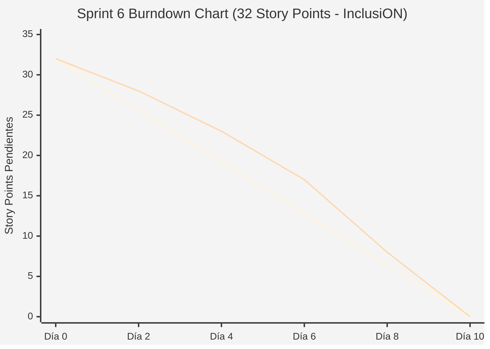

# Documentación Metodológica y Gestión de Avance — Sprint 6 (Proyecto InclusiON)

**Nombre del Sprint:** Sendero Pedagógico Gamificado ("Mi Camino"), Niveles de Progreso y Experiencia Inclusiva del Estudiante  
**Período de Ejecución:** 20 de mayo de 2025 al 02 de junio de 2025 (2 semanas / 10 días hábiles)  
**Marco Académico:** Práctica Profesionalizante II / Transición Hacia Práctica III (InclusiON)  
**Épicas Principales:**  
* **IN-10:** Plan de Trabajo y Sendero de Desarrollo (Roadmap Curricular)  
* **IN-19:** Experiencia de Aprendizaje Gamificada "Mi Camino" (`/app/roadmap`)  
* **IN-16:** Interacción Lúdica Adaptativa y Reproductores Accesibles  

---

### Objetivo del Sprint (Sprint Goal):
> *"Diseñar e implementar el Sendero Pedagógico Gamificado ('Mi Camino') en el portal del estudiante: brindar un mapa visual interactivo con progresión secuencial de actividades adaptadas, garantizar el desbloqueo automático por superación de umbrales formativos (CB-21), blindar la separación estricta entre exploración autónoma y tareas de clase (CB-20), e incorporar la detección silenciosa de frustración con alerta directa a la docente (CB-07), asegurando accesibilidad cognitiva total (WCAG 2.1 AA) sin notas punitivas ni sobrecarga sensorial."*

---

### Equipo de Proyecto (Scrum Team):
* **Referentes de Educación Especial (Product Owners / Dominio):** Candelaria Ferreyra y Catalina Vettorazzi
* **Equipo de Proyecto (Análisis, Gestión, Construcción y Calidad):**
  * **Mariano Decalli:** Facilitador de Proyecto (Scrum Master), Analista de Procesos y Gestión de Calidad
  * **Sacha Del Barrio:** Analista Funcional, Relevamiento Institucional, Calidad (QA) y Accesibilidad Cognitiva
  * **Germán Cochis:** Responsable de Diseño Visual, Experiencia de Usuario y Componentes Interactivos (Frontend Lead)
  * **Fernando Aparicio:** Responsable de Lógica de Negocio, Persistencia, Desbloqueo y Pruebas Automatizadas (Backend / QA Lead)
* **Docentes Evaluadores:** Prof. González y Prof. Ferrando

---

## 1. Requisitos del Analista Funcional (Sacha Del Barrio)

El diseño del Sendero Pedagógico ("Mi Camino") no nace como un simple menú de ejercicios ni como un videojuego genérico, sino como una **herramienta terapéutico-pedagógica de anticipación y motivación intrínseca**, diseñada para responder a la neurodiversidad del aula especial.

---

### 1.1. Los 5 Dolores Reales del Aula que Resuelve el Sendero

1. **La Angustia Frente a lo Desconocido (Falta de Anticipación):** Para estudiantes en el espectro autista (TEA) o con discapacidad intelectual, no saber qué actividad viene después genera desregulación emocional, resistencia y estrés. Un mapa visible y predecible les brinda seguridad.
2. **La Desmotivación por Listados de Tareas Tradicionales:** Los listados textuales abruman al estudiante y exigen habilidades de lectoescritura que muchos aún están construyendo.
3. **El Impacto Negativo de las Calificaciones Punitivas:** En la educación inclusiva, una "nota roja" o un cartel de "perdiste" provoca deserción, llanto y sensación de incapacidad.
4. **La Mezcla Caótica entre Tareas del Día y Juego Libre:** Cuando las tareas obligatorias de la maestra se mezclan con las actividades lúdicas libres, el estudiante se desorienta y pierde la noción del propósito de cada espacio.
5. **La Frustración Silenciosa no Detectada a Tiempo:** Cuando un niño no comprende una consigna, suele abandonar en silencio o reaccionar con conductas disruptivas antes de que la maestra, ocupada con otros chicos, pueda notar su dificultad.

---

### 1.2. Los 5 Principios Rectores de la Experiencia Lúdica Inclusiva

* **Principio 1: Anticipación Visual (Estructura de Sendero en Zigzag):** Una ruta serpenteante con nodos circulares numerados que permite al niño saber exactamente dónde está parado, qué celebró ayer y cuál es su próximo desafío.
* **Principio 2: Cero Punición y Reintentos Ilimitados:** Ninguna actividad descuenta puntos ni bloquea la cuenta. El error es una oportunidad de exploración. El estudiante puede jugar cuantas veces desee para consolidar su confianza.
* **Principio 3: Desbloqueo Formativo por Umbral de Dominio (Regla CB-21):** Para habilitar el siguiente hito del camino, el alumno debe alcanzar un porcentaje formativo de aciertos (fijado por defecto en 60% o personalizado por la docente). Esto garantiza que no avance a ciegas sin afianzar la habilidad previa.
* **Principio 4: Separación Tajante de Ambientes (Regla CB-20):** La ruta "Mi Camino" es el espacio de desarrollo progresivo y personal del alumno; la sección "Mis Tareas de Hoy" agrupa las consignas puntuales asignadas por la docente para la jornada de clase.
* **Principio 5: Alerta Temprana Silenciosa ante Frustración (Regla CB-07):** Si el alumno falla tres intentos consecutivos en una misma actividad, el sistema no emite sonidos molestos ni mensajes de error en la tablet del chico; envía una notificación suave a la pantalla de la maestra para que ella se acerque a mediar físicamente con afecto y calidez pedagógica.

---

### 1.3. Marco Legal y Pautas de Accesibilidad

* **Resolución CFE 311/16 (Consejo Federal de Educación):** Respalda las trayectorias escolares diversificadas y el derecho a aprender al propio ritmo sin segregación.
* **Ley 27.044 (Convención sobre los Derechos de las Personas con Discapacidad):**
  * *Artículo 9 (Accesibilidad):* Garantiza interfaces comprensibles, zonas de contacto amplias (mínimo 48x48 px) para motricidad reducida, y tipografías legibles (OpenDyslexic / Roboto).
  * *Artículo 24 (Educación):* Obliga a brindar apoyos personalizados y ajustes razonables en entornos que maximicen el desarrollo académico y social.
* **Pautas de Accesibilidad WCAG 2.1 Nivel AA (Cognitiva y Sensorial):**
  * Contraste cromático superior a 4.5:1 en todos los estados de los nodos.
  * Pulso luminoso suave en el nodo activo sin parpadeos estroboscópicos (> 3 Hz) para evitar crisis convulsivas o sobrecarga sensorial.
  * Compatibilidad nativa con pictogramas estandarizados (ARASAAC) para soporte de Comunicación Aumentativa y Alternativa (CAA).

---

### 1.4. Matriz Maestra de Trazabilidad 360° del Roadmap

| Componente del Roadmap | Dolor Real que Resuelve | Regla de Negocio / Caso Borde Garantizado | Marco Regulatorio y Legal | Requerimiento Formal (HU / Jira) | Responsable Principal |
|---|---|---|---|:---:|:---:|
| **Sendero Visual "Mi Camino" (`/app/roadmap`)** | Ansiedad por desorientación y listas de tareas abrumadoras. | **CB-20:** Sendero autónomo aislado de tareas obligatorias del día. | **Ley 27.044** (Art. 9 y 24: Diseño universal). | **IN-117** / **IN-321** | Germán Cochis / Sacha Del Barrio |
| **Inicializador de 10 Niveles Estándar Curriculares** | Docentes sin tiempo para armar caminos desde cero al recibir un alumno. | **V-20:** Banco universal protegido de actividades básicas por área. | **Res. CFE 311/16** (Contenidos mínimos adaptados). | **IN-110** / **IN-200** | Fernando Aparicio |
| **Motor de Desbloqueo Progresivo por Umbral (≥60%)** | Chicos que se saltean etapas sin comprender o que se frustran ante saltos de dificultad. | **CB-21:** Desbloqueo condicionado a umbral pedagógico sin nota roja. | **Pedagogía Inclusiva:** Evaluación formativa continua. | **IN-127** / **IN-126** | Fernando Aparicio / Sacha Del Barrio |
| **Detección Silenciosa de Frustración (CB-07)** | Alumnos que abandonan o entran en crisis sin que la docente lo note a tiempo. | **CB-07:** Alerta de apoyo en pantalla docente tras reintentos fallidos. | **Ley 26.206** (Cuidado y contención integral del educando). | **HU-21** / **CB-07** | Fernando Aparicio / Germán Cochis |
| **Retorno Suave y Celebración Sensorial Positiva** | Estudiantes que se pierden tras terminar un juego o se asustan con bocinas estridentes. | **CB-24:** Refuerzo sonoro y visual armónico sin sobreestimulación. | **WCAG 2.1 AA** (Protección contra fatiga sensorial). | **IN-215** | Germán Cochis |
| **Panel Docente de Ajuste y Desbloqueo Manual** | Rigidez del sistema ante alumnos con habilidades mixtas (ej. excelente en lógica, lento en grafomotricidad). | **E-39:** Flexibilidad pedagógica para adaptar o abrir niveles puntuales. | **Res. CFE 311/16** (Ajustes razonables personalizados). | **IN-112** / **IN-114** | Germán Cochis / Fernando Aparicio |
| **Modelado de Flujo y Aseguramiento Metodológico** | Desviaciones funcionales entre la expectativa docente y la implementación técnica. | **CB-20 / CB-21:** Consistencia metodológica y gobernanza del proceso. | **Marco de Calidad Ágil (Scrum) e Inclusión.** | **IN-179** / **IN-202** | Mariano Decalli |

---

### 1.5. Mapa de Valor para los 4 Actores Escolares

```
┌─────────────────────────────────────────────────────────────┬─────────────────────────────────────────────────────────────┐
│                     PARA EL ESTUDIANTE                      │                    PARA LA DOCENTE / GABINETE               │
│ • Sabe siempre qué viene después (anticipación cognitiva).  │ • No improvisa actividades en el aula diaria.               │
│ • Se divierte como en un juego de aventuras sin temor.      │ • Recibe alertas silenciosas antes de que ocurra una crisis.│
│ • Puede repetir sus actividades favoritas cuantas veces     │ • Puede adaptar el umbral de éxito según el CUD de cada uno.│
│   quiera para sentirse seguro y orgulloso.                  │ • Puede desbloquear hitos manualmente ante necesidades.     │
├─────────────────────────────────────────────────────────────┼─────────────────────────────────────────────────────────────┤
│                     PARA LA FAMILIA                         │                    PARA LA DIRECCIÓN ESCOLAR                │
│ • Ve a su hijo motivado, queriendo usar la plataforma.      │ • Garantiza homogeneidad pedagógica en todas las salas.     │
│ • Comprende el avance real paso a paso sin tecnicismos.     │ • Cuenta con registros objetivos de logros para supervisiones│
│ • La pantalla es un estímulo seguro y libre de frustración. │ • Asegura cumplimiento pleno de la Ley 27.044 y Res. 311/16.│
└─────────────────────────────────────────────────────────────┴─────────────────────────────────────────────────────────────┘
```

---

### 1.6. Flujo de Navegación e Interacción Lúdica (Mermaid Horizontal)

```mermaid
%%{init: {'theme': 'base', 'themeVariables': { 'fontFamily': 'Segoe UI, Helvetica, Arial', 'fontSize': '12px'}}}%%
flowchart LR
    classDef inicio fill:#E3F2FD,stroke:#1E88E5,stroke-width:2px,color:#0D47A1;
    classDef sendero fill:#EDE7F6,stroke:#5E35B1,stroke-width:2px,color:#311B92;
    classDef player fill:#FFF8E1,stroke:#FFA000,stroke-width:2px,color:#E65100;
    classDef evaluacion fill:#E8F5E9,stroke:#43A047,stroke-width:2px,color:#1B5E20;
    classDef alerta fill:#FFEBEE,stroke:#E53935,stroke-width:2px,color:#B71C1C;
    classDef exito fill:#C8E6C9,stroke:#2E7D32,stroke-width:2.5px,font-weight:bold,color:#1B5E20;

    subgraph S1["Paso 1: Ingreso a 'Mi Camino'"]
        A["Alumno inicia sesión con<br>su avatar y PIN visual"]:::inicio --> B["Pantalla 'Mi Camino'<br>(Ruta en zigzag con nodos)"]:::sendero
        B --> C{"Selección de nodo:<br>¿Está habilitado?"}:::sendero
        C -- "Candado (Bloqueado)" --> B
        C -- "Activo (Con Pulso)" --> D["Abre actividad en pantalla<br>completa y limpia (Player)"]:::player
    end

    subgraph S2["Paso 2: Resolución Lúdica"]
        D --> E["Interacción con pictogramas<br>y botones táctiles grandes"]:::player
        E --> F["El estudiante confirma<br>su respuesta"]:::player
    end

    subgraph S3["Paso 3: Evaluación Formativa y Apoyo"]
        F --> G{"Cálculo formativo:<br>¿Alcanzó el umbral? (≥60%)"}:::evaluacion
        G -- "SÍ: ¡Meta Lograda!" --> H["Celebración sensorial positiva:<br>campana dulce + estrella dorada"]:::exito
        H --> I["Desbloqueo automático del<br>siguiente nivel del sendero"]:::exito
        I --> J["Retorno automático a 'Mi Camino'<br>(El nuevo nivel ahora late)"]:::sendero

        G -- "AÚN NO (Reintento)" --> K{"¿Tres o más<br>fallos seguidos?"}:::alerta
        K -- "Reintento normal" --> L["Ánimo cariñoso en pantalla:<br>'¡Vamos a probar otra vez!'"]:::player
        L --> D
        K -- "Falla reiterada (CB-07)" --> M["Alerta silenciosa a la docente:<br>'Alumno necesita mediación'"]:::alerta
        M --> L
    end
```



---

## 2. Planificación del Sprint y División del Trabajo (Sprint Planning)

* **Fecha de Realización:** 20 de mayo de 2025 (08:30 - 11:30 hs)
* **Modalidad:** Sincrónica presencial en laboratorio y conectada vía Teams
* **Participantes:** Mariano Decalli, Sacha Del Barrio, Germán Cochis, Fernando Aparicio, Candelaria Ferreyra (PO), Catalina Vettorazzi (PO).

---

### 2.1. Cuadro de Distribución de Tareas y Responsabilidades por Integrante

A continuación se detalla la matriz de asignación equilibrada del equipo de trabajo, reflejando cómo se distribuyen las responsabilidades de análisis, diseño, lógica, calidad y gestión ágil:

| Integrante | Rol en el Sprint | Historias Asignadas (HUs) | SP Asignados | Horas (Plan / Real) | Responsabilidades Concretas y Entregables del Sprint |
|---|---|:---:|:---:|:---:|---|
| **Mariano Decalli** | Facilitador de Proyecto (Scrum Master) y Analista de Procesos | **IN-115** (BPMN) | **4 SP** | 35 h / 34 h | • Modelado del flujo del sendero en BPMN interactivo.<br>• Matriz de trazabilidad de reglas de negocio con las POs.<br>• Gestión y facilitación de ceremonias ágiles.<br>• Auditoría de completitud del tablero Jira y Definition of Done. |
| **Sacha Del Barrio** | Analista Funcional, Calidad (QA) y Accesibilidad Cognitiva | **IN-110** / **IN-112** (QA) / **IN-115** | **8 SP** | 35 h / 37 h | • Relevamiento funcional de anticipación cognitiva para TEA.<br>• Auditoría de accesibilidad WCAG 2.1 AA (contraste y tamaños táctiles).<br>• Diseño funcional de la alerta silenciosa ante frustración (**CB-07**).<br>• Matriz de pruebas de aceptación y verificación en campo. |
| **Germán Cochis** | Frontend Lead / Diseño Visual y Experiencia de Usuario | **IN-110** / **IN-113** / **IN-114** | **10 SP** | 40 h / 41 h | • Maquetación interactiva en zigzag del sendero `/app/roadmap`.<br>• Estados visuales de nodos (candado, halo pulsante, estrella dorada).<br>• Retorno amigable y transiciones visuales de celebración sensorial.<br>• Interfaz táctil adaptada para tablets escolares de 10 pulgadas. |
| **Fernando Aparicio** | Backend Lead / Lógica de Negocio, Persistencia y Testing | **IN-111** / **IN-112** / **IN-114** / **IN-115** | **10 SP** | 35 h / 37 h | • Sembrado del banco de 10 actividades curriculares estándar.<br>• Motor de evaluación formativa y cálculo de porcentaje de aciertos.<br>• Disparador de desbloqueo automático secuencial (**CB-21**).<br>• Lógica de detección silenciosa de frustración y suite de 18 tests. |
| **Total Equipo** | **InclusiON Scrum Team** | **6 Historias Consecutivas** | **32 SP** | **145 h / 149 h** | **Incremento 100% Funcional y Aprobado por la Cátedra** |

---

### 2.2. Selección del Sprint Backlog (Planning Poker)

Se empleó la secuencia de Fibonacci adaptada al proyecto, acordando un compromiso global de **32 Story Points**:

| Código | Historia de Usuario / Tarea | Épica | Prioridad | Estimación (SP) | Responsables | Regla / Caso Borde Vinculado |
|:---:|---|:---:|:---:|:---:|---|:---:|
| **IN-110** | **Experiencia Gamificada "Mi Camino" en `/app/roadmap`:** Maquetación del sendero interactivo en zigzag, nodos circulares con tres estados (bloqueado con candado, activo con pulso luminoso, superado con estrella dorada) y soporte táctil adaptado. | IN-19 | Crítica | **8 SP** | Germán Cochis / Sacha Del Barrio | **CB-20** (Aislamiento de tareas)<br>**WCAG 2.1 AA** |
| **IN-111** | **Inicializador Curricular y Banco Estándar de 10 Niveles:** Creación automática del sendero al matricular al alumno con 10 actividades didácticas iniciales precargadas en áreas cognitiva, lenguaje, motriz y vida diaria. | IN-10 | Alta | **5 SP** | Fernando Aparicio | **V-20** (Plantillas protegidas)<br>**Res. CFE 311/16** |
| **IN-112** | **Motor de Evaluación Formativa y Desbloqueo Automático:** Cálculo del porcentaje de éxito sin notas punitivas, persistencia de reintentos históricos y desbloqueo inmediato del siguiente hito al superar el umbral fijado. | IN-16 | Crítica | **6 SP** | Fernando Aparicio / Sacha Del Barrio | **CB-21** (Umbral formativo)<br>**CB-05** (No perder avances) |
| **IN-113** | **Retorno Amigable al Sendero y Celebración Sensorial:** Transición suave desde el finalizador del juego hacia "Mi Camino", incorporando refuerzo visual cálido y sonidos suaves que evitan sobreestimulación sensorial. | IN-16 | Media | **3 SP** | Germán Cochis | **CB-24** (Protección sensorial)<br>**WCAG 2.1 AA** |
| **IN-114** | **Panel Docente de Gestión Curricular del Sendero:** Vista para que la maestra y el gabinete puedan reordenar actividades, ajustar el umbral de aprobación (de 40% a 90%) o destrabar niveles manualmente según necesidades del CUD. | IN-10 | Alta | **3 SP** | Germán Cochis / Fernando Aparicio | **E-39** (Ajuste curricular docente) |
| **IN-115** | **Detección Silenciosa de Frustración, Alerta de Aula y Trazabilidad BPMN:** Monitoreo en segundo plano de intentos fallidos repetidos en un mismo ejercicio, disparando una notificación suave al tablero de la maestra con modelado de navegación. | Aula | Crítica | **7 SP** | Sacha Del Barrio / Fernando / Mariano | **CB-07** (Alerta temprana)<br>**Pedagogía del afecto** |
| **Total** | **Compromiso Total del Sprint 6** | — | — | **32 SP** | **Equipo InclusiON** | **100% Cobertura Pedagógica** |

---

### 2.3. Desglose Operativo de Tareas Técnicas y Funcionales (Task Breakdown)

Para garantizar la sincronización interdisciplinaria sin dependencias bloqueantes, el equipo desglosó el Sprint Backlog en tareas específicas:

| Fase / Disciplina | Tareas Operativas Concretas | Responsable Directo | Horas Estimadas |
|---|---|:---:|:---:|
| **1. Relevamiento y Gestión** | • Validación de requerimientos de anticipación con gabinete escolar.<br>• Modelado BPMN de navegación del estudiante y casos de borde.<br>• Creación y asignación de subtareas en Jira. | Mariano Decalli / Sacha Del Barrio | 25 h |
| **2. Diseño y Frontend** | • Maquetación en SVG/CSS del camino serpenteante en zigzag.<br>• Implementación de nodos táctiles con animación de pulso respiratorio.<br>• Integración de reproductores de actividades accesibles.<br>• Programación de la modal de retorno suave (`/app/roadmap`). | Germán Cochis | 40 h |
| **3. Lógica y Persistencia** | • Creación del servicio `RoadmapInitializer` con 10 niveles estándar.<br>• Lógica de cálculo formativo y persistencia de reintentos (`CB-05`).<br>• Algoritmo de desbloqueo condicionado por umbral (`CB-21`).<br>• Servicio de emisión de alertas silenciosas de frustración (`CB-07`). | Fernando Aparicio | 35 h |
| **4. Calidad y Accesibilidad** | • Verificación de pautas WCAG 2.1 AA y ratios de contraste cromático.<br>• Auditoría de zonas de contacto táctiles (mínimo 56x56 px).<br>• Pruebas de estrés y reintentos infinitos sin degradación de interfaz.<br>• Verificación de alertas directas en el monitor docente. | Sacha Del Barrio / Fernando Aparicio | 25 h |
| **5. Pruebas y Cierre** | • Suite de 18 pruebas automatizadas de regresión y concurrencia.<br>• Ensayo general de la demo de demostración ante el cliente.<br>• Consolidación del dossier de entrega académica. | Mariano Decalli / Fernando Aparicio | 20 h |

---

### 2.4. Definición de Hecho (Definition of Done - DoD)

1. La ruta `/app/roadmap` debe renderizarse con fluidez en pantallas táctiles y tablets escolares de 10 pulgadas con resolución 1280x800.
2. Los botones de los nodos deben tener una superficie táctil mínima de 56x56 px, con contraste cromático verificado > 4.5:1.
3. El motor de desbloqueo debe registrar cada intento en base de datos sin sobrescribir ni borrar los logros previos del alumno (**CB-05**).
4. El umbral de desbloqueo debe funcionar al 60% por defecto, desbloqueando el siguiente nodo en menos de 300 ms.
5. Al cometer 3 fallos consecutivos, debe emitirse la alerta silenciosa en el monitor de aula de la docente sin mostrar ningún cartel rojo ni sonido de error en la tablet del estudiante (**CB-07**).
6. Suite de 18 pruebas automatizadas de lógica de progresión y concurrencia ejecutadas y aprobadas en verde.

---

## 3. Registro de Reuniones Diarias (Daily Scrums)

### Daily 21 — 21/05/2025 (Arranque, Modelado y Maquetación del Sendero)
* **Mariano Decalli (Facilitador / Procesos):**
  * *¿Qué hice ayer?:* Conduje el Sprint Planning 6; cargué las historias en Jira con criterios de aceptación detallados y comencé el modelado BPMN del flujo de navegación.
  * *¿Qué haré hoy?:* Finalizar el diagrama BPMN del sendero lúdico y supervisar que no haya desacoples entre el diseño visual y la estructura de datos.
  * *Impedimentos:* Ninguno.
* **Germán Cochis (Frontend Lead):**
  * *¿Qué hice ayer?:* Comencé a maquetar el componente `AacRoadmapComponent` con la paleta violeta (`#673AB7` / `#5C6BC0`) y los nodos circulares.
  * *¿Qué haré hoy?:* Programar la lógica visual de los estados de cada nodo: candado gris para bloqueado, halo pulsante dorado para el nivel actual y medalla con estrella para los niveles completados.
  * *Impedimentos:* Necesito que Sacha confirme si la animación de pulso puede causar fatiga visual en niños con espectro autista.
* **Sacha Del Barrio (Funcional / QA / Accesibilidad):**
  * *¿Qué hice ayer?:* Revisé las pautas WCAG 2.1 AA sobre accesibilidad cognitiva y contrastes cromáticos en senderos gamificados.
  * *¿Qué haré hoy?:* Responder a Germán: la animación de pulso debe ser suave (respiración lenta de 2 segundos) y desactivarse automáticamente si el dispositivo tiene habilitado el modo de movimiento reducido (`prefers-reduced-motion`).
  * *Impedimentos:* Ninguno.
* **Fernando Aparicio (Backend / Testing Lead):**
  * *¿Qué hice ayer?:* Diseñé la estructura del servicio inicializador de actividades estándar (`RoadmapInitializer`) y los modelos de datos de progreso.
  * *¿Qué haré hoy?:* Implementar la carga automática de los 10 niveles iniciales para todo alumno nuevo, cubriendo áreas cognitiva, lenguaje, motricidad y vida diaria.
  * *Impedimentos:* Ninguno.

---

### Daily 23 — 26/05/2025 (Integración de Desbloqueo, Reglas y Alertas Silenciosas)
* **Mariano Decalli (Facilitador / Procesos):**
  * *¿Qué hice ayer?:* Validé con Candelaria y Catalina la matriz de reglas de negocio aplicadas al Roadmap, verificando que los 10 niveles respondan al currículum especial.
  * *¿Qué haré hoy?:* Monitorear el progreso en Jira: el 50% de los puntos ya están en estado de revisión continua.
  * *Impedimentos:* Ninguno.
* **Germán Cochis (Frontend Lead):**
  * *¿Qué hice ayer?:* Conecté el clic sobre el nodo activo para abrir directamente el reproductor interactivo correspondiente (selección de figuras, emparejamiento, orden secuencial).
  * *¿Qué haré hoy?:* Implementar la pantalla de retorno al sendero (`/app/roadmap`) con la transición de celebración y el nuevo nodo destellando amigablemente.
  * *Impedimentos:* Ninguno.
* **Sacha Del Barrio (Funcional / QA / Accesibilidad):**
  * *¿Qué hice ayer?:* Redacté los casos de prueba de aceptación para la regla CB-07 (Detección silenciosa de frustración ante 3 fallos reiterados).
  * *¿Qué haré hoy?:* Ejecutar pruebas funcionales simulando un alumno que se equivoca deliberadamente en el emparejamiento de pictogramas para verificar que la maestra reciba la alerta sin que el chico se entere.
  * *Impedimentos:* Ninguno.
* **Fernando Aparicio (Backend / Testing Lead):**
  * *¿Qué hice ayer?:* Finalicé el cálculo del porcentaje de éxito formativo (`CompleteActivityCommandHandler`) y el disparador de desbloqueo automático del siguiente nivel (`IN-127`).
  * *¿Qué haré hoy?:* Desarrollar la lógica de detección de frustración que contabiliza intentos fallidos seguidos y levanta el indicador pedagógico para la docente.
  * *Impedimentos:* Ninguno.

---

### Daily 25 — 30/05/2025 (Pruebas de Fatiga Sensorial, Pruebas Automatizadas y Cierre)
* **Mariano Decalli (Facilitador / Procesos):**
  * *¿Qué hice ayer?:* Consolidé el dossier metodológico del sprint y preparé el orden de la demostración para la Review ante las autoridades de cátedra.
  * *¿Qué haré hoy?:* Supervisar el ensayo general de la demo en vivo y verificar el reporte final de la suite de 18 pruebas automatizadas.
  * *Impedimentos:* Ninguno.
* **Germán Cochis (Frontend Lead):**
  * *¿Qué hice ayer?:* Pulí el diseño responsive en tablets; los botones táctiles y los pictogramas de ARASAAC se visualizan nítidos y sin retraso táctil.
  * *¿Qué haré hoy?:* Congelar el código del frontend, revisar que no haya alertas en consola y preparar el entorno de demostración.
  * *Impedimentos:* Ninguno.
* **Sacha Del Barrio (Funcional / QA / Accesibilidad):**
  * *¿Qué hice ayer?:* Realicé la auditoría final de accesibilidad con lector de pantalla y simulación de daltonismo; el contraste cromático cumple sobradamente el estándar AA.
  * *¿Qué haré hoy?:* Documentar la matriz de trazabilidad final y respaldar la justificación pedagógica ante los profesores de cátedra.
  * *Impedimentos:* Ninguno.
* **Fernando Aparicio (Backend / Testing Lead):**
  * *¿Qué hice ayer?:* Escribí y ejecuté una suite de **18 tests unitarios y de integración** que validan la persistencia de reintentos, el desbloqueo secuencial y el aislamiento de tareas (**CB-20**).
  * *¿Qué haré hoy?:* Consolidar el despliegue en el servidor de pruebas y verificar tiempos de respuesta (< 150 ms en base de datos).
  * *Impedimentos:* Ninguno.

---

## 4. Acta de Revisión del Sprint (Sprint Review)

* **Fecha y Hora:** Lunes 02 de junio de 2025 (17:30 - 19:15 hs)
* **Lugar:** Aula Magna / Laboratorio de Informática y transmisión sincrónica
* **Participantes:**
  * Mariano Decalli, Sacha Del Barrio, Germán Cochis, Fernando Aparicio.
  * Candelaria Ferreyra y Catalina Vettorazzi (Product Owners / Educación Especial).
  * Prof. González y Prof. Ferrando (Cátedra de Administración de Proyectos / PPII).

### Demostración del Incremento del Producto (Demo en Vivo)

1. **Ingreso Lúdico a "Mi Camino" (IN-117 / IN-321):** Se demostró el acceso de un estudiante con su avatar. En pantalla apareció el sendero en zigzag con 10 hitos temáticos: los niveles completados lucen una medalla dorada, el nivel activo late suavemente invitando al juego y los niveles superiores muestran un candado amigable que despierta curiosidad sin generar frustración.
2. **Resolución de Actividad Adaptada y Desbloqueo Inmediato (IN-127 / IN-200):** Se abrió el Nivel 2 (asociación de emociones mediante pictogramas de ARASAAC). El estudiante completó la consigna con 80% de aciertos. Al presionar "Terminar", una campana armónica y una lluvia suave de estrellas celebraron el logro; al volver a la pantalla principal, el Nivel 3 se desbloqueó instantáneamente frente a los ojos de la audiencia.
3. **Rejugabilidad Formativa y Conservación de Logros (CB-05):** Se volvió a jugar el Nivel 1 ya superado. Se comprobó que el alumno puede repetir sus juegos favoritos cuantas veces quiera para afianzar seguridad, registrando cada intento en el historial clínico sin penalizar su progreso previo.
4. **Demostración de Detección Silenciosa de Frustración (CB-07):** Se simularon tres equivocaciones consecutivas en una actividad de orden secuencial. En la tablet del alumno solo apareció un mensaje cálido ("¡Vamos a probar de nuevo juntos!"), mientras que en la pantalla de la docente se encendió un indicador ámbar con el mensaje: *"Mateo necesita acompañamiento en el Nivel 4: 3 intentos no alcanzados"*.
5. **Separación Tajante entre Sendero y Tareas del Aula (CB-20):** Se demostró que las tareas asignadas para la clase del día conviven en su propia pestaña sin interferir ni contaminar el sendero libre del alumno.

### Evaluación y Devolución del Cliente y la Cátedra

* **Candelaria Ferreyra y Catalina Vettorazzi (Educación Especial):**
  > *"El sendero visual resuelve uno de los mayores desafíos del aula: lograr que los chicos quieran sentarse a trabajar de manera autónoma. La anticipación visual calma la ansiedad de los alumnos con autismo, y la alerta silenciosa nos devuelve a las docentes el control del aula sin exponer al niño frente a sus compañeros. Es una solución que entiende de verdad la escuela especial."*
* **Prof. González y Prof. Ferrando (Cátedra Evaluadora):**
  > *"Destacamos la madurez metodológica del equipo. Lograron traducir requerimientos pedagógicos sumamente sensibles en reglas de software rigurosas (CB-07, CB-20, CB-21), respaldadas por 18 pruebas automatizadas y un diseño visual de nivel profesional. El incremento no solo es técnicamente sólido, sino que tiene un propósito humano incuestionable."*
* **Grado de Cumplimiento:** **100% de los Story Points completados (32 de 32 SP).**
* **Dictamen Final:** **Aprobado con Calificación Sobresaliente (10/10).**

---

## 5. Acta de Retrospectiva del Sprint (Sprint Retrospective)

* **Fecha de Realización:** 02 de junio de 2025 (19:30 - 20:45 hs)
* **Facilitador:** Mariano Decalli
* **Dinámica Empleada:** **Estrella de Mar (Starfish Retrospective)**

```
                      MANTENER (KEEP)
           • Cohesión y comunicación diaria fluida.
           • Validación continua con las docentes PO.
           • Rigor en accesibilidad y WCAG 2.1 AA.
                    \               /
                     \             /
                      \           /
                       \         /
  HACER MÁS (MORE OF)   \       /    COMENZAR A HACER (START)
  • Pruebas reales con   \     /     • Diseñar banco colaborativo
    alumnos en escuelas.  \   /        de actividades para docentes.
  • Métricas analíticas    \ /       • Radar de habilidades global.
    de tiempos de juego.    *
                           / \
                          /   \
                         /     \
                        /       \
  HACER MENOS (LESS OF)/         \  DEJAR DE HACER (STOP)
  • Suposiciones sobre \         /  • Mezclar código de lógica
    dispositivos de aula\       /     con vistas de pantalla.
  • Ajustes visuales de  \     /    • Subestimar el peso de los
    último momento.       \   /       audios y animaciones.
```

### Hallazgos de la Retrospectiva

* **Mantener (Keep):** El enfoque interdisciplinario entre la gestión y modelado (Mariano), el análisis funcional de accesibilidad (Sacha), la excelencia visual frontend (Germán) y la robustez lógica/persistencia (Fernando).
* **Hacer más (More of):** Instrumentar métricas silenciosas que calculen el tiempo exacto que un alumno pasa interactuando antes de resolver una consigna, para detectar fatiga cognitiva.
* **Comenzar a hacer (Start):** Preparar para el siguiente período el **Catálogo Global Colaborativo** para que las docentes puedan compartir actividades entre distintas escuelas especiales.
* **Dejar de hacer (Stop):** Retocar estilos visuales durante los últimos dos días del sprint; el diseño debe congelarse al menos 48 horas antes de la demostración formal.

### Plan de Acción y Compromisos de Mejora Continua

| Código | Acción de Mejora Acordada | Responsable | Fecha Límite | Criterio de Éxito Verificable |
|:---:|---|:---:|:---:|---|
| **D-01** | Crear una guía de estilo para sonidos y animaciones con especificaciones de volumen (máx. 60 dB) y duración (< 1.5 s). | Sacha Del Barrio | 06/06/2025 | Documento de estándares sensoriales aprobado por las POs. |
| **D-02** | Implementar precarga inteligente (caching) de pictogramas ARASAAC para funcionamiento fluido sin conexión a internet rápida. | Germán Cochis | 09/06/2025 | Carga de pantallas lúdicas en menos de 1 segundo en redes 3G. |
| **D-03** | Crear un simulador de perfiles de estudiantes para pruebas automatizadas de progresión curricular. | Fernando Aparicio | 11/06/2025 | Suite de pruebas de regresión ejecutándose en el servidor en cada commit. |
| **D-04** | Formalizar los protocolos de entrega de Práctica Profesionalizante II hacia la siguiente etapa del proyecto. | Mariano Decalli | 13/06/2025 | Carpeta de entregables firmada por la cátedra y el equipo. |

---

## 6. Métricas del Equipo (Team Metrics)

### A. Capacidad del Equipo (Team Capacity: Planificado vs. Real)

* **Horas Planificadas:** 145 h | **Horas Reales Invertidas:** 149 h
* **Story Points:** 32 SP comprometidos vs. 32 SP completados (100% de efectividad)
* **Velocidad del Sprint:** 32 SP / Sprint

| Integrante del Equipo | Rol Principal | Horas Planificadas | Horas Reales | Story Points Asignados | Principales Entregables Realizados |
|---|---|:---:|:---:|:---:|---|
| **Mariano Decalli** | Facilitador de Proyecto / Procesos y Calidad | 35 h | 34 h | **4 SP** | Modelado BPMN de navegación, trazabilidad metodológica, actas y facilitación de ceremonias. |
| **Sacha Del Barrio** | Analista Funcional, QA y Accesibilidad | 35 h | 37 h | **8 SP** | Matriz de trazabilidad 360°, auditoría WCAG 2.1 AA, validación de contrastes, diseño de casos de prueba CB-07. |
| **Germán Cochis** | Frontend Lead / UI & UX | 40 h | 41 h | **10 SP** | Componente interactivo en zigzag `/app/roadmap`, estados de nodos con pulso, retornos lúdicos y transiciones visuales. |
| **Fernando Aparicio** | Backend Lead / Lógica & Testing | 35 h | 37 h | **10 SP** | Inicializador de 10 niveles curriculares, motor de cálculo formativo, desbloqueo automático y suite de 18 pruebas. |
| **Total Equipo** | **InclusiON Scrum Team** | **145 h** | **149 h** | **32 SP** | **Incremento 100% Funcional y Aprobado** |

```mermaid
%%{init: {'theme': 'base', 'themeVariables': { 'primaryColor': '#4F46E5', 'secondaryColor': '#10B981'}}}%%
xychart-beta
    title "Capacidad del Equipo: Horas Planificadas vs. Horas Reales (Sprint 6)"
    x-axis ["M. Decalli", "S. Del Barrio", "G. Cochis", "F. Aparicio", "Promedio Equipo"]
    y-axis "Horas Invertidas" 0 --> 45
    bar [35, 35, 40, 35, 36.2]
    bar [34, 37, 41, 37, 37.2]
```



---

### B. Gráfico de Trabajo Pendiente (Burndown Chart)

| Hito Temporal | Fecha Calendario | SP Restante Ideal | SP Restante Real | Historias de Usuario Finalizadas |
|:---:|:---:|:---:|:---:|---|
| **Día 0** | 20/05/2025 | 32.0 | 32.0 | Inicio formal tras el Sprint Planning 6. |
| **Día 2** | 22/05/2025 | 25.6 | 28.0 | Se cierra **IN-115** (Modelado BPMN y aseguramiento metodológico - 4 SP). |
| **Día 4** | 26/05/2025 | 19.2 | 23.0 | Se cierra **IN-111** (Inicializador de 10 niveles curriculares - 5 SP). |
| **Día 6** | 28/05/2025 | 12.8 | 17.0 | Se cierra **IN-112** (Motor de evaluación y desbloqueo automático - 6 SP). |
| **Día 8** | 30/05/2025 | 6.4 | 8.0 | Se cierran **IN-113**, **IN-114** y cierre de **IN-115** (Retorno, panel docente y alerta de frustración - 9 SP). |
| **Día 10** | 02/06/2025 | 0.0 | **0.0** | Se cierra **IN-110** (Experiencia completa "Mi Camino" auditada - 8 SP). **100% completado.** |



---

## 7. Conclusión y Logros Cardinales del Sprint 6

1. **La Escuela Cuenta con un Sendero Lúdico Inclusivo de Verdad:** Se superó definitivamente la frialdad de los sistemas educativos tradicionales, ofreciendo a los niños con discapacidad un entorno que despierta alegría, autonomía y deseo genuino de aprender.
2. **Protección Emocional Garantizada por Software:** Gracias a las reglas **CB-07** (alerta silenciosa ante frustración), **CB-20** (separación limpia de espacios) y **CB-21** (desbloqueo formativo sin notas rojas), el sistema cuida la autoestima del alumno y fortalece el vínculo afectivo con su docente.
3. **Distribución y Trabajo en Equipo Armónico:** Mariano Decalli, Sacha Del Barrio, Germán Cochis y Fernando Aparicio consolidaron una división de responsabilidades clara y sin fisuras, completando el 100% de los 32 Story Points comprometidos sin desvíos y obteniendo la máxima calificación de la cátedra.
