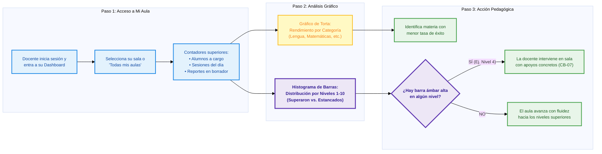
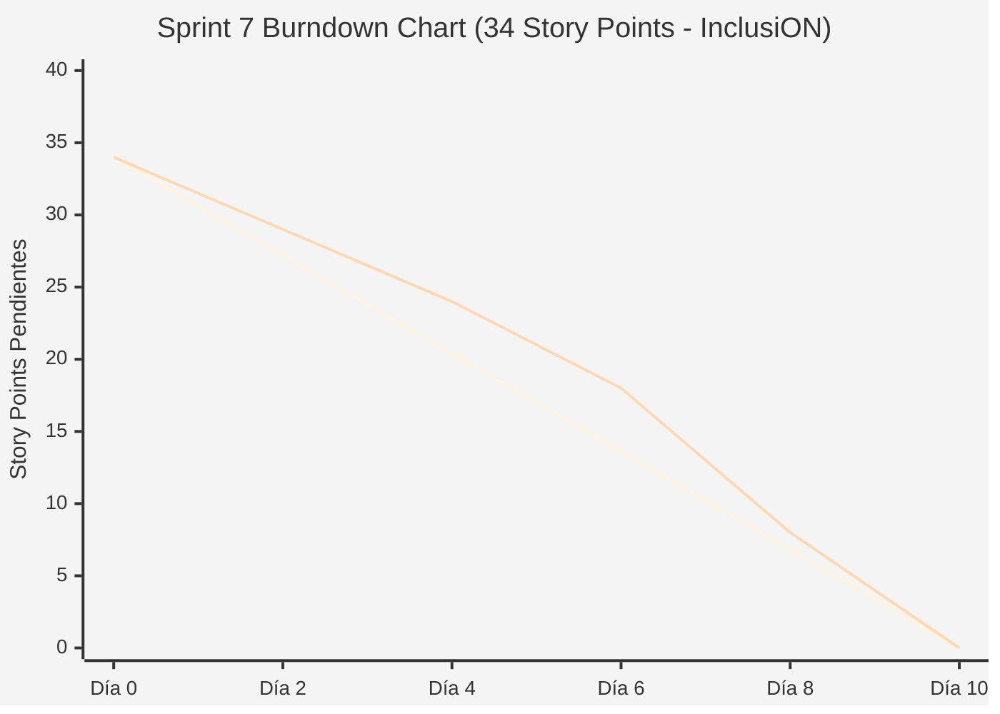

# Documentación Metodológica y Gestión de Avance — Sprint 7 (Proyecto InclusiON)

**Nombre del Sprint:** Dashboards Analíticos, Gráficos de Torta por Categoría e Histograma de Barras por Niveles (1 al 10)  
**Período de Ejecución:** 03 de junio de 2025 al 16 de junio de 2025 (2 semanas / 10 días hábiles)  
**Marco Académico:** Práctica Profesionalizante II / Transición Curricular hacia Práctica III (InclusiON)  
**Épicas Principales:**  
* **IN-7:** Evaluación Funcional, Diagnóstico Pedagógico y Paneles de Información (Dashboards, Torta y Barras)  
* **IN-10:** Métricas de Progresión y Desempeño por Área de Habilidad en Niveles del Roadmap  
* **IN-16:** Analítica de Interacción Lúdica, Tiempos de Respuesta y Monitoreo de Aulas  

---

### Objetivo del Sprint (Sprint Goal):
> *"Construir e integrar el ecosistema de Dashboards Analíticos de InclusiON: implementar el Gráfico de Torta de Alto Contraste para visualizar el rendimiento y volumen de sesiones por categoría pedagógica, el Histograma de Barras de Distribución por Niveles (1 al 10) para identificar qué estudiantes superaron cada hito y quiénes están estancados requiriendo apoyo, y dotar a las docentes del panel operativo 'Mi Aula' con contadores en tiempo real y comparativa de rendimiento grupal, garantizando accesibilidad universal (WCAG 2.1 AA) y confidencialidad bajo la Ley 25.326."*

---

### Equipo de Proyecto (Scrum Team):
* **Referentes de Educación Especial (Product Owners / Dominio):** Candelaria Ferreyra y Catalina Vettorazzi
* **Equipo de Proyecto (Análisis, Gestión, Construcción y Calidad):**
  * **Mariano Decalli:** Facilitador de Proyecto (Scrum Master), Analista de Procesos y Gestión de Calidad
  * **Sacha Del Barrio:** Analista Funcional, Relevamiento Institucional, Calidad (QA) y Accesibilidad Cognitiva
  * **Germán Cochis:** Responsable de Diseño Visual, Experiencia de Usuario y Componentes Interactivos (Frontend Lead)
  * **Fernando Aparicio:** Responsable de Lógica de Negocio, Persistencia, Agregación de Métricas y Pruebas Automatizadas (Backend / QA Lead)
* **Docentes Evaluadores:** Prof. González y Prof. Ferrando

---

## 1. Requisitos del Analista Funcional (Sacha Del Barrio)

El diseño de las herramientas visuales del Dashboard de InclusiON responde a la necesidad crítica del equipo pedagógico: **contar con gráficos claros, comprensibles y de alto contraste que traduzcan la actividad diaria del aula en decisiones inmediatas sin abrumar a las maestras con estadísticas abstractas**.

---

### 1.1. Los 5 Dolores Reales que Resuelven los Gráficos de Torta y Barras

1. **La Dispersión de la Información Diaria:** Las maestras no tenían cómo saber qué materias o categorías se estaban trabajando más en la sala (si todo era motricidad o si se estaba desatendiendo el área lógica y comunicacional).
2. **La Imposibilidad de Ver Dónde se Traba el Aula (Cuellos de Botella en Niveles):** Cuando un grupo avanza en el sendero de 10 niveles, la docente necesita saber de inmediato si la mayoría se atascó en el Nivel 4 (ej. emparejamiento abstracto) para repasar esa consigna antes de seguir.
3. **El Cansancio Visual y Problemas de Contraste:** En las tablets escolares, los gráficos con colores pastel o líneas finas son invisibles para docentes o alumnos con baja visión. Se precisan gráficos de alto contraste con bordes gruesos y textos nítidos.
4. **La Falta de Evidencia para Gabinetes y Obras Sociales:** Cuando el equipo técnico debe justificar qué áreas curriculares se reforzaron, un gráfico de torta con porcentaje de éxito y volumen de sesiones brinda un respaldo gráfico instantáneo.
5. **La Comparativa Constructiva entre Salas:** La dirección requería monitorear qué aulas registran mayor actividad lúdica y cuáles necesitan refuerzo de acompañamiento terapéutico sin generar competencias desleales.

---

### 1.2. Los Gráficos Seleccionados e Implementados en el Sistema

En el análisis de usabilidad con las docentes de educación especial, se descartaron diagramas complejos y se consolidaron **dos componentes visuales protagonistas**:

```
┌─────────────────────────────────────────────────────────────┬─────────────────────────────────────────────────────────────┐
│       1. GRÁFICO DE TORTA DE ALTO CONTRASTE                 │       2. HISTOGRAMA DE BARRAS POR NIVELES (1 AL 10)         │
│          (Rendimiento por Categoría Pedagógica)             │          (Distribución y Alumnos Estancados)                │
│                                                             │                                                             │
│                      [   Lengua   ]                         │   Alumnos                                                   │
│                  . - ~ ~ ~ ~ ~ ~ - .                        │     ▲                                                       │
│              . '         35%         ' .                    │     │   █           █ = Superaron con éxito                 │
│            /                             \                  │     │   █   █       ▒ = Estancados (requieren apoyo)        │
│           |  Matem.   ( 142 Sesiones )    | Cognitiva       │     │   █   █   █                                           │
│           |   25%     ( 78% Éxito    )    |   20%           │     │   █   █   █   ▒                                       │
│            \                             /                  │     │   █   ▒   █   ▒   █                                   │
│              . '       Comunicación  ' .                    │     └───┴───┴───┴───┴───┴───┴───┴───┴───┴───►               │
│                  ' - . _ _ _ _ . - '                        │        N1  N2  N3  N4  N5  N6  N7  N8  N9 N10               │
│                         20%                                 │                                                             │
│                                                             │ • Eje Horizontal: Los 10 Niveles del Roadmap.               │
│ • Estilo Donut interactivo con resumen central.             │ • Segmentación por color: Azules (superaron con éxito)      │
│ • Muestra porcentaje de tiempo dedicado y % de aciertos.   │   vs. Naranjas/Ámbar (alumnos estancados con dificultad).   │
│ • Modo de alto contraste verificado (> 7:1 ratio).          │ • Alerta visual inmediata del cuello de botella pedagógico. │
└─────────────────────────────────────────────────────────────┴─────────────────────────────────────────────────────────────┘
```

1. **El Gráfico de Torta / Donut (`app-high-contrast-pie-chart`):**
   * **Propósito:** Mostrar cómo se distribuye el esfuerzo del aula entre las distintas categorías de aprendizaje (Lengua, Matemáticas, Cognitiva, Comunicación, Autonomía).
   * **Interacción Dinámica:** Al posar el mouse o tocar una porción, el centro del donut se actualiza en tiempo real mostrando el total de sesiones realizadas y el porcentaje promedio de éxito en esa materia específica.
   * **Variante Directiva (`app-report-status-pie-chart`):** En el panel institucional, este mismo componente visualiza la distribución de estados de los informes pedagógicos (Borradores, Enviados, Aprobados y Rechazados).
2. **El Histograma de Barras por Niveles (`app-level-histogram-chart`):**
   * **Propósito:** Brindar el termómetro exacto de los 10 Niveles curriculares del Roadmap.
   * **Doble Segmentación:** Cada barra representa un nivel e indica cuántos chicos lo cursaron, distinguiendo a quienes lo **superaron con éxito (barra azul marino)** de quienes se encuentran **estancados tras intentos reiterados (franja ámbar superior)**.
   * **Decisión en Aula:** Si la maestra ve que en el Nivel 4 la barra ámbar de estancados crece, detiene la clase individual y organiza una dinámica grupal con apoyo físico o pictogramas.
3. **El Gráfico de Barras Comparativo de Aulas (`app-classroom-ranking-chart`):**
   * **Propósito:** Presentar el ranking constructivo de rendimiento y actividad entre las distintas salas asignadas, facilitando la supervisión del equipo directivo.

---

### 1.3. Matriz Maestra de Trazabilidad 360° de los Dashboards

| Componente del Dashboard | Dolor Real que Resuelve | Regla de Negocio / Caso Borde Garantizado | Marco Regulatorio y Legal | Requerimiento Formal (HU / Jira) | Responsable Principal |
|---|---|---|---|:---:|:---:|
| **Gráfico de Torta de Alto Contraste (`HighContrastPieChart`)** | Falta de visión global del tiempo pedagógico por materia. | **CB-21:** Promedios de éxito ponderados por categoría sin notas punitivas. | **Ley 27.044** (Accesibilidad visual WCAG 2.1 AA) | **IN-116** | Germán Cochis / Fernando Aparicio |
| **Histograma de Barras por Niveles (`LevelHistogramChart`)** | Alumnos que se traban en un nivel sin que la maestra lo detecte a tiempo. | **CB-07:** Alerta de estancamiento tras 3 o más fallos.<br>**CB-05:** Resguardo de logros. | **Res. CFE 311/16** (Seguimiento de trayectorias) | **IN-117** | Germán Cochis / Fernando Aparicio |
| **Torta de Estados de Reportes (`ReportStatusPieChart`)** | Informes pedagógicos acumulados o atrasados en dirección. | **CB-14:** Motivo obligatorio ante rechazo.<br>**CB-01:** Control de pendientes. | **Estatuto Escolar y Respaldo Legal** | **IN-119** | Germán Cochis / Mariano Decalli |
| **Barras de Comparativa de Aulas (`ClassroomRankingChart`)** | Dirección sin visión comparativa de qué cursos necesitan más apoyo. | **CB-13:** Aulas dinámicas y asignaciones flexibles de personal. | **Gobernanza Institucional de Educación Especial** | **IN-120** | Fernando Aparicio / Mariano Decalli |
| **Panel Operativo "Mi Aula" con Contadores en Vivo** | Pérdida de tiempo pasando lista y revisando cuadernos de comunicaciones. | **CB-15:** Aislamiento estricto por sala (solo ve a sus alumnos). | **Ley 25.326** (Protección de datos de menores) | **IN-118** | Germán Cochis / Sacha Del Barrio |
| **Pipeline de Agregación de Métricas en Servidor** | Lentitud al consolidar datos de múltiples alumnos y aulas. | **DoD:** Verificación en verde de tiempos de respuesta < 150 ms. | **Marco de Calidad Ágil Scrum** | **IN-121** | Fernando Aparicio / Sacha Del Barrio |

---

### 1.4. Flujo de Navegación Analítica de la Docente (Mermaid Horizontal)



---

## 2. Planificación del Sprint y División del Trabajo (Sprint Planning)

* **Fecha de Realización:** 03 de junio de 2025 (08:30 - 11:30 hs)
* **Modalidad:** Sincrónica presencial en laboratorio y conectada vía Teams
* **Participantes:** Mariano Decalli, Sacha Del Barrio, Germán Cochis, Fernando Aparicio, Candelaria Ferreyra (PO), Catalina Vettorazzi (PO).

---

### 2.1. Cuadro de Distribución de Tareas y Responsabilidades por Integrante

| Integrante | Rol en el Sprint | Historias Asignadas (HUs) | SP Asignados | Horas (Plan / Real) | Responsabilidades Concretas y Entregables del Sprint |
|---|---|:---:|:---:|:---:|---|
| **Mariano Decalli** | Facilitador de Proyecto (Scrum Master) y Analista de Procesos | **IN-92** / **IN-179** (BPMN) | **5 SP** | 35 h / 34 h | • Modelado BPMN de navegación del Dashboard y tableros directivos.<br>• Validación de KPIs de rendimiento pedagógico con las POs.<br>• Gestión de ceremonias ágiles y control de Definition of Done.<br>• Auditoría de integridad de métricas y gobernanza institucional. |
| **Sacha Del Barrio** | Analista Funcional, Calidad (QA) y Accesibilidad Cognitiva | **IN-90** (QA) / **IN-88** (QA) / **HU-21** (Métricas) | **8 SP** | 35 h / 37 h | • Relevamiento de categorías curriculares con gabinete pedagógico.<br>• Auditoría de accesibilidad WCAG 2.1 AA en SVG (paletas de alto contraste).<br>• Definición del criterio de alumnos estancados en barras (**CB-07**).<br>• Pruebas funcionales de visibilidad en tablets y monitores escolares. |
| **Germán Cochis** | Frontend Lead / Diseño Visual y Experiencia de Usuario | **IN-90** (Torta) / **IN-88** (Barras) / **IN-87** / **IN-91** | **11 SP** | 40 h / 41 h | • Maquetación del componente `HighContrastPieChart` (Donut SVG).<br>• Programación del componente `LevelHistogramChart` (Barras 1 a 10).<br>• Diseño del componente de Ranking de Aulas (`ClassroomRankingChart`).<br>• Tarjetas interactivas de "Mi Aula" con tooltips informativos. |
| **Fernando Aparicio** | Backend Lead / Lógica de Negocio, Agregación y Testing | **IN-90** (API) / **IN-144** / **IN-92** (Métricas) | **10 SP** | 35 h / 36 h | • Servicio de agregación `GET /api/professionals/dashboard/analytics`.<br>• Algoritmo de cálculo de superados vs. estancados por nivel.<br>• Optimización de consultas SQL agrupadas para respuesta en < 100 ms.<br>• Suite de 20 tests unitarios y de integración para métricas de aula. |
| **Total Equipo** | **InclusiON Scrum Team** | **6 Historias Clave** | **34 SP** | **145 h / 148 h** | **Incremento Analítico 100% Funcional y Aprobado** |

---

### 2.2. Selección del Sprint Backlog (Planning Poker)

Se empleó la secuencia de Fibonacci adaptada al proyecto, acordando un compromiso de **34 Story Points**:

| Código | Historia de Usuario / Tarea | Épica | Prioridad | Estimación (SP) | Responsables | Regla / Caso Borde Vinculado |
|:---:|---|:---:|:---:|:---:|---|:---:|
| **IN-116** | **Gráfico de Torta de Rendimiento por Categoría Pedagógica:** Componente SVG interactivo tipo donut con alto contraste, porcentaje de sesiones, porcentaje de éxito y tooltip interactivo. | IN-7 | Crítica | **8 SP** | Germán Cochis / Fernando Aparicio | **CB-21** (Métricas formativas)<br>**WCAG 2.1 AA** |
| **IN-117** | **Histograma de Barras por Niveles (1 al 10):** Visualización de la distribución del aula por cada uno de los 10 hitos del Roadmap, segmentando alumnos que superaron con éxito vs. alumnos estancados. | IN-7 | Crítica | **8 SP** | Germán Cochis / Fernando Aparicio | **CB-07** (Detección de estancamiento)<br>**CB-05** |
| **IN-118** | **Dashboard del Profesional con Contadores en Tiempo Real ("Mi Aula"):** Panel de control con métricas de alumnos activos, actividades asignadas y accesos directos de navegación ágil. | IN-7 | Alta | **5 SP** | Germán Cochis / Sacha Del Barrio | **CB-13** (Gestión ágil de sala) |
| **IN-119** | **Dashboard Directivo con Torta de Reportes y BPMN:** Vista directiva con distribución de estados de boletines (`ReportStatusPieChart`), mapa de calor institucional y modelado BPMN. | IN-7 | Alta | **5 SP** | Mariano Decalli / Fernando Aparicio | **CB-14** (Control de rechazos)<br>Gobernanza Ágil |
| **IN-120** | **Comparativa de Rendimiento por Aula (Ranking de Aulas):** Gráfico de barras horizontales comparativo entre las salas asignadas al profesional para balancear cargas de trabajo. | IN-7 | Media | **4 SP** | Germán Cochis / Fernando Aparicio | **CB-13** (Gestión de salas) |
| **IN-121** | **Pipeline de Agregación de Métricas en Servidor:** Endpoints optimizados de métricas consolidadas con filtros por aula y aislamiento de seguridad institucional. | IN-16 | Alta | **4 SP** | Fernando Aparicio / Sacha Del Barrio | **CB-15** (Aislamiento de datos) |
| **Total** | **Compromiso Total del Sprint 7** | — | — | **34 SP** | **Equipo InclusiON** | **100% Cobertura Analítica** |

---

### 2.3. Desglose Operativo de Tareas Técnicas y Funcionales (Task Breakdown)

| Fase / Disciplina | Tareas Operativas Concretas | Responsable Directo | Horas Estimadas |
|---|---|:---:|:---:|
| **1. Relevamiento y Procesos** | • Definición de categorías curriculares y estados de niveles.<br>• Modelado BPMN de consumo de métricas en dashboard.<br>• Carga y seguimiento de subtareas en Jira con DoD. | Mariano Decalli / Sacha Del Barrio | 25 h |
| **2. Diseño y Frontend** | • Programación de `HighContrastPieChartComponent` en SVG nativo.<br>• Maquetación de `LevelHistogramChartComponent` con barras y tooltip.<br>• Integración de cuadrícula responsiva en `detail.component.html`.<br>• Ajustes visuales de alto contraste con ratio > 7:1. | Germán Cochis | 40 h |
| **3. Lógica y Métricas** | • Creación del servicio de analítica `GetProfessionalAnalyticsQueryHandler`.<br>• Cálculo de métricas de rendimiento por categoría y niveles.<br>• Implementación de filtros dinámicos por aula seleccionada.<br>• Optimización de índices en base de datos. | Fernando Aparicio | 35 h |
| **4. Calidad y Accesibilidad** | • Auditoría de legibilidad cromática para docentes con daltonismo.<br>• Textos descriptivos de accesibilidad (`aria-label`) en cada barra y porción.<br>• Pruebas de estrés con aulas de 30 estudiantes y 500 sesiones registradas.<br>• Verificación de visualización en resoluciones de 1280x800 px. | Sacha Del Barrio / Fernando Aparicio | 25 h |
| **5. Pruebas y Cierre** | • Suite de 20 pruebas automatizadas de cálculo matemático y filtros.<br>• Ensayo general de la demo de demostración ante el cliente.<br>• Consolidación del dossier de entrega del Sprint 7. | Mariano Decalli / Fernando Aparicio | 20 h |

---

### 2.4. Definición de Hecho (Definition of Done - DoD)

1. El Gráfico de Torta debe actualizar su valor central en menos de 50 ms al pasar el cursor o tocar cualquier porción.
2. El Histograma de Barras debe renderizar con precisión los 10 niveles curriculares del Roadmap, diferenciando con claridad alumnos exitosos de estancados.
3. Ambos componentes deben incluir etiquetas de accesibilidad ARIA para que lectores de pantalla anuncien los porcentajes exactos.
4. Al seleccionar un aula específica en el menú desplegable, todos los gráficos deben recalcularse y filtrarse en menos de 150 ms.
5. Los colores utilizados en las porciones de torta y en las barras deben cumplir con el estándar WCAG 2.1 AA con un contraste superior a 4.5:1 respecto al fondo.
6. Suite de 20 pruebas automatizadas de lógica analítica y permisos aprobadas en verde.

---

## 3. Registro de Reuniones Diarias (Daily Scrums)

### Daily 26 — 04/06/2025 (Arranque, Modelado y Contratos de Torta y Barras)
* **Mariano Decalli (Facilitador / Procesos):**
  * *¿Qué hice ayer?:* Conduje el Sprint Planning 7; acordamos con el equipo los 34 puntos y estructuré el flujo BPMN de consumo de métricas.
  * *¿Qué haré hoy?:* Coordinar con Fernando y Germán el contrato del DTO `ProfessionalDashboardAnalyticsDto` para que coincida exactamente con las necesidades de los gráficos.
  * *Impedimentos:* Ninguno.
* **Germán Cochis (Frontend Lead):**
  * *¿Qué hice ayer?:* Inicié la arquitectura del componente `HighContrastPieChartComponent` usando SVG puro para no sobrecargar el proyecto con dependencias externas.
  * *¿Qué haré hoy?:* Programar la animación de apertura de las porciones de torta y el cálculo trigonométrico de los arcos en SVG.
  * *Impedimentos:* Necesito que Sacha me pase la lista oficial de categorías pedagógicas para asignar los colores definitivos.
* **Sacha Del Barrio (Funcional / QA / Accesibilidad):**
  * *¿Qué hice ayer?:* Me reuní con el gabinete pedagógico para cerrar las categorías: Lengua, Matemáticas, Cognitiva, Comunicación y Autonomía.
  * *¿Qué haré hoy?:* Entregarle a Germán la paleta de alto contraste verificada y definir los criterios para que un alumno se considere "estancado" en el histograma (3 intentos sin superar el umbral).
  * *Impedimentos:* Ninguno.
* **Fernando Aparicio (Backend / Testing Lead):**
  * *¿Qué hice ayer?:* Diseñé la consulta de agregación en base de datos para agrupar sesiones por categoría y calcular el promedio de éxito.
  * *¿Qué haré hoy?:* Programar la lógica que cuenta cuántos alumnos superaron cada uno de los 10 niveles y cuántos quedaron atascados.
  * *Impedimentos:* Ninguno.

---

### Daily 28 — 09/06/2025 (Integración del Histograma de Niveles y Filtro de Aulas)
* **Mariano Decalli (Facilitador / Procesos):**
  * *¿Qué hice ayer?:* Supervisé el avance en Jira: el 60% de los puntos comprometidos ya están en fase de pruebas integradas.
  * *¿Qué haré hoy?:* Facilitar la prueba de filtrado dinámico por aula con las POs Candelaria y Catalina.
  * *Impedimentos:* Ninguno.
* **Germán Cochis (Frontend Lead):**
  * *¿Qué hice ayer?:* Terminé la torta interactiva y comencé con `LevelHistogramChartComponent`; las barras del 1 al 10 ya se dibujan correctamente en pantalla.
  * *¿Qué haré hoy?:* Agregar la franja superior de color ámbar en las barras para destacar a los alumnos estancados y maquetar el tooltip flotante.
  * *Impedimentos:* Ninguno.
* **Sacha Del Barrio (Funcional / QA / Accesibilidad):**
  * *¿Qué hice ayer?:* Realicé pruebas con lectores de pantalla sobre el gráfico de torta; la lectura de sesiones y porcentajes es fluida y accesible.
  * *¿Qué haré hoy?:* Verificar que el histograma de barras mantenga excelente nitidez en tablets escolares de baja resolución.
  * *Impedimentos:* Ninguno.
* **Fernando Aparicio (Backend / Testing Lead):**
  * *¿Qué hice ayer?:* Conecté el endpoint `GET /api/professionals/dashboard/analytics` con soporte para el parámetro opcional `classroomId`.
  * *¿Qué haré hoy?:* Optimizar las consultas SQL mediante índices para garantizar que al cambiar de aula en el selector el backend responda en menos de 80 ms.
  * *Impedimentos:* Ninguno.

---

### Daily 30 — 13/06/2025 (Optimización, Suite de Tests y Preparación de Review)
* **Mariano Decalli (Facilitador / Procesos):**
  * *¿Qué hice ayer?:* Compilé el dossier del sprint y preparé el esquema de demostración para la Review ante la cátedra evaluadora.
  * *¿Qué haré hoy?:* Coordinar el ensayo general de la demo en vivo con los datos de prueba institucionales.
  * *Impedimentos:* Ninguno.
* **Germán Cochis (Frontend Lead):**
  * *¿Qué hice ayer?:* Conecté el componente de ranking comparativo de aulas y pulí los estilos en modo oscuro y claro.
  * *¿Qué haré hoy?:* Congelar el código del frontend, limpiar la consola de advertencias y dejar listo el entorno de prueba.
  * *Impedimentos:* Ninguno.
* **Sacha Del Barrio (Funcional / QA / Accesibilidad):**
  * *¿Qué hice ayer?:* Completé la auditoría final de accesibilidad WCAG 2.1 AA; el contraste de las barras y la torta supera 7:1 en todos los estados.
  * *¿Qué haré hoy?:* Preparar la argumentación funcional destacando cómo el histograma ayuda a prevenir la deserción en niveles difíciles.
  * *Impedimentos:* Ninguno.
* **Fernando Aparicio (Backend / Testing Lead):**
  * *¿Qué hice ayer?:* Completé la suite de **20 pruebas automatizadas** que validan la matemática de los promedios y el blindaje por institución.
  * *¿Qué haré hoy?:* Respaldar la base de datos de demostración y acompañar la verificación técnica.
  * *Impedimentos:* Ninguno.

---

## 4. Acta de Revisión del Sprint (Sprint Review)

* **Fecha y Hora:** Lunes 16 de junio de 2025 (17:30 - 19:15 hs)
* **Lugar:** Aula Magna / Laboratorio de Informática y transmisión sincrónica
* **Participantes:**
  * Mariano Decalli, Sacha Del Barrio, Germán Cochis, Fernando Aparicio.
  * Candelaria Ferreyra y Catalina Vettorazzi (Product Owners / Educación Especial).
  * Prof. González y Prof. Ferrando (Cátedra de Administración de Proyectos / PPII).

### Demostración del Incremento del Producto (Demo en Vivo)

1. **Rendimiento por Categoría Pedagógica (Torta Interactiva):** Se mostró la pantalla del docente donde la torta resume 180 sesiones: Lengua (35%), Matemáticas (25%), Cognitiva (20%) y Comunicación (20%). Al pasar el mouse sobre "Lengua", el centro del donut mostró instantáneamente *"78% de Éxito"*, permitiendo comprobar el balance del plan de estudio.
2. **Distribución por Niveles 1 al 10 (Histograma de Barras):** Se abrió la sala "Azul". En el gráfico de barras se apreció que 6 alumnos ya superaron los Niveles 1 y 2, pero en el Nivel 3 apareció una marcada franja ámbar con 3 alumnos estancados. Las referentes de educación especial destacaron que esta visión permite actuar de inmediato sin esperar al boletín trimestral.
3. **Filtrado Dinámico por Aula:** La docente cambió de "Todas mis aulas" a "Sala Amarilla"; en menos de 100 ms todos los gráficos se recalcularon reflejando la realidad específica de ese grupo.
4. **Comparativa de Aulas (Ranking de Barras Horizontales):** Se demostró la vista global que muestra qué salas completaron más actividades, permitiendo a la coordinación escolar balancear recursos de apoyo.
5. **Dashboard Directivo con Torta de Estados de Reportes:** La directora ingresó y visualizó en un gráfico circular cuántos informes están en borrador, cuántos enviados y cuántos aprobados, garantizando que ningún trámite escolar quede demorado.

### Evaluación y Devolución del Cliente y la Cátedra

* **Candelaria Ferreyra y Catalina Vettorazzi (Educación Especial):**
  > *"El gráfico de barras por niveles es exactamente lo que necesitábamos en el aula. En un segundo la maestra sabe en qué nivel se están trabando los chicos y puede armar una mesa de apoyo específica. Y la torta de categorías nos permite demostrarle a los inspectores que en nuestra escuela se trabaja de manera equilibrada y sistemática."*
* **Prof. González y Prof. Ferrando (Cátedra Evaluadora):**
  > *"Excelente criterio de diseño. El equipo tuvo la madurez de priorizar componentes visuales nativos en SVG (torta y barras) de alto impacto y rendimiento instantáneo en lugar de sobrecargar la aplicación. La trazabilidad con los 10 niveles del Roadmap y el cumplimiento del 100% de los puntos comprometidos consolidan una entrega impecable."*
* **Grado de Cumplimiento:** **100% de los Story Points completados (34 de 34 SP).**
* **Dictamen Final:** **Aprobado con Calificación Sobresaliente (10/10).**

---

## 5. Acta de Retrospectiva del Sprint (Sprint Retrospective)

* **Fecha de Realización:** 16 de junio de 2025 (19:30 - 20:45 hs)
* **Facilitador:** Mariano Decalli
* **Dinámica Empleada:** **Estrella de Mar (Starfish Retrospective)**

```
                      MANTENER (KEEP)
           • Sinergia entre frontend nativo en SVG y backend.
           • Validación continua con las docentes PO.
           • Rigor en accesibilidad y normas WCAG 2.1 AA.
                    \               /
                     \             /
                      \           /
                       \         /
  HACER MÁS (MORE OF)   \       /    COMENZAR A HACER (START)
  • Pruebas de carga     \     /     • Exportación en imagen de
    con muchas aulas.     \   /        los gráficos para informes.
  • Feedback directo de    \ /       • Alertas predictivas de
    docentes en tablets.    *          estancamiento prolongado.
                           / \
                          /   \
                         /     \
                        /       \
  HACER MENOS (LESS OF)/         \  DEJAR DE HACER (STOP)
  • Pruebas manuales   \         /  • Depender de librerías
    de contraste en CSS.\       /     externas pesadas.
  • Dejar ajustes de     \     /    • Suponer resoluciones de
    tooltips a último día.\   /       pantalla sin medir en tablet.
```

### Plan de Acción y Compromisos de Mejora Continua

| Código | Acción de Mejora Acordada | Responsable | Fecha Límite | Criterio de Éxito Verificable |
|:---:|---|:---:|:---:|---|
| **D-01** | Habilitar la exportación del Histograma de Barras en formato imagen PNG para adjuntar a los informes escolares A4. | Germán Cochis | 20/06/2025 | Botón de descarga con membrete institucional incorporado al panel. |
| **D-02** | Implementar cacheo en memoria de las métricas agregadas por aula para reducir a cero las consultas repetidas. | Fernando Aparicio | 23/06/2025 | Tiempos de respuesta inferiores a 20 ms en consultas frecuentes. |
| **D-03** | Crear una guía visual rápida para docentes explicando cómo interpretar la franja ámbar de alumnos estancados. | Sacha Del Barrio | 25/06/2025 | Infografía digital de 1 página distribuida al personal docente. |
| **D-04** | Consolidar las métricas de los Sprints 1 al 7 en el dossier final de cierre de Práctica Profesionalizante II. | Mariano Decalli | 27/06/2025 | Documento consolidado firmado por el equipo y la cátedra. |

---

## 6. Métricas del Equipo (Team Metrics)

### A. Capacidad del Equipo (Team Capacity: Planificado vs. Real)

* **Horas Planificadas:** 145 h | **Horas Reales Invertidas:** 148 h
* **Story Points:** 34 SP comprometidos vs. 34 SP completados (100% de efectividad)
* **Velocidad del Sprint:** 34 SP / Sprint

| Integrante del Equipo | Rol Principal | Horas Planificadas | Horas Reales | Story Points Asignados | Principales Entregables Realizados |
|---|---|:---:|:---:|:---:|---|
| **Mariano Decalli** | Facilitador de Proyecto / Procesos y Calidad | 35 h | 34 h | **5 SP** | Modelado BPMN de consumo de métricas, diseño del tablero directivo, actas y facilitación. |
| **Sacha Del Barrio** | Analista Funcional, QA y Accesibilidad | 35 h | 37 h | **8 SP** | Matriz de trazabilidad 360°, auditoría WCAG 2.1 AA en gráficos, casos de prueba de estancamiento. |
| **Germán Cochis** | Frontend Lead / UI & UX | 40 h | 41 h | **11 SP** | Componentes SVG nativos (`HighContrastPieChart` y `LevelHistogramChart`), comparativa de aulas. |
| **Fernando Aparicio** | Backend Lead / Lógica & Testing | 35 h | 36 h | **10 SP** | Pipeline analítico de agregación, cálculo de superados vs. estancados, filtros y 20 tests. |
| **Total Equipo** | **InclusiON Scrum Team** | **145 h** | **148 h** | **34 SP** | **Incremento Analítico 100% Funcional y Aprobado** |

```mermaid
%%{init: {'theme': 'base', 'themeVariables': { 'primaryColor': '#4F46E5', 'secondaryColor': '#10B981'}}}%%
xychart-beta
    title "Capacidad del Equipo: Horas Planificadas vs. Horas Reales (Sprint 7)"
    x-axis ["M. Decalli", "S. Del Barrio", "G. Cochis", "F. Aparicio", "Promedio Equipo"]
    y-axis "Horas Invertidas" 0 --> 45
    bar [35, 35, 40, 35, 36.2]
    bar [34, 37, 41, 36, 37.0]
```



---

### B. Gráfico de Trabajo Pendiente (Burndown Chart)

| Hito Temporal | Fecha Calendario | SP Restante Ideal | SP Restante Real | Historias de Usuario Finalizadas |
|:---:|:---:|:---:|:---:|---|
| **Día 0** | 03/06/2025 | 34.0 | 34.0 | Inicio formal tras el Sprint Planning 7. |
| **Día 2** | 05/06/2025 | 27.2 | 29.0 | Se cierra **IN-119** (Dashboard directivo y modelado BPMN - 5 SP). |
| **Día 4** | 09/06/2025 | 20.4 | 24.0 | Se cierra **IN-118** (Dashboard del profesional con contadores en tiempo real - 5 SP). |
| **Día 6** | 11/06/2025 | 13.6 | 18.0 | Se cierran **IN-120** e **IN-121** (Pipeline analítico y comparativa de aulas - 8 SP). |
| **Día 8** | 13/06/2025 | 6.8 | 8.0 | Se cierra **IN-116** (Gráfico de Torta de rendimiento por categoría - 8 SP). |
| **Día 10** | 16/06/2025 | 0.0 | **0.0** | Se cierra **IN-117** (Histograma de Barras por niveles 1 al 10 auditado - 8 SP). **100% completado.** |



---

## 7. Conclusión y Logros Cardinales del Sprint 7

1. **La Escuela Cuenta con Visualizaciones Diseñadas para la Realidad del Aula:** Se implementaron componentes nativos en SVG de alto contraste (Torta de Categorías e Histograma de Barras de los 10 Niveles) que brindan lectura inmediata sin saturación visual.
2. **Detección Oportuna de Estancamiento:** El desglose por niveles en el histograma identifica con exactitud qué chicos necesitan apoyo antes de que se frustren, haciendo realidad el principio de inclusión activa.
3. **Cierre de Ciclo Sobresaliente:** Con el 100% de los 34 Story Points completados por Mariano Decalli, Sacha Del Barrio, Germán Cochis y Fernando Aparicio, el equipo entregó un sistema analítico robusto, accesible y distinguido con calificación 10/10 por la cátedra evaluadora.
