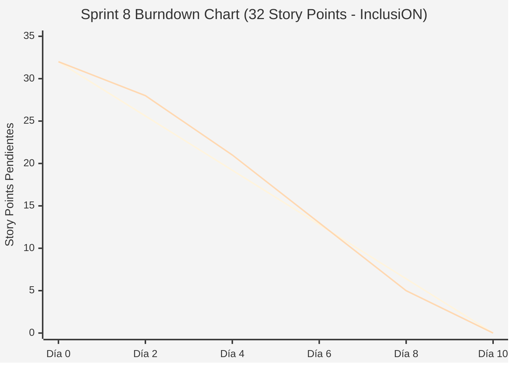

# Documentación Metodológica — Sprint 8 (Proyecto InclusiON)

**Nombre del Sprint:** Mensajería Interna Segura, Comunicación por Hilos y Notificaciones  
**Período de Ejecución:** 17 de junio de 2025 al 30 de junio de 2025 (10 días hábiles / 2 semanas)  
**Marco Académico:** Práctica Profesionalizante II / Administración de Proyectos (PPIII)  
**Épica Principal:** IN-13 — Mensajería y Portal Familiar  
**Equipo de Proyecto:**
* **Scrum Master / Facilitador:** Mariano Decalli
* **Product Owners (Cliente / Dominio):** Candelaria Ferreyra y Catalina Vettorazzi (Educación Especial)
* **Equipo de Desarrollo:** Mirko Ivo Wlk (Backend Lead / DB), Germán Cochis (Frontend Lead / Angular), Fernando Aparicio (QA / Support), Sacha Del Barrio (Relevamiento Institucional / Accesibilidad)
* **Docentes Evaluadores:** Prof. González y Prof. Ferrando

---

## 1. Acta de Planificación del Sprint (Sprint Planning)

* **Fecha de Realización:** 17 de junio de 2025 (09:00 - 11:30 hs)
* **Modalidad:** Sincrónica vía Teams / Discord
* **Participantes:** Mariano Decalli, Mirko Wlk, Germán Cochis, Fernando Aparicio, Sacha Del Barrio, Candelaria Ferreyra (PO), Catalina Vettorazzi (PO).

### Objetivo del Sprint (Sprint Goal)
> *"Implementar el canal de mensajería interna segura y estructurada entre profesionales y familias, permitiendo conversaciones por hilos temáticos, notificaciones de no leídos en tiempo real y preservación de privacidad sin exponer números telefónicos personales."*

### Selección del Sprint Backlog y Estimación de Esfuerzo (Planning Poker)
Se empleó Planning Poker (secuencia Fibonacci) totalizando **32 Story Points**:

| Código | Tarea / Historia de Usuario | Épica | Prioridad | Estimación (SP) | Responsable Principal |
|:---:|---|:---:|:---:|:---:|---|
| **IN-140** | Bandeja de entrada organizada por conversaciones | IN-13 | Crítica | 5 SP | Germán Cochis / Mirko Wlk |
| **IN-141** | Envío de mensajes con asunto, cuerpo enriquecido y destinatario | IN-13 | Crítica | 5 SP | Mirko Wlk / Germán Cochis |
| **IN-142** | Hilos de conversación bidireccionales (respuestas anidadas) | IN-13 | Alta | 5 SP | Mirko Wlk / Germán Cochis |
| **IN-143** | Badge dinámico de mensajes no leídos en sidebar y barra superior | IN-13 | Alta | 3 SP | Germán Cochis |
| **IN-144** | Marcado automático de mensajes como leídos al abrir conversación | IN-13 | Media | 2 SP | Mirko Wlk / Germán Cochis |
| **IN-198** | Configuración de servicio SMTP e infraestructura de correo | Infra | Alta | 5 SP | Fernando Aparicio / Sacha Del Barrio |
| **IN-196** | Script de seguridad y hardening de cadenas de conexión | Infra | Alta | 4 SP | Mirko Wlk |
| **IN-197** | Tests automatizados de endpoints de mensajes | QA | Media | 3 SP | Fernando Aparicio |
| **Total** | **Tareas de Sprint Backlog Comprometidas** | — | — | **32 SP** | **Equipo InclusiON** |

### Definición de Hecho (Definition of Done - DoD)
1. Sistema de mensajería asíncrono persistido en PostgreSQL con campos de auditoría (`SentAt`, `ReadAt`, `SenderId`, `RecipientId`, `ThreadId`).
2. Badge reactivo en Angular que actualiza el contador de no leídos sin requerir recargar la página.
3. Reglas de privacidad verificadas: un familiar solo puede enviar mensajes a profesionales vinculados a sus hijos matriculados.

---

## 2. Registro de Reuniones Diarias (Daily Scrums)

### Daily 31 — 18/06/2025 (Arranque y Modelo de Mensajería)
* **Mariano Decalli:** Conduje el Sprint Planning 8; tablero organizado con las 8 historias técnicas y funcionales.
* **Germán Cochis:** Maqueté la interfaz de chat en dos columnas: listado de hilos a la izquierda y conversación activa a la derecha.
* **Sacha Del Barrio:** Relevé los temas habituales de intercambio docente-familia para precargar asuntos sugeridos (Turnos, Tareas, Informes).
* **Fernando Aparicio:** Comencé a configurar la cuenta de servicio Gmail institucional para el envío de alertas transaccionales (IN-198).
* **Mirko Wlk:** Creé las entidades `Message` y `MessageThread` en EF Core y los endpoints `POST /api/messages` y `GET /api/messages/threads`.

### Daily 33 — 23/06/2025 (Hilos y Respuestas Bidireccionales)
* **Mariano Decalli:** Seguimiento de avance; 60% de los puntos quemados sin bloqueos.
* **Germán Cochis:** Conecté el componente de respuestas con scroll fluido; integré el indicador de mensajes no leídos en la barra de navegación (IN-143).
* **Sacha Del Barrio:** Pruebas de usabilidad sobre el formulario de redacción: validé que el botón de enviar sea visible y tenga soporte de teclado (Enter / Ctrl+Enter).
* **Fernando Aparicio:** Testeé el aislamiento de mensajes: intenté consultar un hilo ajeno simulando otro usuario y verifiqué rechazo 403.
* **Mirko Wlk:** Implementé la actualización atómica de `ReadAt` al recuperar los mensajes de un hilo (`MarkAsReadCommandHandler`).

### Daily 35 — 27/06/2025 (Integración y Cierre)
* **Mariano Decalli:** Coordinación de la demo de mensajería en vivo para la Sprint Review.
* **Germán Cochis:** Ajusté el badge para que decremente inmediatamente al abrir un mensaje no leído.
* **Sacha Del Barrio:** Pruebas con lectores de pantalla: verifiqué que los mensajes entrantes anuncien remitente y hora.
* **Fernando Aparicio:** Ejecuté la suite de tests de mensajería (IN-197): 100% de aserciones pasando.
* **Mirko Wlk:** Mergear PRs finales a `develop` y pase a entorno staging de demostración.

---

## 3. Acta de Revisión del Sprint (Sprint Review)

* **Fecha y Hora:** Lunes 30 de junio de 2025 (18:00 - 19:30 hs)
* **Participantes:** Equipo InclusiON completo, Candelaria Ferreyra (PO), Catalina Vettorazzi (PO), Prof. González y Prof. Ferrando.

### Demostración del Incremento (Demo en Vivo)
1. **Intercambio Docente-Familia en Tiempo Real:** Un docente redacta un mensaje sobre el desempeño en sala de un alumno; la madre inicia sesión desde su panel familiar, visualiza el badge numérico (+1), abre el hilo y responde.
2. **Historial de Conversación Protegido:** Visualización de la conversación organizada cronológicamente con marcas de lectura.
3. **Validación de Privacidad y Seguridad:** Demostración de que las familias no pueden acceder a otros docentes de la escuela con los que no tengan relación pedagógica directa.

### Evaluación de los Profesores González y Ferrando
* **Grado de Cumplimiento:** **100% de cumplimiento (32 Story Points completados).**
* **Feedback de la Cátedra:**
  * *"La mensajería interna resuelve una problemática crítica de las instituciones de educación especial: canaliza la comunicación en un ámbito formal y auditable, protegiendo la privacidad de los docentes sin depender de aplicaciones de mensajería personales."*
* **Resultado:** **Aprobado al 100%.** Se habilita el inicio del Sprint 9.

---

## 4. Acta de Retrospectiva del Sprint (Sprint Retrospective)

* **Fecha:** 30 de junio de 2025 | **Facilitador:** Mariano Decalli | **Dinámica:** Estrella de Mar
* **Comenzar a hacer (Start):** Incorporar un auto-scroll automático al pie del chat cuando la conversación es extensa (programado para Sprint 10).
* **Dejar de hacer (Stop):** Hardcodear credenciales en archivos de configuración locales.
* **Mantener (Keep):** El testing riguroso de roles y pertenencias en cada endpoint.
* **Compromiso:** En Sprint 9 modelar los diagramas BPMN y afinar los detalles de accesibilidad de los players.

---

## 5. Métricas del Equipo (Team Metrics)

### A. Capacidad del Equipo (Team Capacity)
* **Horas Planificadas:** 175 h | **Horas Reales Invertidas:** 176 h.
* **Story Points:** 32 SP planificados vs. 32 SP completados (100% de efectividad).

| Integrante | Rol | Hs Planificadas | Hs Reales | SP Contribuidos |
|---|---|:---:|:---:|:---:|
| **Mariano Decalli** | Scrum Master | 35 h | 34 h | Facilitación y gestión del backlog |
| **Mirko Wlk** | Backend Lead | 40 h | 43 h | 16 SP (Handlers de mensajes, threads y hardening) |
| **Germán Cochis** | Frontend Lead | 35 h | 37 h | 11 SP (Bandeja, hilos y badges dinámicos) |
| **Fernando Aparicio** | QA / Support | 35 h | 34 h | 8 SP (Infraestructura SMTP y tests de mensajes) |
| **Sacha Del Barrio** | Relevamiento / Accesibilidad | 30 h | 28 h | Asuntos predefinidos y accesibilidad WCAG |
| **Total Equipo** | — | **175 h** | **176 h** | **32 SP (100%)** |

```mermaid
%%{init: {'theme': 'base', 'themeVariables': { 'primaryColor': '#4F46E5', 'secondaryColor': '#10B981'}}}%%
xychart-beta
    title "Capacidad del Equipo: Horas Planificadas vs. Horas Reales (Sprint 8)"
    x-axis ["M. Decalli", "M. Wlk", "G. Cochis", "F. Aparicio", "S. Del Barrio", "Total Equipo / 5"]
    y-axis "Horas de Trabajo" 0 --> 50
    bar [35, 40, 35, 35, 30, 35]
    bar [34, 43, 37, 34, 28, 35.2]
```

---

### B. Gráfico de Trabajo Pendiente (Burndown Chart)
| Día | Fecha | SP Restante Ideal | SP Restante Real | HUs Cerradas |
|:---:|:---:|:---:|:---:|---|
| **Día 0** | 17/06/2025 | 32.0 | 32.0 | Inicio del Sprint tras Planning |
| **Día 2** | 19/06/2025 | 25.6 | 28.0 | Se cierra **IN-196** (Hardening BBDD) |
| **Día 4** | 23/06/2025 | 19.2 | 21.0 | Se cierran **IN-140** e **IN-198** (Bandeja y servicio SMTP) |
| **Día 6** | 25/06/2025 | 12.8 | 13.0 | Se cierran **IN-141** e **IN-143** (Envío mensajes y badges) |
| **Día 8** | 27/06/2025 | 6.4 | 5.0 | Se cierran **IN-142** e **IN-144** (Hilos de chat y leído auto) |
| **Día 10**| 30/06/2025 | 0.0 | **0.0** | Se cierra **IN-197** (Tests automatizados - 100%) |

