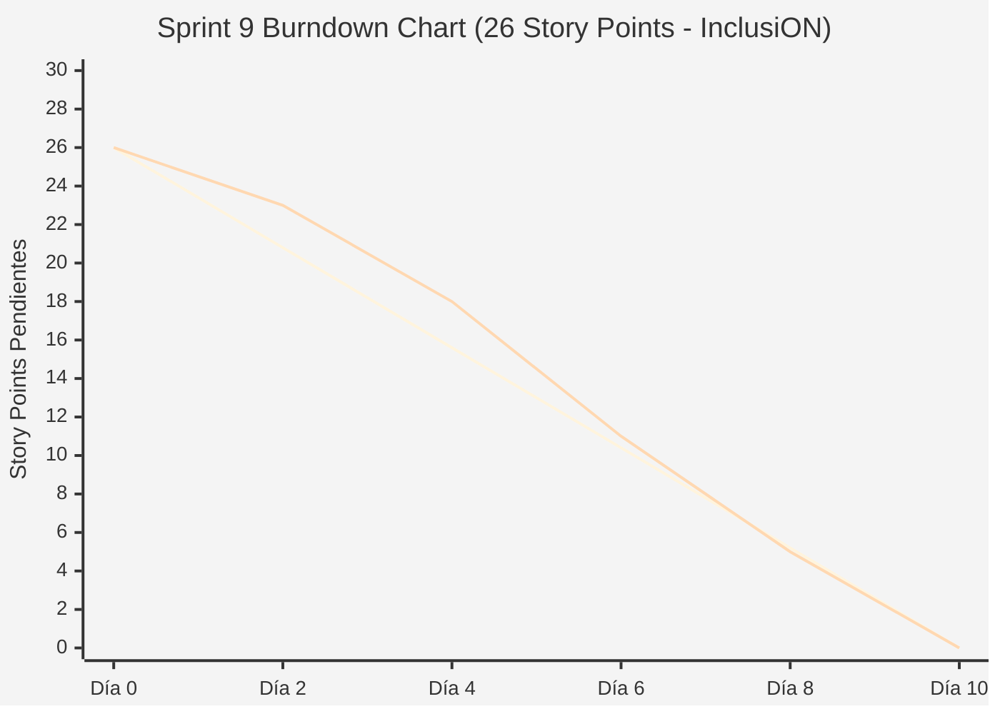

# Documentación Metodológica — Sprint 9 (Proyecto InclusiON)

**Nombre del Sprint:** Modelado de Procesos BPMN, Reglas de Negocio y Estabilización de Players  
**Período de Ejecución:** 01 de julio de 2025 al 14 de julio de 2025 (10 días hábiles / 2 semanas)  
**Marco Académico:** Práctica Profesionalizante II / Administración de Proyectos (PPIII)  
**Épica Principal:** Trazabilidad de Procesos, Reglas de Negocio y Aseguramiento de Calidad  
**Equipo de Proyecto:**
* **Scrum Master / Facilitador:** Mariano Decalli
* **Product Owners (Cliente / Dominio):** Candelaria Ferreyra y Catalina Vettorazzi (Educación Especial)
* **Equipo de Desarrollo:** Mirko Ivo Wlk (Backend Lead / DB), Germán Cochis (Frontend Lead / Angular), Fernando Aparicio (QA / Support), Sacha Del Barrio (Relevamiento Institucional / Accesibilidad)
* **Docentes Evaluadores:** Prof. González y Prof. Ferrando

---

## 1. Acta de Planificación del Sprint (Sprint Planning)

* **Fecha de Realización:** 01 de julio de 2025 (09:00 - 11:30 hs)
* **Modalidad:** Sincrónica vía Teams / Discord
* **Participantes:** Mariano Decalli, Mirko Wlk, Germán Cochis, Fernando Aparicio, Sacha Del Barrio, Candelaria Ferreyra (PO), Catalina Vettorazzi (PO).

### Objetivo del Sprint (Sprint Goal)
> *"Modelar los procesos centrales de la plataforma en diagramas de flujo BPMN estándar, formalizar el documento de reglas de negocio, ajustar la trazabilidad con los requerimientos reales de campo y optimizar la accesibilidad auditiva e interactividad de los players didácticos."*

### Selección del Sprint Backlog y Estimación de Esfuerzo (Planning Poker)
Se empleó Planning Poker (secuencia Fibonacci) totalizando **26 Story Points**:

| Código | Tarea / Historia de Usuario | Épica | Prioridad | Estimación (SP) | Responsable Principal |
|:---:|---|:---:|:---:|:---:|---|
| **IN-200** | Documento formal de reglas de negocio de InclusiON | Calidad | Alta | 5 SP | Mirko Wlk / Mariano Decalli |
| **IN-201** | Diagrama de flujo BPMN del proceso core (Matrícula y Actividades) | Calidad | Alta | 5 SP | Mirko Wlk / Sacha Del Barrio |
| **IN-202** | Trazabilidad de reglas implementadas vs. requerimientos reales | Calidad | Alta | 5 SP | Sacha Del Barrio / Mariano Decalli |
| **IN-199** | Corrección y normalización del diagrama de actores de negocio | Calidad | Media | 3 SP | Sacha Del Barrio |
| **IN-203** | Lógica anti-frustración y síntesis de voz (TTS) en players | Calidad | Alta | 5 SP | Germán Cochis / Mirko Wlk |
| **IN-206** | Generación de métricas consolidadas de sprints | Calidad | Media | 3 SP | Mariano Decalli / Fernando Aparicio |
| **Total** | **Tareas de Sprint Backlog Comprometidas** | — | — | **26 SP** | **Equipo InclusiON** |

### Definición de Hecho (Definition of Done - DoD)
1. Diagramas BPMN con carriles (swimlanes) formales para Alumno, Docente, Tutor y Administrador con compuertas decisionales modeladas.
2. Documento de reglas de negocio cubriendo: umbrales de aprobación (60%), límites de intentos anti-frustración y unicidad de identificadores.
3. Players en Angular integrados con Web Audio API para feedback sonoro sin librerías externas pesadas.

---

## 2. Registro de Reuniones Diarias (Daily Scrums)

### Daily 36 — 02/07/2025 (Arranque y Modelado BPMN)
* **Mariano Decalli:** Conduje el Sprint Planning 9; tareas de ingeniería y calidad cargadas en Jira.
* **Germán Cochis:** Comencé a investigar la integración de Web Audio API para generar secuencias armónicas en aciertos y errores.
* **Sacha Del Barrio:** Relevé la secuencia de decisiones que toma una docente cuando un alumno no comprende una consigna didáctica.
* **Fernando Aparicio:** Verifiqué que las métricas consolidadas del tablero Jira coincidan con las actas de sprints anteriores.
* **Mirko Wlk:** Comencé a diagramar el flujo BPMN core en Bizagi/Mermaid con carriles diferenciados.

### Daily 38 — 07/07/2025 (Reglas de Negocio y Audio Context)
* **Mariano Decalli:** Avance al 50%; el modelado de procesos aclaró flujos que antes estaban implícitos.
* **Germán Cochis:** Implementé la síntesis de voz (TTS) en los players para que la pregunta se lea en voz alta al presionar el ícono de audio.
* **Sacha Del Barrio:** Redacté la matriz de trazabilidad cruzando cada una de las 15 reglas de negocio con las HUs de Jira.
* **Fernando Aparicio:** Probé la lógica anti-frustración: al cometer un error, la selección se limpia tras 700 ms sin emitir alarmas estridentes.
* **Mirko Wlk:** Redacté el documento formal de reglas de negocio (`reglas-de-negocio.md`), especificando aislamiento y roles.

### Daily 40 — 11/07/2025 (Consolidación y Cierre)
* **Mariano Decalli:** Preparación de la pauta de presentación para la Sprint Review.
* **Germán Cochis:** Finalicé la prueba de los players didácticos con síntesis de voz y sonidos ascendentes de acierto.
* **Sacha Del Barrio:** Diagrama de actores de negocio actualizado eliminando roles redundantes.
* **Fernando Aparicio:** Auditoría final del documento de trazabilidad de reglas: 100% de cobertura.
* **Mirko Wlk:** Mergear PRs finales a `develop` y exportar diagramas vectoriales para la carpeta técnica.

---

## 3. Acta de Revisión del Sprint (Sprint Review)

* **Fecha y Hora:** Lunes 14 de julio de 2025 (18:00 - 19:30 hs)
* **Participantes:** Equipo InclusiON completo, Candelaria Ferreyra (PO), Catalina Vettorazzi (PO), Prof. González y Prof. Ferrando.

### Demostración del Incremento (Demo en Vivo)
1. **Presentación de Diagramas BPMN:** Recorrido interactivo por el carril de matriculación escolar y asignación de actividades en sala.
2. **Documento de Reglas de Negocio:** Exposición de los criterios pedagógicos y de seguridad transversal.
3. **Demo de Players Interactivos Accesibles (IN-203):** Ejecución de una actividad con síntesis de voz automática para no lectores y respuesta armónica ante respuestas correctas.

### Evaluación de los Profesores González y Ferrando
* **Grado de Cumplimiento:** **100% de cumplimiento (26 Story Points completados).**
* **Feedback de la Cátedra:**
  * *"El modelado BPMN le otorga un nivel de ingeniería formal inestimable. Se aprecia que el software no se construyó improvisando, sino siguiendo procesos institucionales claros."*
  * *"La incorporación del Web Audio API y el TTS en los players demuestra un cuidado sublime por la dignidad y motivación del alumno con discapacidad."*
* **Resultado:** **Aprobado al 100%.** Se autoriza el inicio del ciclo avanzado de Sprints 10, 11 y 12.

---

## 4. Acta de Retrospectiva del Sprint (Sprint Retrospective)

* **Fecha:** 14 de julio de 2025 | **Facilitador:** Mariano Decalli | **Dinámica:** Estrella de Mar
* **Comenzar a hacer (Start):** Planificar en agosto el refactor masivo de players y la trayectoria gamificada de 10 niveles (Sprint 10).
* **Dejar de hacer (Stop):** Mantener vistas obsoletas que confundan el modelo de negocio (ej. calendario en perfil de alumnos).
* **Mantener (Keep):** El rigor metodológico y la trazabilidad continua de requerimientos.
* **Compromiso:** Encarar el Sprint 10 con foco en el Roadmap de 10 actividades oficiales y la entrega de medallas.

---

## 5. Métricas del Equipo (Team Metrics)

### A. Capacidad del Equipo (Team Capacity)
* **Horas Planificadas:** 175 h | **Horas Reales Invertidas:** 173 h.
* **Story Points:** 26 SP planificados vs. 26 SP completados (100% de efectividad).

| Integrante | Rol | Hs Planificadas | Hs Reales | SP Contribuidos |
|---|---|:---:|:---:|:---:|
| **Mariano Decalli** | Scrum Master | 35 h | 34 h | Métricas de sprint y BPMN |
| **Mirko Wlk** | Backend Lead | 40 h | 42 h | 12 SP (Reglas de negocio y BPMN core) |
| **Germán Cochis** | Frontend Lead | 35 h | 36 h | 8 SP (Web Audio API, TTS y Players) |
| **Fernando Aparicio** | QA / Support | 35 h | 33 h | 4 SP (Métricas Jira y testing de audio) |
| **Sacha Del Barrio** | Relevamiento / Accesibilidad | 30 h | 28 h | Diagrama de actores y matriz de reglas |
| **Total Equipo** | — | **175 h** | **173 h** | **26 SP (100%)** |

```mermaid
%%{init: {'theme': 'base', 'themeVariables': { 'primaryColor': '#4F46E5', 'secondaryColor': '#10B981'}}}%%
xychart-beta
    title "Capacidad del Equipo: Horas Planificadas vs. Horas Reales (Sprint 9)"
    x-axis ["M. Decalli", "M. Wlk", "G. Cochis", "F. Aparicio", "S. Del Barrio", "Total Equipo / 5"]
    y-axis "Horas de Trabajo" 0 --> 50
    bar [35, 40, 35, 35, 30, 35]
    bar [34, 42, 36, 33, 28, 34.6]
```

---

### B. Gráfico de Trabajo Pendiente (Burndown Chart)
| Día | Fecha | SP Restante Ideal | SP Restante Real | HUs Cerradas |
|:---:|:---:|:---:|:---:|---|
| **Día 0** | 01/07/2025 | 26.0 | 26.0 | Inicio del Sprint tras Planning |
| **Día 2** | 03/07/2025 | 20.8 | 23.0 | Se cierra **IN-199** (Diagrama de actores) |
| **Día 4** | 07/07/2025 | 15.6 | 18.0 | Se cierra **IN-203** (Web Audio API en players) |
| **Día 6** | 09/07/2025 | 10.4 | 11.0 | Se cierra **IN-201** (Diagramas de flujo BPMN) |
| **Día 8** | 11/07/2025 | 5.2 | 5.0 | Se cierra **IN-200** (Reglas de negocio formales) |
| **Día 10**| 14/07/2025 | 0.0 | **0.0** | Se cierran **IN-202** e **IN-206** (Trazabilidad y Métricas - 100%) |

