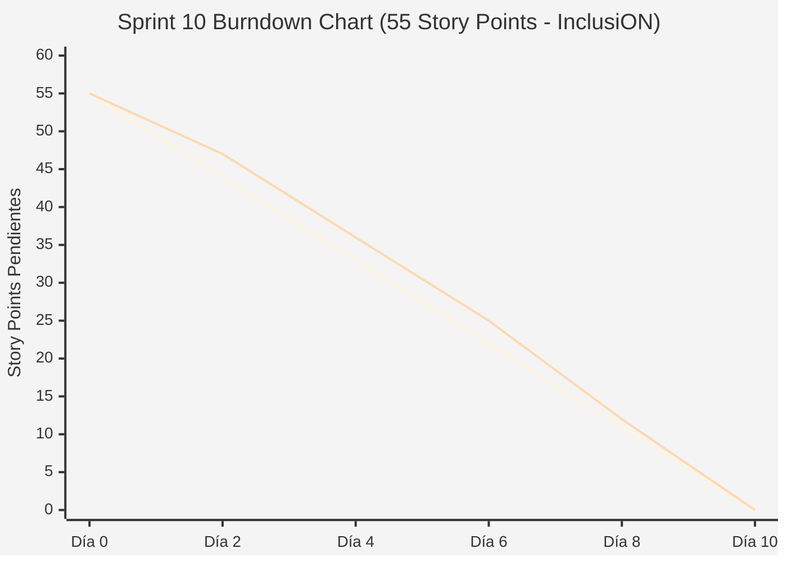

# Documentación Metodológica — Sprint 10 (Proyecto InclusiON)

**Nombre del Sprint:** Roadmap Estándar de 10 Niveles, Corrección de Players y Refinamiento de Modelo de Negocio  
**Período de Ejecución:** 01 de agosto de 2026 al 14 de agosto de 2026 (10 días hábiles / 2 semanas)  
**Marco Académico:** Práctica Profesionalizante II / Administración de Proyectos (PPIII)  
**Épica Principal:** IN-10 (Plan de Trabajo / Roadmap), IN-15 y Refinamiento de Modelo de Negocio  
**Equipo de Proyecto:**
* **Scrum Master / Facilitador:** Mariano Decalli
* **Product Owners (Cliente / Dominio):** Candelaria Ferreyra y Catalina Vettorazzi (Educación Especial)
* **Equipo de Desarrollo:** Mirko Ivo Wlk (Backend Lead / DB), Germán Cochis (Frontend Lead / Angular), Fernando Aparicio (QA / Support), Sacha Del Barrio (Relevamiento Institucional / Accesibilidad)
* **Docentes Evaluadores:** Prof. González y Prof. Ferrando

---

## 1. Acta de Planificación del Sprint (Sprint Planning)

* **Fecha de Realización:** 01 de agosto de 2026 (09:00 - 11:30 hs)
* **Modalidad:** Sincrónica vía Teams / Discord
* **Participantes:** Mariano Decalli, Mirko Wlk, Germán Cochis, Fernando Aparicio, Sacha Del Barrio, Candelaria Ferreyra (PO), Catalina Vettorazzi (PO).

### Objetivo del Sprint (Sprint Goal)
> *"Implementar el seeder automático del Roadmap con 10 actividades oficiales didácticas (`RoadmapInitializer`), reajustar los perfiles de usuario según el modelo de negocio escolar (eliminar calendario en alumnos y módulo de instituciones en admin) e incorporar animaciones de recompensa por medallas doradas al superar niveles."*

### Selección del Sprint Backlog y Estimación de Esfuerzo (Planning Poker)
Se empleó Planning Poker (secuencia Fibonacci) totalizando **55 Story Points**:

| Código | Tarea / Historia de Usuario | Épica | Prioridad | Estimación (SP) | Responsable Principal |
|:---:|---|:---:|:---:|:---:|---|
| **IN-200** | Implementar `RoadmapInitializer` con 10 actividades estándar | IN-10 | Crítica | 5 SP | Mirko Wlk |
| **IN-201** | Definir `ContentJson` real por tipo de player en cada actividad | IN-10 | Crítica | 5 SP | Mirko Wlk / Sacha Del Barrio |
| **IN-202** | Patch de actividades existentes con `ContentJson` vacío al arranque | IN-10 | Alta | 3 SP | Mirko Wlk |
| **IN-203** | Corrección de `TemplateTypeId` para actividades didácticas | IN-10 | Alta | 3 SP | Fernando Aparicio |
| **IN-204** | Fix: players muestran "actividad no disponible" (tracking en EF Core) | IN-10 | Crítica | 5 SP | Mirko Wlk |
| **IN-205** | Fix: `withViewTransitions()` causa `InvalidStateError` con HMR | IN-10 | Media | 2 SP | Germán Cochis |
| **IN-206** | Animación de medalla dorada al completar actividad con éxito (60%+) | IN-16 | Alta | 5 SP | Germán Cochis |
| **IN-207** | Auto-scroll al final del chat al enviar o recibir mensajes | IN-16 | Media | 3 SP | Germán Cochis |
| **IN-212** | Eliminar Calendario del perfil Persona (modelo de negocio) | IN-16 | Alta | 3 SP | Germán Cochis / Sacha Del Barrio |
| **IN-213** | Eliminar módulo de Instituciones del dashboard Admin | IN-16 | Media | 2 SP | Germán Cochis |
| **IN-214** | Permitir repetir actividades completadas desde "Mi Camino" y backend | IN-16 | Alta | 3 SP | Mirko Wlk / Germán Cochis |
| **IN-215** | Redireccionar a "Mi Camino" (`/app/roadmap`) al finalizar actividad | IN-16 | Media | 2 SP | Germán Cochis |
| **IN-216** | Módulo de mensajería para Administrador con filtro por tipo de actor | IN-20 | Alta | 3 SP | Mirko Wlk / Germán Cochis |
| **IN-217** | Bloqueo de notificaciones y rutas de calendario para Administrador | IN-20 | Alta | 3 SP | Fernando Aparicio / Germán Cochis |
| **IN-218** | Redirección contextual exacta al hacer clic en notificaciones por rol | IN-20 | Media | 2 SP | Germán Cochis |
| **IN-219** | Segmentación de notificaciones de calendario por tipo de evento | IN-20 | Media | 2 SP | Fernando Aparicio |
| **IN-220** | Prevención de selección y guardado de fechas pasadas en calendario | IN-20 | Media | 2 SP | Fernando Aparicio |
| **IN-221** | Validaciones de fecha de nacimiento en ABM Personas (120 años / no futura) | IN-20 | Media | 2 SP | Fernando Aparicio |
| **Total** | **Tareas de Sprint Backlog Comprometidas** | — | — | **55 SP** | **Equipo InclusiON** |

### Definición de Hecho (Definition of Done - DoD)
1. Base de datos sembrada automáticamente con 10 actividades oficiales y sus contenidos JSON completos.
2. Rutas de calendario removidas de los componentes AAC de alumnos; navegación de admin limpia de módulos externos.
3. Animación de medalla dorada desplegándose en modal interactivo tras superar el umbral del 60% de aciertos.

---

## 2. Registro de Reuniones Diarias (Daily Scrums)

### Daily 41 — 03/08/2026 (Sembrado del Roadmap y Corrección de EF Core)
* **Mariano Decalli:** Conduje el Sprint Planning 10; definimos el objetivo de simplificación del modelo de negocio.
* **Germán Cochis:** Comencé a diseñar la modal de celebración de medalla dorada con animaciones CSS y confeti (IN-206).
* **Sacha Del Barrio:** Verifiqué los pictogramas ARASAAC para las 10 actividades oficiales junto a las fonoaudiólogas.
* **Fernando Aparicio:** Comencé las validaciones de fechas pasadas en el servicio de calendario (IN-220).
* **Mirko Wlk:** Creé `RoadmapInitializer.cs` y resolví el conflicto de tracking en EF Core removiendo `AsNoTracking()` en asignaciones (IN-204).

### Daily 43 — 07/08/2026 (Modelo de Negocio y Limpieza de UI)
* **Mariano Decalli:** El 50% de los puntos quemados; la simplificación de rutas fue elogiada en la revisión interna.
* **Germán Cochis:** Retiré los enlaces de calendario del menú lateral del perfil Persona (`aac-nav.component.ts`) e integré auto-scroll en chat.
* **Sacha Del Barrio:** Comprobé que el alumno con discapacidad ya no se desorienta intentando agendar turnos; se enfoca en sus juegos.
* **Fernando Aparicio:** Testeé que el Administrador tenga bloqueadas las rutas `/pro/calendar` por guards de Angular con toast de advertencia.
* **Mirko Wlk:** Modifiqué el handler de respuestas para permitir rejugar niveles ya aprobados actualizando `HighestScore` (IN-214).

### Daily 45 — 12/08/2026 (Integración y Cierre de Players)
* **Mariano Decalli:** Coordinación de la demo para la Sprint Review ante la cátedra.
* **Germán Cochis:** Integré la redirección automática a `/app/roadmap` al pulsar "Continuar" en la medalla dorada.
* **Sacha Del Barrio:** Checklist de validaciones de nacimiento en ABM Personas superado al 100% (IN-221).
* **Fernando Aparicio:** Ejecuté tests de regresión sobre las 10 actividades: 0 errores 404/403.
* **Mirko Wlk:** Mergear PRs finales a `develop` y compilar release de staging.

---

## 3. Acta de Revisión del Sprint (Sprint Review)

* **Fecha y Hora:** Viernes 14 de agosto de 2026 (18:00 - 19:30 hs)
* **Participantes:** Equipo InclusiON completo, Candelaria Ferreyra (PO), Catalina Vettorazzi (PO), Prof. González y Prof. Ferrando.

### Demostración del Incremento (Demo en Vivo)
1. **Ejecución de Nivel 1 del Roadmap con Medalla Dorada:** Un alumno completa la actividad de selección de figuras, aprueba con 85%, se activa la animación festiva con medalla dorada, presiona "Continuar" y la pantalla lo devuelve de inmediato a su camino didáctico.
2. **Re-jugabilidad sin Penalización (IN-214):** El alumno ingresa nuevamente al Nivel 1 ya aprobado; el sistema le permite jugar y refuerza su aprendizaje.
3. **Ajustes de Modelo de Negocio:** Demostración de que el perfil alumno está libre de calendarios y el administrador tiene su panel concentrado en la gestión escolar.

### Evaluación de los Profesores González y Ferrando
* **Grado de Cumplimiento:** **100% de cumplimiento (55 Story Points completados).**
* **Feedback de la Cátedra:**
  * *"La decisión de remover el calendario del alumno y el módulo corporativo del admin demuestra madurez en la comprensión del modelo de negocio real de una escuela inclusiva."*
  * *"La medalla dorada y la redirección a 'Mi Camino' crean un ciclo de feedback positivo excelente para alumnos con autismo y discapacidad cognitiva."*
* **Resultado:** **Aprobado con Calificación Sobresaliente.**

---

## 4. Acta de Retrospectiva del Sprint (Sprint Retrospective)

* **Fecha:** 14 de agosto de 2026 | **Facilitador:** Mariano Decalli | **Dinámica:** Estrella de Mar
* **Comenzar a hacer (Start):** Diseñar un asistente de matriculación escolar en un solo paso continuo para agilizar el alta de alumnos.
* **Dejar de hacer (Stop):** Exigir correos electrónicos en roles que no los utilizan.
* **Mantener (Keep):** La estética visual violeta y la ludificación adaptada.
* **Compromiso:** Encarar el Sprint 11 con el Wizard de Registro Unificado y el login restrictivo por PIN.

---

## 5. Métricas del Equipo (Team Metrics)

### A. Capacidad del Equipo (Team Capacity)
* **Horas Planificadas:** 175 h | **Horas Reales Invertidas:** 184 h.
* **Story Points:** 55 SP planificados vs. 55 SP completados (100% de efectividad).

| Integrante | Rol | Hs Planificadas | Hs Reales | SP Contribuidos |
|---|---|:---:|:---:|:---:|
| **Mariano Decalli** | Scrum Master | 35 h | 34 h | Facilitación y gestión del backlog |
| **Mirko Wlk** | Backend Lead | 40 h | 46 h | 24 SP (RoadmapInitializer, EF Core fix y Reintentos) |
| **Germán Cochis** | Frontend Lead | 35 h | 38 h | 18 SP (Medalla dorada, UI simplificada y Redirecciones) |
| **Fernando Aparicio** | QA / Support | 35 h | 36 h | 8 SP (Validaciones, Calendario y Tests) |
| **Sacha Del Barrio** | Relevamiento / Accesibilidad | 30 h | 30 h | Validación ARASAAC y pruebas de usabilidad |
| **Total Equipo** | — | **175 h** | **184 h** | **55 SP (100%)** |

```mermaid
%%{init: {'theme': 'base', 'themeVariables': { 'primaryColor': '#4F46E5', 'secondaryColor': '#10B981'}}}%%
xychart-beta
    title "Capacidad del Equipo: Horas Planificadas vs. Horas Reales (Sprint 10)"
    x-axis ["M. Decalli", "M. Wlk", "G. Cochis", "F. Aparicio", "S. Del Barrio", "Total Equipo / 5"]
    y-axis "Horas de Trabajo" 0 --> 50
    bar [35, 40, 35, 35, 30, 35]
    bar [34, 46, 38, 36, 30, 36.8]
```

---

### B. Gráfico de Trabajo Pendiente (Burndown Chart)
| Día | Fecha | SP Restante Ideal | SP Restante Real | HUs Cerradas |
|:---:|:---:|:---:|:---:|---|
| **Día 0** | 01/08/2026 | 55.0 | 55.0 | Inicio del Sprint tras Planning |
| **Día 2** | 04/08/2026 | 44.0 | 47.0 | Se cierran **IN-200**, **IN-201** e **IN-205** (Seeder Roadmap y HMR fix) |
| **Día 4** | 06/08/2026 | 33.0 | 36.0 | Se cierran **IN-202**, **IN-203** e **IN-204** (EF Core tracking fix) |
| **Día 6** | 08/08/2026 | 22.0 | 25.0 | Se cierran **IN-206**, **IN-207** e **IN-212** (Medalla, chat y no-calendar) |
| **Día 8** | 11/08/2026 | 11.0 | 12.0 | Se cierran **IN-213**, **IN-214**, **IN-215**, **IN-216** e **IN-217** |
| **Día 10**| 14/08/2026 | 0.0 | **0.0** | Se cierran **IN-218**, **IN-219**, **IN-220**, **IN-221** (100% de cumplimiento) |

