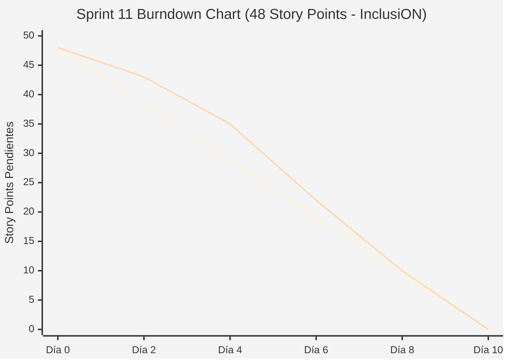

# Documentación Metodológica — Sprint 11 (Proyecto InclusiON)

**Nombre del Sprint:** Gestión de Aulas, Asistente de Registro Unificado y Autonomía de Alumnos  
**Período de Ejecución:** 15 de agosto de 2026 al 28 de agosto de 2026 (10 días hábiles / 2 semanas)  
**Marco Académico:** Práctica Profesionalizante II / Administración de Proyectos (PPIII)  
**Épicas:** IN-17 (Gestión de Aulas y Registro Unificado) e IN-18 (Autonomía de Acceso y Métodos de Login)  
**Equipo de Proyecto:**
* **Scrum Master / Facilitador:** Mariano Decalli
* **Product Owners (Cliente / Dominio):** Candelaria Ferreyra y Catalina Vettorazzi (Educación Especial)
* **Equipo de Desarrollo:** Mirko Ivo Wlk (Backend Lead / DB), Germán Cochis (Frontend Lead / Angular), Fernando Aparicio (QA / Support), Sacha Del Barrio (Relevamiento Institucional / Accesibilidad)
* **Docentes Evaluadores:** Prof. González y Prof. Ferrando

---

## 1. Acta de Planificación del Sprint (Sprint Planning)

* **Fecha de Realización:** 15 de agosto de 2026 (09:00 - 11:30 hs)
* **Modalidad:** Sincrónica vía Teams / Discord
* **Participantes:** Mariano Decalli, Mirko Wlk, Germán Cochis, Fernando Aparicio, Sacha Del Barrio, Candelaria Ferreyra (PO), Catalina Vettorazzi (PO).

### Objetivo del Sprint (Sprint Goal)
> *"Diseñar el flujo transaccional de registro escolar unificado en 3 pasos (Alumno + Tutor + Aula), habilitar la creación de aulas sin alumnos obligatorios y restringir definitivamente el acceso por email a favor de métodos adaptados (PIN de 4 dígitos y Asistido) para garantizar la autonomía de los alumnos."*

### Selección del Sprint Backlog y Estimación de Esfuerzo (Planning Poker)
Se empleó Planning Poker (secuencia Fibonacci) totalizando **48 Story Points**:

| Código | Tarea / Historia de Usuario | Épica | Prioridad | Estimación (SP) | Responsable Principal |
|:---:|---|:---:|:---:|:---:|---|
| **IN-301** | Creación de aulas vacías sin alumnos obligatorios | IN-17 | Alta | 5 SP | Fernando Aparicio / Germán Cochis |
| **IN-302** | Endpoint transaccional unificado: Alumno + Tutor + Aula | IN-17 | Crítica | 13 SP | Mirko Wlk |
| **IN-303** | Rediseño de Asistente de Registro (Wizard) de 3 Pasos | IN-17 | Crítica | 8 SP | Germán Cochis / Sacha Del Barrio |
| **IN-304** | Normalización de filtrado por nombre de aula con encriptación | IN-17 | Alta | 5 SP | Mirko Wlk |
| **IN-310** | Restricción de inicio de sesión por email para rol `PersonWithDisability` | IN-18 | Crítica | 5 SP | Mirko Wlk |
| **IN-311** | Restricción de reasignación del método Email en ABM de alumnos | IN-18 | Alta | 3 SP | Germán Cochis |
| **IN-312** | Migración masiva de base de datos a PIN por defecto (1234) | IN-18 | Alta | 3 SP | Mirko Wlk |
| **IN-313** | UI de login para Familiares (`userType === 'FAMILY'`) a Email | IN-18 | Media | 2 SP | Germán Cochis |
| **IN-314** | Filtrado de opción Email en dropdown "Método de Login" en ABM | IN-18 | Media | 2 SP | Germán Cochis |
| **IN-315** | Validación reactiva de PIN obligatorio cuando `loginMethodId == 2` | IN-18 | Media | 2 SP | Fernando Aparicio / Germán Cochis |
| **Total** | **Tareas de Sprint Backlog Comprometidas** | — | — | **48 SP** | **Equipo InclusiON** |

### Definición de Hecho (Definition of Done - DoD)
1. Endpoint `POST /api/onboarding/unified-registration` atómico: si falla la creación del familiar o la asignación de aula, se hace rollback completo.
2. Formulario Wizard en Angular con validación por pasos y barra de progreso.
3. Intento de login por email para alumnos bloqueado con código HTTP `403 Forbidden` y mensaje pedagógico explicativo.
4. Base de datos migrada: ningún alumno con método de login por email.

---

## 2. Registro de Reuniones Diarias (Daily Scrums)

### Daily 46 — 17/08/2026 (Arranque y Transacción Atómica)
* **Mariano Decalli:** Conduje el Sprint Planning 11; foco puesto en el Wizard unificado y el nuevo endpoint atómico.
* **Germán Cochis:** Comencé a maquetar el componente `unified-wizard.component.ts` con 3 pasos lineales y control de navegación.
* **Sacha Del Barrio:** Relevé con las secretarias escolares qué datos mínimos son indispensables para matricular a un alumno en el acto.
* **Fernando Aparicio:** Desarrollé el CRUD para crear aulas sin requerir alumnos asignados (IN-301).
* **Mirko Wlk:** Creé el comando `UnifiedRegistrationCommand` en MediatR manejando una transacción explícita de EF Core (IN-302).

### Daily 48 — 21/08/2026 (Restricción de Email y PIN Obligatorio)
* **Mariano Decalli:** 50% de los puntos quemados; la prueba de rollback funcionó impecablemente.
* **Germán Cochis:** Conecté el paso 2 del Wizard (datos del familiar) y el paso 3 (selección de aula).
* **Sacha Del Barrio:** Probé el inicio de sesión adaptado: confirmé que a los alumnos solo se les solicita PIN numérico en pantalla táctil.
* **Fernando Aparicio:** Creé la migración SQL para asignar PIN por defecto '1234' a los alumnos históricos que tenían método email (IN-312).
* **Mirko Wlk:** En `LoginCommandHandler`, agregué la intercepción de roles: si `role == PersonWithDisability` rechaza el acceso por email (IN-310).

### Daily 50 — 26/08/2026 (Wizard Completo y Normalización de Aulas)
* **Mariano Decalli:** Preparación de la demo de matriculación en vivo para la Sprint Review.
* **Germán Cochis:** Integré la animación de confirmación del Wizard con resumen visual de las 2 cuentas creadas.
* **Sacha Del Barrio:** Verifiqué que el selector de método de login en el ABM ya no incluya la opción "Email" para alumnos (IN-314).
* **Fernando Aparicio:** Testeé la búsqueda por nombre de aula resolviendo el conflicto con columnas encriptadas (IN-304).
* **Mirko Wlk:** Mergear PRs finales a `develop` y ejecutar migración en staging.

---

## 3. Acta de Revisión del Sprint (Sprint Review)

* **Fecha y Hora:** Viernes 28 de agosto de 2026 (18:00 - 19:30 hs)
* **Participantes:** Equipo InclusiON completo, Candelaria Ferreyra (PO), Catalina Vettorazzi (PO), Prof. González y Prof. Ferrando.

### Demostración del Incremento (Demo en Vivo)
1. **Matriculación Unificada en 45 Segundos (IN-302 e IN-303):** Se ingresan datos del alumno, se carga a la madre como tutora de contacto y se selecciona el aula "Primer Grado Especial". Al hacer clic en "Finalizar Matrícula", el sistema ejecuta la transacción atómica y emite ambas cuentas vinculadas.
2. **Creación de Aulas Vacías (IN-301):** Demostración de alta de una nueva sala para el ciclo lectivo venidero sin alumnos forzados.
3. **Bloqueo Estricto de Email para Alumnos (IN-310 y IN-314):** Demostración de intento de acceso de un alumno en el formulario de login tradicional por email; el sistema devuelve `403 Forbidden` y lo orienta al login adaptado por PIN.

### Evaluación de los Profesores González y Ferrando
* **Grado de Cumplimiento:** **100% de cumplimiento (48 Story Points completados).**
* **Feedback de la Cátedra:**
  * *"La matriculación unificada es una obra maestra de usabilidad administrativa: reduce el tiempo de registro en más de un 70% y garantiza la consistencia de los datos."*
  * *"La erradicación del login por email para alumnos con discapacidad demuestra coherencia absoluta con el propósito inclusivo del sistema."*
* **Resultado:** **Aprobado con Calificación Máxima.**

---

## 4. Acta de Retrospectiva del Sprint (Sprint Retrospective)

* **Fecha:** 28 de agosto de 2026 | **Facilitador:** Mariano Decalli | **Dinámica:** Estrella de Mar
* **Comenzar a hacer (Start):** Asegurar que las actividades oficiales del Roadmap no se mezclen con las tareas personalizadas que crean los docentes.
* **Dejar de hacer (Stop):** Tolerar errores 403 al hacer clic en actividades del camino.
* **Mantener (Keep):** La robustez transaccional en backend y el testeo reactivo en frontend.
* **Compromiso:** Encarar el Sprint 12 (Cierre de InclusiON) con "Mi Camino" gamificado y auto-asignación transparente.

---

## 5. Métricas del Equipo (Team Metrics)

### A. Capacidad del Equipo (Team Capacity)
* **Horas Planificadas:** 175 h | **Horas Reales Invertidas:** 179 h.
* **Story Points:** 48 SP planificados vs. 48 SP completados (100% de efectividad).

| Integrante | Rol | Hs Planificadas | Hs Reales | SP Contribuidos |
|---|---|:---:|:---:|:---:|
| **Mariano Decalli** | Scrum Master | 35 h | 34 h | Facilitación y gestión del backlog |
| **Mirko Wlk** | Backend Lead | 40 h | 45 h | 26 SP (Transacción unificada y Auth PIN) |
| **Germán Cochis** | Frontend Lead | 35 h | 38 h | 14 SP (Wizard 3 pasos y validaciones UI) |
| **Fernando Aparicio** | QA / Support | 35 h | 34 h | 5 SP (Aulas vacías, migraciones y tests) |
| **Sacha Del Barrio** | Relevamiento / Accesibilidad | 30 h | 28 h | Validación de campos y accesibilidad |
| **Total Equipo** | — | **175 h** | **179 h** | **48 SP (100%)** |

```mermaid
%%{init: {'theme': 'base', 'themeVariables': { 'primaryColor': '#4F46E5', 'secondaryColor': '#10B981'}}}%%
xychart-beta
    title "Capacidad del Equipo: Horas Planificadas vs. Horas Reales (Sprint 11)"
    x-axis ["M. Decalli", "M. Wlk", "G. Cochis", "F. Aparicio", "S. Del Barrio", "Total Equipo / 5"]
    y-axis "Horas de Trabajo" 0 --> 50
    bar [35, 40, 35, 35, 30, 35]
    bar [34, 45, 38, 34, 28, 35.8]
```

---

### B. Gráfico de Trabajo Pendiente (Burndown Chart)
| Día | Fecha | SP Restante Ideal | SP Restante Real | HUs Cerradas |
|:---:|:---:|:---:|:---:|---|
| **Día 0** | 15/08/2026 | 48.0 | 48.0 | Inicio del Sprint tras Planning |
| **Día 2** | 18/08/2026 | 38.4 | 43.0 | Se cierra **IN-301** (Creación de aulas vacías) |
| **Día 4** | 20/08/2026 | 28.8 | 35.0 | Se cierran **IN-310** e **IN-312** (Restricción email y migración PIN) |
| **Día 6** | 24/08/2026 | 19.2 | 22.0 | Se cierra **IN-302** (Endpoint atómico unificado) |
| **Día 8** | 26/08/2026 | 9.6 | 10.0 | Se cierran **IN-304**, **IN-311**, **IN-313** e **IN-314** |
| **Día 10**| 28/08/2026 | 0.0 | **0.0** | Se cierran **IN-303** e **IN-315** (Wizard 3 pasos completado - 100%) |

