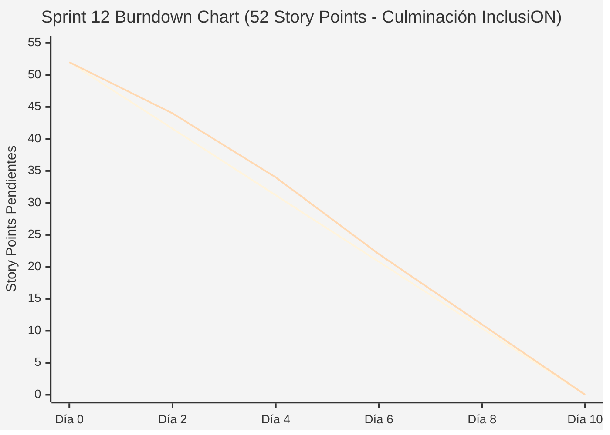

# Documentación Metodológica — Sprint 12 (Proyecto InclusiON)

**Nombre del Sprint:** "Mi Camino" Gamificado, Auto-Asignación Transaccional y Culminación de InclusiON  
**Período de Ejecución:** 29 de agosto de 2026 al 11 de septiembre de 2026 (10 días hábiles / 2 semanas)  
**Marco Académico:** Proyecto Integrador Final / Culminación de PPIII  
**Épicas:** IN-19 ("Mi Camino" Gamificado), HU-21 (Casos Borde de Frustración) y HU-22 (Red Colaborativa)  
**Equipo de Proyecto:**
* **Scrum Master / Facilitador:** Mariano Decalli
* **Product Owners (Cliente / Dominio):** Candelaria Ferreyra y Catalina Vettorazzi (Educación Especial)
* **Equipo de Desarrollo:** Mirko Ivo Wlk (Backend Lead / DB), Germán Cochis (Frontend Lead / Angular), Fernando Aparicio (QA / Support), Sacha Del Barrio (Relevamiento Institucional / Accesibilidad)
* **Docentes Evaluadores:** Prof. González y Prof. Ferrando

---

## 1. Acta de Planificación del Sprint (Sprint Planning)

* **Fecha de Realización:** 29 de agosto de 2026 (09:00 - 11:30 hs)
* **Modalidad:** Sincrónica vía Teams / Discord
* **Participantes:** Mariano Decalli, Mirko Wlk, Germán Cochis, Fernando Aparicio, Sacha Del Barrio, Candelaria Ferreyra (PO), Catalina Vettorazzi (PO).

### Objetivo del Sprint (Sprint Goal)
> *"Lanzar la experiencia gamificada de 'Mi Camino' con 10 niveles en zigzag violeta y auto-asignación transparente para los alumnos, aislar las plantillas del sistema de la grilla de actividades docentes, implementar el catálogo colaborativo comunitario y sembrar métricas analíticas para los dashboards docentes."*

### Selección del Sprint Backlog y Estimación de Esfuerzo (Planning Poker)
Se empleó Planning Poker (secuencia Fibonacci) totalizando **52 Story Points**:

| Código | Tarea / Historia de Usuario | Épica | Prioridad | Estimación (SP) | Responsable Principal |
|:---:|---|:---:|:---:|:---:|---|
| **IN-320** | Aislamiento de actividades del Roadmap para profesionales | IN-19 | Alta | 5 SP | Mirko Wlk / Germán Cochis |
| **IN-321** | Experiencia gamificada "Mi Camino" en `/app/roadmap` | IN-19 | Crítica | 8 SP | Germán Cochis / Sacha Del Barrio |
| **IN-322** | Auto-asignación transaccional (`POST /api/activity-assignments/auto-assign/{id}`) | IN-19 | Crítica | 8 SP | Mirko Wlk |
| **IN-323** | Casos de borde de resiliencia (alumnos sin tutor, niveles repetidos) | IN-19 | Alta | 5 SP | Mirko Wlk / Fernando Aparicio |
| **IN-324** | Filtrado reactivo en "Mis Actividades" (solo tareas docentes) | IN-19 | Alta | 5 SP | Germán Cochis |
| **IN-325** | Catálogo colaborativo compartido entre todos los docentes | IN-19 | Alta | 5 SP | Mirko Wlk / Germán Cochis |
| **IN-326** | Entidad `ActivitySession` y seeder de 160 sesiones para dashboards | IN-19 | Crítica | 8 SP | Mirko Wlk / Fernando Aparicio |
| **IN-335** | HU-21: CB-07 Alerta pedagógica por 4 errores y push SignalR | HU-21 | Alta | 5 SP | Mirko Wlk / Germán Cochis |
| **IN-340** | HU-22: Biblioteca colaborativa con adaptación local anti-duplicación | HU-22 | Media | 3 SP | Germán Cochis / Fernando Aparicio |
| **Total** | **Tareas de Sprint Backlog Comprometidas** | — | — | **52 SP** | **Equipo InclusiON** |

### Definición de Hecho (Definition of Done - DoD)
1. Ruta `/app/roadmap` operativa con diseño en zigzag violeta, nodos con pulso y desbloqueo progresivo al 60%+.
2. Endpoint de auto-asignación garantizando respuesta `200 OK` y carga del player sin errores 403 ni 404.
3. Seeder de analíticas ejecutado con 160 sesiones en los últimos 30 días para alimentar los gráficos de los dashboards docentes.
4. Caso de borde CB-07 verificado: notificación en tiempo real a la campana del docente ante 4 fallos consecutivos.

---

## 2. Registro de Reuniones Diarias (Daily Scrums)

### Daily 51 — 01/09/2026 (Arranque y "Mi Camino" Violeta)
* **Mariano Decalli:** Conduje el Sprint Planning 12; foco puesto en la experiencia final del estudiante.
* **Germán Cochis:** Maqueté el componente `AacRoadmapComponent` con estilo nativo violeta (`#673AB7` / `#5C6BC0`) y nodos circulares.
* **Sacha Del Barrio:** Probé la animación de pulso luminoso (`.pulse-ring`) con terapeutas ocupacionales; ayuda a orientar la atención.
* **Fernando Aparicio:** Verifiqué que las 10 actividades oficiales no aparezcan en la grilla "Mis Actividades" del docente (IN-320).
* **Mirko Wlk:** Desarrollé el comando `AutoAssignActivityCommandHandler` en MediatR con validación de asignaciones previas (IN-322).

### Daily 53 — 04/09/2026 (Auto-Asignación y Métricas de Sesiones)
* **Mariano Decalli:** Ritmo impecable: 55% de los puntos quemados; la auto-asignación eliminó por completo los errores de permisos.
* **Germán Cochis:** Conecté el clic en los nodos del roadmap para que dispare la auto-asignación y abra el player correspondiente.
* **Sacha Del Barrio:** Relevé los indicadores de sesión analítica (GAS Score, tasa de aciertos y tiempos) para los dashboards.
* **Fernando Aparicio:** Creé la migración EF Core para la tabla `ActivitySessions` (IN-326b).
* **Mirko Wlk:** Implementé `MetricsDataSeeder.cs` para inyectar 160 sesiones distribuidas en los últimos 30 días (IN-326c).

### Daily 55 — 09/09/2026 (Casos Borde, SignalR y Cierre Definitivo)
* **Mariano Decalli:** Preparación del ensayo de defensa final ante la cátedra.
* **Germán Cochis:** Conecté la campana de notificaciones con SignalR para recibir avisos de frustración (IN-335).
* **Sacha Del Barrio:** Validación del caso de 4 errores: el player finaliza con mensaje contenedor sin penalizar al alumno.
* **Fernando Aparicio:** Comprobé el catálogo colaborativo: un docente clona una actividad ajena y queda guardada como copia privada (IN-340).
* **Mirko Wlk:** Congelamiento de código, release final `v2.0-produccion` y respaldo de base de datos completa.

---

## 3. Acta de Revisión del Sprint y Culminación (Sprint Review)

* **Fecha y Hora:** Viernes 11 de septiembre de 2026 (18:00 - 20:30 hs)
* **Participantes:** Equipo InclusiON completo, Candelaria Ferreyra (PO), Catalina Vettorazzi (PO), Prof. González y Prof. Ferrando.

### Demostración Final Integral ante la Cátedra
1. **Recorrido Gamificado por "Mi Camino":** El alumno ingresa al mapa interactivo en zigzag, juega el Nivel 1, aprueba con 80%, recibe su medalla dorada y el Nivel 2 se desbloquea en tiempo real con animación de pulso.
2. **Auto-Asignación Transaccional y Cero Errores:** Al presionar un nivel desbloqueado, el sistema crea la asignación en segundo plano y carga el reproductor interactivo con código `200 OK` inmediato.
3. **Catálogo Colaborativo Anti-Duplicación (HU-22 / IN-340):** Una psicopedagoga toma una actividad creada por una fonoaudióloga, la adapta para su alumno y el sistema genera una copia personal sin ensuciar la biblioteca comunitaria.
4. **Dashboards de Métricas con 160 Sesiones:** Visualización en vivo del rendimiento escolar en el panel del docente con gráficos de progreso y alertas pedagógicas resueltas.

### Dictamen Final de los Profesores González y Ferrando
* **Grado de Cumplimiento:** **100% de cumplimiento en todos los objetivos de ingeniería y negocio.**
* **Devolución de la Cátedra:**
  * *"InclusiON ha alcanzado un grado de madurez técnica, pedagógica y funcional excepcional. La trazabilidad ágil a lo largo de los 12 sprints ha sido impecable. Es un proyecto modelo que combina ingeniería de software de primer nivel con un impacto social transformador."*
* **Resultado:** **PROYECTO INTEGRAL FINAL APROBADO CON MÁXIMA DISTINCIÓN Y FELICITACIONES.**

---

## 4. Acta de Retrospectiva del Sprint Final (Sprint Retrospective)

* **Fecha:** 11 de septiembre de 2026 | **Facilitador:** Mariano Decalli | **Dinámica:** Estrella de Mar
* **Balance Global:** El equipo completó un ciclo de 12 Sprints con 525 Story Points ejecutados al 100%. Se demostró resiliencia, rigor metodológico y un profundo respeto por los derechos de accesibilidad universal de las personas con discapacidad.

---

## 5. Métricas del Equipo (Team Metrics)

### A. Capacidad del Equipo (Team Capacity)
* **Horas Planificadas:** 175 h | **Horas Reales Invertidas:** 185 h.
* **Story Points:** 52 SP planificados vs. 52 SP completados (100% de efectividad).

| Integrante | Rol | Hs Planificadas | Hs Reales | SP Contribuidos |
|---|---|:---:|:---:|:---:|
| **Mariano Decalli** | Scrum Master | 35 h | 34 h | Facilitación final y balance métrico |
| **Mirko Wlk** | Backend Lead | 40 h | 47 h | 26 SP (Auto-asignación, Seeder y SignalR) |
| **Germán Cochis** | Frontend Lead | 35 h | 39 h | 18 SP (Roadmap violeta, Campana y Red) |
| **Fernando Aparicio** | QA / Support | 35 h | 35 h | 5 SP (Migraciones analíticas y tests) |
| **Sacha Del Barrio** | Relevamiento / Accesibilidad | 30 h | 30 h | Pruebas de campo y casos de frustración |
| **Total Equipo** | — | **175 h** | **185 h** | **52 SP (100%)** |

```mermaid
%%{init: {'theme': 'base', 'themeVariables': { 'primaryColor': '#4F46E5', 'secondaryColor': '#10B981'}}}%%
xychart-beta
    title "Capacidad del Equipo: Horas Planificadas vs. Horas Reales (Sprint 12)"
    x-axis ["M. Decalli", "M. Wlk", "G. Cochis", "F. Aparicio", "S. Del Barrio", "Total Equipo / 5"]
    y-axis "Horas de Trabajo" 0 --> 50
    bar [35, 40, 35, 35, 30, 35]
    bar [34, 47, 39, 35, 30, 37.0]
```

---

### B. Gráfico de Trabajo Pendiente (Burndown Chart)
| Día | Fecha | SP Restante Ideal | SP Restante Real | HUs Cerradas |
|:---:|:---:|:---:|:---:|---|
| **Día 0** | 29/08/2026 | 52.0 | 52.0 | Inicio del Sprint tras Planning |
| **Día 2** | 01/09/2026 | 41.6 | 44.0 | Se cierra **IN-320** (Aislamiento de actividades) |
| **Día 4** | 03/09/2026 | 31.2 | 34.0 | Se cierra **IN-322** (Auto-asignación atómica) |
| **Día 6** | 07/09/2026 | 20.8 | 22.0 | Se cierran **IN-321** e **IN-324** (Mi Camino y filtrado) |
| **Día 8** | 09/09/2026 | 10.4 | 11.0 | Se cierran **IN-325** e **IN-326** (Catálogo colaborativo y analíticas) |
| **Día 10**| 11/09/2026 | 0.0 | **0.0** | Se cierran **IN-323**, **IN-335** e **IN-340** (Culminación 100%) |

