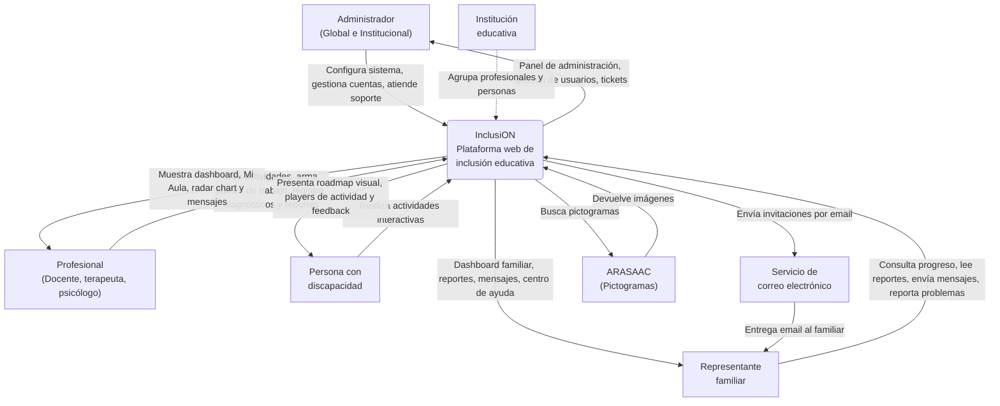

# Diagrama de Contexto — Sistema InclusiON

## Descripción

El diagrama de contexto muestra al sistema InclusiON como una caja negra, identificando los actores externos que interactúan con él y los flujos de información principales entre cada actor y el sistema.

---

## Diagrama

---

## Actores externos

| Actor | Tipo | Interacción con el sistema |
|-------|------|---------------------------|
| **Administrador** | Usuario | Configura el sistema completo: instituciones, roles, permisos, catálogos y usuarios. Gestiona cuentas de forma centralizada (reset password, desactivar, reactivar). Administra el centro de ayuda (FAQ) y atiende tickets de soporte. El admin global tiene acceso total; el institucional opera dentro de su alcance. |
| **Profesional** | Usuario | Actor principal del flujo educativo. Evalúa personas, crea actividades con plantillas dinámicas, arma planes de trabajo, monitorea el progreso y genera reportes. Se comunica con la familia. |
| **Persona con discapacidad** | Usuario | Destinatario del sistema. Accede a su portal AAC, ve su roadmap visual y realiza actividades interactivas. El sistema registra su progreso y ajusta la dificultad automáticamente. |
| **Representante familiar** | Usuario | Se registra por invitación del profesional. Consulta el progreso de su familiar, lee reportes y se comunica con el profesional desde su portal. |
| **Institución educativa** | Entidad | No interactúa directamente con el sistema. Es una unidad organizativa que agrupa profesionales y personas, y define el alcance de los administradores institucionales. |
| **Servicio de correo (SMTP)** | Sistema externo | El sistema envía invitaciones por email a los familiares a través del servicio de correo. |
| **ARASAAC** | Sistema externo | Repositorio de pictogramas de uso libre. El profesional busca e integra pictogramas en las actividades desde la API pública de ARASAAC. |

---

## Flujos de información principales

### Entrada al sistema (lo que recibe InclusiON)

| Desde | Información | Proceso relacionado |
|-------|-------------|---------------------|
| Administrador | Datos de instituciones, profesionales, personas, familiares, catálogos, roles y permisos. Gestión de cuentas, contenido FAQ | 01-08, 17, 19 |
| Profesional | Diagnósticos, actividades, planes de trabajo, reportes, mensajes, invitaciones | 07, 09-11, 15, 16 |
| Persona con discapacidad | Respuestas a actividades (tiempos, aciertos, errores, patrones) | 12 |
| Familiar | Mensajes al profesional, tickets de soporte | 16, 19 |
| ARASAAC | Pictogramas para actividades | 10 |

### Salida del sistema (lo que entrega InclusiON)

| Hacia | Información | Proceso relacionado |
|-------|-------------|---------------------|
| Administrador | Panel de administración, listados, filtros por institución, gestión de usuarios, tickets | 01-08, 17, 19 |
| Profesional | Dashboard, Mi Aula, radar chart, detalle de persona, reportes, mensajes | 14, 15, 16 |
| Persona con discapacidad | Roadmap visual, actividades interactivas, feedback, celebraciones | 12 |
| Familiar | Dashboard familiar, reportes de progreso, mensajes, centro de ayuda | 14, 15, 16, 19 |
| Servicio SMTP | Emails de invitación con link de registro | 07 |

### Flujos internos automáticos

| Proceso | Descripción |
|---------|-------------|
| Motor de Dificultad Adaptativa | Tras cada actividad completada, el sistema evalúa el rendimiento y ajusta automáticamente dificultad, tiempo, pistas e intentos |
| Desbloqueo de actividades | Cuando el porcentaje de éxito supera el umbral, la siguiente actividad del roadmap se desbloquea automáticamente |
| Detección de frustración | Si la persona acumula más de 3 intentos fallidos, el sistema muestra una pausa y registra el nivel de frustración |
| Onboarding por rol | En el primer login, el sistema evalúa el estado del usuario y lo guía por el flujo correspondiente: cambio de contraseña, completar perfil, tour o bienvenida |
| Cierre automático de tickets | Tickets de soporte sin actividad durante 30 días se marcan como cerrados automáticamente |

---

## Límites del sistema

El sistema InclusiON **incluye:**
- Gestión de usuarios, instituciones y relaciones entre actores
- Creación y ejecución de actividades educativas interactivas
- Plan de trabajo personalizado con progresión automática
- Motor de dificultad adaptativa
- Evaluación, diagnósticos y reportes de progreso
- Mensajería interna entre profesionales y familias
- Gestión centralizada de cuentas de usuario (reset password, desactivar, reactivar)
- Onboarding guiado por rol (wizard de perfil, tour, bienvenida)
- Centro de ayuda (FAQ) y sistema de tickets de soporte
- Accesibilidad con 7 perfiles visuales y 4 métodos de login

El sistema InclusiON **no incluye:**
- Gestión administrativa de la institución (nómina, presupuesto, infraestructura)
- Historias clínicas médicas (solo diagnósticos funcionales educativos)
- Videollamadas o comunicación en tiempo real de voz/video
- Facturación o pagos
- Gestión de turnos o agenda presencial
