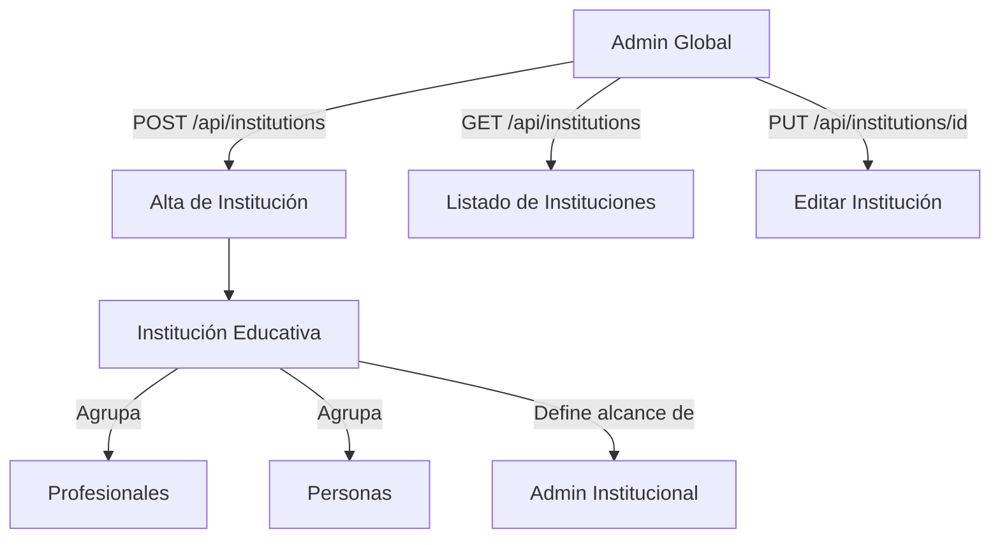

# Proceso 01 — Gestión de Instituciones Educativas

**Área:** Configuración del Sistema

## Descripción
Proceso de alta, edición y administración de las instituciones educativas dentro de la plataforma. Las instituciones son la unidad organizativa central del sistema: determinan el alcance de datos de los admins institucionales y agrupan profesionales, personas y familiares.

## Participantes
- **Admin Global** — Crea y edita instituciones

## Pasos del proceso

### 1. Alta de Institución ✅ Implementado
El admin global registra la institución con nombre, dirección, teléfono y email.
- **Endpoint:** `POST /api/institutions`
- **Frontend:** `/admin/institutions` (formulario modal)

### 2. Consulta de Instituciones ✅ Implementado
Listado paginado de todas las instituciones del sistema.
- **Endpoint:** `GET /api/institutions`
- **Frontend:** `/admin/institutions` (DataTable)

### 3. Edición de Institución ✅ Implementado
El admin global modifica los datos de una institución existente.
- **Endpoint:** `PUT /api/institutions/{id}`
- **Frontend:** `/admin/institutions` (modal de edición)

## Diagrama de flujo

## Estado resumen

| Paso | Estado |
|------|--------|
| Alta de institución | ✅ Implementado |
| Consulta de instituciones | ✅ Implementado |
| Edición de institución | ✅ Implementado |
