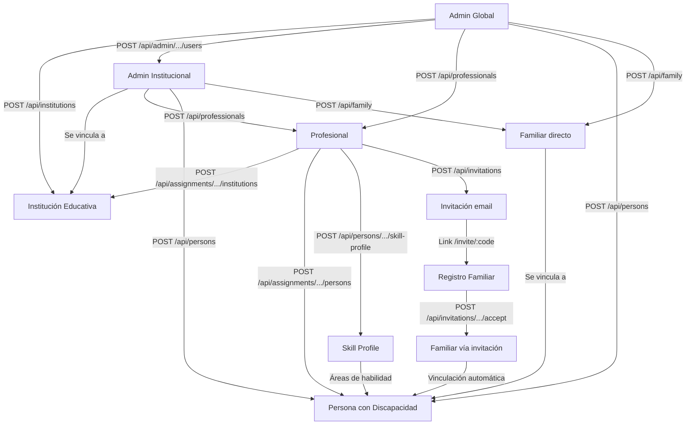

# Proceso 01 — Gestión de Usuarios (Onboarding)

**Origen:** Proyecto final (Proceso 1: Gestión de Usuarios) + Implementación extendida

## Descripción
Proceso de alta y configuración inicial de todos los usuarios del sistema: administradores, profesionales, personas con discapacidad y representantes familiares. Todos los CRUD están implementados con paginación, búsqueda y filtrado por institución para admins institucionales.

## Participantes
- **Admin Global** — Crea instituciones, admins institucionales, profesionales, personas, familiares
- **Admin Institucional** — Crea profesionales y personas dentro de su institución
- **Profesional** — Invita familiares vía email

## Pasos del proceso

### 1. Alta de Institución Educativa ✅ Implementado
El admin global registra la institución con nombre, dirección, teléfono y email.
- **Endpoint:** `POST /api/institutions`
- **Lectura:** `GET /api/institutions`
- **Edición:** `PUT /api/institutions/{id}`
- **Frontend:** `/admin/institutions`

### 2. Alta de Administrador Institucional ✅ Implementado
El admin global crea un usuario admin vinculado a una o más instituciones. Se genera contraseña temporal y el usuario debe cambiarla en el primer login.
- **Endpoint:** `POST /api/admin/institutions-assignments/users`
- **Gestión de asignaciones:** `POST /api/admin/institutions-assignments/{adminUserId}`, `DELETE /api/admin/institutions-assignments/{adminUserId}/{instId}`
- **Listar admins:** `GET /api/admin/institutions-assignments/admins`
- **Frontend:** `/admin/admins`

### 3. Alta de Profesional ✅ Implementado
El admin crea el profesional con datos personales y credenciales. Luego se asigna a una o más instituciones.
- **CRUD:** `POST /api/professionals`, `GET /api/professionals` (paginado), `GET /api/professionals/{id}`, `PUT /api/professionals/{id}`
- **Desactivar:** `PUT /api/professionals/{id}/deactivate`
- **Asignar institución:** `POST /api/assignments/{profId}/institutions`
- **Desasignar institución:** `DELETE /api/assignments/{profId}/institutions/{instId}`
- **Frontend:** `/admin/professionals`

### 4. Alta de Persona con Discapacidad ✅ Implementado
El admin o profesional registra la persona con tipo de discapacidad, nivel de autonomía, perfil de accesibilidad y método de login.
- **CRUD:** `POST /api/persons`, `GET /api/persons` (paginado), `GET /api/persons/{id}`, `PUT /api/persons/{id}`
- **Método de login:** `PUT /api/persons/{id}/login-method`
- **Frontend:** `/admin/persons` (admin) y `/pro/persons/{id}` (profesional)

### 5. Asignación Profesional-Persona ✅ Implementado
El admin asigna personas a profesionales. Se define si es profesional principal y si puede supervisar login asistido.
- **Asignar:** `POST /api/assignments/{profId}/persons`
- **Listar:** `GET /api/assignments/{profId}/persons`
- **Desactivar:** `PUT /api/assignments/{profId}/persons/{personId}/deactivate`
- **Frontend:** Tab "Personas a cargo" en detalle del profesional

### 6. Alta de Familiar (dos vías) ✅ Implementado

**Vía Admin (CRUD directo):**
- **CRUD:** `POST /api/family`, `GET /api/family` (paginado), `GET /api/family/{id}`, `PUT /api/family/{id}`
- **Desactivar:** `PUT /api/family/{id}/deactivate`
- **Frontend:** `/admin/family`

**Vía Invitación (registro público):**
- **Crear invitación:** `POST /api/invitations` (genera código y envía email SMTP)
- **Validar código:** `GET /api/invitations/{code}`
- **Aceptar invitación:** `POST /api/invitations/{code}/accept` (crea usuario + familiar + vinculación automática)
- **Frontend:** `/invite/:code` (ruta pública)

### 7. Configuración del Perfil de Habilidades ✅ Implementado
El profesional asigna áreas de habilidad a la persona y configura niveles iniciales.
- **Crear perfil:** `POST /api/persons/{id}/skill-profile`
- **Leer perfil:** `GET /api/persons/{id}/skill-profile`
- **Actualizar área:** `PUT /api/persons/{id}/skill-profile/{areaId}`

## Diagrama de flujo

