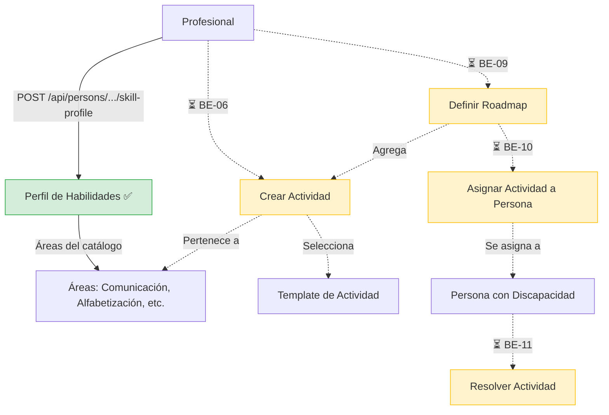

# Proceso 02 — Asignación y Gestión del Plan de Trabajo

**Origen:** Proyecto final (Proceso 2: Asignación y Gestión del Plan de Trabajo)

## Descripción
Proceso donde el profesional define y gestiona las actividades educativas para cada persona con discapacidad, creando un plan de trabajo personalizado. Actualmente solo está implementado el paso de configuración del perfil de habilidades; las actividades, roadmap y asignaciones están pendientes de desarrollo.

## Participantes
- **Profesional** — Configura perfil de habilidades de la persona
- **Persona con discapacidad** — Destinataria del plan de trabajo

## Pasos del proceso

### 1. Configuración del Perfil de Habilidades ✅ Implementado
El profesional selecciona las áreas de habilidad que se van a trabajar con la persona y establece niveles iniciales.
- **Crear perfil:** `POST /api/persons/{id}/skill-profile`
- **Leer perfil:** `GET /api/persons/{id}/skill-profile`
- **Actualizar área:** `PUT /api/persons/{id}/skill-profile/{areaId}`
- **Frontend:** Sección "Perfil de habilidades" en el detalle de persona (`/pro/persons/{id}`)
- Las áreas de habilidad disponibles se obtienen del catálogo: `GET /api/catalogs/skill-areas`

### 2. Creación de Actividades ⏳ Pendiente (BE-06)
El profesional creará actividades vinculadas a un template y área de habilidad.
- No existe controller ni handlers para actividades.
- Los tipos de template ya están catalogados: `GET /api/catalogs/activity-template-types`
- Las categorías de actividad ya están catalogadas: `GET /api/catalogs/activity-categories`

### 3. Definición del Roadmap ⏳ Pendiente (BE-09)
El profesional armará el roadmap educativo agregando actividades en secuencia por área.
- No existe controller ni handlers.

### 4. Asignación de Actividades a Persona ⏳ Pendiente (BE-10)
Las actividades se asignarán a la persona, manual o automáticamente vía roadmap.
- No existe controller ni handlers.

### 5. Resolución de Actividades ⏳ Pendiente (BE-11)
La persona realizará las actividades y la plataforma registrará las respuestas.
- No existe controller ni handlers para respuestas de actividad.

## Diagrama de flujo

## Estado resumen

| Paso | Estado | Referencia |
|------|--------|------------|
| Perfil de habilidades | ✅ Implementado | BE-07 |
| CRUD de actividades | ⏳ Pendiente | BE-06 |
| Roadmap | ⏳ Pendiente | BE-09 |
| Asignación de actividades | ⏳ Pendiente | BE-10 |
| Respuestas de actividades | ⏳ Pendiente | BE-11 |
